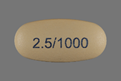
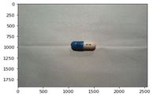
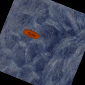
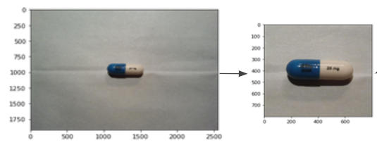
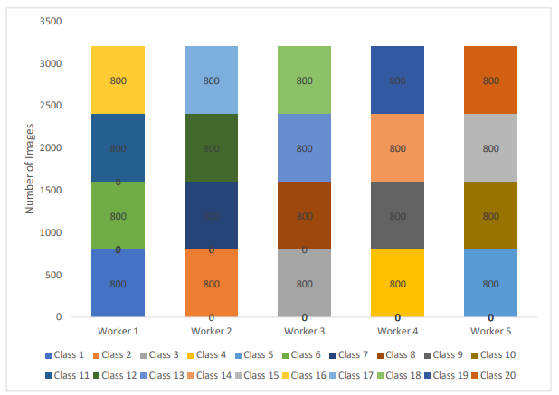
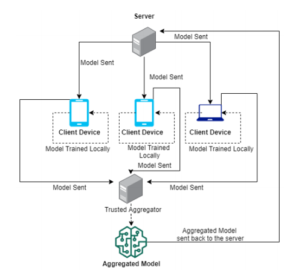
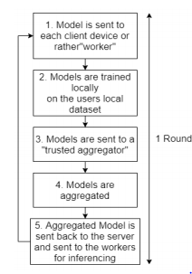
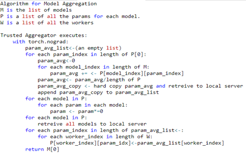
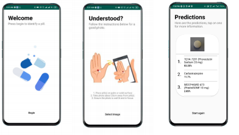

<!-- TODO(a11y): 13 localized body image(s) have empty alt text -->

**Alright**, so you’ve built an MNIST classifier using Federated Learning. Now it’s time to build something a little more cooler. Let’s build a Pill Identifier using Federated Learning. Side note, this article only contains the methods on how the pill identifier was made and trained, not the actual code. Also, several steps may have improvements suggested as well so if you’re building your own pill identifier while following this article, feel free to follow them or stick with what’s done here.

## But why build this though?

### The Problem with mHealth apps

mHealth (Mobile Health) apps are mobile applications that offer convenient and personalized health related services, such apps include fitness trackers, pill identifiers, and diet trackers. A study done by the University of Toronto revealed that 19 out of 24 of the most popular mHealth applications were found to be sharing user data to various companies and service providers, some were even described as commercializing the data as well. (Grundy et al., 2019). Health information as you may know is quite sensitive, it must be both collected and managed ethically. It is considered to be an individual’s right to be able to control the data collection, potential uses and/or  disclosure of his or her personal health data (Sampat, Prabhakar and Hansraj, 2017).

### The Issue with Existing Pill Identifiers

Pill identifiers are a subset of mHealth applications, these solutions help identify medication pills and tablets. They are aimed at solving the massive problem of medication non-adherence. The annual cost of medication non-adherence amounts to anywhere from $100 to $290 billion USD (Cutler et al., 2018)! In fact it is estimated that adults in developed nations adhere to merely 50% of prescribed medications, this figure is thought to be even lower in developing nations (Ahmed et al., 2018). The National Institute of National Health in the US recognized this issue of medication non-adherence and in 2016 held the NLM Pill Image Recognition Challenge to have participants create pill identifiers. Numerous pill identifiers were created for this challenge and after.

Typically, most pill identification solutions can be broken down into two categories: **manual entry** based ones and **computer vision** based ones. Manual entry ones allow the user to manually enter the characteristics of a pill to identify it. Computer vision based ones automate this task. As manual entry ones allow for users to easily make mistakes when entering information, computer vision based approaches can be considered superior. Computer vision based approaches can be broken down even further into **deep learning** and **feature engineering** based approaches. In order to make our pill identifier more data driven, we’ll be using deep learning to create ours.

Deep learning approaches typically consist of three steps, once given the image, (i) it finds the pill(s) in an image, (ii) crops the pill(s) and then (iii) classifies the cropped image(s). Our’s will do these exact three steps, we will utilize an object detection model to find the pills in an image and an image classifier to classify the images. In order to protect the user’s privacy however, we will create our pill identifier using **Federated Learning** ?. For simplicity’s sake however, only the image classification model will be trained using Federated Learning and not the object detection model.

<figure class="">

</figure>

### What models do we need?

We will use **YoloV3** for the object detection model and **SqueezeNet** for the image classification model. Now, I’m sure you are asking “why not just use YOLOv3 to identify and classify the pills by itself?”. Well, that’s because in reality, Federated Learning requires sending models back and forth over unstable networks, and sending large models like YOLOv3 is probably not the best idea. Even Tiny YOLO is just under 50mb which is still quite large. That’s why we will be using SqueezeNet as the image classification model and why it’ll be the only model in our pill identifier to be trained using Federated Learning. SqueezeNet is around 4.8mb, with some deep compression, this can be dropped down to less than 1mb, making it ideal for Federated Learning!.

## Ok, we need a dataset right?

### A short summary of the dataset we’ll use!

Now we need a dataset. We’ll be creating our own dataset from the existing pill dataset given for the NLM Pill Image Recognition. You can download it here:

[https://pir.nlm.nih.gov/challenge/submission.html](https://pir.nlm.nih.gov/challenge/submission.html)  
The dataset can be broken down into two categories: Consumer and Reference. Consumer images are images made to emulate a user taking a photo of a pill with a smartphone whereas reference images are studio quality images with a consistent background and no shadows. There are 1000 pills in this dataset, each pill has 2 reference images (back and front) and 5 consumer images. The images below are some examples.

<figure class="">

<figcaption>Reference Image</figcaption></figure>

<figure class="">

<figcaption>Consumer Image</figcaption></figure>

Alright, to make matters simple, we are going to choose 20 random different pills to have our pill identifier classify.

### Let’s make some more images with the Reference Images!

So we have 20 pills chosen, each with 2 reference images and 5 consumer images, that means 140 images in total. We need more images, so let’s make them. All the reference images have a consistent background and no shadows. Let’s take out that consistent “gray” background leaving just the pill itself, an example can be seen below.

<figure class="">

<figcaption>Pill Image without the background</figcaption></figure>

Now, we can take these pill images and place them anywhere we want with some random transformations such as perspective, color filters, etc. We chose 113 different background images randomly from the VisMod Vision Texture dataset. We chose primarily floor and fabric textures, but feel free to find appropriate background images as you wish. You can find this dataset here:

[https://vismod.media.mit.edu/vismod/imagery/VisionTexture/vistex.html](https://vismod.media.mit.edu/vismod/imagery/VisionTexture/vistex.html)

Once you’ve selected the backgrounds, we can start superimposing the pill images we made on top of these texture images. Here is an example:

<figure class="">

<figcaption>Pill Image superimposed on the texture image</figcaption></figure>

Now here’s the kicker, we need to train an object detection model right? All we have to do is save the coordinates of the pills superimposed on that background on a separate annotations file. These images along with the annotation files will be used to **train our YOLOv3 network**! Also, a side note, make sure that you have a diverse dataset. We’ve applied several transformations such as perspective changes to our images, you can of course choose transformations that you feel will be best for your dataset, even consider adding a shadow as well to mimic real-world conditions.

Once you have saved those images and the annotations, let’s crop out the image of the pill itself on top of the background using the coordinates from the previous step. You should have similar to the image below, a cropped pill image with the background. These images will be used to train the SqueezeNet classifier.

<figure class="">

<figcaption>Cropped superimposed image</figcaption></figure>

In total we generated 10000 images from the reference images from the original pill dataset.

### We shouldn’t let the Consumer images go to waste right?

Definitely, we must use them as well. Here’s the thing, these consumer images are organized according to sizes, meaning the images can be categorized into small, medium or large. I’ll let you figure out the actual sizes, but essentially each image can be center cropped according to their size. Each image has the pill in the center of the image so center cropping works to make sure that the information in that image is mostly the pill and not the background. This process can be seen in the figure below. You can of course write a script that centers crops according to the sizes of the image or you can crop the images out manually as well. These center cropped images also were annotated as well with the pills coordinates and saved in an annotation file to be used to train the object detection model.

<figure class="">

</figure>

These cropped images will result in a total 100 cropped pill images (20 pills x 5 images per pill). We can of course add some transformations to these images to expand this dataset. After the transformations were done, a total of 10000 images were made using the consumer images.

After combining the reference and consumer images we have a total dataset of 20000 images of pills, 20 pills in total. Now that we have the dataset, let’s see how we train the models.

## How do we train this thing?

As this article focuses on creating a pill identifier using Federated Learning, it won’t go into detail as to how the object detection model was trained, rather the image classifier. For the object detection model however, long story short, we used Supervise.ly with a GCP Virtual Machine to train a YOLOv3 model pre-trained on the ILSVRC dataset. This model only outputs one class: a generic “pill” class, not a specific type of pill. The model was trained with 17 000 images and validated against 3000 images. It was trained until the validation loss started converging. The final model had an average precision score of 0.909 with an IoU threshold of 0.8.

### Training SqueezeNet!

Before getting into the fun part of this article (the federated learning part), let’s see how the image classification model was trained. The model was pretrained on the ImageNet dataset and retrained using our custom pill dataset. The final convolutional layer of SqueezeNet had an output of 20 for the 20 pill classes instead of the default 1000 (the number of classes in ImageNet). The model was trained using CrossEntropyLoss and plain SGD as an optimizer without any momentum or learning rate decay. We left the learning rate at a consistent 0.001, of course you can introduce learning rate decay into your one as well.

We split the dataset into a 16000 training and 4000 validation dataset. The model was trained until the validation loss started plateauing and an accuracy of **96.575%** on the validation dataset was finally reached. Pretty good, right? Alright, that’s the actual training of the model, lets see some Federated goodness now!

### Prepping for Federated Learning

Alright, now it’s time we get into some Federated Learning, but first, we must prep. Let’s start sending the data to the actual workers. In our implementation, we **simulated** the process of Federated Learning using 5 **virtual workers**. The 16k training dataset was split across the workers in a non-IID (Independent and identically distributed) fashion. The data distribution can be seen in the figure below. Essentially, each worker gets a set of 4 different pills. This data distribution was made to emulate a real-world scenario where all the devices will not have the same pills.

<figure class="">

<figcaption>Data Distribution</figcaption></figure>

Also, for each worker, a separate model and an optimizer (SGD) was created. Separate optimizers were made to ensure that the gradients didn’t get mixed up after aggregation. As we are leveraging transfer learning, we are only optimizing the final convolutional layer of SqueezeNet, meaning each optimizer only retrieves the parameters of that layer, not the other layers that do not need to be optimized. These parameters of that final convolutional layer for each model were also saved into a list prior to sending the models to workers so that during aggregation, we can easily access each parameter.

### Federated Learning all the way!

We are using vanilla Federated Learning with a Trusted Aggregator. For simplicity’s sake, a trusted aggregator was used to aggregate the models but you feel free to implement other privacy preserving techniques such as secret sharing as you wish. The figure below is a high level diagram of the actual Federated Learning part. Essentially, we will be using a cross-device and synchronous method to aggregate our models.

<figure class="">

<figcaption>High Level Diagram of Federated Learning</figcaption></figure>

Following the diagram above, the server sends the models to the client devices or rather “workers”, the client devices train the models locally on each of their own datasets. Once the models are trained locally, they are sent to the trusted aggregator where all the models are aggregated together. The aggregated model is then sent back to the server.  
These steps can be best understood from the figure below. Once the models have been aggregated, the aggregated model is sent back to the server and to the client devices completing one round of training. Multiple rounds can be done until convergence is reached.

<figure class="">

<figcaption>Federated Learning process</figcaption></figure>

**How did we aggregate it?**

<figure class="">

<figcaption>Aggregation Pseudocode</figcaption></figure>

The image above contains the pseudocode for the actual aggregation of the models. Remember, as this implementation uses synchronous Federated Learning, all the models have to be finished training on the local devices before being sent to the trusted aggregator for aggregation. We are using Federated Averaging for aggregation.

For aggregation, remember that list of parameters we saved during the creation of the models? We’ll be using that list to easily access each parameter of each model to get the average of these saved parameters. It is important to note that as we are leveraging transfer learning, only the final convolutional layer’s parameters of each model will be aggregated together. This was done because aggregating the other layers parameters would be redundant as those parameters will be frozen and thus they’ll be the same for each of the models, averaging the same value across multiple models will yield the same value, For example, say that each model’s first parameter’s value is 50, then 50+50+50+50+50 is 250, to get the average, you divide it by 5 and you would get 50 which is the same as the individual values. This concept can also be applied to the parameters of each model. In short, to avoid redundancy, only the layers that are allowed to train are being averaged, not the ones that are frozen.

If you follow the pseudocode, you can see that each trainable parameter of each model for each parameter position is being added together and averaged, this averaged parameter is then hard copied and appended into a new list. Once aggregation is done, this new list will be the same length as the number of trainable parameters of one model. Then the parameters of the individual models are set to zero and retrieved back to the local server, they are set to zero because we don’t want the parameters trained on the user’s data to come back to the central server which can present a breach of privacy. Afterwards, for each parameter of each model, the averaged parameter in that newly created list is set as the new parameter for that parameter position. Yea, it is a little confusing, follow the pseudocode carefully step by step, it’ll make sense once you go over it a couple times. Eventually after everything is completed, you’ll have 5 models, each with the same averaged parameters. As these models have the same parameters, you only need one for testing.

## The App

An app was also created with the object detection and image classification model once both were trained. Check it out below, it’s quite simple. The final screen contains the predictions of each pill in the image.

<figure class="">

</figure>

## And in conclusion!

<figure class="">

</figure>

That’s all folks. That’s how we made our pill identifier using Federated Learning. We covered what mHealth applications and pill identifiers are, how a pill identifier works, their privacy issues and how a pill identifier can be made using Federated Learning. Of course there’s much room for improvement, feel free to add some thoughts on this in the comments below! Anyways, thanks for making it through this exhaustive article.

Till next time, your newbie machine learning partner in crime, Avinath ! ?

Tweet Me: @avinathg

## References

Hansraj Sampat, B., Prabhakar, B., & Hansraj, B. (2017). Privacy Risks and Security Threats in mHealth apps. In Journal of International Technology and Information Management (Vol. 26). Retrieved from https://scholarworks.lib.csusb.edu/jitimAvailableat:https://scholarworks.lib.csusb.edu/jitim/vol26/iss4/5

Grundy, Q., Chiu, K., Held, F., Continella, A., Bero, L., & Holz, R. (2019). Data sharing practices of medicines related apps and the mobile ecosystem: traffic, content, and network analysis. BMJ, 364, 920. https://doi.org/10.1136/bmj.l920

Cutler, R. L., Fernandez-Llimos, F., Frommer, M., Benrimoj, C., & Garcia-Cardenas, V. (2018, January 1). Economic impact of medication non-adherence by disease groups: A systematic review. BMJ Open, Vol. 8. https://doi.org/10.1136/bmjopen-2017-016982

Ahmed, I., Safir Ahmad, N., Ali, S., Ali, S., George, A., Saleem Danish, H., … Darzi, A. (n.d.). Medication Adherence Apps: Review and Content Analysis. https://doi.org/10.2196/mhealth.6432
