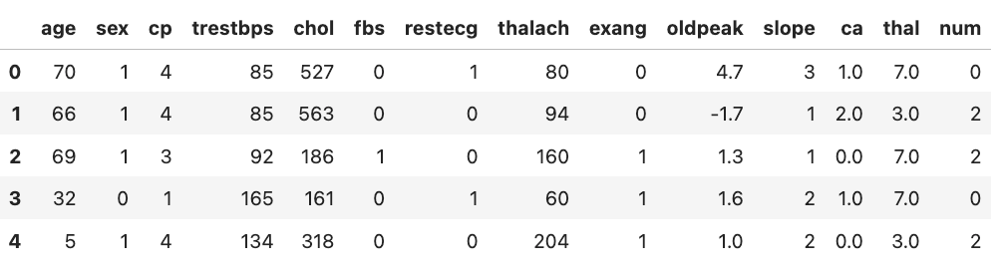
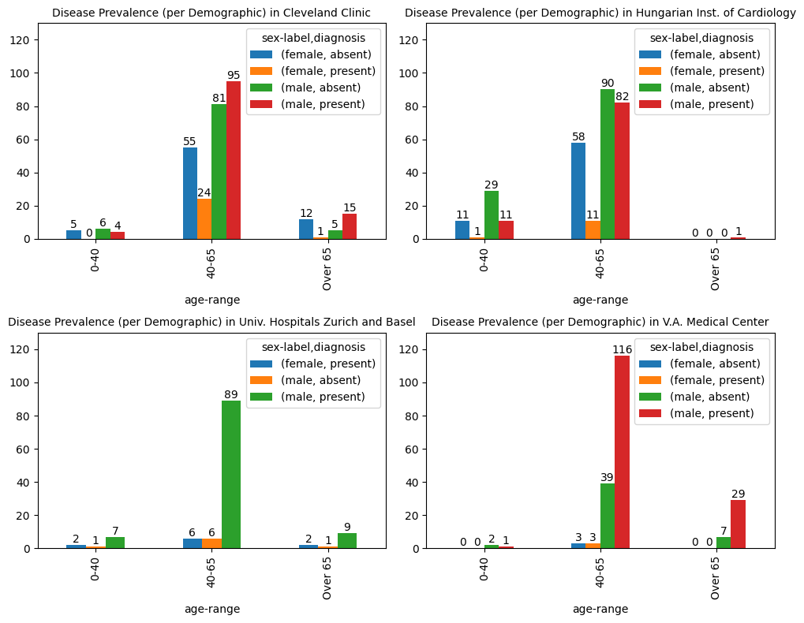

<!-- TODO(a11y): 2 localized body image(s) have empty alt text -->


Everybody working with data knows the unwritten rule in data science: _the more data, the better_! However, with medical data, accessing even a _single_ dataset is difficult (and for all very good reasons!). Let alone wanting to access _more_ data. But what if you could change that by writing a single email to the Institute owning the data you need for your research, and ask them to install a single Python package?

## A new software, the same data science

Let’s start by making a short list of requirements we would want from a data access tool:

1.  Work with data and protect privacy: i.e. never seeing the private data, only accessing the results of our code.
2.  Running our data science code remotely, on the server where the data is stored.
3.  Use the same protocol to access datasets distributed across multiple servers.
4.  **Last but not least**: have little to no disruption to our usual data science workflow, as if we were working locally.

_I know_: these seem difficult to achieve altogether. Even more so within the same tool. So, let me show you how that works with a practical research use case!

## Studying heart disease with PySyft

Let’s see how to work with multiple medical datasets while maintaining privacy, using PySyft. We want to study heart disease, a use case that is well-known within the Machine learning community (e.g. [Chicco, 2020](https://bmcmedinformdecismak.biomedcentral.com/articles/10.1186/s12911-020-1023-5)). As representative of our medical datasets, we will use the “Heart Disease” dataset as available on the [UCI Machine Learning Repository](https://archive.ics.uci.edu/dataset/45/heart+disease). The promise with our project is to work on our Python data science code, _without ever seeing the data_.

### 1\. Install PySyft

First, install PySyft. We will use the latest stable release available at the time of writing (See the announcement [post](https://blog.openmined.org/announcing-pysyft-09/ "Announcing PySyft 0.9.0"))

```python
$ pip install syft==0.9.0
```

### 2\. Setup PySyft Datasites

The “Heart Disease” study contains data for the diagnosis of coronary artery disease, from patients in _four hospitals_: (1) “Cleveland Clinic” (Ohio, USA); (2) “Hungarian Institute of Cardiology” (Budapest, HU); (3) “VA Medical Center” (Long Beach, California, USA); (4) “University Hospitals in Zurich and Basel” (Switzerland).

In our scenario, each hospital will be mapped to a single [Datasite](https://docs.openmined.org/en/latest/#login-to-the-datasite "What is a DataSite") hosting their own version of their private database. The Datasites will be deployed within a network of trusted parties, to which we can connect to as external researchers.

The code to launch the four Datasites would look like this (see below to access the full code):

```python
import syft as sy

def setup_datasite(name: str) -> None:
    datasite = sy.orchestra.launch(name=name, reset=True, port="auto")
    client = datasite.login(email="info@openmined.org", password="changethis")
    client.settings.allow_guest_signup(True)  # allow guest logins

    data = download_data(name)  # e.g. data is in a pandas DataFrame format
    dataset = create_syft_dataset(data)
    client.upload_dataset(ds)

for server in ["Cleveland", "Budapest", "Switzerland", "Long Beach"]:
    setup_datasite(name=server)
```

### 3\. Create a new Notebook: Explore data across the datasites

When all the four Datasites are up and running, we can create a new Jupyter notebook, and start to work on the analysis. As a good first step, we can collect information about the demographics in each dataset.

To start working on our code, we can’t use the private data, as PySyft automatically inhibits unauthorised access to it. Instead, we can use **mock** data: a dummy version of the original data only available for code prototyping.

Let’s connect to one datasite to understand how to work with mock data:

```python
import syft as sy 

client = sy.login_as_guest("https://url-to-datasite:port")
data_asset = client.datasets[0].assets[0]  # get data asset
mock_data = data_asset.mock  # access mock data from asset
mock_data.head()  # e.g. data has been stored as pandas DataFrame
```

<figure class="wp-block-image">



<figcaption class="wp-element-caption">Excerpt of mock data as extracted from the “Cleveland Clinic” Datasite.&nbsp;</figcaption></figure>

Mock data have been generated to share the same structure of the original data so that we could work on our code. The `age` and the `sex` columns identify the available demographics in our data, while the `num` column reports the medical diagnosis, indicating the presence (`num > 0` ) or the absence (`num==0`) of the heart disease.

So here is a possible plan for our code:

1.  Using some [pandas magic](https://pandas.pydata.org/docs/reference/api/pandas.crosstab.html) to aggregate the data, and group data by demographics.
2.  Wrap our code into a Syft function, that is a self-contained Python function, combined with the syft decorator `@syft_function_single_use` ( This is the _only_ adjustment we need to run our code remotely on PySyft!)
3.  Submit a new code request to each Datasites, with our new Syft function.

```python
from syft import syft_function_single_use

@syft_function_single_use(data=data_asset)  # Map the execution to specific data asset
def disease_prevalence_per_demographic(data):
    # third-party library
    import pandas as pd 
    
    def aggregate_factors():
       ...  # omissis - see the full code in the repo 
    
    cats = aggregate_factors()    
    demographics = pd.crosstab(index = cats["age-range"], 
                               columns = [cats["sex-label"], cats["diagnosis"]],
    )
    return demographics

for datasite in DATASITES:  # list of the four connected clients
    datasite.code.request_code_execution(disease_prevalence_per_demographic)
```

When all the code requests are approved, we can get the results, that we can [plots](https://seaborn.pydata.org/generated/seaborn.countplot.html) for clearer insights:

<figure class="wp-block-image">



<figcaption class="wp-element-caption">Disease prevalence in the four datasets, aggregated by available demographics.</figcaption></figure>

From these plots, we can immediately appreciate how population distribution varies across the four datasets, considering the _age range_, _sex_, and health _diagnosis_. All these characteristics in teh data can be extremely useful for a better informed data partitioning in preparation for machine learning modelling.

## There is more!

The **complete PySyft tutorial** is [available here](https://openmined.github.io/syft-heart-disease-tutorial "Study Heart Disease using PySyft"), where you can get access to the full code presented in this post, and to continue experimenting with PySyft yourself! You’ll only need (_another_) notebook!?

For example, how about doing some **machine learning** to predict heart disease? Models will be trained using the data across the four Datasites, _while still preserving the privacy of the data_!

Try it yourself, starting [here](https://openmined.github.io/syft-heart-disease-tutorial/#materials "PySyft tutorial Materials").

## Signup for Beta Testing!

If you liked this article and you want to contribute your feedback to shape the future builds of PySyft, please consider joining our [Beta Testing Program](https://github.com/OpenMined/design/tree/main/user_tests "PySyft Beta Testing Program"). As PySyft beta tester, you will sign up to different data science testing missions, pushing PySyft’s features to the limit. Let’s build together a library that can unlock 1000x more data for research!
