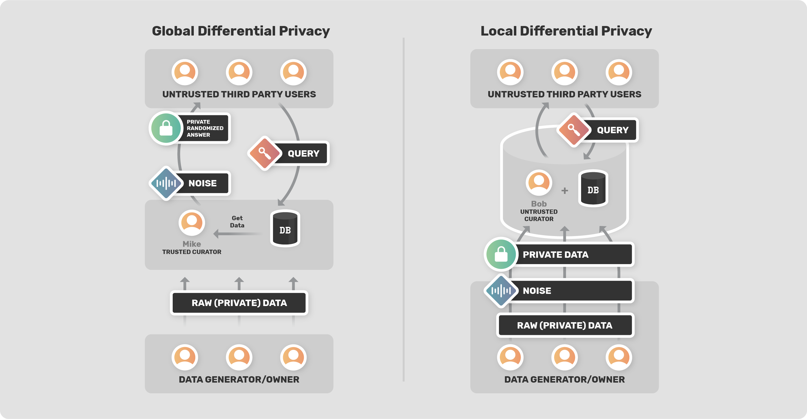
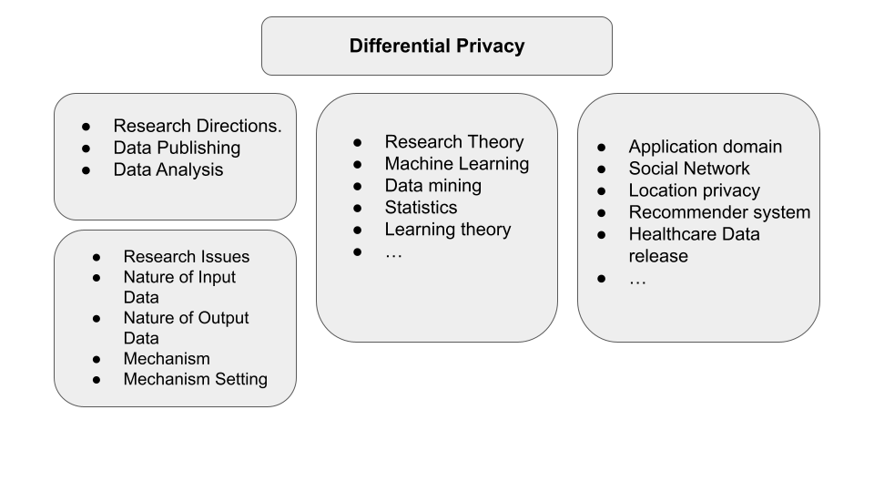
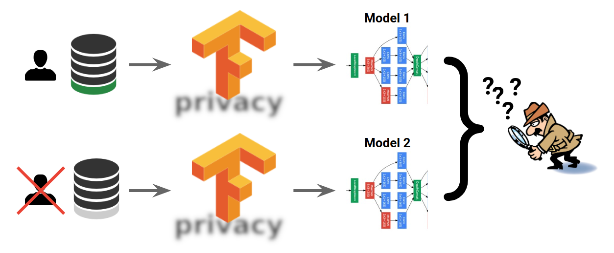

<!-- TODO(a11y): 3 localized body image(s) have empty alt text -->

A comprehensive overview of various libraries and frameworks for differential privacy and their use cases.

## **What is Differential Privacy?**

Differential Privacy (DP) is a system for publicly sharing information about a dataset by describing the patterns of groups within the dataset while withholding information about individuals in the dataset.

In short, Differential privacy is a mathematical, quantitative definition of privacy. The definition guarantees privacy for individuals in the data, and any query that is mathematically proven to satisfy this definition is considered differentially private (DP). When you invoke a DP query on your data, you are guaranteed that each individual’s influence on the release is bounded by a privacy parameter. A privacy parameter measures how distinguishable each individual can be in a data release.

DP works by adding statistical noise to the data (either to their inputs or to the output). Based on where the noise is added, DP is classified into two types – **Local Differential Privacy** and **Global Differential Privacy.**

<figure class="">

<figcaption><em>Global vs Local Differential Privacy. </em><a href="https://blog.openmined.org/basics-local-differential-privacy-vs-global-differential-privacy/"><em>Source</em></a><em>.</em></figcaption></figure>

To help individuals and organizations implement differential privacy in their models, several popular companies have developed and released differential privacy tools and libraries that can be used in different programming languages, such as C++, Go, and Python. These tools and libraries are designed to make it easier for developers to implement differential privacy in their applications and systems, without the need for extensive knowledge of the underlying mathematical concepts.

<figure class="">

<figcaption>Key components associated with differential privacy</figcaption></figure>

## **A compilation of Differential Privacy Frameworks**

Several libraries and tools are commonly used for implementing differential privacy. Some of the widely used ones are:

1.  [Google’s Differential Privacy Libraries](https://github.com/google/differential-privacy) – Google has several libraries related to differential privacy, including the Differential Privacy Library which is an open-source library for implementing differential privacy in data analysis pipelines. It provides a collection of tools( such as Privacy on Beam) for data analysts and engineers to easily add differential privacy to their workflows. The library includes functionality for data collection, data preprocessing and data analysis. These libraries are implemented in C++, Java and Go. Some of the popular tools include :  
    a. Privacy on Beam – An end-to-end differential privacy framework built on top of Apache Beam. It is intended to be usable by all developers, regardless of their differential privacy expertise.  
    b. A stochastic tester, used to help catch regressions that could make the differential privacy no longer hold  
    c. A command line interface for running differentially private SQL queries with [ZetaSQL](https://github.com/google/zetasql).
    
2.  [Pytorch’s Opacus](https://opacus.ai/) – Opacus is a high-speed library for training pytorch models with differential privacy. It promises an easier path for researchers and engineers to adopt differential privacy in ML, as well as accelerate DP research in the field.The aim of Opacus is to protect the confidentiality of individual training samples while minimizing the effect on the accuracy of the resulting model. It achieves this by adjusting a PyTorch optimizer to implement and monitor differential privacy during the training process. Specifically, the approach focuses on using differentially private stochastic gradient descent (DP-SGD) to train the model.
    
    Learn more about Opacus [here](https://opacus.ai/tutorials/).
    
3.  [SecretFlow](https://github.com/secretflow/secretflow) – is a comprehensive framework for conducting data analysis and machine learning while preserving privacy. It offers device abstraction, which converts privacy-enhancing technologies such as Multi-Party Secure Computing (MPC), Homomorphic Encryption (HE), and Trusted Execution Environment (TEE) into ciphertext devices, and plaintext computing into plaintext devices.The framework also utilizes computational graphs built on these abstracted devices, enabling data analysis and machine learning workflows to be represented in this format.Additionally, it provides machine learning and data analysis capabilities based on these computational graphs, accommodating data with horizontal/vertical/hybrid segmentation and other scenarios.
    
4.  [IBM’s Differential Privacy Library](https://github.com/IBM/differential-privacy-library) – Diffprivlib by IBM is a general-purpose library for experimenting with,investigating and developing applications in, differential privacy. It boasts a set of tools for machine learning and data analytics tasks, all with built-in privacy guarantees. This library stands out by offering scientists and developers with accessible and user-friendly tools for data analysis and machine learning that can be executed in a familiar setting. It is unique in its simplicity, as most tasks can be accomplished with as little as a single line of code!
    
5.  [Tensorflow Privacy](https://github.com/tensorflow/privacy) – Tensorflow Privacy is a powerful open-source python package that is specifically developed to ensure privacy in machine learning and deep learning models. It provides a range of techniques for protecting sensitive data during the training process, including differential privacy, which adds noise to the model’s parameters to prevent individuals’ data from being inferred from the model’s output. Additionally, Tensorflow Privacy offers a variety of optimizers that are tailored to work with privacy-enhancing mechanisms, making it easy for developers to incorporate privacy into their training process and achieve state-of-the-art results while maintaining the confidentiality of their data. Overall, Tensorflow Privacy is a valuable tool for any developer looking to create machine learning models that are both accurate and privacy-respecting.
    
    Get started with Tensorflow privacy [here](https://www.tensorflow.org/responsible_ai/privacy/tutorials/classification_privacy).
    

<figure class="">

<figcaption><a href="https://blog.tensorflow.org/2019/03/introducing-tensorflow-privacy-learning.html">Source</a></figcaption></figure>

6.  [OpenDP](https://opendp.org/) – The OpenDP Library is a group of statistical methods that follow the principle of differential privacy, and can be utilized to develop privacy-protected computations using various privacy models. It is written in Rust and can be accessed easily from Python. The design of the library is based on a framework for performing privacy-sensitive computations outlined in the “[A Programming Framework for OpenDP](https://projects.iq.harvard.edu/files/opendp/files/opendp_programming_framework_11may2020_1_01.pdf)” paper. The OpenDP Library is a component of the wider OpenDP Project, which is a collaborative endeavor to create reliable open-source software for analyzing private data.  
    Learn more about OpenDP [here](https://opendp.org/about).
    
7.  [Openmined/PyDP](https://github.com/OpenMined/PyDP) – PyDp is a python wrapper for Google’s DIfferential Privacy project created by OpenMined. The OpenDP Library offers a collection of algorithms that are ε-differentially private, which can be used to generate aggregate statistics from data sets containing confidential or sensitive information. This means that with PyDP, one can control the level of privacy and precision of their Python-based models.  
    Learn more about [Openmined](https://www.openmined.org) and [PyDP](https://github.com/OpenMined/PyDP).
    

## Closing Thoughts

All these libraries, tools, and frameworks provide a variety of functionalities such as adding noise, calculating sensitivity, and providing privacy guarantees, which can be used to implement differential privacy in a wide range of applications, including machine learning, data analysis, and statistics. With the increasing focus on data privacy and security, the use of differential privacy tools and libraries will likely become more widespread in the future.
