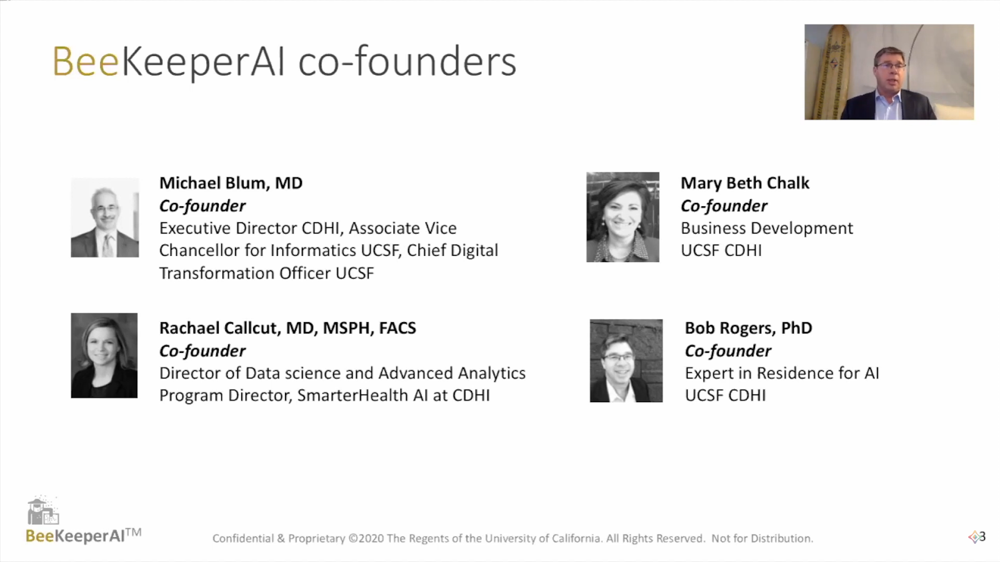
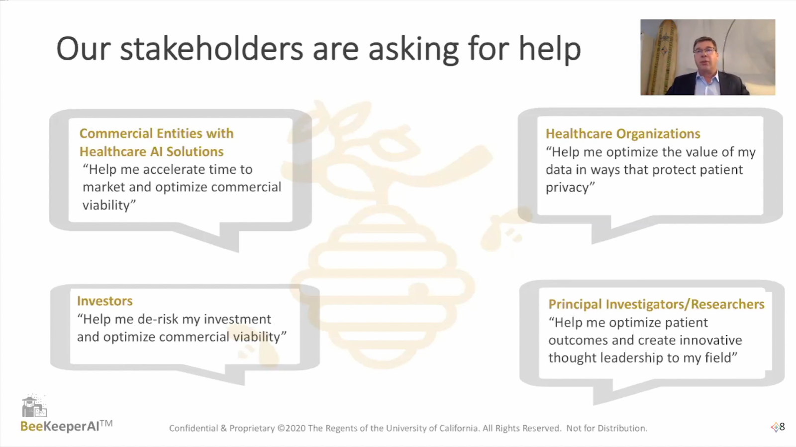

<!-- TODO(a11y): 2 localized body image(s) have empty alt text -->

[Center for Digital Health Innovation](https://www.centerfordigitalhealthinnovation.org/) partnered with [GE](https://www.ge.com/) to develop the world’s first FDA cleared AI (Artificial Intelligence) on a medical device. A suite of AI algorithms work together to detect emergent conditions in chest x-rays in the ICU setting. During the course of getting the product FDA cleared, it was discovered that accessing data for validation and for algorithm training was a huge challenge. Hence arose the need for the BeeKeeperAI. BeeKeeperAI is a privacy preserving platform for training and validating healthcare AI that we believe will accelerate the deployment of healthcare AI by 1000x.

<figure class="">

</figure>

## Why is access to data a challenge?

In order to realize why access to data is a challenge, the need for data has to be understood first. When a newly developed algorithm is to be FDA cleared, CE marked or even get accepted by the medical community for its use as a recognized healthcare AI, a diverse data set is required. The data set in question should be capable of handling all the different variations that can come up in real clinical practice. Thus up to 5 diverse data sets might be required, each from different locations to cover all the diversity in patients from a biological, anatomic, and demographic perspective. The diversity of the different devices collecting the data and all the different ways in which data might be collected during the course of clinical care must also be taken into account.

## How hard could it be?

-   Data is legally protected
-   Data is viewed as an organizational asset
-   Patients’ ethical perceptions of its use
-   Raw data may not be computable
-   Bespoke computational infrastructure

If further optimization is needed, we need secure federated training.

## The Impact

The market for Healthcare AI is huge. Different findings in clinical diagnostics multiplied by different devices used for the findings multiplied by different developers creating algorithms to address the specific clinical use cases, gives us a huge number of different stakeholders. If each one of these stakeholders spend $2.5 million just to validate, estimates say that the Healthcare AI market might be worth over $36 billion.

<figure class="">

</figure>

## BeeKeeperAI changes the data conversation

The working of BeeKeeperAI can be imagined in the following manner:

An algorithm developer develops an algorithm, puts it in a secure container. Data is recorded in a secure vault, where it can be transformed, harmonized and annotated. The algorithm works on the data, the computation occurs, and the resulting validation report is generated.

Thus, not only is the data protected, but the algorithm is protected too. Thus a zero trust environment is created for validating algorithms, where both data and algorithms are protected. This is made possible by proprietary technology developed at [UCSF](https://www.ucsf.edu/) in the [Center for Digital Health Innovation](https://www.centerfordigitalhealthinnovation.org/).

There are two major work streams:

## Zero-Trust Validation Workstream

SGX enclaves are built, which allow secure encrypted computation in the memory space of the CPU (from Intel). Fortanix runtime encryption and self-defending key management to build technology work in combination with this, to take the algorithm, protect the data, put them together and generate reports. All this runs on Microsoft Azure which is a principal cloud provider for providing SGX hardware.

## Data Selection and Federated Training Workstream

When validation isn’t enough and federated training needs to be done upon multiple data sets, [OpenMined](https://www.openmined.org/) comes to the rescue. The individual nodes that hold the data local to the data owner’s own infrastructure can be connected through [PyGrid](https://blog.openmined.org/what-is-pygrid-demo/) to:

-   Find the right data sets without compromising privacy
-   Train simultaneously on multiple data sets without sharing data
-   Orchestrate the activities of all stakeholders while maintaining privacy

## BeeKeeperAI’s hive protecting capabilities

Algorithm developer benefits:

-   Reduce cost and time to market
-   Protect algorithm IP
-   Support regulatory requirements

Data owner benefits:

-   Utilize health system data within HIPAA-compliant cloud
-   Accelerate AI-informed clinical improvement
-   Support AI collaboration through shared tools and methods

## Summary

-   BeeKeeperAI is a privacy preserving platform for training and validating healthcare AI
-   BeeKeeperAI has the potential to accelerate the deployment of healthcare AI by 1000x
-   Diverse data sets are needed to test new algorithms
-   BeeKeeperAI works by protecting both the data and the algorithm, thus validating algorithms in a zero trust environment
-   Two major work streams are Zero-Trust Validation Workstream and Data Selection and Federated Training Workstream
-   Using BeeKeeperAI benefits both the algorithm developer as well as the data owner
