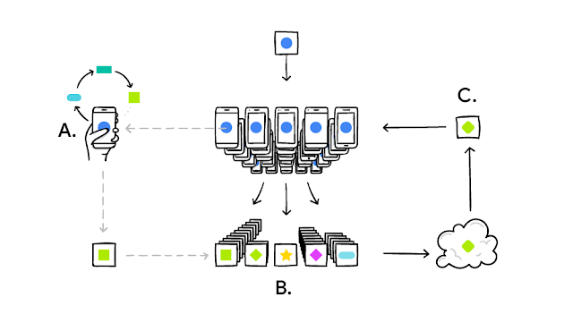
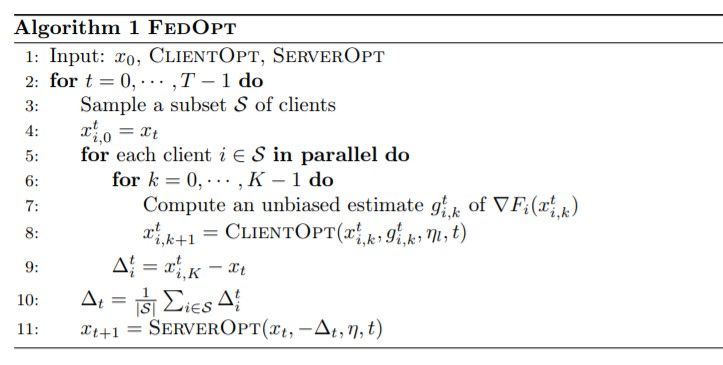
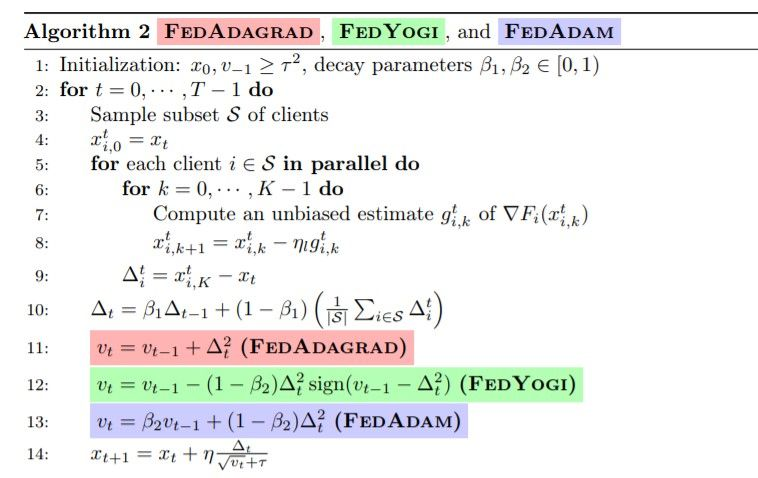
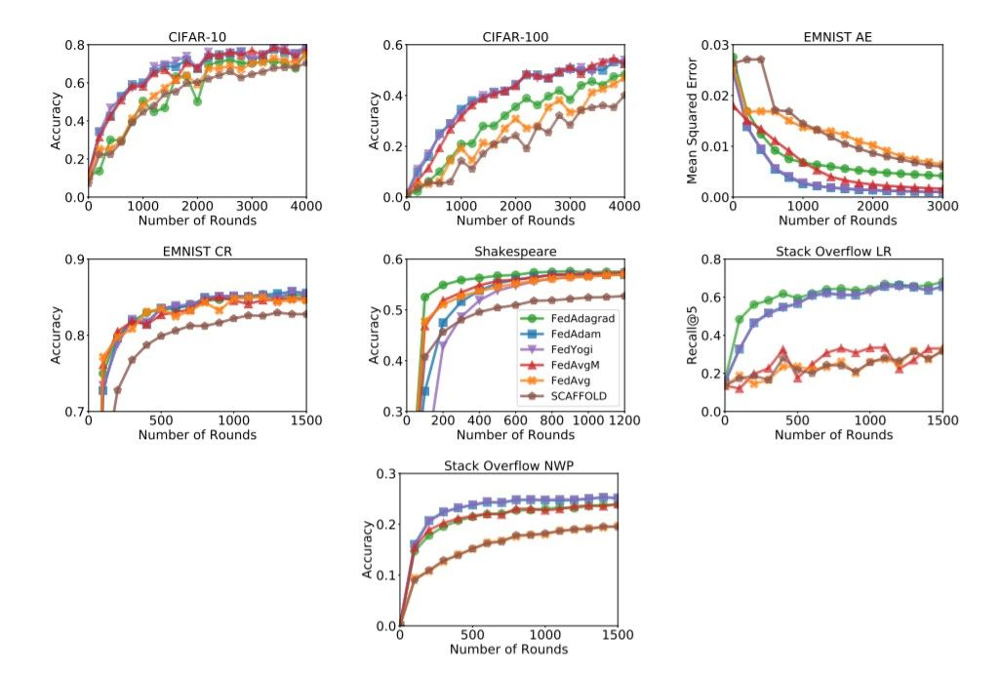
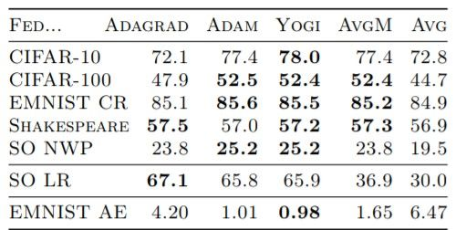

<!-- TODO(a11y): 5 localized body image(s) have empty alt text -->

> This blog post is inspired by the talk on Adaptive Federated Optimization by Zachary Charles from Google at the OpenMined Privacy Conference 2020.

### Motivation

Federated Learning (FL) is a distributed machine learning paradigm where several client devices coordinate with a server in performing on-device model training using their own data, while only sharing model updates with the server.

The following infographic shows how a client device (for instance, our phone) personalizes the initially shared global model (denoted by the blue circle) model locally. This is typically achieved by running a few steps of Stochastic Gradient Descent (SGD) using our data (**A**) and the updated model’s parameters are shared (denoted by the yellow square). Many such clients’ updates are aggregated (**B**) to form a consensus change (model update) (**C**) to the shared model, after which the procedure is repeated until we have a model that yields satisfactory performance.

<figure class="">

<figcaption>Illustrating the Premise of Cross-device Federated Learning <a href="https://arxiv.org/pdf/2003.00295.pdf">(Image Source:</a> <a href="https://arxiv.org/abs/2003.00295">arxiv.org/abs/2003.00295</a><a href="https://arxiv.org/pdf/2003.00295.pdf">)</a></figcaption></figure>

**Adaptive Federated Optimization** is aimed at improving optimization methods for Federated Learning (FL). These methods can facilitate automatic adaptation of the process of client and server training to **heterogeneous user data**, the key challenges being performing hyperparameter tuning and the lack of consistent benchmarks in the field.

> Why is this an interesting direction worth pursuing?

Federated Learning is a young but promising area that is often faced with challenges stemming from optimizing over heterogeneous data. The contributions by the team of researchers at Google include novel and adaptive algorithms for federated optimization, and open-source implementations in TensorFlow Federated while also facilitating empirical benchmarks spanning a variety of tasks and models. The goal of the work is to show through experiments on adaptive methods that the use of adaptive optimizers can significantly improve the performance of federated learning.

### Federated Optimization

In most Federated Learning methods, there are two levels of optimization occurring: **client optimization**, and **server optimization**. Most research efforts in the area have focused on methods using Stochastic Gradient Descent (SGD), such as Federated Averaging (`FedAvg`) where the several client devices that take part in the training process run multiple steps of SGD and share model updates to the server, and the server takes an average of the shared updates to update the initial model. However, these methods perform badly under heterogeneous settings such as in NLP domains where the users have different vocabularies.

### Framework for Federated Optimization

A general framework for Federated Learning has been proposed that explicitly accounts for client and server optimization. This recovers many popular methods such as `FedAvg`, `FedAvg + server momentum`. The key concept here is the fact that client optimization is fundamentally different from server optimization. The clients may participate in the process of training at most once, and perform a small number of steps. The coordinating server can maintain state throughout the algorithm.

The pseudocode for federated optimization algorithm, as shown in the figure below. Here, `CLIENTOPT` and `SERVEROPT` are gradient-based optimizers with learning rates `ηl` and `η` respectively. As we can see from the federated learning setting, `CLIENTOPT` aims to minimize the objective based on each client’s local data while `SERVEROPT` aims to optimize from a global perspective.

<figure class="">

<figcaption>Pseudocode for Federated Optimization Algorithm <a href="https://arxiv.org/pdf/2003.00295.pdf">(Image Source:</a> <a href="https://arxiv.org/abs/2003.00295">arxiv.org/abs/2003.00295</a><a href="https://arxiv.org/pdf/2003.00295.pdf">)</a></figcaption></figure>

### Incorporating Adaptivity

In centralized optimization, adaptive methods have had nearly unparalleled success. The goal of the work is to explore and bring insights and power of these adaptive methods to the federated domain.

The approach merges theory and practice of Federated Learning by providing algorithms that are theoretically justified while also providing extensive empirical studies on a wide swath of models and tasks. The work also provides easy-to-use open source implementations and reproducible benchmarks showcasing the methods.

> The overall objective of adaptive federated optimization is to enable **more accurate** and **heterogeneity-aware** Federated Learning models.

Under the adaptive optimization approach, the work aims at specializing `FEDOPT` to settings where `SERVEROPT` is an **adaptive optimization method** (one of `ADAGRAD`, `YOGI` or `ADAM`) and `CLIENTOPT` is `SGD`. By using adaptive methods, which generally require maintaining state on the server and `SGD` on the clients, it’s ensured that the adaptive methods have the same communication cost as `FedAvg` in cross-device settings. The pseudocode for the adaptive version of federated optimization is shown below.

<figure class="">

<figcaption>Pseudocode for Adaptive Federated Optimization Algorithm <a href="https://arxiv.org/pdf/2003.00295.pdf">(Image Source:</a> <a href="https://arxiv.org/abs/2003.00295">arxiv.org/abs/2003.00295</a><a href="https://arxiv.org/pdf/2003.00295.pdf">)</a></figcaption></figure>

### Contributions and Results

Three new adaptive federated optimization algorithms have been proposed. These methods incorporate adaptivity without sacrificing server-side adaptivity. The current work complements this with sophisticated theory on the convergence of such methods.

In many tasks, adaptive optimizers significantly improve upon non-adaptive ones while performing at least as well as non-adaptive optimizers on all tasks. As the goal of the work is to also provide fair and reproducible comparisons between Federated Learning (FL) algorithms, and help document and encourage best practices, all experimental results are made reproducible through open-source code in TensorFlow Federated. The performance of adaptive methods `FedAdagrad`, `FedAdam`, and `FedYogi`, and the selected non-adaptive methods, `FedAvg`, `FedAvgM` and `SCAFFOLD` are compared, in terms of convergence. The plots of validation performances for each task or optimizer are shown in the figure below.

<figure class="">

<figcaption>Validation Accuracy of Adaptive and Non-adaptive Methods <a href="https://arxiv.org/pdf/2003.00295.pdf">(Image Source:</a> <a href="https://arxiv.org/abs/2003.00295">arxiv.org/abs/2003.00295</a><a href="https://arxiv.org/pdf/2003.00295.pdf">)</a></figcaption></figure>

The following table summarizes the last-100-round validation performance.

<figure class="">

<figcaption>Average validation performance over the last 100 rounds for Stack Overflow LR and EMNIST AE <a href="https://arxiv.org/pdf/2003.00295.pdf">(Image Source:</a> <a href="https://arxiv.org/abs/2003.00295">arxiv.org/abs/2003.00295</a><a href="https://arxiv.org/pdf/2003.00295.pdf">)</a></figcaption></figure>

> In essence, this work establishes results on how adaptive optimizers can be powerful tools in facilitating heterogeneity-aware Federated Learning. Adaptivity is incorporated into FL in a principled, and intuitive manner using a simple client/server optimizer framework.

### References

\[1\] Adaptive Federated Optimization, [https://arxiv.org/abs/2003.00295](https://arxiv.org/abs/2003.00295)

\[2\] [Talk by Zachary Charles at the OpenMined Privacy Conference 2020](https://www.youtube.com/watch?v=fjjFvTF0tyg)

Cover Image of Post: [Photo by Steve Johnson](https://unsplash.com/@steve_j?utm_source=ghost&utm_medium=referral&utm_campaign=api-credit) on Unsplash.
