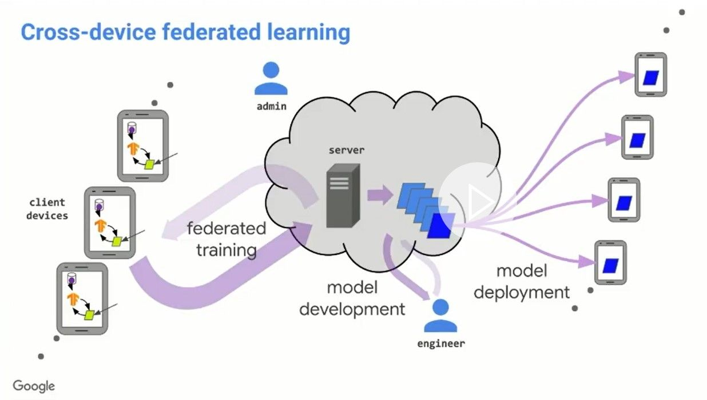
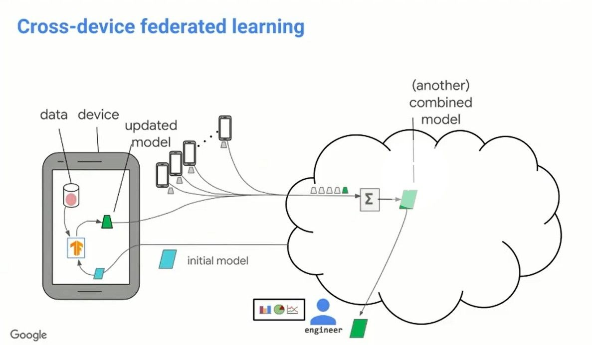
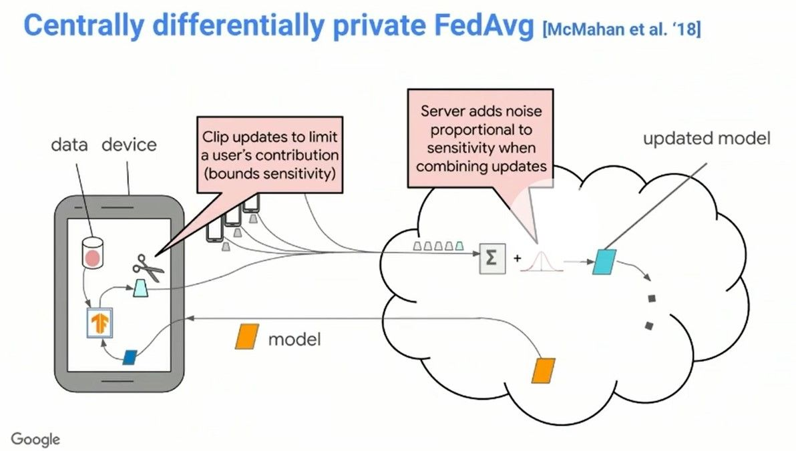
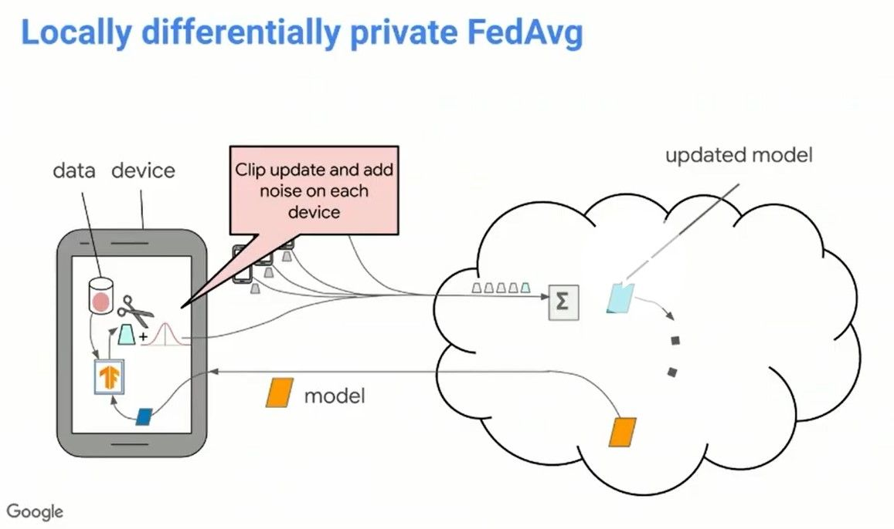
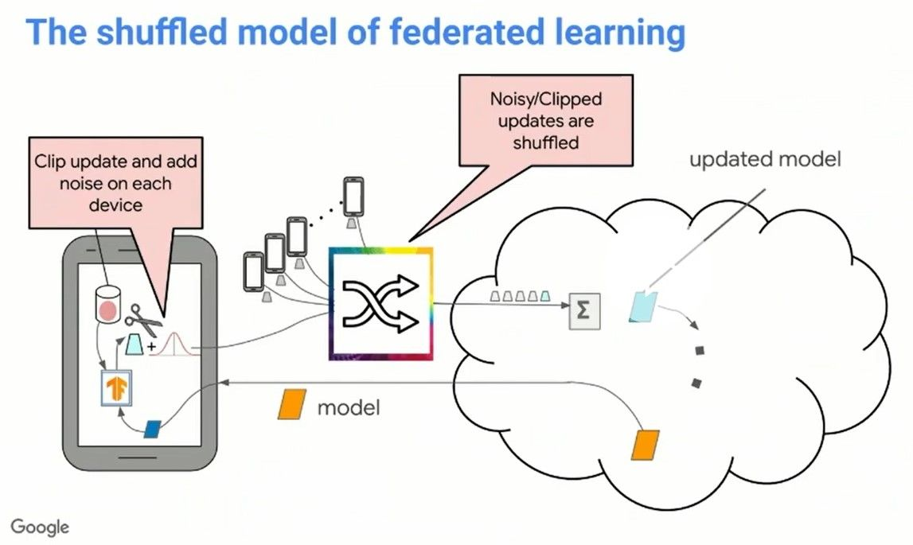

<!-- TODO(a11y): 5 localized body image(s) have empty alt text -->

This blog post is inspired by [Peter Kairouz](https://www.linkedin.com/in/kayrouzp/)’s talk titled ‘**Advances and Open Problems in Federated Learning’** at the OpenMined Privacy Conference 2020.

### What is Federated Learning?

> Federated Learning is a machine learning setting where **multiple** entities (clients) **collaborate** in solving a machine learning problem, under the coordination of a central server or service provider. Each **client’s raw data** is stored **locally** and **not** exchanged or **transferred**; instead, **focused updates** intended for immediate aggregation are used to achieve the learning objective. – Working definition proposed in [https://arxiv.org/abs/1912.04977](https://arxiv.org/abs/1912.04977)

### Understanding Cross-Device Federated Learning

Let us start by understanding the premise of Federated Learning; the working model architecture of **cross-device federated learning** comprises of several client devices that take part in the process of federated training, a server that coordinates with client devices in the iterative process of **model development** and devices on which the model will be deployed.

<figure class="">

<figcaption>Illustration of Cross-Device Federated Training (<a href="https://www.youtube.com/watch?v=YnzoxibzkdI">Image Credits: Peter Kairouz et al.</a>)</figcaption></figure>

The server sends out an **initial model** (given by the _cyan parallelogram_ in the illustration below), the clients then train the model on-device with their data **locally** and send the updated model (shown in _green_) to the server. The server then combines the updates from the clients suitably, using **federated averaging** to update the initial model. The metrics are then computed for the updated model. If the metrics are satisfactory, the model is deployed on several other devices; else, the process of federated training commences again, until the model obtained gives optimal performance.

> The key premise in the process is that at any point in time, the server does not have access to the clients’ data on which the model is trained but only has access to the updated model.

<figure class="">

<figcaption>Illustrating Model Distribution and Combining Updates in cross-device federated learning (<a href="https://www.youtube.com/watch?v=YnzoxibzkdI">Image Credits: Peter Kairouz et al.</a>)</figcaption></figure>

### Federated Averaging Algorithm

In essence, the **federated averaging** algorithm involves the following steps. The **client devices** run multiple steps of Stochastic Gradient Descent (**SGD**) on their local data to **compute an update**. Server computes an **overall update** using a simple _weighted average of the client updates._ There have been many advances in the area of federated learning, but, there are some challenges that need to be addressed, which we shall cover in subsequent sections.

### Challenges in Federated Learning

### Improving efficiency and effectiveness

The following are the areas where there’s scope to improve the current federated learning systems.

-   **Personalize** for the client devices.
-   Attempt to **do more with fewer client devices** or with less resources per device.
-   Even when the server does not get to see any of the data that clients used for training, how can we effectively support machine learning **debugging** and **hyperparameter search**?
-   Make trained **models smaller** so that they are deployment-friendly even on devices like mobile phones.
-   Reduce wall-clock training time.
-   Support unsupervised, semi-supervised and reinforcement learning.

### Robustness to attacks and failures

There are many adversarial attacks possible that can potentially disrupt the entire system. A few of them are listed below.

-   Client device training on compromised data (**data poisoning**)
-   A compromised client device that sends **malicious updates to the server**.
-   **Data corruption** during transmission to and from the server.
-   Inference-time evasion attacks.

### Ensuring fairness and addressing sources of bias

In this area, the following are some of the concerns that should be addressed.

-   **How do we account for bias in training data?**  
    For example, while our model may be representative of a major fraction of the client population, would it be just as representative of the minority client population as well?
-   **Bias in device availability**  
    All the clients need not be available at all times and they may choose to drop out even as the training is in progress.
-   **Bias in which devices successfully send updates**  
    It is not necessary that all participating clients successfully send updates to the server. In that case, how can we account for those clients that participate in the training process, but do not send model updates?

### Preserving the privacy of user data

The privacy principles guiding federated learning are motivated by the following question:

> What private information might an adversary learn with access to the **client devices**, the **network** over which model updates are sent, the **server**, and the released models? A few of the privacy principles guiding federated learning are enumerated below.

-   **Minimal data exposure and focused collection:** At the client side, exposure of data should be minimized, and the updates should be securely aggregated.
-   **Anonymous or ephemeral collection:** The updates are anonymously collected and are stored only until the federated averaging step is completed and are deleted.
-   **Only-in-aggregate release:** An engineer/data analyst who has access to models only gets to see the aggregated model, and not any of the individual client’s model updates.

### Understanding Differential Privacy

Among the several complementary privacy technologies such as Encryption, Secure Multi-Party Computation(SMPC) and Differential Privacy, we shall focus on ensuring Differential Privacy in a Federated Learning system. There are a few different ways of ensuring differential privacy in a federated learning system, outlined below.

> Differential Privacy is the statistical science of trying to learn a**s much as possible about a group** while learning **as little as possible about any individual** in it. – [Andy Greenberg in WIRED,2016](https://www.wired.co.uk/profile/andy-greenberg)

### Centrally Differentially Private Federated Averaging

In **Centrally Differentially Private Federated Averaging**, the client devices **clip** the model updates, as a measure to **bound sensitivity** of the model to individual records in the training dataset. The **server** then adds **noise**, whose standard deviation is proportional to the sensitivity, while combining the model updates from the clients.

<figure class="">

<figcaption>Centrally DP FedAvg (<a href="https://www.youtube.com/watch?v=YnzoxibzkdI">Image Credits: Peter Kairouz et al.</a>)</figcaption></figure>

### Locally Differentially Private Federated Averaging

> What if the clients do not trust the server for the noise addition part?

Well, they can then choose to **clip updates as well as add noise locally** on their respective devices. This is called **Locally Differentially Private Federated Averaging**. However, we do realize that this procedure can end up adding too much noise, and there are certain fundamental results that limit the feasibility of applying locally differentially private federated averaging at scale, in practice.

<figure class="">

<figcaption>Locally DP FedAvg (<a href="https://www.youtube.com/watch?v=YnzoxibzkdI">Image Credits: Peter Kairouz et al.</a>)</figcaption></figure>

### The Shuffled Model of Federated Learning

As a recent development, there has been a demonstration of the shuffled model; where, the _clients can choose to clip updates and add noise_ , and the updates are **randomly shuffled** so as to increase anonymity, and the server cannot possibly identify the particular client’s updates.

<figure class="">

<figcaption>The Shuffled Model of FL (<a href="https://www.youtube.com/watch?v=YnzoxibzkdI">Image Credits: Peter Kairouz et al.</a>)</figcaption></figure>

However, here are some limitations with this approach. There’s _no fixed or known population_ to sample from or shuffle. Client availability is **dynamic** due to multiple system layers and participation constraints. Clients may **drop out** at any point in the process, impacting privacy and utility.

### Desirable characteristics of the system and active areas of research

-   Good **privacy vs. utility** trade-offs.
-   **Robust** to nature’s choices (**client availability, client dropout**) in that privacy and utility are both preserved, possibly at the expense of forward progress.

---

### References

\[1\] [Peter Kairouz’s talk at the OpenMined Privacy Conference 2020](https://www.youtube.com/watch?v=YnzoxibzkdI)

\[2\] Advances and Open Problems in Federated Learning, [https://arxiv.org/abs/1912.04977](https://arxiv.org/abs/1912.04977)

\[3\] Cover Image of Post: [Photo](https://unsplash.com/photos/xyuYk9oLA8I) by [Samuel Scalzo](https://unsplash.com/@scalzodesign?utm_source=ghost&utm_medium=referral&utm_campaign=api-credit) on Unsplash
