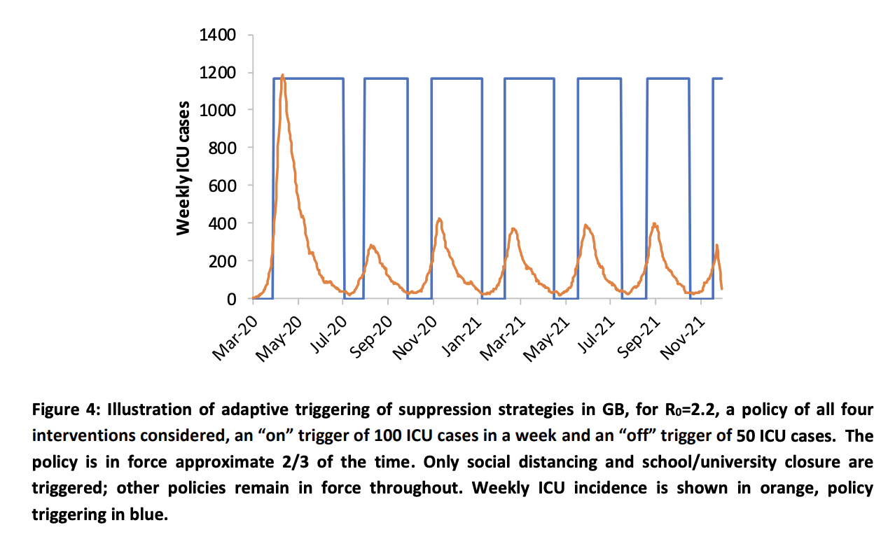

<!-- TODO(a11y): 1 localized body image(s) have empty alt text -->

_How do we get back to work and save our economy without re-triggering the pandemic?_

### Part 1: Stopping a pandemic would be easy

Stopping a pandemic would be easy if every member of society could isolate for 30 days, but we can’t. Our survival depends on people doing their jobs. This presents us with a problem:

**When someone needs to enter a common space, there is a tradeoff between the probability they will infect someone in that space and the degree to which society is economically depending on them being in that space.**

For example, everyone is economically relying on the truck drivers to keep our distribution lines running during the lockdown. Without them, we don’t get food. Fortunately, the odds of them spreading disease from the cabin of their truck is low. Thus, we can place truck drivers in the “high economic reliance, low risk of spread” category.

Restaurant chefs, however, find themselves in a different relationship to society. Society can feed the population using grocery stores, but a single sick fast-food chef could potentially infect hundreds of people in one day’s work. Thus, a chef is in the “low economic reliance, high risk of spread” category.

However, employment is not the only measure of someone’s economic necessity or likelihood of spreading disease. For example, while a child being at school might not seem like anything the economy is relying on, closing schools can require many parents to stay home (especially single parents), which can include a wide variety of industry professionals the economy is relying on.

Similarly, someone’s likelihood of spreading disease isn’t just a function of their employment (or even their location). Whether they’ve already had the disease, passed an antibody test, been in quarantine for the last 14 days, or recently traveled to an infected area are all important risk factors in calculating someone’s current “likelihood to spread the disease”.

This is where we meet the tradeoff mentioned above. When someone needs to enter a common space, there is a tradeoff between the probability they will infect someone in that space and the degree to which society is economically depending on them being in that space.

And since we cannot turn off the entire society for 30 days to rid ourselves of the pandemic, we need to figure out how to get the best possible tradeoff between **furthering the spread of the disease** and **turning the economy off**, both of which are harmful in their own way.

However, since the disease can only spread when people are in shared spaces, we can further refine this tradeoff to the following. We need to get the best possible tradeoff between **allowing and denying individuals access to shared spaces** where the disease can spread.

You can think of this tradeoff like a tug-of-war between two facts about a person. On the “deny entrance” side of the rope, we have a person’s likelihood of being sick (vaccinated vs showing symptoms) and the inherent risk of the area being entered (open street vs restaurant kitchen). On the “let them go in anyway” side of the rope, we have the economy’s reliance on the person being there (a Fedex pilot flying medical supplies vs a chef in a fast-food kitchen).

If we were able to perfectly solve this access problem, and we knew with 100% certainty whether someone would spread a disease by entering a shared space, the disease would be stopped with the exact minimum cost to the economy. Only those who were sick and trying to enter spaces where they would spread their sickness would be denied access to those spaces (maybe not even quarantined at home!).

But, we don’t know who will spread a disease with 100% certainty. So, if we don’t know that, what do we know? How close can we get?

### Part 2: The tools we have

The tools we have to limit access to shared spaces are incredibly blunt by default. The first tool is non-essential quarantine. This is the “mega switch” which [over 100 countries](https://www.bbc.co.uk/news/world-52103747) have flipped, requiring all non-essential staff to be denied access to all spaces other than their homes, grocery stories, and the streets between them. This is the emergency lever which can only be sustained for so long before the economy buckles underneath it.

But what happens after? What tools do we have when this switch is forcibly turned back on? Unfortunately, they too are incredibly blunt instruments. Schools are either open or closed. Restaurants and bars are either open or closed. Travel across borders is either open or closed. Factories, shops, and warehouses are either open or closed. By default, from a public policy perspective, seemingly everything is a 100% binary switch.

And why does the “bluntness” matter?

“Bluntness” means you are left with hard choices. You either accept everyone to a space (regardless of the likelihood they might spread the disease) or no-one to a space (regardless of the economic cost). In terms of trade offs, bluntness is the worst case scenario. You either get all of the gain and all of the cost of one side, or all of the gain and all of the cost of the other. There’s no opportunity for compromise, or what statisticians might call the “pareto frontier”.

And if you’re trying to not flood your hospital system (causing more deaths), then a government is forced to use their switches in a way exemplified in the following graph.

<figure class="">

<figcaption>Source: <a href="https://www.imperial.ac.uk/media/imperial-college/medicine/sph/ide/gida-fellowships/Imperial-College-COVID19-NPI-modelling-16-03-2020.pdf">Imperial College COVID-19 Response Team</a>&nbsp;</figcaption></figure>

This graph depicts how “blunt” instruments are used to fight a pandemic. In this simulation by researchers at Imperial College, switches are turned on and off based on the number of intensive care unit (ICU) bed cases in a week. This is because when a hospital runs out of beds an important threshold is reached, wherein additional deaths occur because of individuals failing to receive treatment owing to a lack of available ICU beds. So, the economy is turned on until the ICU beds fill up (ramping up the economy), and then the economy is turned off until the number of hospital beds returns to a low enough number to flip back.

And it’s important to consider that switching an economy off and on costs more than just the “off” sections. It’s what an economist calls “market volatility”, which is a nice word for what happens to your engine if you floor-it from a cold start 100 times in a row. The economy doesn’t like to be turned off and on. Eventually some parts just stop working all together.

### Part 3: The next best thing

**The next best thing to an on/off switch is a “dimmer” which can be adjusted by the same people who would normally be flipping the switch on and off.** Instead of blocking “everybody” from schools or restaurants or cafes or allowing “everybody’ to schools, restaurants, or cafes, each day gets a random subset of the population which can enter on any given day.

For example, if you wanted to do a “50%” level, you could split the population into two groups according to the first letter of their last name, the A-M group and the N-Z group. On even days, the A-Ms can go out in society, and on odd days, the N-Zs can take their turn. In this way, we can achieve a 50% level of quarantine. Additionally, this system also has the nice benefit that in general, at least one parent stays home on the same days as their kids.

And if you want to lower the quarantine to 33%, do it on a 3-day rotation. 25%? Do a 4 day rotation! Need an arbitrary %, post a calendar on the state government’s website so people can plan around it.

However, this tool still leaves a lot on the table. What about the fact that truck drivers are inherently less likely to spread a disease (and more vital to feeding the nation) than restaurant chefs? It is still less-than-optimal from an economy vs epidemic standpoint to treat them the same and have them quarantine at the same intervals.

Or if you need a more extreme version – it’s less-than-optimal to have a stay-at-home parent or a remote computer-based worker under the same quarantine frequency as a grocery truck driver. **Keeping a remote computer-based worker under quarantine has minimal impact on the economy while a grocery truck driver has a very strong one.** However, this tool quarantines each of them just as much (and from all places in society, not just the high risk ones).

### Part 4: The tool we want

The tool we want is one which can accurately estimate each person’s probability of spreading a disease if they enter a given space. If we know that probability (based on their likelihood of being sick and their role in that space), we can empower policymakers with granular tools for tweaking quarantine differently for high and low-risk people and places. This means we can keep the economy alive longer while allowing the riskiest members of our population to remain in isolation.

_Note: For those of you who might be wondering whether treating people differently based on their likelihood of being sick and their economic importance is a social justice issue, it ABSOLUTELY IS! Moreover, the worst case scenario is one in which everyone is sick and the economy fails to feed us. Not only does this affect everyone negatively, but it disproportionately affects those who were already disadvantaged. However, if we can keep the economy humming by keeping some groups at home, this “lifts all boats” while also opening up greater opportunity for government programs to realistically support those who are in quarantine. So, to maximize social justice, I encourage you to focus on a combination of “preserve the economy” type efforts and “subsidize those in need” type efforts._

So, in an ideal setting we would have a tool which could perfectly do the following:

-   Model the probability that someone is infectious
-   Model the probability that a person, if infected, would spread a disease if allowed in a location
-   Model the degree to which the economy is relying on this person entering the location
-   Deny someone access to a physical location if the pandemic risk/economic reward tradeoff is too high.

If this tool existed and worked perfectly, we would be able to optimally decide who should be allowed in which areas to most rapidly stop the pandemic.

**However, a perfect tool for this is probably impossible. We can never know the probability that someone is infectious or the probability that any given role within a space is conducive to spreading disease.** Is a restaurant server likely to spread disease? How about a bus boy or a hostess? And what about our economy’s reliance on any one worker? How can this be exactly quantified given our complex our society is? Calculating this risk/reward number is going to be difficult!

Of course, even if we could perfectly model a risk/reward number for each “entrance event” (when a person tries to enter a space), there will always be issues with enforcement and adoption. Who is going to prevent someone from entering a space if it’s too risky? How will they know for sure that they should? What happens if someone is denied access from too many spaces? Can someone cheat the system? What kind of precedent does this set for society?

### Part 5: The next best thing  

The next best thing is an approximate version of this idealized tool which seeks to address failure modes in a graceful way. The most likely failure mode is one in which all the **“probabilities” being estimated are wrong** and the app is randomly quarantining (some) people. Another possible failure mode is one wherein **people don’t adopt the tool or find ways to cheat** around the tool (and leave quarantine whenever). The most important failure mode is one in which such a tool **infringes on the user’s data privacy**, which we’ll get to in a minute (it requires its own section).

To help discuss these failure modes I’m going to describe one incantation of this tool, a COVID-19 smartphone application. However, it’s important to consider that a fully formed version of this tool would not _only_ be an app (because not all people have smartphones). But for the purpose of showing how an approximate version of the most desirable tool could have manageable failure modes, we’ll talk about a smartphone app.

So, what does this smartphone application do? Well, let’s remember the tradeoff.

**The Core Tradeoff:** When someone needs to enter a common space, there is a tradeoff between the probability they will infect someone in that space and the degree to which society is economically depending on them being in that space.

Thus, in accordance to this goal, a smartphone app could try to do 3 things:

-   Predict whether its owner is infectious
-   Predict whether a certain space is high-risk given this owner’s role in it
-   Predict whether its owner has a strong-enough economic reason to enter.
-   Testify to a space gate-keeper that the owner is low enough risk (pass/fail)

****Feature 1: A smartphone app that tries to predict if you’re infectious****

Perhaps a smartphone application would store information about its owner and attempt to predict whether the owner is likely to get sick. This could include information such as:

-   Whether the owner has COVID-19 like symptoms
-   Whether the other has been recently tested, and if so, the results
-   Whether the owner has been to high-risk areas
-   Whether the owner has been in quarantine
-   Whether the owner has an auto-immune disease
-   Whether the owner has received a contact-tracing alert

Given all of this information, the phone could calculate the probability that a person is currently infectious. This probability could be used for the other features in the app.

**Feature 2: A smartphone app that tries to predict if a certain space is high-risk given an owner’s role in it**

While this could be statically set, there are a myriad of things that could go into modeling whether a person’s role in a place is likely to be infectious:

-   Will you be working with food or food related items (cutlery, tablecloths, etc.)?
-   How many people will also be in the same enclosed space?
-   Will you be in close quarters with other individuals (< 2 meters) for extended periods?
-   Will you or others be participating in activities that lead to heavy breathing?
-   etc.

Additionally, some roles could simply be pre-defined as high risk in accordance with their common patterns. Chefs, massage therapists, and yoga instructors all fit in this category.

**Feature 3: A smartphone app that tries to predict whether its owner has a strong economic reason to enter**

This has less to do with surveying the user and more to do with government authorities having the option to designate some activities as economically more vital than others. This is already being done around the world during full lockdowns. “Essential services” are still allowed to operate. This is just about asking policymakers to make more buckets — rather than only saying who is “essential”, they could specify which groups are “mostly essential”, “partially essential”, “mildly essential” and “non-essential”.

And rather than specifying that these individuals can go anywhere and do anything, specify which spaces they should be entering for their essential tasks! For example, someone who is “essential” needs access to their workplace, but don’t necessarily need access to the local pub or nursing home.

So in this case, the smartphone’s task is really just to figure out which category its owner is in (Are they a nurse or a truck driver?) and what location they’re trying to enter (Is it a gas station or a yoga studio?). Then the level of economic importance can simply be checked against that jurisdiction’s policy.

**Feature 4: Testify to a space gate-keeper that the owner is low enough risk (pass/fail)**

So, given that we are in a society which is in lockdown, such an app needs to be able to prove to gatekeepers of a shared space (restaurant, store, building, etc) that this person is low enough risk and high enough economic reward to enter the area.

Without getting into UX specifics, the main challenge here is getting social institutions on board enough to facilitate the transaction. Assuming that the smartphone app has accomplished features 1-3, a phone of a gatekeeper (receptionist, security guard, bouncer, etc.) could simply talk to the phone of a person trying to enter and ask, “Hey, should I let you in?”. And if the apps agree that entrance is warranted, the gatekeeper can allow an exception to the society-wide quarantine for this individual.

So, given an app that successfully accomplishes these 4 things, society can gracefully fade back from quarantine to normal life without the violent open/close of the policy switches. However, it doesn’t take too much imagination to think of ways this might go wrong. Let’s talk about a few of them.

### Part 6: Failure modes

**Failure mode 1: What if the app isn’t accurate?**

What if the app does a terrible job of predicting the probability that someone is infectious? What if it’s only accurate 60% of the time? What if it’s no better than random?

It doesn’t matter.

It’s still better than what we have now, turning the quarantine entirely off… and on… and off… and on…

Worst case scenario, the app can’t predict who is sick, but you can still skew the randomness by making it more or less likely to randomly deny someone entrance to a place. Thus, **as long as the app’s thresholds are always adjustable by the local health authorities**, it is better than the current state. We still end up in a world where we have a “dimmer” instead of a “switch”.

And it’s **very unlikely** that we would generate an app with _completely random_ decisions. Some events, such as people self reporting symptoms (even with dishonesty), people recovering from previously having COVID-19 (and thus have antibodies), are going to have very strong correlation with whether or not they are likely to infect others. While a perfect prediction is probably unrealistic, some useful signal, weighted with the “dimmer”, can be very helpful.

And just to make the point from one more angle, even if the app generated _completely random decisions_, just the ability to adjust the “dimmer” by occupation or location is a huge win! **Policymakers could reduce the number of people entering restaurants instead of shutting them down entirely.** Or if particular parts of town were suffering economically, perhaps it could allow more commerce in that sub-town and offset the risk with less in another part of town which was doing quite well.

In short, as long as the thresholds are adjustable, even a really unintelligent app provides useful optionality that didn’t exist before. Furthermore, adjustable thresholds allow for trial and error, giving flexibility to unforeseen circumstances. Adjustable thresholds are the key.

**Failure **Mode 2: What if people fake data?****

My first response is the same as Mode 1. As long as the overall probability of entering/denying is still adjustable, it’s still a win. Secondly, even if some people fake data, if not _all_ people fake data it’s still better than not having it at all.

However, this one also benefits from a group of technologies called Self Sovereign Identity. Without going into it too much, SSI allows one person to make claims about another. More importantly, it allows the latter person to prove that the former made the claims to a third party.

For example, SSI can enable a patient to prove that a doctor has claimed they are COVID-negative. SSI can enable an employee to prove that the IRS has claimed they work at a specific location. SSI can even enable a citizen to prove that a random stranger claimed they were at home all day.

It’s important to consider that SSI cannot prove that any of the claims are true, but it can prove that someone important believes them to be! And in society, that’s what really matters.

Perhaps the most obvious application of SSI technologies is to allow people to prove that a registered doctor or testing facility has recently claimed them to be COVID-19 negative. To do this, a doctor would generate (likely using an app) a cryptographic “signature”. This signature is a lot like a normal signature on a piece of paper, except that it is impossible to fake and trivial to verify. (This is better than a normal signature which is trivial to fake and very hard to verify). A doctor can take a document, “cryptographically sign it” and then give the signature to the patient. The patient can then take the signature to anyone who, with the proper smartphone app, can verify that it came from a certified doctor.

It might sound like magic, and in many ways it is. You can read more [here](https://medium.com/@AlexPreukschat/self-sovereign-identity-a-guide-to-privacy-for-your-digital-identity-5b9e95677778).

Again, just to repeat. SSI is not a silver bullet. It only works when everyone agrees to use the SSI infrastructure (which means a few smartphone apps need to be made). Furthermore, it doesn’t prove that anything is true. It just proves that someone important thinks that it is true.

**Failure Mode 3: What if people don’t use the app?**

If people don’t use the app then it can’t help. However, if even some people use the app, then the “dimmer” effect begins to be useful.

Secondarily, if a local jurisdiction’s first move after total quarantine is “quarantine exceptions based on an app”, I imagine adoption would be pretty high. In exchange for downloading an app, you literally get access to all of society. Seems like a pretty compelling driver for adoption.

**Mode 4: What if people delete the app and restart from scratch if they don’t like the app’s predictions?**

One interesting problem is if people were to, say, test positive for COVID-19 and then their app denies them entrance to everywhere.

This is the wrong way to think about the app. It’s not about denying you entrance to anywhere. By default you’re in quarantine. By default you’re blocked. Testing positive for COVID-19 shouldn’t really change anything about access to society that deleting the app wouldn’t also do.

The app is about storing information which is going to **open doors** for you. This means that deleting the app and “starting over” just means you’re back to square one, total quarantine. You’ll need to gather information and store it in your phone to be able to prove to business owners that you are low enough risk to enter.

### Part 7: What about privacy?

This all might sound really hard to do while preserving privacy. First, let me reassure you that everything I’ve spoken about above can be done with a very high level of privacy. While privacy is a complex subject, a good threshold is: don’t build a database with users data in it.

The two secret weapons for privacy in this kind of app infrastructure is:

-   On-device data
-   Self Sovereign Identity Technology

Each smartphone app is just supposed to store enough information about its owner to prove to other people that the owner is low-risk. If you’re trying to get into a pizza place. Your app is responsible for calculating your risk score, including “claims” from other people that you are low risk. These claims are then presented to the guy blocking the door at the pizza place. If the guy blocking the door thinks that your economic gains for entering are worth the risk (according to a policy set by the local health officials), you get to enter.

None of this requires a centralized database. None of it requires a user login. Your app is just collecting “evidence” for you to “make your case” at each establishment you want to enter. And you probably do this by showing them a QR code.

**If you’re uploading individual user’s data to a central server, you’re probably doing something wrong.**

### Part 8: What about informing health officials?  

It is widely known that health officials need to know things about the population in order to respond. Where are people getting sick? Where are they reporting symptoms (about to get sick)? Are people actually self-isolating? All of these are important factors affecting everything from where hospital supplies should be delivered to whether schools should be opened (whether “dimmers” should be adjusted).

**The important thing to remember is that health officials need to know aggregate statistics**. **They don’t need to know individual records. For example, they need to know, “how many people are coughing today?”. They don’t need to know, “Is John Glenn coughing?”**

The tricky bit is figuring out how to provide officials with these aggregate statistical results without first sending them the underlying data.

Fortunately there are several scientific fields dedicated to this: Secure Aggregation and Differential Privacy being the main ones you should look at. I wouldn’t go so far as to say it’s a solved problem, but there are approaches that are more than practical enough for this use-case.

The trickier bit is making sure you’re using a secure implementation of Differential Privacy or Secure Aggregation. If you’re unsure, please use the [resources we are providing](https://blog.openmined.org/openmineds-efforts-for-the-coronavirus-pandemic/).

This aggregate information, in combination with “dimmers” for relevant categories in society, really is a powerful tool for epidemiologists working with health authorities. Officials can observe current health trends and modify society’s risk thresholds in real time to address them. It’s a powerful idea.

### Part 8: What about contact tracing apps?

Contact tracing apps attempt to keep a running list of anyone you’ve come in contact with over the past 14 days. If you become sick, the app will automatically inform everyone in the list (hopefully in a privacy preserving way) that they may have been exposed.

It’s a compelling idea, and if we had reason to believe that the technology would be 100% accurate in predicting infections, one could make the case that it is all that we need.

However, there are a myriad of reasons to believe that contact tracing will have a large number of false positives and negatives. First, if deployed in isolation from any other use case or features, this kind of messaging app has struggled to gain adoption. In Singapore (one of the first places to deploy contact tracing), only 12% of the population has downloaded the app. This means that 12% \* 12% = 1.4% of interactions are actually measured by the app (because both the sender and the receiver have to be running the app to capture a connection).

However, even if 100% of people adopted the app, bluetooth technology is not able to accurately measure the distance between two phones. This means that it could think you came into close contact with someone who was sitting outside a cafe 15 feet away from you (a false positive). Furthermore, bluetooth also works through walls (despite not knowing the wall is there), another source of false positives.

However, even if it was perfectly able to measure distance, the notion of a “contact” meaning that you were “definitely” exposed is fundamentally flawed. At what number of seconds or distance should you go get tested? It’s an inherently probabilistic process. This also doesn’t even account for shared surfaces such as door handles or contaminated food.

Additionally, even if contact tracing met all of these requirements, it still relies on the assumption that someone can actually, definitely find out that they have COVID-19. In the UK, virtually no-one gets tested unless they are **hospitalized** (or the prime minister), which means there are loads of cases running around which would never generate a contact tracing event. In short, if someone exposed you but never definitely finds out that they have COVID-19 (instead of just a cold, or perhaps no symptoms at all), a contact tracing app will never message you to warn you.

So is contact tracing a waste of time?

Absolutely not. Contact tracing is super useful. However, the way it is **packaged** at the moment is potentially quite harmful. At the moment, instead of focusing on helping to optimize the economic/epidemic tradeoff, most contact tracing apps just **message people** if it thinks they’ve been exposed. False positives drive people to flood hospitals who are otherwise perfectly healthy. False negatives are empowered with the false sense of security their trusty contact tracing app ensues to run around society spreading their illness.

If contact tracing is instead merely another **input corollary** to an app like the one described in the app above, which is merely attached to a “dimmer” which can adjust how much a contact tracing event affects your overall likelihood of transmission, then the negative externalities go away.

Furthermore, contact tracing could rely on more than just sending a binary “you’ve been exposed”. Far more useful would be contact tracing which actually messages people with anonymous information about your risk profile. For example, if someone sitting next to you in the cafe the night before is symptomatic today, maybe you shouldn’t go visit your grandmother in the nursing home for a few weeks. This is the true power of contact tracing. **Think of it more like page rank for likelihood of infection.**

TODO: link to full proposal for end-to-end encrypted contact tracing messaging here

### Part 9: What happens if there are zillions of these apps?

Nothing in this app works across jurisdictions if independent apps aren’t interoperable.

As this is a global pandemic; hundreds of independent organizations, countries, and states will implement and approve their own version of COVID-19 apps. This is a good thing — app diversity will improve security by diversifying risk and reducing the reward for any one system that is compromised. However, this presents a challenge for any one app reaching critical user mass if we end up with several ‘main’ apps. If apps are not able to communicate with each other, they will fail to work when people cross borders.

For example, someone can be exposed but since they’re on a different platform they will not be notified. They will continue to be in public spaces, infecting others. Or perhaps invesrely, someone might obtain a cryptographic “claim” from their doctor that they are COVID-19 negative, but because they drove across a state line now nobody can verify their claim.

To solve this issue, apps developed for these use cases should have a federated back end that complies with \[**a standard being developed**\] which enables these features to be done in such a way where there is no plaintext “database of users” which could be dangerous to share. Instead, we should simply ensure that the way that phones are encoding various claims of low-risk are compatible with one another. (Note: contact tracing needed this as well but the Apple/Google announcement seems to have nullified the worry that they wouldn’t be.)

### Part 10: Conclusion  

If you’d like to get in touch, please email [covid@openmined.org](mailto:covid@openmined.org). In particular, our community is focused on helping all COVID-19 related apps to be as effective and privacy preserving as possible. We provide free consulting and software development services.
