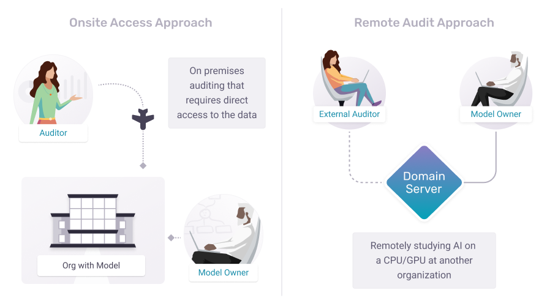
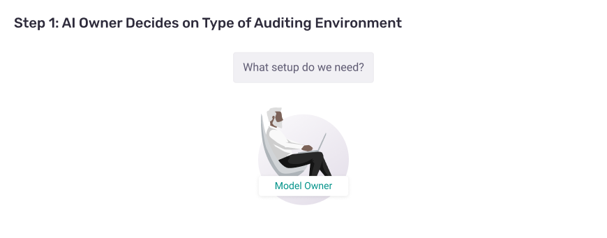
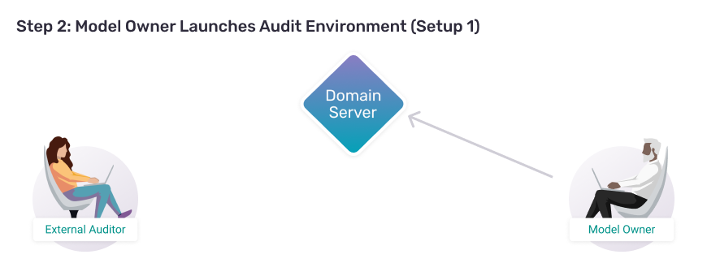
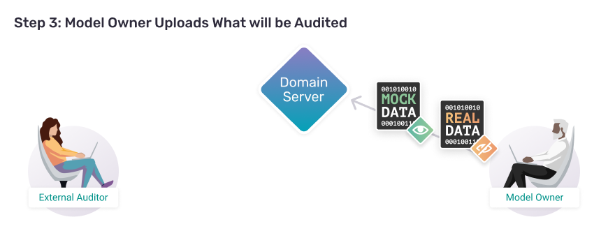
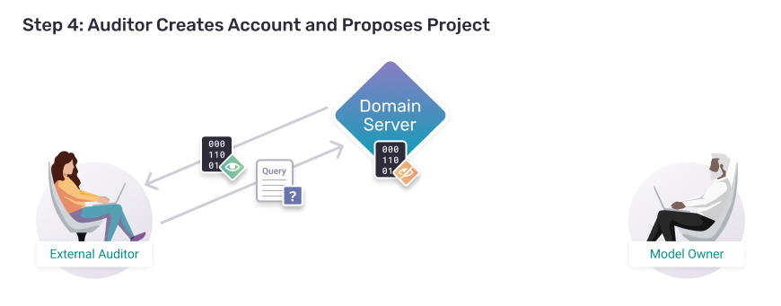
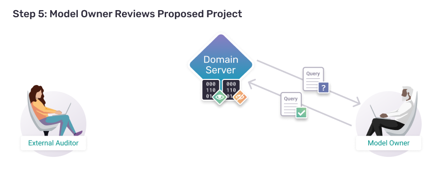
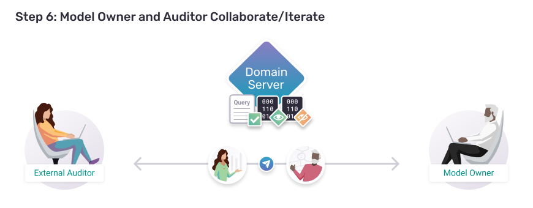
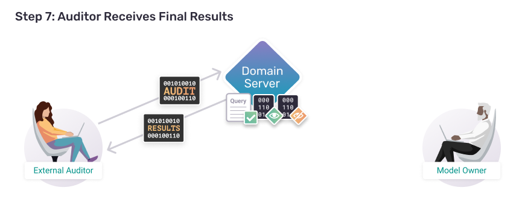

<!-- TODO(a11y): 10 localized body image(s) have empty alt text -->


<!-- TODO(content): shortcode(s) present (verify) -->

_Summary (1 page) — Non-technical Article (11 pages) — Technical Tutorial (20 pages)_

**Summary:** At the present moment, important qualities (value alignment, fairness, bias, safety, toxicity, truthfulness, copyright, etc.) of many powerful AI products and services remain unchecked by external parties. At the same time, the few external parties who get to check these properties are often given too much access, exposing AI owners to unnecessary privacy, security, and intellectual property (IP) risks. This works against the interests of all parties involved: auditors, AI owners, and the billions of people who rely upon increasingly powerful AI products and services in their daily life. Fixing this **_external access problem_** could improve AI products and services, strengthen public trust in AI, mitigate key risks to society, and increase privacy, security, and intellectual property protection for AI owners and users during the audit process. Addressing this problem has imminent practical relevance given the large and growing impact of AI on our daily lives.



This blogpost series surveys the limitations of modern external access approaches such as onsite, API, open release, and trust-based protocols. Each approach is a partial solution to the problem, struggling with a tradeoff between auditor access and AI owner risk. Protocols that prioritize the AI owner’s protection over auditor’s access might require limiting audits to high-trust individuals, constraining auditors’ field of inquiry to a subset of shareable data, constraining auditors’ field of inquiry to a narrow pre-built API, or running an auditor’s query for them — restricting the ability of an auditor to create and verify their own results. On the other hand, other protocols can grant an auditor too much freedom with an AI system, exposing owners to extraneous privacy, security, and IP risks that exceed the audit’s intended scope. Furthermore, all of these approaches suffer from another problem: access to an AI system alone fails to reveal the downstream impacts of AI products on real people after they leave the AI system — the true goal of an audit — due to not properly leveraging third-party data about user welfare. Auditors frequently rely on heuristics about the quality of AI systems — test datasets, simulated environments, etc. — while the true impact on users’ lives remains unverified.

In this series of tutorials, we describe a new way forward which alleviates these problems by facilitating a query-based system with one key capability: an external auditor will be able to propose a question about an AI system to its owner and related third parties and — if they approve the question — the auditor will be able to download the answer to that question without the auditor, AI owner, or third parties learning anything beyond what the group explicitly approved. To do this, an owner copies their AI system into a PySyft “Domain” server, which exposes an API to an external auditor, and third parties load their data into PySyft “Domain” servers, making them available for use in AI audits. The auditor can then download fake/mock pieces of the AI system and third-party datasets, and use those fake pieces to create audit code. The auditor then sends this proposed audit code to the AI owner and third parties for approval. If all actors consent (through manual review or an automatic process), the external auditor can download the answer to a specific question without any parties learning any other information in the process. This facilitates more precisely scoped collaboration between internal and external parties in keeping with the concept of [structured transparency](https://arxiv.org/abs/2012.08347).

**Future Work:** This post is part 1 of a multi-part series on AI auditing. It describes a new type of AI auditing infrastructure. Subsequent posts apply this infrastructure to audit for: **copyright**, **bias**, **fairness**, **plagiarism**, **value alignment**, **illegal content**, and **disinformation**. Furthermore, while this post focuses on auditing an AI’s user log — a simple introduction to the solution — subsequent posts will look at other parts of an “AI system”, such as the training data, model, compute allocation, and other related APIs and metadata. If you’d like to be notified about these posts, [let us know](https://us16.list-manage.com/subscribe?u=8d080204f3579a90b631d6765&id=a36b6b4412) and we’ll message you when we post them.

<section style="border-style: solid none; border-width: 1px; border-color: #CFCDD6; padding: 24px; gap: 24px"><center><div class="section-title"><h5 style="margin: 0px; padding: 0px; color: #464A91">Motivation</h5><h3 style="margin: 0px; padding: 0px; color: #353243">The Value of External Access</h3></div></center></section>

External access is valuable for two reasons. First, even though internal employees of AI organizations already have the access they need to answer any question about their own AI models — it is not clear to external stakeholders that they sufficiently answer all of the most important questions (e.g., value alignment, safety, fairness, etc.), and share those answers with appropriate external stakeholders (e.g., users, regulators, etc.). This is problematic for everyone involved. Responsible AI organizations want external parties to believe and trust in the quality of their AI systems, but often cannot give them access to private, secure IP to verify important claims. Inversely, society broadly wants to be sure that the AI systems they use are safe and trustworthy, but cannot obtain access to private, secure IP — and largely wouldn’t have the expertise to know what to do with that access if they did obtain it. This motivates the value propositions of external auditing — validation and coverage: validation of claims by internal parties, and extension to new claims which external actors believe were missed, yet important. And because external auditing is valuable, external access is valuable.

Second, even though internal employees of AI organizations already have the access they need to answer many questions about their own AI models — AI organizations often don’t know what happens to users after they use an AI. The latter requires information about what happens to people after they leave the AI product or service, and so companies are less likely to have this kind of information. A film streaming service might recommend the movie you watch before bed, but they don’t know if their recommendation disrupted your sleep. A social media app might recommend a picture that impacts a teenager’s thoughts about their body, but they don’t know if a teen skipped dinner because the picture made them feel insecure. This reveals a common mis-conception about AI auditing: the purpose of AI auditing is not principally about AI models, it is about people — and the ways in which their lives get better or worse as a result of AI products and services. This too is challenging for all involved. Both the creators of AI systems and society broadly want to confirm that AI products and services are making people’s lives better, but often AI creators just don’t have the data to verify this claim. Furthermore, acquiring a copy of welfare data from other organizations can raise serious concerns about privacy, security, and IP. This is a central value proposition of external auditing, measuring AI’s effect on the lives of people living in the real world.

These two external access programs — an auditor to an AI system, and an auditor to 3rd parties — relate to two styles of AI auditing. Taking inspiration from other sectors, these two styles of AI auditing are comparable to the early and late stages of a drug trial. Early in a drug trial, scientists test a drug in simulated environments — in test tubes in a lab. Late in a drug trial, scientists measure whether people were helped or harmed when they took the drug in the course of their normal life. Similarly, early in an AI evaluation, scientists test an AI model in simulated environments — in video-game worlds or against test datasets. This type of test requires the first type of external access described above. Later, scientists can run an AI model in the real world — and create an aggregate measurement of whether people’s lives get better or worse when they use it. This requires the second type of external access — the involvement of 3rd parties. Infrastructure for this second type must facilitate the aggregate understanding of an AI system’s impacts without revealing information about any specific person in the process — similar to how aggregate statistics regarding COVID vaccine effectiveness describe the effectiveness of a drug without revealing information about specific patients taking it. Such is the nature of the external access problem.

Taken together, external access is valuable because it’s the driving force behind the full spectrum of early-to-late-stage external auditing. Without external access, we — society — are left with only the knowledge AI owners tell us, with limited-to-no ability to verify it, and only based on the information AI owners have in-house. And if a user’s welfare is not described by what an organization collects as a part of their AI product experience, an AI organization may be unable to understand if and when harms are occurring. But with external access, external parties can validate and extend society’s knowledge of the way AI systems make people’s lives better or worse, powering improvements in the quality of AI systems and the lives of the people who rely on them.

<section style="border-style: solid none; border-width: 1px; border-color: #CFCDD6; padding: 24px; gap: 24px"><center><div class="section-title"><h5 style="margin: 0px; padding: 0px; color: #464A91">Problem</h5><h3 style="margin: 0px; padding: 0px; color: #353243">The Challenge of External Access</h3></div></center></section>

External access is hard because of two sub-problems. First, it is hard for an untrusted external actor to answer a question about a private, secure, valuable piece of intellectual property inside of an organization. We call this the _1st party access problem_ or simply the _1st party problem_. Second, it is hard for an untrusted external actor to combine and jointly leverage secure, private, valuable IP at multiple organizations which may not trust one another enough to put their digital assets in the same place. We call this the _3rd party access problem_, or simply the _3rd party problem_.

Solving both of these problems simultaneously would mean that a 1st party (auditor) would be able to answer a question about a 2nd party’s assets (AI system), even if that answer required additional information from a 3rd party (e.g., holder of demographic information about an AI owner’s users, so that the 1st party could measure the bias/fairness of the AI system). In the ideal case, the 1st party (auditor) would be the only party who learned anything in the process — the answer to their question (e.g., about an AI’s bias) — while the 2nd and 3rd parties learn nothing they didn’t already know (they only ever see their own data/model). Facilitating this “only one party learns only one thing while working with data across many parties” requires achieving an ideal called [structured transparency](https://arxiv.org/abs/2012.08347).

<section style="border-style: solid none; border-width: 1px; border-color: #CFCDD6; padding: 24px; gap: 24px"><center><div class="section-title"><h5 style="margin: 0px; padding: 0px; color: #464A91">Status Quo</h5><h3 style="margin: 0px; padding: 0px; color: #353243">Current Approaches to External Access</h3></div></center></section>

In the context of an AI audit, there are three popular approaches to the 1st party problem and two popular approaches to the 3nd party problem. They all fall short of the ideal of structured transparency. The approach we propose — PySyft — combines the best properties from these approaches. So, before introducing PySyft, we will briefly summarize these other popular approaches as an important bridge to our proposal.

<section style="padding: 20px 36px 0px; gap: 20px"><div class="step-title" style="padding: 5px 20px; gap: 20px; border-left: 4px solid #464A91"><h5 style="margin: 0px; padding: 0px; color: #464A91">Status Quo:</h5><h4 style="margin: 0px; padding: 0px; color: #353243">Legacy Approaches to the 1st Party Problem</h4></div></section>

_“It is hard for an untrusted external actor to answer a question about a private, secure, valuable piece of intellectual property inside of an organization.”_

There are three popular approaches to the 1st party problem:

1.  **Open access:** release AI models and datasets to external parties via an insecure environment (such as a public webpage)
2.  **Onsite-access:** store AI models and datasets in a secure environment, and bring external auditors into this environment for study.
3.  **API access:** store AI models and datasets in a secure environment, and build an API which allows external auditors to extract specific pieces of information from the secure environment.

##### Open Access:

For most production AI systems, open access is a non-starter because of privacy, security, and IP concerns — even if external parties sign various confidentiality agreements. This is common because, even with confidentiality agreements signed, it’s almost impossible to enforce what someone does with your information once you share it with them.

This leaves onsite-access and API access. Both draw from the same core philosophy. If someone you don’t trust needs to access your internal systems to do something, have the untrusted party convey what they want to someone you do trust, who can then do it on their behalf and send the untrusted party their results — but only if the internal trusted party feels the organization should do so.

##### Onsite-Access

Onsite-access is the legacy approach of governments and corporations around the world for managing their information. Trusted employees access official, organization-owned devices inside of secure facilities which require security badges to enter. This has been extended to external parties through the combined use of both trust exercises (background checks, etc.) and — more or less — requiring trusted internal parties to be the ones who actually produce research results for untrusted external parties.

For example, the US government runs Federal Statistical Research Data Centers (FSRDCs). Researchers with special sworn status (SSS) can enter a physical building (without bringing electronics with them), sit down at a secure computer, perform analysis against sensitive data, and then submit their code to an analyst who works for the FSRDC. The researcher then leaves the facility (without their results), and waits for their project to be reviewed. If it passes the review, the internal employee runs the code, produces the result, and transmits it to the external researcher.

##### API Access

API access is — in effect — an extension of this same philosophy as onsite-access, but with a greater potential for scale. If it is likely that many external researchers will run variations of the same query, and if variations of that query are approved by internal employees of the organization, the organization can build a custom web application allowing external researchers to ask and answer these specific research questions. This has all the benefits of onsite-access with one additional benefit, it can operate at much lower cost and higher scale for everyone involved. Researchers need not travel to physical locations and owners of secure information need not host them there. In the context of AI audits, this is called [structured access](https://arxiv.org/abs/2201.05159).

However, API access has a drawback in practice; it constrains researchers only to the questions which can be answered by the custom API. In this sense, if external researchers all want to ask the same types of questions, an API is more scalable. But if external researchers all want to ask different types of questions, an API is less scalable — an organization would be constantly hiring software engineers to extend its API with new workloads and endpoints for each research project.

<section style="padding: 20px 36px 0px; gap: 20px"><div class="step-title" style="padding: 5px 20px; gap: 20px; border-left: 4px solid #F8C073"><h5 style="margin: 0px; padding: 0px; color: #C2570A">Our Approach:</h5><h4 style="margin: 0px; padding: 0px; color: #353243">A Flexible Query API</h4></div></section>

Building upon the benefits of an API, we propose a new type of API which allows for particularly flexible use. Instead of an API which allows an external party to call specific functions on an AI model, the API offers mock (fake) versions of the private datasets and models behind the API. This allows an external auditor to write audit code against these fake versions (as if they had access to the real datasets and models). Then, they can use the API to submit this audit code to the AI owner. When they do so, they’re asking permission to answer a specific audit question. And if the AI owner is willing to run their code and see the result, the AI owner is granting them permission to answer their question. In essence, it’s a user-customzied version of [structured access](https://arxiv.org/abs/2201.05159).


This approach is beneficial because it captures the best aspects of open access, onsite-access, and API access. It’s like open access in that an external auditor downloads datasets and AI models, allowing them to write audit code locally. It’s like onsite-access in that an AI auditor is largely unconstrained in the types of questions they can pose of the AI system. Yet, it is like an API in that the external auditor only learns information specifically approved by the AI owner. Taken together, flexible query APIs offer a compelling-yet-familiar advantage over the three previous approaches.

<section style="padding: 20px 36px 0px; gap: 20px"><div class="step-title" style="padding: 5px 20px; gap: 20px; border-left: 4px solid #464A91"><h5 style="margin: 0px; padding: 0px; color: #464A91">Status Quo:</h5><h4 style="margin: 0px; padding: 0px; color: #353243">Legacy Approaches to the 3rd Party Problem</h4></div></section>

_“It is hard for an untrusted external actor to combine and jointly leverage secure, private, valuable IP at multiple organizations which may not trust one another enough to put their data in the same place.”_

The 3rd party problem has two solutions: open access or trusted intermediary. If an external auditor must combine data from multiple parties, either the parties can openly release their data (open access), or all of the parties can collectively find a trusted intermediary which they all trust to host their information. We focus on times when open access is a non-starter because of privacy, security, and IP concerns. This leaves the trusted intermediary.

Finding and working with trusted intermediaries is all but impractical because it requires just the right balance of incentives. Let’s say an external auditor wants to perform analysis using data from two organizations which do not trust one another. It needs to find a third organization which both of these organizations trust enough to hold their valuable, secure, private, IP — but which is also somehow motivated and experienced enough in the domains of both organizations to effectively steward the information. For example, if one wanted to perform analysis against data from a hospital and a bank, one would need to find a trusted intermediary which the bank and the hospital both trusted, and which also understood healthcare and banking well enough to know how to protect the data — to know what uses were appropriate or inappropriate. However, it turns out that expertise in healthcare and banking usually means — the organization operates in the healthcare and banking industries. If they operate in the healthcare and banking industries, it reduces the chances that they don’t have a conflict-of-interest with holding data from a hospital and a bank.

This is not impossible, and trusted intermediaries do exist. However, there’s a trust-at-scale issue. The more parties an external auditor seeks to work with simultaneously, the harder it will be to find a trusted intermediary capable of jointly understanding and protecting the interests of all parties involved. And as the number of relationships increases, so too do the dynamics (will the intermediary give any of the parties preferential treatment over the others, etc.).

For understanding the impacts of AI in society, this trust-at-scale issue is of paramount importance. Consider trying to understand the impacts of newsfeed, recommender, or credit scoring algorithms on the health and welfare of society’s members. “Health and welfare” means medical, financial, cultural, educational, political, and many other sensitive areas of possible impact. At the end of it all, is there an intermediary who is both experienced in — and neutrally separated from — all of these application areas? Surely such a party does not exist.

In a perfect world, if a 1st party (auditor) wanted to work with data across multiple 3rd parties, they could do so without requiring any of the 3rd parties to relinquish control over their information to anyone else. This would allow each of the 3rd parties to ensure that their interests and expertise were used to govern whether their information was used in an acceptable way.

<section style="padding: 20px 36px 0px; gap: 20px"><div class="step-title" style="padding: 5px 20px; gap: 20px; border-left: 4px solid #F8C073"><h5 style="margin: 0px; padding: 0px; color: #C2570A">Our Approach:</h5><h4 style="margin: 0px; padding: 0px; color: #353243">Hardware and software intermediaries that provably follow the instructions of their shareholders</h4></div></section>

There are multiple ways this can be done, but for the moment we will focus on the most accessible version to explain: a secure enclave. A secure enclave is a type of computer chip which is special in two ways. First, when it is manufactured, a “private key” is burned into the chip in a way that no-one else can know its value. This allows an external party to encrypt information using a “public key” with the knowledge that the only computer in the entire world that could decrypt this information and use it is the secure enclave chip.

Second, a secure enclave chip has a critical core capability burned into its hardware: it produces a hash of what software it is running. This allows multiple owners to know — ahead of time — what the computer chip would do with their information if that information was sent into the secure enclave. In the context of PySyft, we call these owners “shareholders”, because we can design software which empowers multiple owners with joint control over what the enclave does.

Taken together, an auditor can launch a secure enclave and propose this secure enclave to multiple 3rd parties whose data they want to leverage. The auditor then uploads a specific software program (PySyft), which allows the 3rd parties to maintain veto power over any use or derivative of their own information. With this guarantee, 3rd parties are free to upload their information into the secure enclave — assured that they have not in fact lost any control over how their information will be used. An auditor then proceeds to propose extensions to the API — which are applied if-and-only-if all of the relevant shareholders agree to allow it.

There is more to a secure enclave in practice, but this is enough to understand the general principle at hand. It allows the strategy that we proposed to solve the 1st party problem to generalize to the 3rd party problem by giving 3rd parties a safe intermediary. Because the intermediary does not delegate governance, 3rd parties need not identify an intermediary organization with whom they trust. They need only trust that the secure enclave is — in fact — actually a well-constructed secure enclave. If they are not inclined to trust a secure enclave, then there are other software approaches at their disposal, broadly termed “secure multi-party computation”. This can facilitate exactly the same outcome, it just uses software to do so instead of hardware.

<section style="border-style: solid none; border-width: 1px; border-color: #CFCDD6; padding: 24px; gap: 24px"><center><div class="section-title"><h5 style="margin: 0px; padding: 0px; color: #464A91">An Emerging Solution</h5><h3 style="margin: 0px; padding: 0px; color: #353243">Overcoming the 1st party problem</h3></div></center></section>

To overcome the 1st party problem in practice, an AI owner and auditor must jointly execute several steps together. First, the AI owner launches a new type of user-extendable web server — a “domain server” — and loads it with relevant datasets and AI models. By relevant datasets, we mean logs of the AI-system other than the model itself. This could be an AI model’s training data, user log, or other relevant metadata.

An auditor then “proposes a project”, which is a bit of code they’d like to be added to the Domain Server’s API. This code typically interacts with datasets and AI models in a specific way, so that the external auditor can use it to answer important question in the future. The model owner reviews this project (reviews the code) and — if they approve — the code is added to the API. And against this new API, the external auditor can download their results. Below, you can see this process broken apart into a series of 7 steps:

      

<div class="tabs tabs--center tabs--card" data-tabs data-base="audit-steps" data-initial="0">
<div class="tabs__list" role="tablist" aria-label="AI audit process, step by step">
<button type="button" class="tabs__tab" role="tab">STEP 1</button>
<button type="button" class="tabs__tab" role="tab">STEP 2</button>
<button type="button" class="tabs__tab" role="tab">STEP 3</button>
<button type="button" class="tabs__tab" role="tab">STEP 4</button>
<button type="button" class="tabs__tab" role="tab">STEP 5</button>
<button type="button" class="tabs__tab" role="tab">STEP 6</button>
<button type="button" class="tabs__tab" role="tab">STEP 7</button>
</div>
<div class="tabs__panels">

<div>



In this step we will cover how a **model owner** selects an infrastructure setup based off of their needs.

</div>

<div>



In this step we will cover how a **model owner**…

- Launches a domain server

</div>

<div>



In this step we will cover how a **model owner**…

- Uploads real and mock User+AI prediction logs
- Gives permissioned access to the external auditor

</div>

<div>



In this step we will cover how an **external auditor**…

- Connects to a “Domain Server”
- Uses mock data to prepare audit code
- Submits an audit proposal

</div>

<div>



In this step we will cover how a **model owner**…

- Downloads audit project and code
- Reviews code against mock data
- Submits audit response

</div>

<div>



This step covers the differnt conversations that happen to iterate on an audit.

</div>

<div>



In this step we will cover how an **external auditor**…

- Checks the project approval status
- Executes the audit project code
- Downloads the audit results

</div>

</div>
</div>

In a future blogpost, we’ll describe a bit more about how this paradigm can be extended to the 3rd party problem. If you’d like to be notified about these posts, [let us know](https://us16.list-manage.com/subscribe?u=8d080204f3579a90b631d6765&id=a36b6b4412) and we’ll message you when we post them.

<section style="border-style: solid none; border-width: 1px; border-color: #CFCDD6; padding: 24px; gap: 24px"><center><div class="section-title"><h5 style="margin: 0px; padding: 0px; color: #464A91">In Practice</h5><h3 style="margin: 0px; padding: 0px; color: #353243">PySyft</h3></div></center></section>

In this first blogpost, we have introduced the foundational concepts behind a new type of AI auditing solution. With regards to the 1st party problem, we analyzed the three conventional approaches and proposed a new solution which combines the best attributes of all three: APIs which external parties can extend themselves. With regards to the 3rd party problem, we considered the challenge of jointly governing information, and described how the 1st party solution can be generalized to multiple shareholders using secure enclaves or secure multi-party computation. Taken together, structured transparency can be achieved. A 1st party could learn the answer to a specific question — using data from multiple sources — without any of the parties learning anything else in the process. If we assume that we understand the incentives of 1st, 2nd, and 3rd parties — that auditors would be satisfied answering specific questions, and that AI owners want to help them to do so despite privacy, security and IP concerns — this technology will be transformative to the AI auditing space.

Yet, there is tremendously more to discuss when considering how to do this in practice. First, there are practical questions. How do 3rd party shareholders come to meet one another, and what does the governance process look like? How do they approve or deny extensions of the static API when they cannot see the information contributed from other parties? When the auditor receives their results, how do they know they haven’t been faked? And when a consumer later uses an AI product or service, how do they know they are receiving predictions from an AI model that has in fact been audited? This involves a myriad of important topics: meta-audits, audit registries, signed hashes, digital identity, and more. Future blogposts will introduce these concepts and give tutorials for how to launch them using PySyft. If you’d like to be notified about these posts, [let us know](https://us16.list-manage.com/subscribe?u=8d080204f3579a90b631d6765&id=a36b6b4412) and we’ll message you when we post them.

There is also more to discuss with respect to domain specific applications. There are already a myriad of tools emerging for studying AI bias, fairness, plagiarism, value alignment, illegal content, disinformation, and copyright. For the most part, these tools assume that the access problem has already been solved, focusing instead on how to measure these properties using AI models they can already access. In subsequent blogposts, we will visit each of these domain specific areas and describe how to use tools from across the ecosystem to extend PySyft APIs. Finally, there are practical matters of how to audit different parts of an AI system. Extending a domain server’s API to interrogate a user log is different from interrogating an AI model, which is different from checking a training dataset for copyright licenses. Across future blog posts, we will present layman-friendly descriptions and hands-on tutorials for how to do all of these using PySyft.

Finally, we conclude this blogpost with a hands-on tutorial. In this tutorial, we start at the beginning: an external auditor will audit an AI model’s use log. We begin here because it is the simplest place to start, while also being the most important. It is common to think of an AI audit as interacting with an AI model (such as a ChatGPT API). However, this type of interaction is primarily speculative. It looks to the future and speculates about how users might use the API, and how a model might react to that use. However, interacting with a user log is grounded in real-world user interactions. To that end, it is the gold-standard evidence of an AI model’s influence on the world, and an excellent place to start a tutorial.

<section style="border-style: solid none; border-width: 1px; border-color: #CFCDD6; padding: 24px; gap: 24px"><center><div class="section-title"><h5 style="margin: 0px; padding: 0px; color: #C2570A">Tutorial</h5><h3 style="margin: 0px; padding: 0px; color: #353243">Audit an AI’s User-log Using PySyft</h3></div></center></section>

<section style="padding: 20px 36px 0px; gap: 20px"><div class="step-title" style="padding: 5px 20px; gap: 20px; border-left: 4px solid #F8C073"><h5 style="margin: 0px; padding: 0px; color: #C2570A">Step 1:</h5><h4 style="margin: 0px; padding: 0px; color: #353243">AI Owner Decides on Type of Auditing Environment</h4></div></section>

The first step is to determine what kind of external access infrastructure is best. This decision is based on three things:

-   **Budget:** how much the AI organization has to spend on external access
-   **Trust:** how much the internal and external actors trust each other
-   **Audit Type:** what types of questions the external actor seeks to ask of the organization’s internal assets.

To serve a wide variety of scenarios, this series presents 5 SETUPS of auditing infrastructure. SETUP 1 is the simplest, lowest-cost, least flexible option, while SETUP 5 has all the bells-and-whistles. While none of these setups require the internal AI organization to trust the external auditor, SETUP 1 does require the external auditor to trust that the AI organization is honest about what assets it offers for audit. That is to say, because the external auditor never sees the assets they’re auditing, SETUP 1 requires the external auditor to trust that the assets they’re remotely controlling are genuine and haven’t been faked, swapped, or otherwise tampered with.

SETUP 1-3 add additional capabilities to the audit — additional types of questions an auditor may ask about an AI model. SETUP 3-5 add layers of verification to an auditor’s results. By SETUP 5, the external auditor can have a high degree of confidence that they are remotely auditing the assets they think they are. With a properly executed SETUP 5 system, it would be very difficult for an AI organization to fake, swap, or tamper with the audit.

Below is an overview of what each setup offers. You can find out more details about each stage by exploring the tabbed section beneath the capabilities chart.

This blogpost will describe SETUP 1, which allows an external auditor to audit fixed datasets such as a training dataset or user log. Future posts in this series will explore SETUPs 2+ as we learn how to audit more complex AI systems and provide stronger privacy and verification guarantees around the audit.

<section style="padding: 20px 36px 0px; gap: 20px"><div class="step-title" style="padding: 5px 20px; gap: 20px; border-left: 4px solid #F8C073"><h5 style="margin: 0px; padding: 0px; color: #C2570A">Step 2:</h5><h4 style="margin: 0px; padding: 0px; color: #353243">Model Owner Launches SETUP 1 Audit Environment</h4></div></section>

Let’s begin by pretending we’re the **model owner.** The first thing you need to do is to launch a **domain server**. A domain server will hold your AI model’s user log and allow an external auditor to remotely query it. You deploy a domain server using a library called [PySyft](https://github.com/openmined/pysyft). Start by installing that library.

##### A. Install PySyft on Python 3.9 – 3.11

```bash
pip3 install syft -U -f https://whls.blob.core.windows.net/unstable/index.html
```

By the time you read this, there might be a version of PySyft which is available at a higher version. You can try this if you wish but the exact API calls may have changed some. At the time of writing, when you run this command you should see something like the following:

<video src="/blog/ai-audit-part-1/install_syft_beta_osx.mp4" autoplay loop muted playsinline aria-label="Terminal animation of pip install command"></video>

If you get any installation errors, create a github issue [here](https://github.com/OpenMined/PySyft/issues/new?assignees=&labels=Type%3A+Bug+%3Abug%3A&projects=&template=bug.md&title=) and — if you want especially fast service — join [slack.openmined.org](https://communityinviter.com/apps/openmined/openmined/) and share your Github Issue in the #support channel. Alternatively, you can [run this tutorial on Google Colab](http://colab.research.google.com/github/OpenMined/PySyft/blob/dev/notebooks/tutorials/model-auditing/colab/01-user-log.ipynb).

##### B. Launch PySyft Domain Server

Because this is an introductory tutorial, we will run a domain server using a simple python client. However, PySyft can also deploy domains inside of [Docker](https://www.docker.com/) and [Kubernetes](https://kubernetes.io/). Future tutorials will look into this. If you want to deploy AI audit infra  in production (on Kubernetes/Docker) between now and then, [just reach out](https://docs.google.com/forms/d/1LKfNDC4O6g59zeRnwCZ1tQeMXX39VFMaaHBIQzGw6tU/prefill). For now, let’s begin by installing PySyft.

```python
syft launch --name=my-domain --port=8080 --reset=True
```

When you run this command, you should see a python server start on port 8080. The output should look something like:

<video src="/blog/ai-audit-part-1/syft_server.mp4" autoplay loop muted playsinline aria-label="Terminal animation of launching a domain server"></video>

If you get any installation errors, create a github issue [here](https://github.com/OpenMined/PySyft/issues/new?assignees=&labels=Type%3A+Bug+%3Abug%3A&projects=&template=bug.md&title=) and — if you want especially fast service — join [slack.openmined.org](https://communityinviter.com/apps/openmined/openmined/) and share your Github Issue in the #support channel.

##### C. Launch Jupyter Lab and Login

While PySyft can work in any Python 3.9-3.11 runtime, it has special support for Jupyter based notebooks. If you don’t have Jupyter Lab installed, you can find an installation tutorial [here](https://jupyterlab.readthedocs.io/en/latest/getting_started/installation.html). Once you have it installed, open up a new notebook and enter the following code.

```python
import syft as sy

domain_client = sy.login(email="info@openmined.org",
                         password="changethis",
                         port=8080)
                         
domain_client
```

<video src="/blog/ai-audit-part-1/01-login-cropped.mp4" autoplay loop muted playsinline></video>

In this Jupyter Notebook, you’ve successfully logged in as the administrator of the domain server that you launched in step 2.2. If you were looking to deploy this into production, your next step would be to change the default password. But, since this is just a tutorial with a test server, let’s move on to the next step.

##### D. Configure Node to Allow User Registration

For this tutorial, we’ll configure a domain to allow external auditors to register their own accounts.

```python
 domain_client.settings.allow_guest_signup(enable=True)
```

<video src="/blog/ai-audit-part-1/02-allow-signup-cropped.mp4" autoplay loop muted playsinline></video>

With this configuration, if an external auditor knows the URL of the domain node (and the firewall gives them access) they’ll have the ability to create their own account and submit a project.

<section style="padding: 20px 36px 0px; gap: 20px"><div class="step-title" style="padding: 5px 20px; gap: 20px; border-left: 4px solid #F8C073"><h5 style="margin: 0px; padding: 0px; color: #C2570A">Step 3:</h5><h4 style="margin: 0px; padding: 0px; color: #353243">Model Owner Uploads What will be Audited</h4></div></section>

With the server successfully deployed, now it’s time for you to load in the assets you want to allow an external auditor to audit. For this blogpost, this is a “user log”.

##### A. Download GPT-2 User Logs

Since this is just a tutorial, let’s download a set of user interactions that come from GPT-2. For more on how this log was created please see the README.

```python
import pandas as pd

model_log = pd.read_csv("https://github.com/OpenMined/datasets/raw/main/AuditingBlogpost/gpt2_100row.csv")

mock_model_log = pd.read_csv("https://raw.githubusercontent.com/OpenMined/datasets/main/AuditingBlogpost/gpt2_100row_mock.csv")
    
```

<video src="/blog/ai-audit-part-1/03-load-data-cropped.mp4" autoplay loop muted playsinline></video>

##### B. Create Metadata and syft.Dataset Object

In the last example you downloaded a user log we created from GPT-2 alongside a mock dataset. The mock data is identical to the real dataset in every way (size, type, columns, etc.) except that it’s values are made up. This will be useful for the external auditor to prepare their project — so that they write code which they know will actually run on the private data.

So now we upload the dataset to our domain server alongside important metadata which will help the auditor find the dataset, know what they’re working with, and know how to reach out for help if they’re unsure.

We create a “contributor” which is the name and contact email of the person who uploaded the dataset. That way if an external auditor has questions about the dataset, they know who to ask. Then they create a syft.Dataset object and upload both the private data, mock data, and related metadata.

```python

main_contributor = sy.Contributor(name="Jeffrey Salazar", role="Dataset Creator", email="jsala@ailab.com")

gpt2_user_log = sy.Dataset(
    name="GPT-2 Activity Log",
    description="User interactions from GPT-2 usage in text completion.",
    contributors=[main_contributor],
    asset_list = [
        sy.Asset(
            name="gpt2-mar23-prompts-responses",
            description="Text prompts and corresponding model predictions from GPT-2 (March 2023)",
            contributors=[main_contributor],
            data=model_log,
            mock=mock_model_log
        )]
)
```

<video src="/blog/ai-audit-part-1/04-create-dataset-obj-cropped.mp4" autoplay loop muted playsinline></video>

##### C. Upload Dataset to Domain Server

And with our dataset object created, now we can upload it to the Domain server.

```python

domain_client.upload_dataset(gpt2_user_log)
```

<video src="/blog/ai-audit-part-1/05-upload-dataset-cropped.mp4" autoplay loop muted playsinline></video>

<section style="padding: 20px 36px 0px; gap: 20px"><div class="step-title" style="padding: 5px 20px; gap: 20px; border-left: 4px solid #F8C073"><h5 style="margin: 0px; padding: 0px; color: #C2570A">Step 4:</h5><h4 style="margin: 0px; padding: 0px; color: #353243">Auditor Creates Account and Proposes Project</h4></div></section>

Now that the dataset is loaded into the Domain Server, the AI Model Owner is ready for auditors to register accounts on the Domain Server and submit projects for approval.

##### A. Register for an Account

As the auditor’s first action, they connect to the Domain Server, register for an account, and login.

```python
# login as guest
guest_client = sy.login(port=8080)

# register as auditor
guest_client.register(name="Alice Jay", 
                      email="ajay@aisb.org", 
                      password="password1234")

# login as auditor
auditor_client = guest_client.login(email="ajay@aisb.org", 
                                    password="password1234")
```

<video src="/blog/ai-audit-part-1/06-register-auditor-cropped.mp4" autoplay loop muted playsinline></video>

##### B. Search for Datasets and Create Project Object

Now the auditor searches through the available datasets, thinking about what project they might like to take on. They then create a basic project object and add a simple description of the project they’d like to do.

```python

dataset = auditor_client.datasets[0]
asset = dataset.assets[0]
asset

mock = dataset.assets[0].mock
mock

audit_project = sy.Project(
    name="Model Output Audit",
    description="Auditing GPT2 model outputs for toxicity, bias, etc.",
    members=[auditor_client],
)
audit_project
```

<video src="/blog/ai-audit-part-1/07-create-audit-project-cropped.mp4" autoplay loop muted playsinline></video>

##### C. Use Mock Data to Create a Query

Since the auditor can’t access the real data, they download mock data which is an imitation of the real data (but with fake values). This allows them to design a python program which could (theoretically) also execute on the real data.

```python
import evaluate

!pip install evaluate

import evaluate
toxicity = evaluate.load("toxicity", module_type="measurement")
results_as_strings = [str(res) for res in mock["result"]]
toxicity_results = toxicity.compute(predictions=results_as_strings)
toxicity_results 
```

<video src="/blog/ai-audit-part-1/08-calculate-mock-toxicity-cropped.mp4" autoplay loop muted playsinline></video>

##### D. Package Query as Syft Function

Now that the auditor has the program they want to run on the real data, they package it as a method, using a special decorator. This decorator binds the method to a specific set of inputs. They then create a code request — asking the data owner if they could have permission to run the method “model\_output\_analysis” on the input “dataset.assets\[0\]”.

```python
@sy.syft_function_single_use(data=dataset.assets[0])
def model_output_analysis(data):
    """
    Evaluate the model's quantify the toxicity of the input texts using the R4 Target Model, 
    a pretrained hate speech classification model 
    Evaluate the model's estimated language polarity towards and social perceptions of a demographic 
    (e.g. gender, race, sexual orientation).
    """
    
    import evaluate
    toxicity = evaluate.load("toxicity", module_type="measurement")
    # regard = evaluate.load("regard", module_type="measurement")
    results_as_strings = [str(res) for res in data["result"]]
    toxicity_results = toxicity.compute(predictions=results_as_strings)
    # regard_results = regard.compute(predictions=results_as_strings)
    return toxicity_results  #, regard_results
    
audit_project.create_code_request(model_output_analysis, auditor_client)

auditor_client.code

project = audit_project.start()
project
```

<video src="/blog/ai-audit-part-1/09-create-and-submit-syft-function-cropped.mp4" autoplay loop muted playsinline></video>

<section style="padding: 20px 36px 0px; gap: 20px"><div class="step-title" style="padding: 5px 20px; gap: 20px; border-left: 4px solid #F8C073"><h5 style="margin: 0px; padding: 0px; color: #C2570A">Step 5:</h5><h4 style="margin: 0px; padding: 0px; color: #353243">Model Owner Reviews Proposed Project</h4></div></section>

With the project and code request submitted to the model owner, now it’s the model owner’s turn to review the project and decide whether they want to allow the auditor’s code to be run.

```python

     
domain_client.projects

project = domain_client.projects[0]
project

request = domain_client.requests[0]
request 

request.code.code

asset = request.code.assets[0]

real_result = request.code.unsafe_function(data=asset.data)
real_result

request.accept_by_depositing_result(real_result)
     
     
```

<video src="/blog/ai-audit-part-1/10-approve-request-cropped-halved.mp4" autoplay loop muted playsinline aria-label="Terminal animation of launching a domain server"></video>

<section style="padding: 20px 36px 0px; gap: 20px"><div class="step-title" style="padding: 5px 20px; gap: 20px; border-left: 4px solid #F8C073"><h5 style="margin: 0px; padding: 0px; color: #C2570A">Step 6:</h5><h4 style="margin: 0px; padding: 0px; color: #353243">Model Owner and Auditor Collaborate/Iterate</h4></div></section>

While this blogpost only does one round of back-and-forth interaction between an external auditor and an AI model owner, conventionally there would be some discussion between these parties during the course of the project. For example, a model owner might reach out over slack or email to discuss their submission, recommend refinements, and discuss properties about the private assets that might be relevant to the project.

For now we’ll continue on to the conclusion of the project and this tutorial.

<section style="padding: 20px 36px 0px; gap: 20px"><div class="step-title" style="padding: 5px 20px; gap: 20px; border-left: 4px solid #F8C073"><h5 style="margin: 0px; padding: 0px; color: #C2570A">Step 7:</h5><h4 style="margin: 0px; padding: 0px; color: #353243">Auditor Receives Final Results</h4></div></section>

And now that the code has been approved, the auditor can run the code on the real data (remotely) and download their results.

```python
asset = auditor_client.datasets[0].assets[0]

auditor_client.code.model_output_analysis(data=asset).get_from(auditor_client)
```

<video src="/blog/ai-audit-part-1/11-get-results-cropped.mp4" autoplay loop muted playsinline aria-label="Terminal animation of launching a domain server"></video>

<section style="border-style: solid none; border-width: 1px; border-color: #CFCDD6; padding: 24px; gap: 24px"><center><div class="section-title"><h5 style="margin: 0px; padding: 0px; color: #464A91">Conclusion</h5><h3 style="margin: 0px; padding: 0px; color: #353243">The Beginning of a New Series</h3></div></center></section>

We hope you’ve enjoyed Part 1 of this new series on remote model auditing. In later sections, we’ll dig deeper into other use cases like copyright, bias, plagarism, value alignment, illegal content, and disinformation. We’ll also dig deeper into privacy enhancing technologies like differential privacy, federated analysis, and secure enclaves. If you’d like to play with code yourself, you can [find all the code here](http://colab.research.google.com/github/OpenMined/PySyft/blob/dev/notebooks/tutorials/model-auditing/colab/01-user-log.ipynb). And if you’d like for us to feature your auditing tooling or framework in a later blogpost, please don’t hesitate to reach out. Finally, if you’d like to get involved in the tools you’ve seen here, please join us on slack at [slack.openmined.org](http://slack.openmined.org)

<section style="padding: 20px 36px 0px; gap: 20px"><div class="step-title" style="padding: 5px 20px; gap: 20px; border-left: 4px solid #F8C073"><h5 style="margin: 0px; padding: 0px; color: #C2570A">Acknowledgements</h5><h4 style="margin: 0px; padding: 0px; color: #353243">We’d Like to Thank</h4></div></section>

Finally, we’d like to thank all those who provided feedback, editing, and guidance in the creation of this post, including: Dewey Murdick, Emma Bluemke, Heidi Mayer, Helen Toner, Hema Krishnamurthy, Jan Leike, Jiahao Chen, Joe O’Brien, John Farkas, Matt Prewitt, Nahema Marchal, Rumman Chowdhury, Sean McGregor, Sebastian Farquhar, Shahar Avin, Teddy Collins, William Isaac, and Yonadav Shavit.

<section style="padding: 20px 36px 0px; gap: 20px"><div class="step-title" style="padding: 5px 20px; gap: 20px; border-left: 4px solid #F8C073"><h5 style="margin: 0px; padding: 0px; color: #C2570A">Authors</h5><h4 style="margin: 0px; padding: 0px; color: #353243"></h4></div></section>

Andrew Trask, Akshay Sukumar, Antti Kalliokoski, Bennett Farkas, Callis Ezenwaka, Carmen Popa, Curtis Mitchell, Dylan Hrebenach, George-Cristian Muraru, Ionesio Junior, Irina Bejan, Ishan Mishra, Ivoline Ngong, Jack Bandy, Jess Stahl, Julian Cardonnet, Kellye Trask, Kellye Trask, Khoa Nguyen, Kien Dang, Koen van der Veen, Kyoko Eng, Lacey Strahm, Laura Ayre, Madhava Jay, Oleksandr Lytvyn, Osam Kyemenu-Sarsah, Peter Chung, Peter Smith, Rasswanth S, Ronnie Falcon, Shubham Gupta, Stephen Gabriel, Teo Milea, Theresa Thoraldson, Thiago Porto, Tudor Cebere, Yash Gorana, Zarreen Reza
