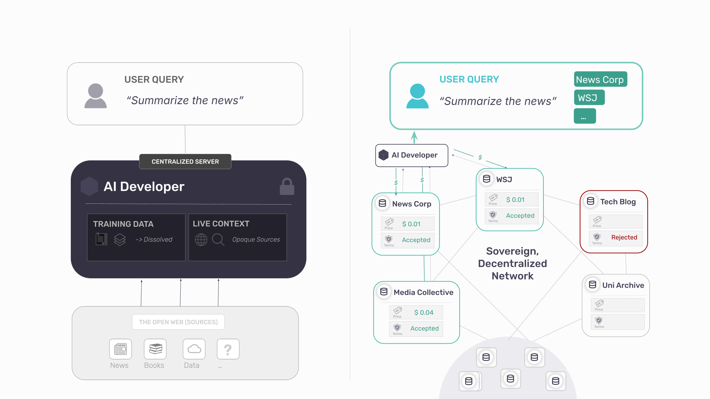
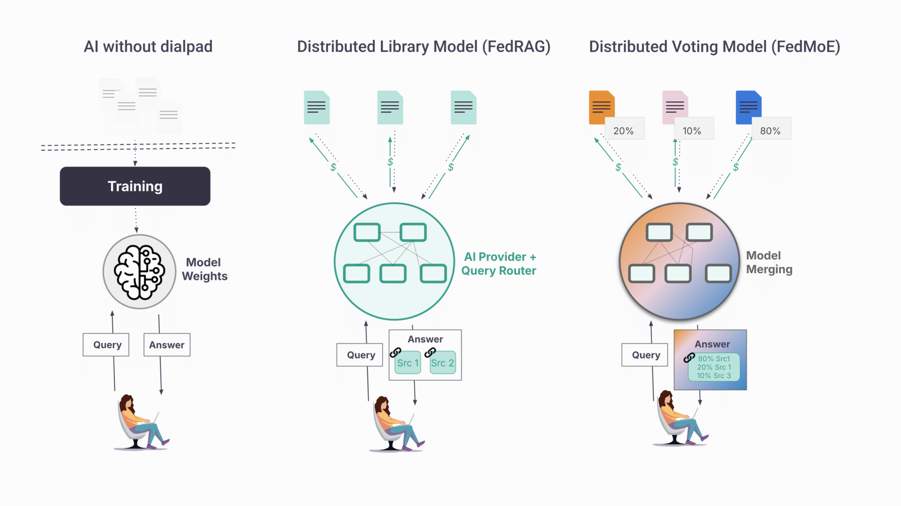

<!-- TODO(a11y): 3 localized body image(s) have empty alt text -->

<!-- TODO(content): HubSpot form(s) auto-embedded as <FormEmbed> — verify placement; title_width_px=720 (custom title width — needs handling); content_width_px=680 (custom content-column width — needs handling); toc_offset_top_px=5 (TOC start offset — maps to TocAnchor) -->

**TL;DR:** The three dominant responses to this problem – blocking scrapers, licensing content, charging for scraper access – share the same flaw: once content is copied to a model server, control and attribution are lost. Each treats distribution and control as mutually exclusive. They are not. A different architecture exists, one in which publishers retain governance over each interaction, AI systems gain sustainable access to the highest-quality sources, and value flows back to those who create it. We call this framework **attribution-based control (ABC)**.  

⬩⬩⬩

For two decades, the information economy rested on a legible exchange: readers consumed content, publishers set the terms, and search engines indexed pages and sent readers back. The bargain was imperfect, but it was modelable, monetizable, and refusable.

AI broke this bargain. Unlike search engines, which index content to direct users toward it, AI systems ingest content to answer users directly. Cloudflare’s 2025 data captures this asymmetry: Anthropic’s bot crawls a site 38,000 times for every single referral returned. OpenAI’s ratio was 1,091 to 1. Roughly 80% of crawling now serves model training, not search \[[1](https://blog.cloudflare.com/crawlers-click-ai-bots-training/)\] \[[2](https://www.fastly.com/press/press-releases/)\].

The consequences extend far beyond journalism. Every sector of the information economy faces the same structural disruption:

-   Trade and educational publishing: Reference works are summarized without attribution \[[4](https://internationalpublishers.org/educational-publishers-tackle-ai-state-interference-at-open-forum/)\], eliminating the need to consult the original content.
-   Academic publishing: Journals face large-scale ingestion \[[5](https://www.nature.com/articles/d41586-024-02757-z)\] and verifiable “sources of truth” are replaced by probabilistic, anonymous summaries that infiltrate research pipelines and undermine future scholarship.
-   Book and niche publishing: Entire catalogs are absorbed into systems that compete with their products \[[6](https://authorsguild.org/news/ai-class-action-lawsuits)\]. Lacking the leverage to negotiate, many publishers are cut out of the loop entirely.

What unites these sectors is not a legal deficiency, but a technical one. Every major leap in AI capability over the past decade has been powered by training on more and better data, and the sectors above _(journalism, academic and educational publishing, books, images, music)_ produce a disproportionate share of the high-quality, professionally edited, verifiable content that frontier models depend on. That dependency is leverage.

But the architecture of modern training makes it nearly impossible to exercise: the moment content is copied to a third-party server and absorbed into model weights, the ability to meter use, attribute value, or withdraw consent collapses. Publishers supply the input that drives the frontier, and watch others capture value it produces.

This is part one of a series exploring how publishers can reclaim agency in the AI economy through technical leverage, public infrastructure and collective power. _Part 2 examines why AI developers benefit from attribution-based control. Part 3 explores collective bargaining and institutional strategy._  

Sign up to be notified of follow-up parts.

⬩⬩⬩

## Rights Without Enforcement Are Insufficient

Publishers hold an arsenal of legal protections: copyright, terms of service, licensing frameworks, contractual restrictions. Their effectiveness, however, depends entirely on technical enforceability – and on that front, the infrastructure is failing.

Consider the most fundamental mechanism:_robots.txt_, proposed in 1994 as a voluntary standard rooted in the assumption that “machines could be taught to listen to human intent and choose to honor it” \[[7](https://chevan.info/robots-txt-the-birth-of-the-agentic-internet/)\]. The evidence is now unambiguous that they do not:

-   13% of AI bot requests ignored robots.txt directives in Q2 2025 \[[8](https://tollbit.com/state-of-the-bots/)\]
-   Perplexity AI continued accessing publisher content after being blocked, deploying disguised crawlers to circumvent restrictions \[[9](https://www.nytimes.com/2025/12/05/technology/new-york-times-perplexity-ai-lawsuit.html)\]
-   89% of domains – approximately 5.6 million websites – now block GPTBot \[[10](https://paulcalvano.com/2025-08-21-ai-bots-and-robots-txt/), [11](https://ahrefs.com/blog/ai-bot-block-rates/)\]

Tools such as Cloudflare’s bot management empower publishers to stop crawlers at the perimeter. But once data is scraped, downstream governance becomes difficult to verify and enforce at scale. A publisher cannot specify: “Yes to inference, no to training.” Or: “Access for Lab A, not Lab B.” Or: “Permissible for summarization, impermissible for competing content generation.” This is the problem of **use bundling**: once data has been obtained, there is no technical mechanism to separate how it is used.  

Over 70 copyright lawsuits remain pending \[[12](https://www.mckoolsmith.com/newsroom-ailitigation)\]\[[13](https://chatgptiseatingtheworld.com/2025/10/08/status-of-all-51-copyright-lawsuits-v-ai-oct-8-2025-no-more-decisions-on-fair-use-in-2025/)\]. Crawlers, meanwhile, continue operating without constraint.

## The Architectural Problem of AI

Two properties of modern AI training make traditional governance impossible, regardless of how litigation resolves. Call them the **copy problem** and the **distillation problem**. They are distinct, and they compound.

**The Copy Problem**

Training requires a full copy of the content to be transferred — permanently — to the developer’s servers. Once copied, the publisher’s rights remain on paper, but every mechanism of enforcement disappears: no transparency into how the content is used, no way to verify compliance, no ability to withdraw.

  
This asymmetry is what drives publishers into broad, future-spanning licenses. It isn’t preference; it’s the rational response to the fact that once a file has left your server, auditing what happens to it is nearly impossible.

**The Distillation Problem**

AI training is designed for distillation, not retrieval. Source material is converted into gradient updates and model weights, and individual contributions dissolve into a composite. A search engine is a telephone directory: every result traces back to a specific number, while training operates like a party line: millions of conversations merged into a single signal. This, in particular, is not a flaw that can be patched. The architecture of AI training was never built to keep origin attached to text, so provenance is stripped at training time by design.  

The natural objection is that models memorize. Research from Stanford and Yale shows Claude and GPT can reproduce near-complete books, storing recoverable sequences rather than abstract patterns \[[14](https://www.theatlantic.com/technology/2026/01/ai-memorization-research/685552/?gift=sfbZfCZIUKWYZXloam4F-Ax0T9M9xvGtDZ491KkZIdg)\]. But memorization is a statistical accident of overtraining, not a mechanism that preserves source. Even when a model reproduces a paragraph verbatim, it has no record of where the paragraph came from. The strongest possible case for attribution (the text survives intact) and the system still cannot say who wrote it:

  
The downstream consequences compound:

-   **Data is decoupled from metadata**: Even when models memorize high-value texts, author names, URLs or any other metadata is lost by the current architectures \[[16](https://www.nature.com/articles/s42256-024-00878-8)\].

-   **Post-training traceability fails**: Tools designed to trace AI output back to training sources (“influence functions”) are notoriously unstable and fail in large models \[[17](https://arxiv.org/abs/2508.07297)\]\[[18](https://link.springer.com/article/10.1007/s10994-023-06495-7)\]\[[19](https://arxiv.org/abs/2409.19998)\]. Startups like ProRata market Shazam-style attribution, but the underlying methods are not yet reliable.

-   **The “unlearning” barrier**: There’s no undo button. Removing specific content from a trained model risks breaking the model itself \[[20\]](https://www.lesswrong.com/posts/zmfXZEsiycGLP9YZW/machine-unlearning-in-large-language-models-a-comprehensive-1), which makes contributions impossible to isolate or measure.

Together, these mechanisms transfer control irreversibly from the people who create content to the platforms that ingest it. And leverage moves with control.

## The Distribution-Control Trade-off

The pattern is older than AI. Every major communications technology has demanded the same exchange: reach in return for governance. Whoever controls distribution captures the value, regardless of who created the underlying work.  

Historically, the **printing press** expanded distribution but concentrated control over it \[[21](https://www.radicalxchange.org/media/blog/the-models-are-yours-the-publics-leverage-in-ai/)\]. Press owners captured value; authors traded one patron for another. Copyright emerged as the corrective. For two centuries, it largely held: creators gained a legal claim on distribution, and readers still arrived at the source.

**Social media** repeated the pattern with greater intensity. New distribution channels emerged, but publishers and authors remained outside the control loop. Copyright helped at the margins, but platforms held the leverage. When Facebook’s 2016 “pivot to video” collapsed—built on metrics inflated by 150–900%\[[22](https://variety.com/2019/digital/news/facebook-settlement-video-advertising-lawsuit-40-million-1203361133/)\]\[[23](https://fortune.com/2018/10/17/advertisers-facebook-video-metrics/)\]—publishers like Mic and Vocativ had no recourse. By 2024, Facebook referrals to news sites had fallen 58% \[[24](https://pressgazette.co.uk/platforms/facebook-referral-traffic-publishers-down-50-12-months-chartbeat-data/)\]. Still, a residual link persisted: readers followed links and visited sites.

AI completes the arc: it does not merely control distribution, but as evidence shows, uses the content itself to provide answers directly \[[2](https://www.radicalxchange.org/media/blog/the-models-are-yours-the-publics-leverage-in-ai/)5\]. The audience relationship is severed; the financial relationship never forms. If social media strained the bargain, AI has broken it. Reach no longer compensates for the loss of control, because the reach is no longer there.  

The result is a false choice: opt out fully of AI scraping and lose discovery, or participate in an arrangement that extracts without returning value.

## Why Current Defenses Fail 

A defense that actually addresses the copy and distillation problems would need to do four things: separate one use from another, verify attribution at the point of use, audit ongoing behavior, and connect that behavior to a value loop. The three responses on offer – blocking, licensing, pay-to-access – each address a real symptom. None does these four things.  

**Blocking: Preserves Principle, Sacrifices Reach**

Eighty percent of major news publishers now block AI crawlers \[[25\]](https://pressgazette.co.uk/platforms/facebook-referral-traffic-publishers-down-50-12-months-chartbeat-data/)\[[26](https://pressgazette.co.uk/platforms/eight-in-ten-of-worlds-biggest-news-websites-now-block-ai-training-bots/)\]. A Rutgers/Wharton study found this costs publishers 23% of total traffic and 14% of human traffic; protecting content “actually harmed traffic more than allowing access.” \[[27](https://reutersinstitute.politics.ox.ac.uk/how-many-news-websites-block-ai-crawlers)\]. AI and search are becoming structurally intertwined: Google’s AI Overviews now appear in standard search results; Microsoft’s Bing has become Copilot Search \[[28](https://blogs.microsoft.com/blog/2025/04/04/your-ai-companion)\]. Blocking the crawler increasingly means disappearing from discovery. 

Partial workarounds exist. Lawsuits target the use-bundling that lets a single scrape serve both search indexing and model training \[15\], and services like Cloudflare offer publishers finer controls than the all-or-nothing block. But the underlying mechanic is untouched: the moment content leaves the publisher’s server, control is gone. And what leaves is increasingly precious — pre-AI archives are now the scarcest training resource on the internet, the last large bodies of text uncontaminated by model output. Publishers are being asked to hand over their most valuable asset, at the moment of its peak value (so far).  

****Full Access Licensing: Generates Revenue, Forfeits Governance****

Full-access licensing generates real revenue. News Corp’s five-year deal with OpenAI is worth $250 million; the Financial Times receives an est. $5-10 million annually \[[29](https://variety.com/2024/digital/news/news-corp-openai-licensing-deal-1236013734/)\].

But once access is granted, no traceability follows. No visibility into usage, no guaranteed attribution, no mechanism to adjust terms as the content’s value to the model becomes clear. Data ends up priced as a commodity — not because it is one, but because the architecture offers no way to meter ongoing contribution. The transaction collapses to a single moment: license once, lose every downstream lever.

The structural consequence is worse than any individual deal. Every license strengthens the licensee. More premium content makes a better model, and a better model gives the lab more leverage over the next publisher at the table. The largest publishers sign first: they have the catalog, the legal teams, and the negotiating weight; and in doing so they undercut the smaller publishers who try to hold out. Licensing doesn’t just transfer value from publishers to labs; it concentrates market power on the side that already has it, and it does so faster with each deal.

**Pay-to-Access: Adds a Toll, Not Control**

Intermediaries like Tollbit and Cloudflare sit between publishers and crawlers, charging for access \[[30](https://techcrunch.com/2024/09/23/cloudflares-new-marketplace-will-let-websites-charge-ai-bots-for-scraping)\]. The mechanism is useful, but it does not solve the underlying problem. Pricing is often opaque and disconnected from actual use because they pay for a copy of the data. And even when the fee is paid, the content is still copied in full: the publisher has charged for extraction, not prevented it, and retains no governance over what happens next.

The deeper concern is structural. Intermediaries in information markets calcify into platforms. Facebook courted newsrooms with traffic and distribution promises, then changed the algorithm and collapsed referrals overnight. \[[33](https://pressgazette.co.uk/media-audience-and-business-data/media_metrics/facebooks-referral-traffic-for-publishers-down-50-in-12-months/)\]. Google AMP offered faster mobile pages in exchange for publishers ceding control of their own URLs and ad inventory to Google’s infrastructure [\[34\]](https://searchengineland.com/google-throttled-amp-page-speeds-created-format-to-hamper-header-bidding-antitrust-complaint-claims-375466). Each began as a service to publishers and became the platform that set the terms. A new middleman between publishers and AI crawlers, however well-intentioned today, sits in the same structural position. Intentions are temporary; structures are not.

Each approach addresses a symptom: lost revenue, lost traffic, lost attribution, but accepts the same premise: distribution and control are mutually exclusive. That publishers must choose between reach and sovereignty.

However, that assumption is no longer true.  

## A Different Architecture: ABC

Today, AI is a telephone without a dial pad. Information arrives, but you can’t choose who answers, verify the source, or reach anyone again on purpose.  

An alternative paradigm exists to restore the dial pad – [Attribution-Based Control](https://openmined.org/attribution-based-control/) (ABC). Instead of centralizing content into model weights, publishers hold their own content and AI systems query them in real time, on the publisher’s terms. The architecture addresses the copy and distillation problems directly:

-   **Where copying kills control, ABC ensures content never leaves** the publisher’s infrastructure. Instead of a blanket yes or no, publishers get fine-grained, real-time, revocable governance: who may access their content, at what price, and with what attribution.  
    
-   **Where distillation destroys traceability, ABC substitutes live, query-time access** that pulls from identifiable endpoints, not undifferentiated weights — preserving the link between answer and source.  
    

<figure class="wp-block-image size-full has-custom-border is-style-wide-style">

<video src="/blog/ai-content-protection-for-publishers/illustration-abc-bi-anq2y.mp4" autoplay loop muted playsinline></video>

</figure>

On the other end of the line, ABC enables a kind of access that doesn’t currently exist. An AI developer can interrogate a curated network of medical journals. A user can cast a wide net (“all news sources”), narrow it (“only peer-reviewed”), or query a single source (“the FT’s view”). Discovery and governance finally point in the same direction. So, how does this work in practice?

<figure class="wp-block-image size-full has-custom-border is-style-wide-style">

</figure>

### Implementation: The [Syft](http://syft.docs.openmined.org) Protocol

OpenMined, a global non-profit, has built the [Syft Protocol](http://syft.docs.openmined.org/), an open-source protocol to implement ABC designed for independent and collective use: sovereign, free, and with no intermediary. It’s piloting now with news publishers, book publishers, and academic institutions \[[31](https://syft-protocol.openmined.org/for-publishers.html)\].

Here’s how it works:

1.  **Content stays at source.** Publisher data lives on the publisher’s servers. Local processing makes it queryable and AI-ready, and the publisher decides what leaves: a paragraph, an article, or a generated response derived from it. Setup integrates with existing CMS tools and requires no technical expertise.
2.  **Queries come to you.** When an AI system needs a publisher’s content, the request arrives at the publisher’s infrastructure in real time. The publisher sees who is asking and can enforce KYC, rate limits, or human review before answering.
3.  **Terms are set and enforced per query**. Pricing, access, and usage restrictions are applied dynamically — not negotiated once and forgotten. Terms can vary by requester, use case, and volume, with full support for usage-based pricing.
4.  **Attribution is structural.** Every answer cites its source, because each answer comes from a source. Payment flows because usage is logged at the origin and various business models can be explored _(pay-per-request, pay-per-document)._
5.  **No intermediary fee and no platform dependency.** Publishers keep 100% of revenue and can revoke access at any time. Once configured, a publisher becomes discoverable to any participant in the network – AI developers, startups, researchers, and user agents.

<figure class="wp-block-image size-large has-custom-border is-style-wide-style">

</figure>

#### Towards Collective Leverage

Individual control is necessary but not sufficient. A single publisher negotiating alone, even with perfect technical enforcement, is easy to overlook. Visibility, discoverability, and infrastructure are what turn isolated participation into market presence, and those are easier to build together than alone.

ABC supports collectives as governance and infrastructure layers. A trade association, regional alliance, or academic consortium can operate the shared backbone its members rely on — discovery surfaces, common authentication, standard query interfaces, joint analytics — while each publisher sets its own pricing, usage terms, and access rules. Where members want to coordinate, they can opt in: a collective may publish recommended terms members adopt voluntarily, adapt, or ignore.

The practical effect is reach. Smaller publishers (_local news, specialist journals, mid-list houses, independent authors)_ are rarely at the table when major labs sign deals and lack the infrastructure to make themselves available individually. A collective puts them on the same discovery network as larger publishers, with the same technical capabilities, without surrendering independence on terms.

The same infrastructure enables members to build, not just supply — and to build across collectives, not only within them. A medical journal can power a research assistant from its own archive, or combine with peer journals across multiple consortia to cover a broader specialty. A regional newsroom can offer a local-coverage tool grounded in its own reporting, or join newsrooms in adjacent regions to assemble national coverage from local sources. An academic publisher can provide a verified-source query interface to its readers, or partner with archives, libraries, and other publishers to span a full discipline. Members choose what they build, with whom, and on what terms; the collective provides the technical means.

We expand on governance structures, member opt-in mechanics, and product paths in Part 3.

#### Towards AI labs adoption

ABC isn’t only a publisher’s tool. As frontier models converge on similar capabilities, data quality and provenance become the competitive frontier and adversarial scraping cannot deliver either sustainably. Part 2 of this series makes the case for ABC from the AI lab side: why sustainable access, verifiable sources, and compliance-ready provenance are increasingly worth more than the marginal data a crawler can take.

### The Case for Public Infrastructure

The web is open because HTTP was built as public infrastructure, not as a proprietary product. Mobile and social are relatively closed because open protocols arrived too late \[[32](https://www.w3.org/History.html)\]. The protocols governing AI will determine whether information flows openly or through centralized pipelines in which creators disappear.

Syft is built as open-source infrastructure precisely for this reason. No single entity decides who participates or on what terms. Content owners set their own conditions; AI developers access content through open APIs. The protocol coordinates; it does not control.

This is public infrastructure for the AI era: designed to prevent the concentration of power that characterized previous technological transitions.

## The Path Forward

The crisis facing publishing is not that AI uses content. It is that when AI generates an answer, the publisher is entirely absent – with no control and no share of the value their content created. The strategic choice is binary:

1.  **Remain passive suppliers:** sell access while losing audience, attribution, and long-term leverage, accepting a future as raw material.
2.  **Become active participants in AI infrastructure:** retain control, preserve visibility, and capture recurring value at the moment of inference, every time your content informs an answer.

AI will reshape publishing whether publishers participate or not. The question is whether they shape the infrastructure that governs how their work is used – or are governed by it.

If you would like to be notified for the upcoming parts or participate in the conversation, sign-up for our newsletter and shoot us a message:

## References

\[1\]: [Cloudflare Blog, “The crawl-to-click gap: Cloudflare data on AI bots, training, and referrals,” 2024](https://blog.cloudflare.com/crawlers-click-ai-bots-training/)

\[2\]: [Fastly Press Release, “New Fastly Threat Research Reveals AI crawlers make up almost 80% of AI bot traffic,” 2024](https://www.fastly.com/press/press-releases/new-fastly-threat-research-reveals-ai-crawlers-make-up-almost-80-of-ai-bot)

\[3\]: [Maria Ressa quote (LinkedIn post)](https://www.linkedin.com/posts/cpj_nobel-peace-prize-laureate-maria-ressa-highlights-activity-7426263583778414592-p4Xy?utm_source=share&utm_medium=member_desktop&rcm=ACoAAGTsgGIBfbXnCBe-KreWpmFlq-17XBr__kU)

\[4\]: [International Publishers Association, “Educational Publishers Tackle AI, State Interference at Open Forum,” Frankfurt Book Fair, 2024.](https://internationalpublishers.org/educational-publishers-tackle-ai-state-interference-at-open-forum/)

\[5\]: [Nature, “AI firms must play fair when they use academic data in training,” 2024.](https://www.nature.com/articles/d41586-024-02757-z)

\[6\]: [Authors Guild, “Understanding the AI Class Action Lawsuits,” 2024.](https://authorsguild.org/news/ai-class-action-lawsuits)

\[7\]: [Chevan Nanayakkara, “Robots.txt: The Birth of the Agentic Internet,” Medium, June 2025](https://medium.com/@chevannanayakkara/robots-txt-the-birth-of-the-agentic-internet)

\[8\]: [Tollbit AI Bot Traffic Report, Q2 2024](https://tollbit.com/analytics/).

\[9\]: [New York Times v. Perplexity AI, complaint filed December 2025, Southern District of New York.](https://www.nytco.com/press/the-times-sues-perplexity-ai/)

\[10\]: [Paul Calvano, “AI Bots and Robots.txt,” August 2025](https://paulcalvano.com/2025-08-21-ai-bots-and-robots-txt/)

\[11\]: [Ahrefs Blog, “The AI Bots That ~140 Million Websites Block the Most,” 2024](https://ahrefs.com/blog/ai-bot-block-rates/)

\[12\]: [McKool Smith, “AI Litigation Tracker,” updated 2025](https://www.mckoolsmith.com/newsroom-ailitigation)

\[13\]: [ChatGPT Is Eating the World, “Status of all 51 copyright lawsuits v. AI (Oct. 8, 2025),” October 2025](https://chatgptiseatingtheworld.com/2025/10/08/status-of-all-51-copyright-lawsuits-v-ai-oct-8-2025-no-more-decisions-on-fair-use-in-2025/)

\[14\]: [Alex Reisner, “AI’s Memorization Crisis,” The Atlantic, January 2026](https://www.theatlantic.com/technology/2026/01/ai-memorization-research/685552/)

\[15\]: [Ted Chiang, “ChatGPT Is a Blurry JPEG of the Web,” The New Yorker, February 2023](https://www.newyorker.com/tech/annals-of-technology/chatgpt-is-a-blurry-jpeg-of-the-web)

\[16\]: [Longpre et al., “A large-scale audit of dataset licensing and attribution in AI,” Nature Machine Intelligence, 2024](https://www.nature.com/articles/s42256-024-00878-8)

\[17\]: [Zhu and Cangelosi, “Revisiting Data Attribution for Influence Functions,” arXiv, August 2025](https://arxiv.org/abs/2508.07297)

\[18\]: [Hammoudeh and Lowd, “Training Data Influence Analysis and Estimation: A Survey,” Machine Learning, 2024](https://link.springer.com/article/10.1007/s10994-023-06495-7)

\[19\]: [Li et al., “Do Influence Functions Work on Large Language Models?,” arXiv, September 2024](https://arxiv.org/abs/2409.19998)

\[20\]: [“Machine Unlearning in Large Language Models: A Comprehensive Survey,” LessWrong, 2024](https://www.lesswrong.com/posts/zmfXZEsiycGLP9YZW/machine-unlearning-in-large-language-models-a-comprehensive-1)

\[21\]: [Matt Prewitt, “The Models Are Yours: The Public’s Leverage in AI,” RadicalxChange, January 2024](https://www.radicalxchange.org/media/blog/the-models-are-yours-the-publics-leverage-in-ai/) \[22\]: [Variety, “Facebook to Pay $40 Million to Settle Claims It Inflated Video Viewing Data,” 2019](https://variety.com/2019/digital/news/facebook-settlement-video-advertising-lawsuit-40-million-1203361133/)

\[23\]: [Fortune, “Facebook Admitted That It Was Inflating Video Metrics. Now a Lawsuit Says the Problem Started Much Earlier—and Was Way Worse,” October 2018](https://fortune.com/2018/10/17/advertisers-facebook-video-metrics/)

\[24\]: [Press Gazette/Chartbeat data, “Facebook’s referral traffic for publishers down 50% in 12 months,” May 2024](https://pressgazette.co.uk/platforms/facebook-referral-traffic-publishers-down-50-12-months-chartbeat-data/)

\[25\]: [Press Gazette, “Eight in ten of world’s biggest news websites now block AI training bots,” 2024](https://pressgazette.co.uk/platforms/eight-in-ten-of-worlds-biggest-news-websites-now-block-ai-training-bots/)

\[26\]: [Reuters Institute, Richard Fletcher, “How many news websites block AI crawlers?” February 2024](https://reutersinstitute.politics.ox.ac.uk/how-many-news-websites-block-ai-crawlers)

\[27\]: [Zhao and Berman, “The Impact of LLMs on Online News Consumption and Production,” Rutgers/Wharton, 2025](https://arxiv.org/abs/2512.24968)

\[28\]: [Microsoft, “Your AI Companion” (Copilot Search in Bing announcement), April 2025](https://blogs.microsoft.com/blog/2025/04/04/your-ai-companion)

\[29\]: [Variety, “News Corp Inks OpenAI Licensing Deal Worth More Than $250 Million,” May 2024](https://variety.com/2024/digital/news/news-corp-openai-licensing-deal-1236013734/)

\[30\]: [TechCrunch, “Cloudflare’s new marketplace will let websites charge AI bots for scraping,” September 2024](https://techcrunch.com/2024/09/23/cloudflares-new-marketplace-will-let-websites-charge-ai-bots-for-scraping)

\[31\]: [OpenMined, “Syft For Publishers \[Beta\],” 2024](https://syft-protocol.openmined.org/for-publishers.html)

\[32\]: [W3C, Tim Berners-Lee, “A Little History of the World Wide Web”](https://www.w3.org/History.html)
