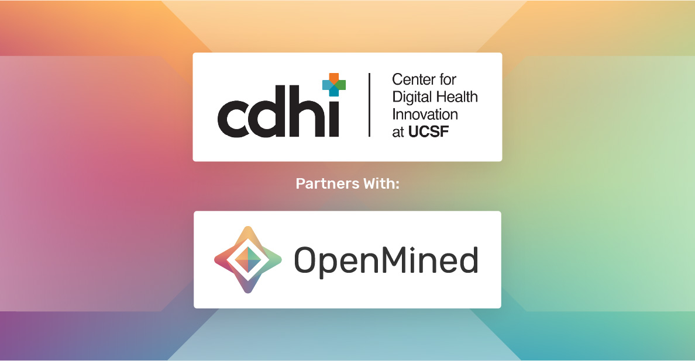

<!-- TODO(a11y): 1 localized body image(s) have empty alt text -->

<figure class="">

</figure>

We’re very excited to announce the next round of open-source software development grants in the OpenMined community, generously sponsored by the University of California San Francisco! These fellowships will focus on bringing data-centric federated learning with differential privacy budgeting to PyGrid. It will also be focused on giving PyGrid the ability to be controlled via a user interface, allowing for a more granular permissioning system at both the user level and the tensor level.

This project is described in more detail on our roadmap, [located here](https://github.com/OpenMined/Roadmap/blob/master/federated_learning/projects/data_centric_fl.md).

Many of the roles are optionally part-time or full-time, depending on the candidate’s desires and flexibility. All of the fellowships are to fund work on the core OpenMined codebase. If you would like to be considered for any of the fellowships, you can apply at the bottom of this page.

There are 3 senior-level roles (2 in Python, 1 in Javascript) and 1 junior-level role in Python. For compensation, all 3 senior-level roles listed below are paid the same rate: £2,000 per month for part-time work (6-month contract) or £4,000 per month for full-time work (3-month contract). The junior-level role is paid £1,000 per month for part-time work (6-month contract) or £2,000 per month for full-time work (3-month contract). You may apply for either level position, whichever you feel more comfortable with, but ultimately we will make the choice of which position to offer should you be chosen as a candidate.

It’s important to note that **anyone may apply for an OpenMined fellowship**, however, we will show a strong preference to existing contributors. If you would like to better your chances of receiving a grant, we suggest you pick an issue labeled “good first issue” on the following code repositories:

-   [PyGrid](https://github.com/OpenMined/PyGrid) – _the main Grid library for hosting PySyft data in a cloud environment_
-   [GridNode](https://github.com/OpenMined/GridNode) – a s_erver-based grid node for the PyGrid library_
-   [GridNetwork](https://github.com/OpenMined/GridNetwork) – _a network router for the PyGrid library_

### Key Dates

**Application Deadline**: June 19th, 2020  
**Candidates Selected**: June 22nd, 2020  
**Development Begins**: July 1st, 2020  
**Project Completed**: January 1st, 2021

**[Link to fellowship application](https://forms.gle/KQaQ9ASYTAziySZ36)**

## Front-End Developer Fellowship

We’re looking for a front-end Javascript developer to help us build a user interface for PyGrid. This user interface will allow us to control the entire data-centric federated learning workflow. It will also allow us to vertically and horizontally scale PyGrid’s compute resources across multiple cloud providers. The system will have a complex permissioning system for users, groups, and tensors. You will be responsible for coding this UI based on designs that are provided for you, ensuring that it is fully responsive to any screen size, and working with the PyGrid team to align on an API to fit the needs of the front-end.

### Required Skills

-   You must be well-versed in modern ES6/7 Javascript development
-   You must have an excellent knowledge of React.js
-   You should have a good knowledge of Javascript in general, including both object-oriented programming and functional programming. Ideally, you’ve been coding in Javascript regularly for at least 3 years.

### Bonus Skills

-   Knowledge of PySyft and PyGrid is a huge bonus
-   Adequate knowledge of Python is also desired. Every member of our team is expected to be enough of a generalist to switch roles if needed.
-   Knowledge of the principles behind deep learning and federated learning – if you haven’t already taken our Udacity course, we suggest that you start there.
-   Experience writing end-to-end tests in Cypress, Jest, and React Testing Library
-   **Have a good attitude** – you’re here to be a leader in our community, but you’re also here to learn. We’re interested in people willing to work as a team that’s building something greater than themselves.

## PyGrid Developer Fellowship

We’re looking for a Python developer who is interested in working on the PyGrid core development team. In this project, you will be expected to be very familiar with modern Python programming paradigms, as well as have intimate knowledge of how to build API’s, deploy projects to cloud-based infrastructure, and build libraries in Python.

**There are 3 positions for this fellowship: 2 senior and 1 junior.**

In this project, you will be responsible for a variety of tasks. While you may not work on every one of these projects within the grant, we expect you and the rest of the team to accomplish the following within the timeline of the fellowship:

-   Reorganizing the PyGrid repositories to reflect a structure that is more easily able to be scaled in cloud environments
-   Adding the ability for PyGrid to be deployed and scaled properly to multiple cloud providers, including but not limited to Amazon Web Services, Google Cloud, Microsoft Azure, DigitalOcean, and Heroku.
-   Building out a complex user and group authentication and permissioning system
-   Creating an HTTP and Websocket API for our front-end application, PyGrid Admin, to interact with
-   Adding differential privacy capabilities, as well as privacy budgeting capabilities, to PyGrid users and groups

### Required Skills

-   You must be well-versed in modern Python development
-   You must have an excellent knowledge of PyGrid, how it works, and what problems it aims to solve
-   You must have experience developing scalable API’s, ideally in both HTTP and Websocket protocols
-   You must have experience deploying Python projects and/or libraries to cloud-based infrastructure

### Bonus Skills

-   Knowledge of differential privacy is going to be a massive differentiator for candidates. Strong candidates should be familiar with the basic concepts of global and local differential privacy, as well as basic practices of privacy budgeting.
-   It’s imperative that you are comfortable with regularly testing and documenting your code. If we finish our project with a codebase that is is untested or undocumented, people cannot use what we produce.
-   **Have a good attitude** – you’re here to be a leader in our community, but you’re also here to learn. We’re interested in people willing to work as a team that’s building something greater than themselves.

## How to Apply

**Application Deadline**: June 19th, 2020  
**Candidates Selected**: June 22nd, 2020  
**Development Begins**: July 1st, 2020  
**Project Completed**: January 1st, 2021

The call for applicants opened on June 19th. **To apply for any of the positions, [please fill out this Google Form](https://forms.gle/KQaQ9ASYTAziySZ36)**. Successful applicants will receive confirmation of their acceptance by June 22nd and will begin work on July 1st.

The project manager for this grant will be **Patrick Cason**, the Web & Mobile Team Lead for OpenMined. You may contact Patrick with any further questions related to the grant and how to apply on Slack (**@cereallarceny**).

If you or someone you know may be interested in sponsoring a grant like this one, please don’t hesitate to reach out via email – [andrew@openmined.org](mailto:andrew@openmined.org).
