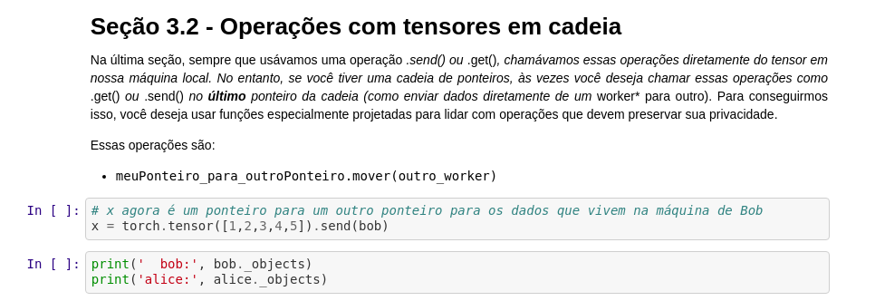

<!-- TODO(a11y): 1 localized body image(s) have empty alt text -->

<figure class="">

</figure>

OpenMined is an ever-growing, world-wide community, and it’s our mission to make it easier for more people to access our projects and resources. The OpenMined community has immensely benefited from the hard work of our contributors in Brazil, and today we are pleased to announce **the translation of our PySyft tutorials into Portuguese!**

All the tutorials can be found [here](https://github.com/OpenMined/PySyft/blob/master/examples/tutorials/translations/portugu%C3%AAs), under the [PySyft repo](https://github.com/OpenMined/PySyft).

We’d like to thanks everyone who contributed to the translation of the tutorials:

_Márcio Porto ([@MarcioPorto](https://github.com/MarcioPorto)), Jeferson Ferreira ([@jefersonf](https://github.com/jefersonf)), João Lucas ([@joaolcaas](https://github.com/joaolcaas)), Marcus Vinicius ([@marcusvlc)](https://github.com/marcusvlc), Héricles Emanuel ([@hericlesme](https://github.com/hericlesme))_ and _Izabella Antonino ([@Izabellaaaq](https://github.com/Izabellaaaq))._

### Join Us

Keep watching our blog and other social media platforms for updates on upcoming translation releases. If you are ****interested in helping translate**** our tutorials into more languages or joining the writing team, fill out this [form](https://forms.gle/URTqQEENRQr6RHFL8).

### Here is the full list of tutorials in Portuguese

_You can also view the original **english** tutorials [here](https://github.com/OpenMined/PySyft/tree/master/examples/tutorials)_

-   [Parte 01 – As Ferramentas Básicas do Private Deep Learning](https://github.com/OpenMined/PySyft/blob/master/examples/tutorials/translations/portugu%C3%AAs/Parte%2001%20-%20As%20Ferramentas%20B%C3%A1sicas%20do%20Private%20Deep%20Learning.ipynb)
-   [Parte 02 – Introdução a Aprendizagem Federada](https://github.com/OpenMined/PySyft/blob/master/examples/tutorials/translations/portugu%C3%AAs/Parte%2002%20-%20Introdu%C3%A7%C3%A3o%20a%20Aprendizagem%20Federada.ipynb)
-   [Parte 03 – Ferramentas Avançadas para Execução Remota](https://github.com/OpenMined/PySyft/blob/master/examples/tutorials/translations/portugu%C3%AAs/Parte%2003%20-%20Ferramentas%20Avan%C3%A7adas%20para%20Execu%C3%A7%C3%A3o%20Remota.ipynb)
-   [Parte 04 – Aprendizado Federado por meio de Agregador Confiável](https://github.com/OpenMined/PySyft/blob/master/examples/tutorials/translations/portugu%C3%AAs/Parte%2004%20-%20Aprendizado%20Federado%20por%20meio%20de%20Agregador%20Confi%C3%A1vel.ipynb)
-   [Parte 05 – Bem-vindo ao Sandbox](https://github.com/OpenMined/PySyft/blob/master/examples/tutorials/translations/portugu%C3%AAs/Parte%2005%20-%20Bem-vindo%20ao%20Sandbox.ipynb)
-   [Parte 06 – Aprendizado Federado com MNIST usando uma CNN](https://github.com/OpenMined/PySyft/blob/master/examples/tutorials/translations/portugu%C3%AAs/Parte%2006%20-%20Aprendizado%20Federado%20com%20MNIST%20usando%20uma%20CNN.ipynb)
-   [Parte 07 – Aprendizado Federado com Conjunto de Dados Federado](https://github.com/OpenMined/PySyft/blob/master/examples/tutorials/translations/portugu%C3%AAs/Parte%2007%20-%20Aprendizado%20Federado%20com%20Conjunto%20de%20Dados%20Federado.ipynb)
-   [Parte 08 – Introdução a Planos](https://github.com/OpenMined/PySyft/blob/master/examples/tutorials/translations/portugu%C3%AAs/Parte%2008%20-%20Introdu%C3%A7%C3%A3o%20a%20Planos.ipynb)
-   [Parte 08 bis – Introdução a Protocolos](https://github.com/OpenMined/PySyft/blob/master/examples/tutorials/translations/portugu%C3%AAs/Parte%2008%20bis%20-%20Introdu%C3%A7%C3%A3o%20a%20Protocolos.ipynb)
-   [Parte 09 – Introdução à Programas Criptografados](https://github.com/OpenMined/PySyft/blob/master/examples/tutorials/translations/portugu%C3%AAs/Parte%2009%20-%20Introdu%C3%A7%C3%A3o%20%C3%A0%20Programas%20Criptografados.ipynb)
-   [Parte 10 – Aprendizagem Federada com Agregação Segura](https://github.com/OpenMined/PySyft/blob/master/examples/tutorials/translations/portugu%C3%AAs/Parte%2010%20-%20Aprendizagem%20Federada%20com%20Agrega%C3%A7%C3%A3o%20Segura.ipynb)
-   [Parte 11 – Classificação Segura Usando Aprendizagem Profunda](https://github.com/OpenMined/PySyft/blob/master/examples/tutorials/translations/portugu%C3%AAs/Parte%2011%20-%20Classifica%C3%A7%C3%A3o%20Segura%20Usando%20Aprendizagem%20Profunda.ipynb)
-   [Parte 12: Treinar uma Rede Neural criptografada com dados criptografados](https://github.com/OpenMined/PySyft/blob/master/examples/tutorials/translations/portugu%C3%AAs/Parte%2012%20-%20Treinar%20uma%20Rede%20Neural%20criptografada%20com%20dados%20criptografados.ipynb)
-   [Parte 12 bis – Treinamento criptografado no MNIST](https://github.com/OpenMined/PySyft/blob/master/examples/tutorials/translations/portugu%C3%AAs/Parte%2012%20bis%20-%20Treinamento%20criptografado%20no%20MNIST.ipynb)
-   [Parte 13a – Classificação Segura com Syft Keras e TFE – Treinamento Público](https://github.com/OpenMined/PySyft/blob/master/examples/tutorials/translations/portugu%C3%AAs/Parte%2013a%20-%20Classifica%C3%A7%C3%A3o%20Segura%20com%20Syft%20Keras%20e%20TFE%20-%20Treinamento%20P%C3%BAblico.ipynb)
-   [Parte 13b – Classificação segura com Syft Keras e TFE – Servindo o modelo de forma segura](https://github.com/OpenMined/PySyft/blob/master/examples/tutorials/translations/portugu%C3%AAs/Parte%2013b%20-%20Classifica%C3%A7%C3%A3o%20segura%20com%20Syft%20Keras%20e%20TFE%20-%20Servindo%20o%20modelo%20de%20forma%20segura.ipynb)
-   [Parte 13c – Classificação Segura com Syft Keras e TFE – Cliente de predição privada](https://github.com/OpenMined/PySyft/blob/master/examples/tutorials/translations/portugu%C3%AAs/Parte%2013c%20-%20Classifica%C3%A7%C3%A3o%20Segura%20com%20Syft%20Keras%20e%20TFE%20-%20Cliente%20de%20predi%C3%A7%C3%A3o%20privada.ipynb)

---

## Anunciando a Tradução dos Tutoriais do PySyft para o Português

A OpenMined é uma comunidade mundial crescente e nossa missão é facilitar o acesso de mais pessoas a nossos projetos e recursos. A comunidade OpenMined se beneficiou imensamente do trabalho árduo de nossos colaboradores no Brasil e hoje temos o prazer de anunciar **a tradução de nossos tutoriais do PySyft para o português**!

Todos os tutoriais podem ser encontrados [aqui](https://github.com/OpenMined/PySyft/blob/master/examples/tutorials/translations/portugu%C3%AAs), no [repositório do PySyft](https://github.com/OpenMined/PySyft).

Sinceros agradecimentos a todos que contribuiram com a tradução dos tutoriais:

_Márcio Porto ([@MarcioPorto](https://github.com/MarcioPorto)), Jeferson Ferreira ([@jefersonf](https://github.com/jefersonf)), João Lucas ([@joaolcaas](https://github.com/joaolcaas)), Marcus Vinicius ([@marcusvlc)](https://github.com/marcusvlc), Héricles Emanuel ([@hericlesme](https://github.com/hericlesme))_ e _Izabella Antonino ([@Izabellaaaq](https://github.com/Izabellaaaq))._

### Junte-se a nós

Continue acompanhando nosso blog e redes sociais para atualizações sobre os próximas traduções. Se você está **interessado em nos ajudar a traduzir** nossos tutoriais em mais linguagens ou se juntar à equipe de redação, preencha este [formulário](https://forms.gle/URTqQEENRQr6RHFL8).

### Aqui está uma lista completa de todos os nossos tutoriais em Português

_Você também pode ver os tutoriais originais **em inglês** [aqui](https://github.com/OpenMined/PySyft/tree/master/examples/tutorials)._

-   [Parte 01 – As Ferramentas Básicas do Private Deep Learning](https://github.com/OpenMined/PySyft/blob/master/examples/tutorials/translations/portugu%C3%AAs/Parte%2001%20-%20As%20Ferramentas%20B%C3%A1sicas%20do%20Private%20Deep%20Learning.ipynb)
-   [Parte 02 – Introdução a Aprendizagem Federada](https://github.com/OpenMined/PySyft/blob/master/examples/tutorials/translations/portugu%C3%AAs/Parte%2002%20-%20Introdu%C3%A7%C3%A3o%20a%20Aprendizagem%20Federada.ipynb)
-   [Parte 03 – Ferramentas Avançadas para Execução Remota](https://github.com/OpenMined/PySyft/blob/master/examples/tutorials/translations/portugu%C3%AAs/Parte%2003%20-%20Ferramentas%20Avan%C3%A7adas%20para%20Execu%C3%A7%C3%A3o%20Remota.ipynb)
-   [Parte 04 – Aprendizado Federado por meio de Agregador Confiável](https://github.com/OpenMined/PySyft/blob/master/examples/tutorials/translations/portugu%C3%AAs/Parte%2004%20-%20Aprendizado%20Federado%20por%20meio%20de%20Agregador%20Confi%C3%A1vel.ipynb)
-   [Parte 05 – Bem-vindo ao Sandbox](https://github.com/OpenMined/PySyft/blob/master/examples/tutorials/translations/portugu%C3%AAs/Parte%2005%20-%20Bem-vindo%20ao%20Sandbox.ipynb)
-   [Parte 06 – Aprendizado Federado com MNIST usando uma CNN](https://github.com/OpenMined/PySyft/blob/master/examples/tutorials/translations/portugu%C3%AAs/Parte%2006%20-%20Aprendizado%20Federado%20com%20MNIST%20usando%20uma%20CNN.ipynb)
-   [Parte 07 – Aprendizado Federado com Conjunto de Dados Federado](https://github.com/OpenMined/PySyft/blob/master/examples/tutorials/translations/portugu%C3%AAs/Parte%2007%20-%20Aprendizado%20Federado%20com%20Conjunto%20de%20Dados%20Federado.ipynb)
-   [Parte 08 – Introdução a Planos](https://github.com/OpenMined/PySyft/blob/master/examples/tutorials/translations/portugu%C3%AAs/Parte%2008%20-%20Introdu%C3%A7%C3%A3o%20a%20Planos.ipynb)
-   [Parte 08 bis – Introdução a Protocolos](https://github.com/OpenMined/PySyft/blob/master/examples/tutorials/translations/portugu%C3%AAs/Parte%2008%20bis%20-%20Introdu%C3%A7%C3%A3o%20a%20Protocolos.ipynb)
-   [Parte 09 – Introdução à Programas Criptografados](https://github.com/OpenMined/PySyft/blob/master/examples/tutorials/translations/portugu%C3%AAs/Parte%2009%20-%20Introdu%C3%A7%C3%A3o%20%C3%A0%20Programas%20Criptografados.ipynb)
-   [Parte 10 – Aprendizagem Federada com Agregação Segura](https://github.com/OpenMined/PySyft/blob/master/examples/tutorials/translations/portugu%C3%AAs/Parte%2010%20-%20Aprendizagem%20Federada%20com%20Agrega%C3%A7%C3%A3o%20Segura.ipynb)
-   [Parte 11 – Classificação Segura Usando Aprendizagem Profunda](https://github.com/OpenMined/PySyft/blob/master/examples/tutorials/translations/portugu%C3%AAs/Parte%2011%20-%20Classifica%C3%A7%C3%A3o%20Segura%20Usando%20Aprendizagem%20Profunda.ipynb)
-   [Parte 12: Treinar uma Rede Neural criptografada com dados criptografados](https://github.com/OpenMined/PySyft/blob/master/examples/tutorials/translations/portugu%C3%AAs/Parte%2012%20-%20Treinar%20uma%20Rede%20Neural%20criptografada%20com%20dados%20criptografados.ipynb)
-   [Parte 12 bis – Treinamento criptografado no MNIST](https://github.com/OpenMined/PySyft/blob/master/examples/tutorials/translations/portugu%C3%AAs/Parte%2012%20bis%20-%20Treinamento%20criptografado%20no%20MNIST.ipynb)
-   [Parte 13a – Classificação Segura com Syft Keras e TFE – Treinamento Público](https://github.com/OpenMined/PySyft/blob/master/examples/tutorials/translations/portugu%C3%AAs/Parte%2013a%20-%20Classifica%C3%A7%C3%A3o%20Segura%20com%20Syft%20Keras%20e%20TFE%20-%20Treinamento%20P%C3%BAblico.ipynb)
-   [Parte 13b – Classificação segura com Syft Keras e TFE – Servindo o modelo de forma segura](https://github.com/OpenMined/PySyft/blob/master/examples/tutorials/translations/portugu%C3%AAs/Parte%2013b%20-%20Classifica%C3%A7%C3%A3o%20segura%20com%20Syft%20Keras%20e%20TFE%20-%20Servindo%20o%20modelo%20de%20forma%20segura.ipynb)
-   [Parte 13c – Classificação Segura com Syft Keras e TFE – Cliente de predição privada](https://github.com/OpenMined/PySyft/blob/master/examples/tutorials/translations/portugu%C3%AAs/Parte%2013c%20-%20Classifica%C3%A7%C3%A3o%20Segura%20com%20Syft%20Keras%20e%20TFE%20-%20Cliente%20de%20predi%C3%A7%C3%A3o%20privada.ipynb)

---

Thanks for reading 🙂
