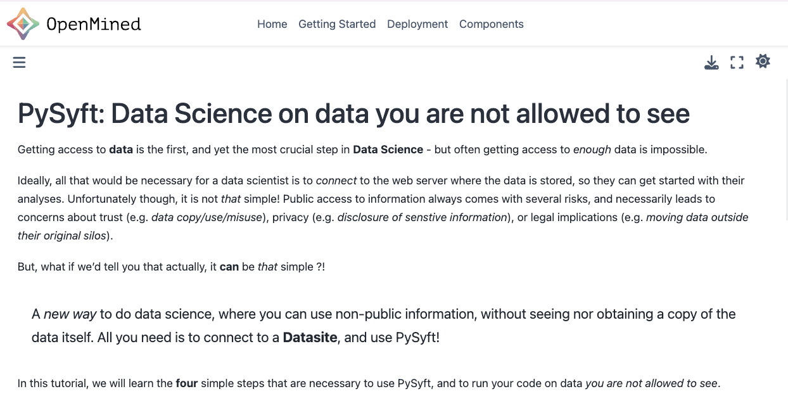

<!-- TODO(a11y): 2 localized body image(s) have empty alt text -->


Imagine you have spent years curating a dataset, and you want to share it with the scientific community to foster new collaborations, and to boost your academic recognition. However your data contains _sensitive_ information. So to effectively share your data you need to control (A) who can access it, and (B) how your data is used (e.g. _avoid unauthorized data copy or download_). This complexity can delay or even cancel research, turning valuable resources into a barrier for scientific discoveries. **PySyft 0.9** is the _game changer_! PySyft offers a new way to work with non-public data, ensuring governance and privacy, without sacrificing accessibility. In this post we will discover how.

## Introducing PySyft 0.9

[PySyft 0.9](https://github.com/openmined/syft "PySyft GitHub repo") is an open source stack of tools that provides a comprehensive solution for data privacy and governance. This version introduces several new features and improvements, moving beyond the focus of past releases as Federated Learning library.

**Enhanced Privacy**: PySyft protects privacy by enabling data scientists to work on data remotely, with the ability to integrate multiple [PETs](https://blog.openmined.org/tag/privacy/) to adapt to different privacy requirements (Read more on this [paper](https://arxiv.org/abs/2012.08347)).

**Robust Security, with Datasites**: Datasites are servers for non-public data that maintain strict control over data access and use. Datasites can be deployed on local computers, in a cluster, or in the cloud. And for more stringent security, Datasites support air-gapped configuration to separate the prototyping environment from code execution.

**Prevent Misuse**: PySyft safeguards against data misuse by using mock data, secure barriers between data and code, and rigorous reviews of information flow. This comprehensive approach ensures that sensitive information remains protected, and is not shared without proper oversight.

**Documentation**: PySyft 0.9 features a brand-new [documentation](https://docs.openmined.org "PySyft Documentation") site.

## Step 1. Install the `syft` package:

You can install the `syft` Python package directly from [PyPI](https://pypi.org/project/syft/):

<figure class="alignleft">

<video src="/blog/announcing-pysyft-09/render1722452351752.mp4" autoplay loop muted playsinline></video>

<figcaption class="wp-element-caption">Installing PySyft using pip</figcaption></figure>

## Step 2. Launch and connect to your Datasite

The Datasite is where your data will be uploaded, to become available for external researchers.

> ? **What is a Datasite**  
> Think of a Datasite as a website, but for non-public data! A website works by hosting files in a server. When you click a link, that website sends the files to you, which your browser shows to you. A datasite is also server with files in it, but when you use a datasite, you don’t download the files. You download the **answer to a question** based on those files.

To get started, let’s use the integrated _lite datasite_ server:

```python
import syft as sy

data_site = sy.orchestra.launch(name="my-research-institute-datasite")
```

You can connect to the server using the default credentials.

```python
# Connecting using default credentials
client = data_site.login(email="info@openmined.org", password="changethis")
```

## Step 3. Upload your dataset

Datasets are the key to how PySyft guarantees that external researchers can work with non-public information, _without seeing nor downloading the data_. There are **two types** of data to be hosted on a Datasite:

1.  **Real** data: the original non-public data that cannot be publicly released;
2.  **Mock** data: a fake version of the real data that is public, and only useful for code prototyping.

To create and upload a new PySyft dataset, we need to instantiate a new `syft.Dataset` object:

> ? To be able to replicate the code snippets in this post, let’s use the [breast\_cancer](https://scikit-learn.org/stable/modules/generated/sklearn.datasets.load_breast_cancer.html#sklearn.datasets.load_breast_cancer) data as proxy for a generic dataset to upload on our datasite. For simplicity, we will create the _mock_ version of this data using random data.

```python
from numpy.random import random
from sklearn.datasets import load_breast_cancer

X, _ = load_breast_cancer(return_X_y=True)
client.upload_dataset(
    sy.Dataset(
        description="Breast Cancer Dataset",
        asset_list=[sy.Asset(data=X, mock=random(X.shape))],
    )
)
```

## Step 4. Invite researchers to access your datasite

Finally, let’s create some (sample) credentials to allow a vetted collaborator to connect to your datasite:

```python
client.users.create(name="Dr. Anthony E. Stark",
                    email="tony@stark-research.institute", 
                    password="iron-syft",
                    password_verify="iron-syft",
                    institution="Stark Research Institute"
)
```

**That’s it**! ? Your datasite is now set up, and ready to receive code requests by “Dr. Stark”!

## Step 5. Continue on [docs.openmined.org](https://docs.openmined.org)

> ? Curious to discover how “Dr. Stark” could work with a PySyft Datasite under privacy guarantees?

[**Join**](https://bit.ly/join-om-slack) our community and check out other tutorials on the PySyft official [documentation](http://docs.openmined.org).

<figure class="wp-block-image">



<figcaption class="wp-element-caption">PySyft 0.9 Documentation Main Page</figcaption></figure>
