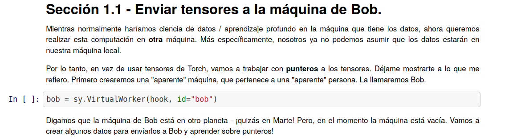

<!-- TODO(a11y): 1 localized body image(s) have empty alt text -->

<figure class="">

</figure>

**¡Hola!**

As part of effort to make it easier for more people to access our projects and resources, we have **translated our PySyft tutorials into Spanish!**

The tutorials can be found [here](https://github.com/OpenMined/PySyft/tree/master/examples/tutorials/translations/espa%C3%B1ol), under the [PySyft repo](https://github.com/OpenMined/PySyft).

## Join us

Keep watching our blog and other social media platforms for updates on upcoming translation releases. If you are **interested in helping translate** our tutorials into more languages or joining the writing team, fill out this [form](https://docs.google.com/forms/d/e/1FAIpQLSdWSdhmXjLypvenrajYlaFDzipNZFhK9K-MtvXw8MeXqj6a5g/viewform).

## Here is the full list of tutorials in Spanish

_You can also view the original **english** tutorials [here](https://github.com/OpenMined/PySyft/tree/master/examples/tutorials)._

-   [Parte 01 – Herramientas básicas de aprendizaje profundo privado](https://github.com/OpenMined/PySyft/blob/master/examples/tutorials/translations/espa%C3%B1ol/Parte%2001%20-%20Herramientas%20b%C3%A1sicas%20de%20aprendizaje%20profundo%20privado.ipynb)
-   [Parte 02 – Intro al Aprendizaje Federado](https://github.com/OpenMined/PySyft/blob/master/examples/tutorials/translations/espa%C3%B1ol/Parte%2002%20-%20Intro%20al%20Aprendizaje%20Federado.ipynb)
-   [Parte 03 – Herramientas avanzadas de ejecución remota](https://github.com/OpenMined/PySyft/blob/master/examples/tutorials/translations/espa%C3%B1ol/Parte%2003%20-%20Herramientas%20avanzadas%20de%20ejecuci%C3%B3n%20remota.ipynb)
-   [Parte 04 – Aprendizaje Federado via un Agregador Confiable](https://github.com/OpenMined/PySyft/blob/master/examples/tutorials/translations/espa%C3%B1ol/Parte%2004%20-%20Aprendizaje%20Federado%20via%20un%20Agregador%20Confiable.ipynb)
-   [Parte 05 – Bienvenido a la caja de arena](https://github.com/OpenMined/PySyft/blob/master/examples/tutorials/translations/espa%C3%B1ol/Parte%2005%20-%20Bienvenido%20a%20la%20caja%20de%20arena.ipynb)
-   [Parte 06 – Aprendizaje federado en MNIST usando una red neuronal convolucional](https://github.com/OpenMined/PySyft/blob/master/examples/tutorials/translations/espa%C3%B1ol/Parte%2006%20-%20Aprendizaje%20federado%20en%20MNIST%20usando%20una%20red%20neuronal%20convolucional.ipynb)
-   [Parte 07 – Aprendizaje Federado con Datos Federados](https://github.com/OpenMined/PySyft/blob/master/examples/tutorials/translations/espa%C3%B1ol/Parte%2007%20-%20Aprendizaje%20Federado%20con%20Datos%20Federados.ipynb)
-   [Parte 08 – Introducción a los Planes](https://github.com/OpenMined/PySyft/blob/master/examples/tutorials/translations/espa%C3%B1ol/Parte%2008%20-%20Introducci%C3%B3n%20a%20los%20Planes.ipynb)
-   [Parte 08 bis – Introducción a Protocolos](https://github.com/OpenMined/PySyft/blob/master/examples/tutorials/translations/espa%C3%B1ol/Parte%2008%20bis%20-%20Introducci%C3%B3n%20a%20Protocolos.ipynb)
-   [Parte 09 – Intro a los Programas Encriptados](https://github.com/OpenMined/PySyft/blob/master/examples/tutorials/translations/espa%C3%B1ol/Parte%2009%20-%20Intro%20a%20los%20Programas%20Encriptados.ipynb)
-   [Parte 10 – Aprendizaje Federado con Agregación Segura](https://github.com/OpenMined/PySyft/blob/master/examples/tutorials/translations/espa%C3%B1ol/Parte%2010%20-%20Aprendizaje%20Federado%20con%20Agregaci%C3%B3n%20Segura.ipynb)
-   [Parte 11 – Clasificación con Aprendizaje Profundo y Seguro](https://github.com/OpenMined/PySyft/blob/master/examples/tutorials/translations/espa%C3%B1ol/Parte%2011%20-%20Clasificaci%C3%B3n%20con%20Aprendizaje%20Profundo%20y%20Seguro.ipynb)
-   [Parte 12 – Entrenar una red neuronal encriptada con datos encriptados](https://github.com/OpenMined/PySyft/blob/master/examples/tutorials/translations/espa%C3%B1ol/Parte%2012%20-%20Entrenar%20una%20red%20neuronal%20encriptada%20con%20datos%20encriptados%20.ipynb)
-   [Parte 12 bis – Entrenamiento Encriptado con MNIST](https://github.com/OpenMined/PySyft/blob/master/examples/tutorials/translations/espa%C3%B1ol/Parte%2012%20bis%20-%20Entrenamiento%20Encriptado%20con%20MNIST.ipynb)
-   [Parte 13a – Clasificación Segura con Syft Keras y TFE – Aprendizaje Público](https://github.com/OpenMined/PySyft/blob/master/examples/tutorials/translations/espa%C3%B1ol/Parte%2013a%20-%20Clasificaci%C3%B3n%20Segura%20con%20Syft%20Keras%20y%20TFE%20-%20Aprendizaje%20P%C3%BAblico.ipynb)
-   [Parte 13b – Clasificación Segura con Syft Keras y TFE – Proveer Predicciones desde un Modelo Seguro](https://github.com/OpenMined/PySyft/blob/master/examples/tutorials/translations/espa%C3%B1ol/Parte%2013b%20-%20Clasificaci%C3%B3n%20Segura%20con%20Syft%20Keras%20y%20TFE%20-%20Proveer%20Predicciones%20desde%20un%20Modelo%20Seguro.ipynb)
-   [Parte 13c – Clasificación Segura con Syft Keras y TFE – Prediccion Privada (Cliente)](https://github.com/OpenMined/PySyft/blob/master/examples/tutorials/translations/espa%C3%B1ol/Parte%2013c%20-%20Clasificaci%C3%B3n%20Segura%20con%20Syft%20Keras%20y%20TFE%20-%20Prediccion%20Privada%20\(Cliente\).ipynb)

Thank you to all those who contributed to this effort:

Arturo Márquez ([@aturomf94](https://github.com/arturomf94)), Ricardo Pretelt ([@ricardopretelt](https://github.com/ricardopretelt)), Carlos Salgado ([@socd06](https://github.com/socd06)) and Daniel Firebanks-Quevedo ([@thefirebanks](https://github.com/thefirebanks))

---

## Anunciando la traducción de los tutoriales de PySyft a español

Como parte de un esfuerzo para facilitar el acceso a nuestros proyectos y recursos, **¡hemos traducido todos nuestros tutorials de PySyft a español!**

Los tutoriales los puedes encontrar [aquí](https://github.com/OpenMined/PySyft/tree/master/examples/tutorials/translations/espa%C3%B1ol), en el [repositorio de PySyft](https://github.com/OpenMined/PySyft).

## ¡Únte!

Mantente al tanto de nuestro blog y nuestas redes sociales para saber más sobre nuestros anuncios. Si te **interesa ayudar en la traducción** de los tutorials o te gustaría formar parte de nuestro equipo de escritores llena este [formato](https://docs.google.com/forms/d/e/1FAIpQLSdWSdhmXjLypvenrajYlaFDzipNZFhK9K-MtvXw8MeXqj6a5g/viewform).

## Aquí está la lista completa de los tutoriales en español

_También puedes encontrar su versión en **inglés** [aquí](https://github.com/OpenMined/PySyft/tree/master/examples/tutorials)._

-   [Parte 01 – Herramientas básicas de aprendizaje profundo privado](https://github.com/OpenMined/PySyft/blob/master/examples/tutorials/translations/espa%C3%B1ol/Parte%2001%20-%20Herramientas%20b%C3%A1sicas%20de%20aprendizaje%20profundo%20privado.ipynb)
-   [Parte 02 – Intro al Aprendizaje Federado](https://github.com/OpenMined/PySyft/blob/master/examples/tutorials/translations/espa%C3%B1ol/Parte%2002%20-%20Intro%20al%20Aprendizaje%20Federado.ipynb)
-   [Parte 03 – Herramientas avanzadas de ejecución remota](https://github.com/OpenMined/PySyft/blob/master/examples/tutorials/translations/espa%C3%B1ol/Parte%2003%20-%20Herramientas%20avanzadas%20de%20ejecuci%C3%B3n%20remota.ipynb)
-   [Parte 04 – Aprendizaje Federado via un Agregador Confiable](https://github.com/OpenMined/PySyft/blob/master/examples/tutorials/translations/espa%C3%B1ol/Parte%2004%20-%20Aprendizaje%20Federado%20via%20un%20Agregador%20Confiable.ipynb)
-   [Parte 05 – Bienvenido a la caja de arena](https://github.com/OpenMined/PySyft/blob/master/examples/tutorials/translations/espa%C3%B1ol/Parte%2005%20-%20Bienvenido%20a%20la%20caja%20de%20arena.ipynb)
-   [Parte 06 – Aprendizaje federado en MNIST usando una red neuronal convolucional](https://github.com/OpenMined/PySyft/blob/master/examples/tutorials/translations/espa%C3%B1ol/Parte%2006%20-%20Aprendizaje%20federado%20en%20MNIST%20usando%20una%20red%20neuronal%20convolucional.ipynb)
-   [Parte 07 – Aprendizaje Federado con Datos Federados](https://github.com/OpenMined/PySyft/blob/master/examples/tutorials/translations/espa%C3%B1ol/Parte%2007%20-%20Aprendizaje%20Federado%20con%20Datos%20Federados.ipynb)
-   [Parte 08 – Introducción a los Planes](https://github.com/OpenMined/PySyft/blob/master/examples/tutorials/translations/espa%C3%B1ol/Parte%2008%20-%20Introducci%C3%B3n%20a%20los%20Planes.ipynb)
-   [Parte 08 bis – Introducción a Protocolos](https://github.com/OpenMined/PySyft/blob/master/examples/tutorials/translations/espa%C3%B1ol/Parte%2008%20bis%20-%20Introducci%C3%B3n%20a%20Protocolos.ipynb)
-   [Parte 09 – Intro a los Programas Encriptados](https://github.com/OpenMined/PySyft/blob/master/examples/tutorials/translations/espa%C3%B1ol/Parte%2009%20-%20Intro%20a%20los%20Programas%20Encriptados.ipynb)
-   [Parte 10 – Aprendizaje Federado con Agregación Segura](https://github.com/OpenMined/PySyft/blob/master/examples/tutorials/translations/espa%C3%B1ol/Parte%2010%20-%20Aprendizaje%20Federado%20con%20Agregaci%C3%B3n%20Segura.ipynb)
-   [Parte 11 – Clasificación con Aprendizaje Profundo y Seguro](https://github.com/OpenMined/PySyft/blob/master/examples/tutorials/translations/espa%C3%B1ol/Parte%2011%20-%20Clasificaci%C3%B3n%20con%20Aprendizaje%20Profundo%20y%20Seguro.ipynb)
-   [Parte 12 – Entrenar una red neuronal encriptada con datos encriptados](https://github.com/OpenMined/PySyft/blob/master/examples/tutorials/translations/espa%C3%B1ol/Parte%2012%20-%20Entrenar%20una%20red%20neuronal%20encriptada%20con%20datos%20encriptados%20.ipynb)
-   [Parte 12 bis – Entrenamiento Encriptado con MNIST](https://github.com/OpenMined/PySyft/blob/master/examples/tutorials/translations/espa%C3%B1ol/Parte%2012%20bis%20-%20Entrenamiento%20Encriptado%20con%20MNIST.ipynb)
-   [Parte 13a – Clasificación Segura con Syft Keras y TFE – Aprendizaje Público](https://github.com/OpenMined/PySyft/blob/master/examples/tutorials/translations/espa%C3%B1ol/Parte%2013a%20-%20Clasificaci%C3%B3n%20Segura%20con%20Syft%20Keras%20y%20TFE%20-%20Aprendizaje%20P%C3%BAblico.ipynb)
-   [Parte 13b – Clasificación Segura con Syft Keras y TFE – Proveer Predicciones desde un Modelo Seguro](https://github.com/OpenMined/PySyft/blob/master/examples/tutorials/translations/espa%C3%B1ol/Parte%2013b%20-%20Clasificaci%C3%B3n%20Segura%20con%20Syft%20Keras%20y%20TFE%20-%20Proveer%20Predicciones%20desde%20un%20Modelo%20Seguro.ipynb)
-   [Parte 13c – Clasificación Segura con Syft Keras y TFE – Prediccion Privada (Cliente)](https://github.com/OpenMined/PySyft/blob/master/examples/tutorials/translations/espa%C3%B1ol/Parte%2013c%20-%20Clasificaci%C3%B3n%20Segura%20con%20Syft%20Keras%20y%20TFE%20-%20Prediccion%20Privada%20\(Cliente\).ipynb)
