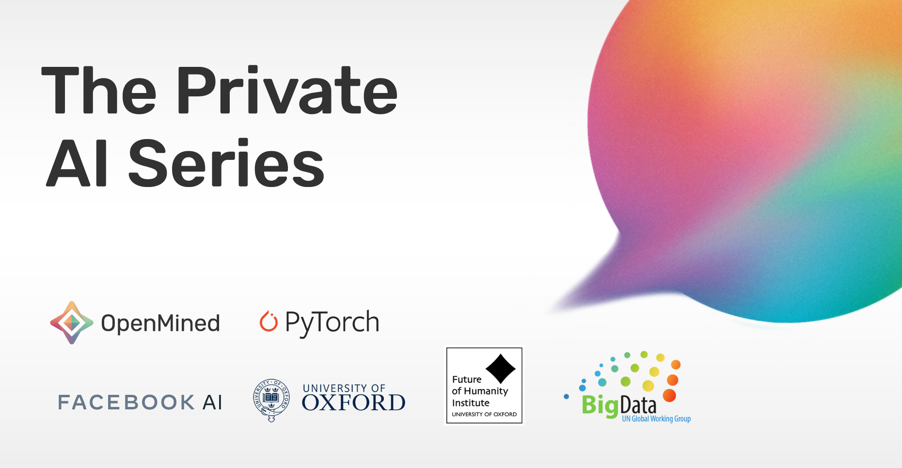

<!-- TODO(a11y): 1 localized body image(s) have empty alt text -->

<figure class="">

</figure>

Our goal at OpenMined is to build a new future by lowering the barrier-to-entry to privacy technologies. To this end, we’ve built tools such as PySyft and PyGrid for performing secure, privacy-preserving data science. With these tools you can take advantage of modern techniques such as federated learning, homomorphic encryption, and differential privacy.

To accomplish our mission, we need to go beyond just building the tools. We must ensure that institutions worldwide are using privacy technology to build new products, analyze sensitive data, and provide new services. New paradigms and skills are spread most effectively through education, so we’re building an entirely new learning platform starting with a series of courses on privacy-preserving machine learning.

This series of four courses is designed for students of all skill levels. Through hands-on exercises and expert instruction, students will learn how privacy enhancing technologies are transforming society. They will also learn the foundations of private computation and how to build products using privacy-preserving machine learning. Each course builds to a real-world project designed to demonstrate new skills and understanding, perfect for building out portfolios.

In the first course, **Privacy and Society**, students learn how privacy infrastructure is changing the way information is managed in society. Students will build the knowledge and skills necessary to take advantage of the opportunities provided by privacy-enhancing technology. This course is non-technical, intended for business leaders and software developers alike.

The second course, **Foundations of Private Computation**, teaches every major privacy-preserving technology to an intermediate level, including the math behind encrypted computations. Students will build these technologies from scratch, use federated learning to work with protected data on remote devices, and use differential privacy budgeting with PyTorch models.

In the **Federated Learning Across Enterprises** course, students develop the skills to use federated learning for analyzing private data across multiple institutions. Students learn how to share data in a private data warehouse themselves and access private data for statistical analysis or to train machine learning models.

Finally, the **Federated Learning on Mobile** course teaches students how to build mobile apps that can train models across millions of devices. This course covers building apps on different platforms including iOS, Android, and browsers with React.js. For the final project, students propose their own mobile app and develop a prototype.

Students won’t be learning on their own. Along with support from the OpenMined community, we’re providing technical mentors to answer questions and give detailed feedback on projects. These mentors will help students at every step through their learning journey.

The Private AI series is developed in collaboration with PyTorch, Facebook AI, the University of Oxford’s Centre for the Governance of AI at the Future of Humanity Institute, and the United Nations Global Working Group on Big Data. We will also seek to design content sufficient to prepare you for the forthcoming certification on private data analysis to be issued by the UN Global Working Group on Big Data.

We’re excited to bring these courses to everyone in the world. All of our courses will be free to access and technical mentorship is free for our students thanks to the [generosity of our partners](https://ai.facebook.com/blog/facebook-ai-openmined-partner-on-new-pytorch-privacy-and-machine-learning-courses). Join the privacy revolution, [sign up today](https://courses.openmined.org/).
