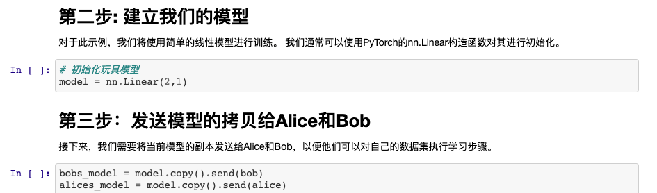

<!-- TODO(a11y): 1 localized body image(s) have empty alt text -->

<figure class="">

</figure>

Happy Chinese New Year!  As we welcome in the year of the rat, we are excited to announce that **our tutorials have been translated into Chinese**, which can be found [here](https://github.com/OpenMined/PySyft/tree/master/examples/tutorials/translations/chinese).  Keep watching our blog and other social media platforms for updates on upcoming translation releases.  Additionally, if you are **interested in helping translate** our tutorials into more languages, fill out this [form](https://forms.gle/URTqQEENRQr6RHFL8).

For convenience, here is the full list of tutorials in Chinese:

-   [Part 01 – The Basic Tools of Private Deep Learning](https://github.com/OpenMined/PySyft/blob/master/examples/tutorials/translations/chinese/Part%2001%20-%20The%20Basic%20Tools%20of%20Private%20Deep%20Learning.ipynb)
-   [Part 02 – Intro to Federated Learning](https://github.com/OpenMined/PySyft/blob/master/examples/tutorials/translations/chinese/Part%2002%20-%20Intro%20to%20Federated%20Learning.ipynb)
-   [Part 03 – Advanced Remote Execution Tools](https://github.com/OpenMined/PySyft/blob/master/examples/tutorials/translations/chinese/Part%2003%20-%20Advanced%20Remote%20Execution%20Tools.ipynb)
-   [Part 04 – Federated Learning via Trusted Aggregator](https://github.com/OpenMined/PySyft/blob/master/examples/tutorials/translations/chinese/Part%2004%20-%20Federated%20Learning%20via%20Trusted%20Aggregator.ipynb)
-   [Part 05 – Welcome to the Sandbox](https://github.com/OpenMined/PySyft/blob/master/examples/tutorials/translations/chinese/Part%2005%20-%20Welcome%20to%20the%20Sandbox.ipynb)
-   [Part 06 – Federated Learning on MNIST using a CNN](https://github.com/OpenMined/PySyft/blob/master/examples/tutorials/translations/chinese/Part%2006%20-%20Federated%20Learning%20on%20MNIST%20using%20a%20CNN.ipynb)
-   [Part 07 – Federated Learning with Federated Dataset](https://github.com/OpenMined/PySyft/blob/master/examples/tutorials/translations/chinese/Part%2007%20-%20Federated%20Learning%20with%20Federated%20Dataset.ipynb)
-   [Part 08 – Introduction to Plans](https://github.com/OpenMined/PySyft/blob/master/examples/tutorials/translations/chinese/Part%2008%20-%20Introduction%20to%20Plans.ipynb)
-   [Part 08 bis – Introduction to Protocols](https://github.com/OpenMined/PySyft/blob/master/examples/tutorials/translations/chinese/Part%2008%20bis%20-%20Introduction%20to%20Protocols.ipynb)
-   [Part 09 – Intro to Encrypted Programs](https://github.com/OpenMined/PySyft/blob/master/examples/tutorials/translations/chinese/Part%2009%20-%20Intro%20to%20Encrypted%20Programs.ipynb)
-   [Part 10 – Federated Learning with Secure Aggregation](https://github.com/OpenMined/PySyft/blob/master/examples/tutorials/translations/chinese/Part%2010%20-%20Federated%20Learning%20with%20Secure%20Aggregation.ipynb)
-   [Part 11 – Secure Deep Learning Classification](https://github.com/OpenMined/PySyft/blob/master/examples/tutorials/translations/chinese/Part%2011%20-%20Secure%20Deep%20Learning%20Classification.ipynb)
-   [Part 12 – Train an Encrypted Neural Network on Encrypted Data](https://github.com/OpenMined/PySyft/blob/master/examples/tutorials/translations/chinese/Part%2012%20-%20Train%20an%20Encrypted%20Neural%20Network%20on%20Encrypted%20Data.ipynbhttps://github.com/OpenMined/PySyft/blob/master/examples/tutorials/translations/chinese/Part%2012%20-%20Train%20an%20Encrypted%20Neural%20Network%20on%20Encrypted%20Data.ipynb)
-   [Part 12 bis – Encrypted Training on MNIST](https://github.com/OpenMined/PySyft/blob/master/examples/tutorials/translations/chinese/Part%2012%20bis%20-%20Encrypted%20Training%20on%20MNIST.ipynb)
-   [Part 13a – Secure Classification with Syft Keras and TFE – Public Training](https://github.com/OpenMined/PySyft/blob/master/examples/tutorials/translations/chinese/Part%2013a%20-%20Secure%20Classification%20with%20Syft%20Keras%20and%20TFE%20-%20Public%20Training.ipynb)
-   [Part 13b – Secure Classification with Syft Keras and TFE – Secure Model Serving](https://github.com/OpenMined/PySyft/blob/master/examples/tutorials/translations/chinese/Part%2013b%20-%20Secure%20Classification%20with%20Syft%20Keras%20and%20TFE%20-%20Secure%20Model%20Serving.ipynb)
-   [Part 13c – Secure Classification with Syft Keras and TFE – Private Prediction Client](https://github.com/OpenMined/PySyft/blob/master/examples/tutorials/translations/chinese/Part%2013c%20-%20Secure%20Classification%20with%20Syft%20Keras%20and%20TFE%20-%20Private%20Prediction%20Client.ipynb)

Thank you to Hou Wei (github: [@dljgs1](https://github.com/dljgs1)) for his hard work on these translations!
