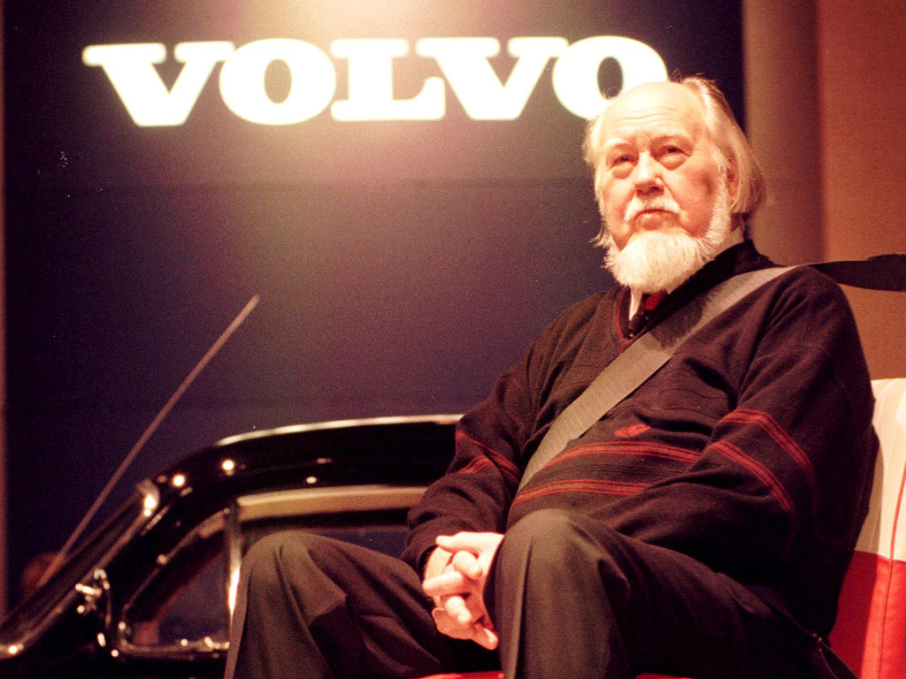
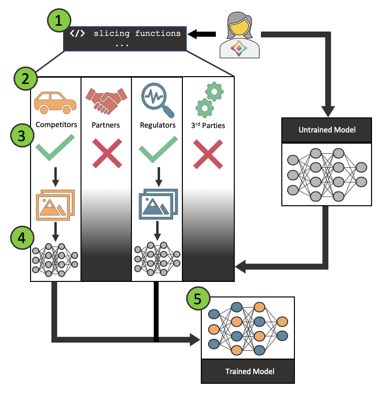
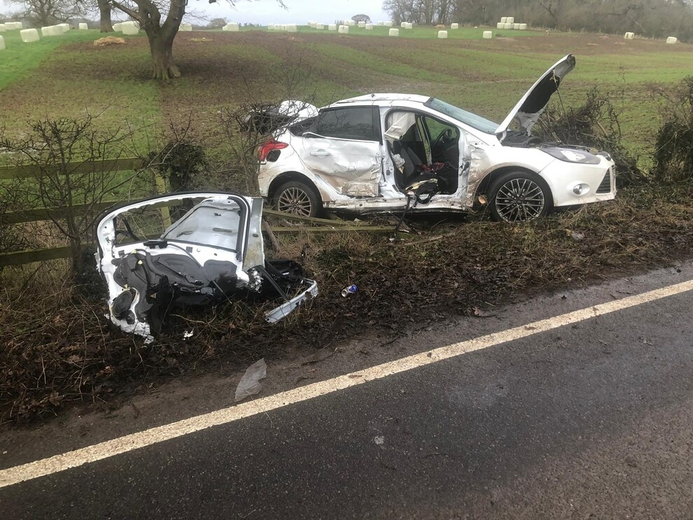

<!-- TODO(a11y): 3 localized body image(s) have empty alt text -->

_Volvo made seatbelt patents readily available to all competitors to encourage adoption of this life saving innovation. Is there a way to promote sharing, or discovery, of safety critical innovations in autonomous vehicles?_

## Introducing Nils Bohlin…

In 1959 Volvo unveiled the three-point seat belt. Pioneered by Nils Bohlin, the company’s first Chief Safety Officer, the design was a simple alternative to otherwise clunky lap straps found in competitor’s cars at the time.

<figure class="">

<figcaption>Nils Bohlin looking stoic.</figcaption></figure>

The three-point seat belt required a significant amount of money to be spent on research and development by Volvo, who went to great lengths to demonstrate the advantages offered by the new design. The company ran hundreds of experiments and researched tens of thousands of accidents to verify the efficacy.

Despite patenting the design and gaining the ability to charge competitors hefty licensing fees, Volvo made the patents readily available to all competitors in a move to drive adoption of this life saving innovation \[[1](https://www.forbes.com/sites/douglasbell/2019/08/13/60-years-of-seatbelts-volvos-great-gift-to-the-world/#804c85c22bcc)\].

The Volvo case is a gripping example of how a company’s decision to forgo short term profits in favour of safety can help to drive the adoption of new innovations, as well as save millions of lives. Volvo acted in the wider interests of society, but there is nothing stopping others in the future breaking from this precedent.

## Moving forward to the present day

The automotive industry is in the midst of an epochal change. The advent of autonomous vehicles is going to transform how we, as humans, navigate our planet. You’re likely to have seen the mind-bending statistics attached to the widespread adoption of the technology- savings of $190 billion in healthcare costs thanks to reductions in accidents, 5.7 billion square metres of parking space re-purposed, 50 minutes per day freed for commuters \[[2](https://www.mckinsey.com/industries/automotive-and-assembly/our-insights/ten-ways-autonomous-driving-could-redefine-the-automotive-world)\].

**With the Volvo seat belt in mind but within the context of the autonomous driving revolution: As opposed to relying on the good will of companies, is there a better way to promote sharing, or discovery, of safety critical innovations?**

To begin to understand this question, let us consider three key points:

-   **Data is the lifeblood of the autonomous vehicle.** The deep learning systems which act as both an autonomous vehicle’s “brains” and senses are reliant on data to faithfully model the world. This makes data the most valuable asset for manufacturers as it represents their competitive advantage.
-   **Safety critical features will increasingly be dominated by software updates**– instead of hardware innovation. Software updates are more difficult to spot than hardware changes and, critically, more difficult to regulate.
-   **Deep learning systems optimise for overall quality** across the entirety of a dataset- potentially reducing performance on edge cases.

Through this lens we can begin to understand some of the differences between today’s landscape, and that of 1959 — when Volvo released the three-point seat belt. Were an autonomous vehicle manufacturer today to decide to release a safety critical feature they had created they have two main options:

-   **Release the model:** This option is simply a non-starter. It would be impossible to carve out the safety critical part of the model. Therefore, manufacturers would be forced to provide the entire model to their competition- handing over the keys to the castle. Furthermore, this would introduce a zero-sum notion to improving on current algorithms — why should I invest time and money into improving my model, if it is then simply going to be handed to the competition?
-   **Release the data:** While this option is more appealing than releasing the underlying model, it still is not feasible. It would be incredibly difficult to quantify how much data to give away, in order to cement the learning. Give away too little and there is no benefit, give away too much and you’re losing a competitive edge. Furthermore, there is no guarantee this data is relevant to the competition: simply because it improved your model, does not mean it will improve mine. Finally, data privacy would add another barrier to this approach.

**However, there is a third option- the use of federated learning \[[3](https://arxiv.org/pdf/1602.05629.pdf)\].** Federated learning uses the premise of moving multiple models to disparate data sources followed by an aggregation step of all of the local models to create a final model. This differs from typical model training which sends data to a central point and then trains a model local to the now centralised data.

The advantages to this approach are numerous. Firstly, data stays in place — meaning that control over the resource is never relinquished to a competitor. Competitor’s models federated out to you can be held and trained in a secure environment — using only the relevant subset of the data. Meanwhile, models which you federate out to competitors have the opportunity to gain the new safety critical learning, and provided there is a secure training environment, competitors would never observe your model’s architecture, weights, biases etc.

This does not solve all of our headaches, though. Manufacturers are not likely to allow competitors to train a model unrestrained on their hard-earned datasets. We need to introduce a second concept; slicing functions \[[4](https://www.snorkel.org/use-cases/03-spam-data-slicing-tutorial)\]. **Slicing functions are used to identify application-critical data subsets, or slices. For example, in this case, slicing functions could be used to identify data that is relevant to safety.**

The application of slicing functions will allow manufacturers to write heuristics to select slices of safety critical data. It’s important to note that slicing functions are noisy, meaning they will not be highly accurate and therefore will grab some data which is irrelevant- see Figure 1 below. As a workaround we can write sets of slicing functions which when taken on aggregate perform well enough to slice a useable section of data.

<figure class="">

<figcaption>Figure 1: Example set of slicing functions to select imagery containing both rain and pedestrians. Slicing functions can make use of both metadata, as well as the image itself. Photo source: https://www.flickr.com/photos/rokonkhan/23653337248</figcaption></figure>

## Developing an Ecosystem

Making use of federated learning in conjunction with slicing functions we can start to imagine an ecosystem where insights from safety critical data could be shared between participants.

Let us imagine an example where Tesla would like to improve the performance of one of their computer vision algorithms at a specific task: for instance, identifying pedestrians on country lanes.

<figure class="">

<figcaption>Figure 2: Example federated model training workflow.</figcaption></figure>

1.  **Slicing functions created:** Tesla engineers would generate a set of slicing functions which they believe would appropriately target the data which they care about. The creation of these functions could be informed by sample data or a metadata schema released by others.
2.  **Functions sent to ecosystem:** These slicing functions could then be federated out to the ecosystem, where they would be reviewed to understand the precise subset of imagery which is being targeted.
3.  **Approved or rejected by ecosystem members:** Ecosystem members can then make a decision to approve or reject the slicing functions which they have received. It is possible that members could modify the functions to tailor the slices- which would in turn be sent back to Tesla for acceptance.
4.  **Models are federated to approving members:** The Tesla model is then federated out to approving members. It is trained on the slice of data in a secure environment.
5.  **Models are gathered, and insights gained:** Each of the copies of the model are then federated back to Tesla, where they are aggregated, and the insights quantified.

It is worth making a distinction around the different ways such a system could be used. The critical difference is the amount and distribution of the data:

1.  **Mission critical:** Data which no single manufacturer has a large repository of but is critical to the operation of autonomous vehicles as a whole. The most obvious example of this would be real-world crash data. No single manufacturer will have a large backlog of real-world crash data (one would hope) and yet this information is clearly incredibly valuable for understanding how to prevent future accidents.  
    It is likely this data will already be released to regulators for investigation who will produce recommendations. The proposed system takes this a step further and instead offers the opportunity to encode those insights directly into other autonomous vehicles.  
    
2.  **Insights:** Niche but more plentiful data which a minority of manufacturers would hold. An example of this may be weather related data, a Swedish manufacturer is likely to hold a far greater volume of snowy imagery compared to one based in Germany. If it does snow in Frankfurt, passengers would expect their autonomous vehicle to behave safely and reliably. Therefore, there is incentive for the German-based manufacturer to train on the Swedish data. This exchange could be facilitated through cold hard cash (e.g. €1 for every image trained upon), a quid pro quo exchange of data (e.g. my snowy data, for your rainy data), or imposed by regulators (e.g. the EU).  
    Exchange of data in the pursuit of insights, safety critical or otherwise, opens the door for smaller players to enter the market. A business model focused around collection and curation of high quality, uncommon data becomes feasible. Insights from the dataset could be sold to larger players, without having to hand over the data- Data as a Service.  
    
3.  **Commodity:** Widespread and plentiful. This is common data which every manufacturer is likely to have access to. An example is likely to be motorway driving on sunny roads. This type of data is unlikely to help inform safety critical features per se, but could allow collaboration between smaller manufacturers to generate models trained on far larger collective data sets.  
    

## Conclusion

Times have changed since 1959, yet the challenges of ensuring passenger safety have never been more relevant. The question posed above was; as opposed to relying on the good will of companies, is there a better way to promote sharing, or discovery, of safety critical innovations?

This blog made an attempt at answering that question. The use of federated learning, alongside slicing functions, could allow for a shared safety ecosystem to emerge. This would open the door for numerous companies and organizations to participate in driving (no pun intended) safety forward in the industry — critically without compromising any intellectual property.

This is simply a starting point to prompt discussion around the practicalities of a proposed shared safety ecosystem. I would love to hear your thoughts, and would be happy to collaborate to develop this further!

## Reaching out!

If this has inspired you there are a number of ways to get involved:

-   Join OpenMined on Slack: [https://slack.openmined.org](https://slack.openmined.org)
-   DM me on Slack to collaborate further: @Tom.Farrand
-   If you are a part of a self-driving car company and would be interested in partnering with OpenMined on this or another use case – reach out to [partnerships@openmined.org](mailto:partnerships@openmined.org)
-   Add me on [LinkedIn](https://www.linkedin.com/in/tom-farrand-16023b125/)

## References

\[1\] [https://www.forbes.com/sites/douglasbell/2019/08/13/60-years-of-seatbelts-volvos-great-gift-to-the-world/#804c85c22bcc](https://www.forbes.com/sites/douglasbell/2019/08/13/60-years-of-seatbelts-volvos-great-gift-to-the-world/#804c85c22bcc)

\[2\] [https://www.mckinsey.com/industries/automotive-and-assembly/our-insights/ten-ways-autonomous-driving-could-redefine-the-automotive-world](https://www.mckinsey.com/industries/automotive-and-assembly/our-insights/ten-ways-autonomous-driving-could-redefine-the-automotive-world)

\[3\] Communication-Efficient Learning of Deep Networks from Decentralized Data: [https://arxiv.org/pdf/1602.05629.pdf](https://arxiv.org/pdf/1602.05629.pdf)

\[4\] Snorkel: [https://www.snorkel.org/use-cases/03-spam-data-slicing-tutorial](https://www.snorkel.org/use-cases/03-spam-data-slicing-tutorial)

Cover image credit: 3D Car Crash: Seatbelts save lives – Hochschule Ansbach [https://vimeo.com/19968164](https://vimeo.com/19968164)

Car crash image: [https://www.shropshirestar.com/news/local-hubs/north-shropshire/whitchurch/2020/01/15/driver-cut-free-after-two-car-crash-near-whitchurch/](https://www.shropshirestar.com/news/local-hubs/north-shropshire/whitchurch/2020/01/15/driver-cut-free-after-two-car-crash-near-whitchurch/)

Snowy road image: [https://unsplash.com/photos/\_RoPd3Eeeuo](https://unsplash.com/photos/_RoPd3Eeeuo)

Sunny road image: [https://www.reddit.com/r/WQHDWallpaper/comments/5cvgc5/sunnyroadinmorningtime3840x2400/](https://www.reddit.com/r/WQHDWallpaper/comments/5cvgc5/sunnyroadinmorningtime3840x2400/)
