A gentle introduction to Deep Learning and its associated terms along with Implementation in Tensorflow and Keras. – Part 1

## What is Deep Learning ?

**Deep learning** is a subset of _machine learning_ that uses multi-layer neural  
networks (large neural networks), inspired by the biological structure of the human  
brain, where neurons in a layer receive some input data, process it, and send the output to the following layer. These neural networks can consist of thousands of interconnected nodes (neurons), mostly organized in different layers, where one node is connected to several nodes in the previous layer from where it receives its input data, as well as being connected to several nodes in the following layer, to which it sends the output data after it has been processed.

The “**deep**” in deep learning comes from the depth of layers which are used to extract meaningful conclusions from data.

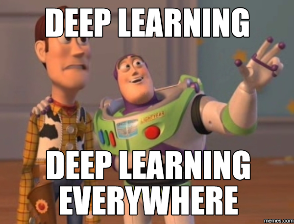

### Terms associated with Deep Learning

There are a variety of terms associated with Deep Learning specifically concerning Artificial Neural networks. Some of them include

1.  Neural Networks
2.  Perceptron
3.  Multi Layer Perceptron (MLP)
4.  Optimization
5.  Forward Propogation
6.  Loss Functions
7.  Backward Propogation
8.  Gradient Descent

We will see what each of these mean along with their Implementation in Tensorflow  
TensorFlow is a powerful open-source software library developed by the Google Brain Team for deep neural networks.

### What are Neural Networks ?

As discussed earlier, neural networks are a type of machine learning algorithm  
that’s modeled on the anatomy of the human brain and that uses mathematical  
equations to learn a pattern from the observations that were made from the  
training data.  
However, to actually understand the logic behind the training process that neural  
networks typically follow, it is important to understand the concept of perceptrons.

### So then, what are perceptrons ?

Developed during the 1950s by **Frank Rosenblatt**, a perceptron is an artificial neuron that takes several inputs and produces a binary output, similar to neurons in the human brain. This then becomes the input of a subsequent perceptron (neuron). Perceptrons are the essential building blocks of a neural network (just like neurons are the building blocks of the human brain):

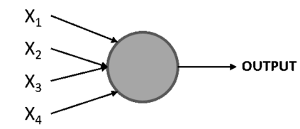

Here,\[X1, X2, X3, and X4\] represent the different inputs of the perceptron, and there could be any number of these. The circle is the _perceptron_, which is where the inputs are processed to arrive at an output.

Rosenblatt also introduced the concept of _weights_ (w1, w2, …, wn), which are numbers that express the importance of each input. The output can be either 0 or 1, and it depends on whether the weighted sum of the inputs is above or below a given  
threshold (a numerical limit set by the developer or by a constraint of the data  
problem), which can be set as a parameter of the perceptron, as can be seen here

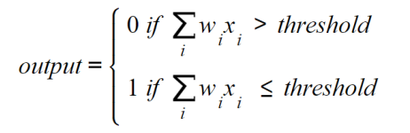

### To Multi Layer Perceptrons

The notion of a multi-layered network consists of a network of multiple perceptrons stacked together (also  
known as nodes or neurons), such as the one shown here :

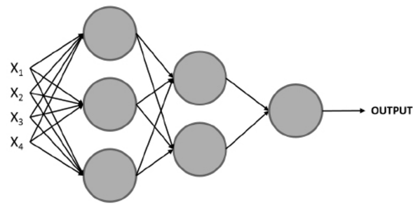

> **_NOTE:_** The Conventional way to refer to the layers in a neural network is as follows  
> The first layer is the input layer, the last layer is the output layer, and all the layers in between are hidden layers.

A set of inputs is used to train the model, but instead of feeding a single perceptron, they are fed to all the perceptrons (neurons) in the first layer. Next, the outputs that are obtained from this layer are used as inputs for the perceptrons in the subsequent layer and so on until the final layer is reached, which is in charge of outputting a result.  
Note that the first layer of a perceptron handles a simple decision process by weighting the inputs, while the subsequent layer can handle more complex and abstract decisions based on the **output** of the previous layer, and hence the stat-of-the-art performance of deep neural networks (networks that use many layers) for complex data problems.

### Understanding the Learning Process of Neural Networks

In general terms, a neural network is made up of multiple neurons. Each neuron computes a linear function along with an activation function to arrive at an output based on some inputs. An activation function is designed to break linearity. This output is tied to a weight, which represents its level of importance and will be used for calculations in the following layer.

These calculations are carried out throughout the entire architecture of the network, until a final output is reached. This output is used to determine the performance of the network in comparison to the ground truth, which is then used to adjust the different parameters of the network to start the calculation process over again.

Considering this, the training process of a neural network can be seen as an iterative process that goes forward and backward through the layers of the network to arrive at an optimal result, which can be seen in the following diagram

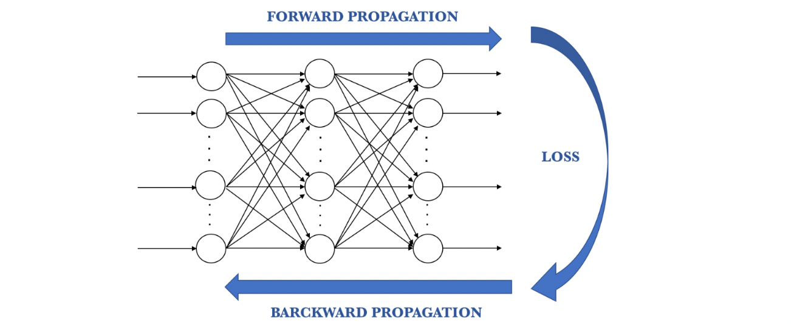

### Forward Propagation

This is the process of going from left to right through the architecture of the network while performing calculations using the input data to arrive at a prediction that can be compared to the ground truth. This means that every neuron in the network will transform the input data (the initial data or data received from the previous layer) according to the weights and biases that it has associated with it and will send the output to the subsequent layer until a final layer is reached and a prediction is made

The calculations that are performed in each neuron include a **linear function** that multiplies the input data by some **weight** plus a **bias**, which is then passed through an **activation function**. The main purpose of the activation function is to break the linearity of the model, which is crucial considering that most real-life data problems that are solved using neural networks are not defined by a line, but rather by a complex function. These formulas are as follows

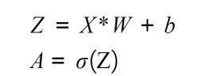

_X_ refers to the **input data**, _W_ is the **weight** that determines the level of importance of the input data, _b_ is the **bias** value, and **sigma (σ)** represents the activation function that’s applied over the linear function.

The activation function serves the purpose of introducing non-linearity to the model. There are different activation functions to choose from, and a list of the ones most commonly used nowadays is as follows:

1.  **Sigmoid:** This is S-shaped, and it basically converts values into simple probabilities between 0 and 1, where most of the outputs that are obtained by the sigmoid function will be close to the extremes of 0 and 1

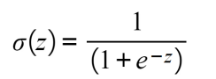

2.  **Softmax:** Similar to the sigmoid function, this calculates the probability distribution of an event over n events, meaning that its output is not binary. In simple terms, this function calculates the probability of the output being one of the target classes in comparison to the other classes:

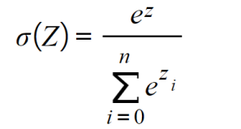

3.  **Tanh:** This function represents the relationship between the hyperbolic sine and the hyperbolic cosine, and the result is between -1 and 1. The main advantage of this activation function is that negative values can be dealt with more easily

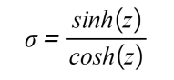

4.  **Rectified Linear Function (ReLU):** This basically activates a node given that the output of the linear function is above 0; Otherwise, its output will be 0. If the output of the linear function is above 0, the result from this activation function will be the raw number it received as input:

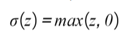

### Calculation of Loss Functions

Once forward propagation is complete, the next step in the training process is to calculate a **loss function** to estimate the error of the model by comparing how good or bad the prediction is in relation to the ground truth value. Considering this, the ideal value to be reached is 0, which would mean that there is no divergence between the two values.  
This means that the goal in each iteration of the training process is to minimize the loss function by changing the parameters (weights and biases) that are used to perform the calculations during the forward pass.

There are multiple loss functions to choose from. However, the most commonly used loss functions for regression and classification tasks are as follows:

1.  **Mean squared error (MSE)**: Widely used to measure the performance of regression models, the MSE function calculates the sum of the distance between the ground truth and the prediction values:

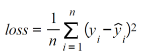

Here, _n_ refers to the number of samples, _yi_ is the ground truth values, and _ŷi_ is the predicted value.

2.**Cross-entropy/multi-class cross-entropy:** This function is conventionally used for binary or multi-class classification models. It measures the divergence between two probability distributions; a large loss function will represent a large divergence. Hence, the objective here is to also minimize the loss function:

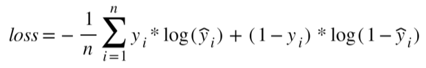

### Backward Propogation

The final step in the training process consists of going from right to left in the architecture of the network to calculate the partial derivatives (also known as gradients) of the loss function in respect to the weights and biases in each layer in order to update these parameters (weights and biases) so that in the next iteration step, the loss function is lower.

The final objective of the optimization algorithm is to find the global minima where the loss function has reached the least possible value, as shown in the following plot:

> **_NOTE_**  
> A local minima refers to the smallest value within a section of the function domain. On the other hand, a glboal minima refers to the smallest value of the entire domain of the function.

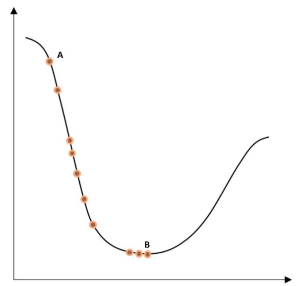  
Here, the dot furthest to the left, _A_, is the initial value of the loss function before any optimization. The dot furthest to the right, _B_, at the bottom of the curve, is the loss function after several iteration steps, where its value has been minimized. The process of going from one dot to another is called a **step**.  
However, it is important to mention that the loss function is not always as smooth as the preceding one, which can introduce the risk of reaching a local minima during the optimization process.

This process is also called **optimization**, and there are different algorithms that vary in methodology to achieve the same objective. The most commonly used optimization algorithm will be explained next.

### Gradient Descent

Gradient descent is the most widely used optimization algorithm among data scientists, and it is the basis of many other optimization algorithms. After the gradients for each neuron are calculated, the weights and biases are updated in the opposite direction of the gradient, which should be multiplied by a learning rate (used to control the size of the steps taken in each optimization), as shown in the following equations.  
The learning rate is crucial during the training process as it prevents the update of the weights and biases from over/undershooting, which may prevent the model from reaching convergence or delay the training process, respectively.  
The optimization of weights and biases in the gradient descent algorithm is as follows :

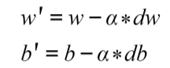

Here, _α_ refers to the learning rate, and _dw/db_ represents the gradients of the weights or biases in a given neuron. The product of the two values is subtracted from the original value of the weight or bias in order to penalize the higher values, which are contributing to computing a large loss function.

An improved version of the gradient descent algorithm is called **stochastic gradient descent**, and it basically follows the same process, with the distinction that it takes the input data in _random batches_ instead of in one chunk, which improves the training times while reaching outstanding performance. Moreover, this approach allows for the use of larger datasets because by using small batches of the dataset as inputs, we are no longer limited by computational resources.

### Introduction to Artificial Neural Networks

Artificial neural networks (ANNs), also known as multi-layer perceptrons, are collections of multiple perceptrons. The connection between perceptrons occurs through layers. One layer can have as many perceptrons as desired, and they are all connected to all the other perceptrons in the preceding and subsequent layers.

Networks can have one or more layers. Networks with over four layers are considered to be deep neural networks and are commonly used to solve complex and abstract data problems.

ANNs are typically composed of three main elements, which were explained earlier,  
and can also be seen in the following image:

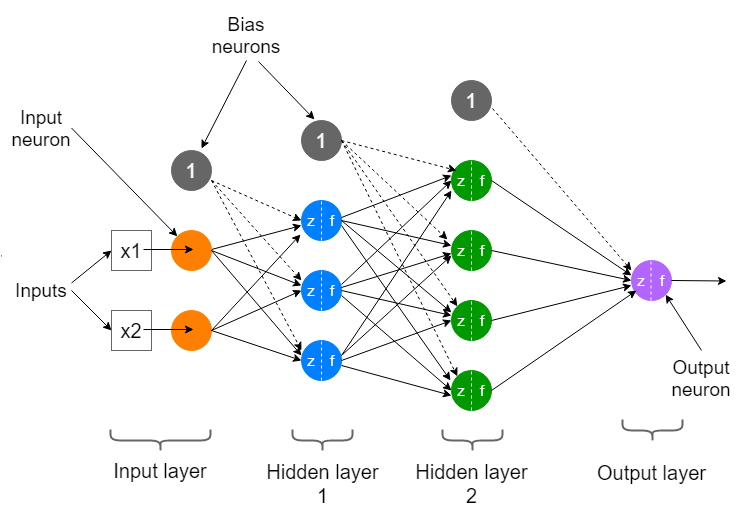

1.  **Input Layer**: This is the first layer of the network, conventionally located furthest to the left in the graphical representation of a network. It receives the input data before any calculation is performed and completes the first set of calculations.  
    This is where the most generic patterns are uncovered.  
    For supervised learning problems, the input data consists of a pair of features and targets. The job of the network is to uncover the correlation or dependency between the features and target.
    
2.  **Hidden Layer**: Next, the hidden layers can be found. A neural network can have many hidden layers, meaning there can be any number of layers between the input layer and the output layer. The more layers it has, the more complex data problems it can tackle, but it will also take longer to train. There are also neural network architectures that do not contain hidden layers at all, which is the case with single-layer networks.
    

In each layer, a computation is performed based on the information that’s received as input from the previous layer, which is then used to output a value that will become the input of the subsequent layer.

3.  **Output Layer**: This is the last layer of the network as is located at the far right of the graphical representation of the network. It receives data after the data has been processed by all the neurons in the network to make a final prediction.

The output layer can have one or more neurons. The former refers to models where the solution is binary, in the form of 0s or 1s. On the other hand, the latter case consists of models that output the probability of an instance belonging to each of the possible class labels (the possible values that the target variable has),  
meaning that the layer will have as many neurons as there are class labels.

In the next blog, we will implement an ANN for detection of handwritten MNSIT Digits using Keras and Tensorflow!
