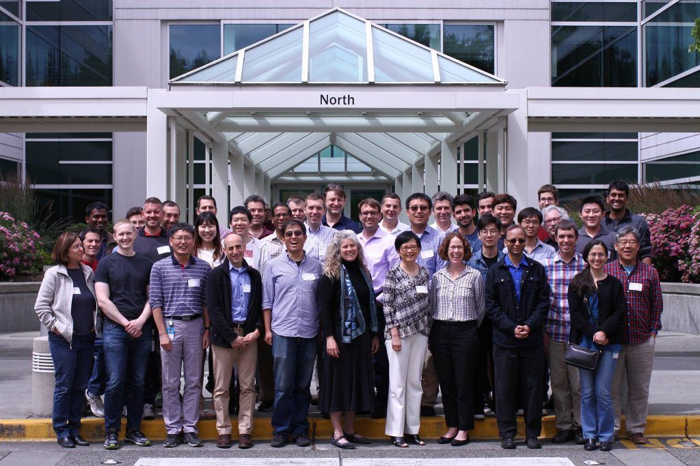
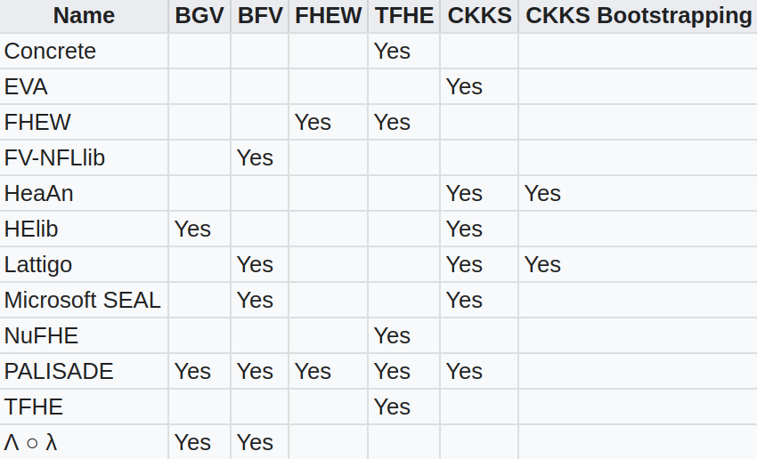

<!-- TODO(a11y): 2 localized body image(s) have empty alt text -->


<figure class="">



<figcaption>Attendees of First Workshop of <a href="http://homomorphicencryption.org/" rel="noopener">Homomorphic Encryption (HE) community</a></figcaption></figure>

Homomorphic Encryption cryptosystem is a cryptosystem whose decryption is a morphism.

```
Decrypt(a*b) = Decrypt(a) * Decrypt(b)
```

Homomorphic Encryption cryptosystem allows operate on ciphertexts without decryption. It ensures end-to-end semantically secure, which is ensuring security against honest but curious adversaries.

Different from confidential computing, FHE takes a software-based data encryption/protection. Since FHE does not perform computational processing in Trusted Execution Environment (TEE), and unauthorized access or modification of data and application code during processing might occur. Thus, FHE does not support application code integrity nor code confidentiality.

Homomorphic Encryption cryptosystem is solve the Ring-Learning With Errors (RLWE) problem. The RLWE and most homomorphic encryption schemes are considered to be secure against quantum computers. Homomorphic Encryption cryptosystem makes it “more secure than factorization and discrete logarithm-based systems such as RSA and many forms of elliptic curve cryptography” \[3\] .

In 1978, Ronald Rivest, Leonard Adleman and Mike Dertouzos propose the idea of ​​using homomorphic encryption to protect the security of data information \[1\]. The first homomorphic encryption framework is constructed by Craig Gentry in 2009 \[4\]. This lattice-based cryptography system enables computing on evaluated ciphertexts, and attracts the attention of many cryptography experts and scholars. Based on homomorphic encryption, people can entrust a third party, both trusted or untrusted third parties, to process data. In 2010, Dijk, Gentry and Vaikuntanathan proposes an integer-based fully homomorphic encryption scheme \[5\] . The design is based on the approximate greatest common factor problem. The original solution only supports the operation of low-order polynomials. With bootstrapping technology, this integer-based fully homomorphic encryption scheme can support complex calculation circuits, through refreshing of the ciphertext \[6\].

There are several widely adopted fully homomorphic encryption schemes. They are grouped into generations corresponding to the underlying approach \[2\] . For detailed scheme and algorithm explanation, please refer to:

[http://homomorphicencryption.org/wp-content/uploads/2018/11/HomomorphicEncryptionStandardv1.1.pdf](http://homomorphicencryption.org/wp-content/uploads/2018/11/HomomorphicEncryptionStandardv1.1.pdf)

1.  Pre-FHE, where operations are limited for unbounded homomorphic encryption operations
    -   RSA cryptosystem (unbounded number of modular multiplications)
    -   ElGamal cryptosystem (unbounded number of modular multiplications)
    -   Goldwasser–Micali cryptosystem (unbounded number of exclusive or operations)
    -   Benaloh cryptosystem (unbounded number of modular additions)
    -   Paillier cryptosystem (unbounded number of modular additions)
    -   Sander-Young-Yung system (after more than 20 years solved the problem for logarithmic depth circuits)
    -   Boneh–Goh–Nissim cryptosystem (unlimited number of addition operations but at most one multiplication)
    -   Ishai-Paskin cryptosystem (polynomial-size branching programs)
2.  First-generation FHE, based on lattice model, however “limited to evaluating low-degree polynomials over encrypted data” \[3\] .
    -   Marten van Dijk, Craig Gentry, Shai Halevi and Vinod Vaikuntanathan (idea lattice)
3.  Second-generation FHE, based on RLWE and NTRU related problem.
    -   The Brakerski-Gentry-Vaikuntanathan (BGV, 2011) scheme.
    -   NTRU-based scheme by Lopez-Alt, Tromer, and Vaikuntanathan (LTV, 2012).
    -   The Brakerski/Fan-Vercauteren (BFV, 2012) scheme,on Brakerski’s scale-invariant cryptosystem.
    -   The NTRU-based scheme by Bos, Lauter, Loftus, and Naehrig (BLLN, 2013),building on LTV and Brakerski’s scale-invariant cryptosystem;
4.  Third-generation FHE
    -   Craig Gentry, Amit Sahai, and Brent Waters (GSW), on building FHE schemes that avoids an expensive “relinearization” step in homomorphic multiplication.
    -   FHEW (2014), ring variants of the GSW cryptosystem
    -   TFHE (2016), ring variants of the GSW cryptosystem
    -   CKKS scheme, focuses on machine learning, conducts efficient rounding operations in encrypted state.

There are several open-source implementations of the above fully homomorphic encryption schemes.

<figure class="">



</figure>

Full homomorphic encryption technology is a trending technology, which is widely used in outsourcing computing, privacy protection machine learning, secure multi-party computing, federated learning, and data exchange and sharing. A large number of experts and scholars have conducted research on it. At present, the research on homomorphic encryption technology is mainly focused on improving the calculation speed, shortening the length of ciphertext, expanding the data type, and expanding the supported operations.

With the flourish of privacy preserving edge computing, full homomorphic encryption becomes draws more and more attention.

References:

\[1\] Rivest, R. L., Adleman, L., & Dertouzos, M. L. (1978). On data banks and privacy homomorphisms. _Foundations of secure computation_, _4_(11), 169-180.

\[2\] Homomorphic Encryption References [https://people.csail.mit.edu/vinodv/FHE/FHE-refs.html](https://people.csail.mit.edu/vinodv/FHE/FHE-refs.html)

\[3\] **[Homomorphic Encryption Standardization Webpage](http://homomorphicencryption.org/),** [https://homomorphicencryption.org/](https://homomorphicencryption.org/)

\[4\] Gentry, C. (2009, May). Fully homomorphic encryption using ideal lattices. In _Proceedings of the forty-first annual ACM symposium on Theory of computing_ (pp. 169-178).

\[5\] Van Dijk, M., Gentry, C., Halevi, S., & Vaikuntanathan, V. (2010, May). Fully homomorphic encryption over the integers. In _Annual international conference on the theory and applications of cryptographic techniques_ (pp. 24-43). Springer, Berlin, Heidelberg.

\[6\] Gentry, C., Halevi, S., & Smart, N. P. (2012, May). Better bootstrapping in fully homomorphic encryption. In _International Workshop on Public Key Cryptography_ (pp. 1-16). Springer, Berlin, Heidelberg.
