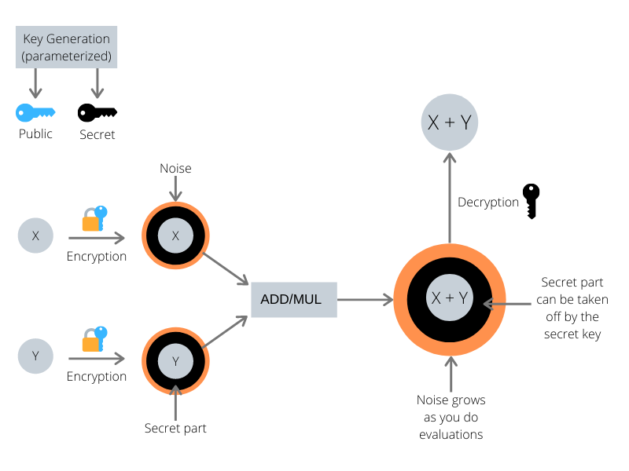

<!-- TODO(a11y): 1 localized body image(s) have empty alt text -->


<!-- TODO(content): shortcode(s) present (verify) -->

**Summary:** This blog post aims at explaining the basic mathematical concepts behind most of today’s homomorphic encryption (HE) schemes, and then build upon this to implement our own scheme (similar to [BFV](https://eprint.iacr.org/2012/144.pdf)) from scratch using Python. This post assumes general knowledge of HE and its terminology, if you have no idea what HE is, then you should check my [previous blog post](https://www.ayoub-benaissa.com/blog/introduction-to-homomorphic-encryption/) for a quick introduction.

We will start by introducing the hard problem behind most of today’s HE schemes, namely, [learning with error](https://en.wikipedia.org/wiki/Learning_with_errors) and its variant [ring learning with error](https://en.wikipedia.org/wiki/Ring_learning_with_errors), if you are familiar with these concepts then you may want to jump directly to the [implementation section](#buildanhomomorphicencryptionscheme), but just before, we need to agree on some basic notation.

## Basic Notation

We denote by \\( \\mathbb{Z}\_q \\) the set of integers \\((-q/2, q/2\]\\) where \\( q > 1 \\) is an integer, all integer operations will be performed (mod \\( q \\)) if not stated otherwise, and for simplicity, you will see me mostly deal with positive integers in \\(\[0, q)\\), but keep in mind that it’s the same as our \\( \\mathbb{Z}\_q \\), as \\(-x \\equiv q – x \\; ( \\mod \\; q )\\) where \\( x \\) is a positive integer (e.g. \\(-1 \\equiv 6 \\; ( \\mod \\; 7 )\\) ). An element \\( v \\in \\mathbb{Z}\_q^n \\) would be simply a vector of \\( n \\) elements in \\( \\mathbb{Z}\_q \\).  
We will use \\(\[\\cdot\]\_m\\) to specify that we are applying modulo \\( m \\), and \\(\\lfloor \\cdot \\rceil\\) for rounding to the nearest integer.  
We denote by \\(\\langle a,b \\rangle\\) the inner product of two elements \\( a,b \\in \\mathbb{Z}\_q^n \\) and is defined as follows  
\\\[ \\langle a,b \\rangle = \\sum\_i^n{a\_i \\cdot b\_i} \\; ( \\mod \\; q ) \\\]

## Learning With Error & Ring Learning With Error

Learning With Error (LWE) was introduced by [Regev in 2009](https://cims.nyu.edu/~regev/papers/qcrypto.pdf) and can be defined as follows: For integers \\( n \\geq 1 \\) and \\( q \\geq 2 \\), let’s consider the following equations  
\\\[ \\langle s, a\_1 \\rangle + e\_1 = b\_1 \\; ( \\mod \\; q ) \\\] \\\[ \\langle s, a\_2 \\rangle + e\_2 = b\_2 \\; ( \\mod \\; q ) \\\] \\\[ … \\\] \\\[ \\langle s, a\_m \\rangle + e\_m = b\_m \\; ( \\mod \\; q ) \\\] where \\( s \\) and \\( a\_i \\) are chosen independently and uniformly from \\( \\mathbb{Z}\_q^n \\), and \\( e\_i \\) are chosen independently according to a probability distribution over \\( \\mathbb{Z}\_q \\), and \\( b\_i \\in \\mathbb{Z}\_q \\). The LWE problem state that it’s hard to recover \\( s \\) from the pairs \\( (a\_i, b\_i) \\), and it’s on such hardness that cryptography generally lies. On the list of candidate algorithms for the [post-quantum cryptography standardization](https://csrc.nist.gov/Projects/post-quantum-cryptography) are some that are based on LWE, so you would probably hear more about it when it would be used in key-establishement and public-key encryption.

Ring-LWE is a variant of LWE, it’s still based on the hardness of recovering \\( s \\) from the pairs \\( (a\_i, b\_i) \\), and the equations are mainly the same, however, we go from the world of integers \\( ( \\mathbb{Z}\_q^n ) \\) to the world of [polynomial quotient rings](https://math.stackexchange.com/questions/395028/how-to-deal-with-polynomial-quotient-rings) \\( ( \\mathbb{Z}\_q\[x\]/ \\langle x^n + 1 \\rangle ) \\), this means that we will deal with polynomials with coefficients in \\( \\mathbb{Z}\_q \\), and the polynomial operations are done (mod) some polynomial that we call the **polynomial modulus** (in our case: \\( \\langle x^n + 1 \\rangle \\)), so all polynomials should be of degree \\( d < n \\), and \\( x^n \\equiv -1 \\; ( \\mod \\; \\langle x^n + 1 \\rangle ) \\).

Let’s now use a more [formal definition of RLWE by Regev](https://cims.nyu.edu/~regev/papers/lwesurvey.pdf): Let \\( n \\) be a power of two, and let \\( q \\) be a prime modulus satisfying \\( q = 1 \\; ( \\mod \\; 2n ) \\). Define \\( R\_q \\) as the ring \\( \\mathbb{Z}\_q\[x\]/ \\langle x^n + 1 \\rangle \\) containing all polynomials over the field \\( \\mathbb{Z}\_q \\) in which \\( x^n \\) is identified with \\( -1 \\). In ring-LWE we are given samples of the form \\( (a, b = a \\cdot s + e) \\in R\_q \\times R\_q \\) where \\( s \\in R\_q \\) is a fixed secret, \\( a \\in R\_q \\) is chosen uniformly, and \\( e \\) is an error term chosen independently from some error distribution over \\( R\_q \\).

So if we want to build an HE scheme using RLWE, then our basic elements won’t be integers, but polynomials, and you should be familiar with basic polynomial operations (addition, multiplication and modulo). I cooked up a quick refresher of polynomial operations to avoid getting off on the wrong foot, but you can just skip it if it’s a trivial thing for you.

**Note:** All the polynomials in the below examples (addition and multiplication) are in \\( \\mathbb{Z}\_{11} / \\langle x^4 + 1 \\rangle \\)

#### Addition

Let’s add two polynomials \\( a(x) = 7x^3 + 4x^2 + 9 \\) and \\( b(x) = x^3 + 10x^2 + 3x + 5 \\)

\\\[ a(x) + b(x) = (7+1 \\; \\mod \\; 11)x^3 + (4+10 \\; \\mod \\; 11)x^2 + (3 \\; \\mod \\; 11)x + (9+5 \\; \\mod \\; 11) \\\] The below modulo operation is useless but I just wanted to show that all operations are performed modulo our polynomial modulus.  
\\\[ a(x) + b(x) \\; ( \\mod \\; x^4 + 1) = 8x^3 + 3x^2 + 3x + 3 \\\]

#### Multiplication

Now we multiply two simpler polynomials \\( a(x) = 5x^2 + 3 \\) and \\( b(x) = 3x^3 + 4x^2 \\)  
\\\[ a(x) \\cdot b(x) = 5x^2 \\cdot (3x^3 + 4x^2) + 3 \\cdot (3x^3 + 4x^2) \\\] \\\[ a(x) \\cdot b(x) = 4x^5 + 9x^4 + 9x^3 + x^2 \\\] \\\[ a(x) \\cdot b(x) \\; ( \\mod \\; x^4 + 1) = 9x^3 + x^2 + 7x + 2 \\\] (9x^3 + x^2 + 7x + 2) is the remainder of the division of \\( a(x) \\cdot b(x) \\) by \\( x^4 + 1 \\) as you may see below:  
\\\[ 4x^5 + 9x^4 + 9x^3 + x^2 = (4x + 9) \\cdot (x^4 + 1) + 9x^3 + x^2 + 7x + 2 \\\]

Don’t panic! We will write these operations in Python in the next section so you won’t have to do these calculations anymore.

---

## Build an Homomorphic Encryption Scheme

**Disclaimer:** This implementation doesn’t neither claim to be secure nor does it follow software engineering best practices, it is designed as simple as possible for the reader to understand the concepts behind homomorphic encryption schemes.

In this section, we go through an implementation of an homomorphic encryption scheme which is mainly inspired from [BFV](https://eprint.iacr.org/2012/144.pdf). We have split the whole scheme into basic functionalities, key-generation, encryption, decryption and evaluation (add and mul). Each functionality would be first explained then implemented in Python. The full implementation can be found on [this github gist](https://gist.github.com/youben11/f00bc95c5dde5e11218f14f7110ad289).

We start by importing the amazing Numpy library, then we define two helper functions (`polyadd` and `polymul`) for adding and multiplying polynomials over a ring \\( R\_q = \\mathbb{Z}\_q / \\langle x^n + 1 \\rangle \\).

```python
import numpy as np
from numpy.polynomial import polynomial as poly

def polymul(x, y, modulus, poly_mod):
    """Add two polynoms
    Args:
        x, y: two polynoms to be added.
        modulus: coefficient modulus.
        poly_mod: polynomial modulus.
    Returns:
        A polynomial in Z_modulus[X]/(poly_mod).
    """
    return np.int64(
        np.round(poly.polydiv(poly.polymul(x, y) % modulus, poly_mod)[1] % modulus)
    )

def polyadd(x, y, modulus, poly_mod):
    """Multiply two polynoms
    Args:
        x, y: two polynoms to be multiplied.
        modulus: coefficient modulus.
        poly_mod: polynomial modulus.
    Returns:
        A polynomial in Z_modulus[X]/(poly_mod).
    """
    return np.int64(
        np.round(poly.polydiv(poly.polyadd(x, y) % modulus, poly_mod)[1] % modulus)
    )
```

### Key Generation

We start by generating a random secret-key (sk) from a probability distribution, we will use the uniform distribution over \\(R\_2\\), which means \\(sk\\) will be a polynomial with coefficients being \\(0\\) or \\(1\\). For the public-key we first sample a polynomial \\(a\\) uniformly over \\(R\_q\\) and a small error polynomial \\(e\\) from a discrete [normal distribution](https://en.wikipedia.org/wiki/Normal_distribution) over \\(R\_q\\). We then set the public-key to be the tuple \\(pk = (\[-(a \\cdot sk + e)\]\_q, a)\\). So let’s first implement the generation of polynomials from different probability distributions.

```python
def gen_binary_poly(size):
    """Generates a polynomial with coeffecients in [0, 1]
    Args:
        size: number of coeffcients, size-1 being the degree of the
            polynomial.
    Returns:
        array of coefficients with the coeff[i] being 
        the coeff of x ^ i.
    """
    return np.random.randint(0, 2, size, dtype=np.int64)

def gen_uniform_poly(size, modulus):
    """Generates a polynomial with coeffecients being integers in Z_modulus
    Args:
        size: number of coeffcients, size-1 being the degree of the
            polynomial.
    Returns:
        array of coefficients with the coeff[i] being 
        the coeff of x ^ i.
    """
    return np.random.randint(0, modulus, size, dtype=np.int64)

def gen_normal_poly(size):
    """Generates a polynomial with coeffecients in a normal distribution
    of mean 0 and a standard deviation of 2, then discretize it.
    Args:
        size: number of coeffcients, size-1 being the degree of the
            polynomial.
    Returns:
        array of coefficients with the coeff[i] being 
        the coeff of x ^ i.
    """
    return np.int64(np.random.normal(0, 2, size=size))
```

Then we can define our key-generator using these functions

```python
def keygen(size, modulus, poly_mod):
    """Generate a public and secret keys
    Args:
        size: size of the polynoms for the public and secret keys.
        modulus: coefficient modulus.
        poly_mod: polynomial modulus.
    Returns:
        Public and secret key.
    """
    sk = gen_binary_poly(size)
    a = gen_uniform_poly(size, modulus)
    e = gen_normal_poly(size)
    b = polyadd(polymul(-a, sk, modulus, poly_mod), -e, modulus, poly_mod)
    return (b, a), sk
```

The public-key `(b, a)` can then be used for encryption, and the secret-key `sk` for decryption.

### Encryption

Our scheme will support encryption of polynomials in the ring \\(R\_t = \\mathbb{Z}\_t / \\langle x^n + 1 \\rangle\\) where \\(t\\) is called the **plaintext modulus**. In our case we will want to encrypt integers in \\(\\mathbb{Z}\_t\\) so we will need to encode this integer into the plaintext domain \\(R\_t\\), we will simply encode an integer \\(pt\\) (for plaintext) as the constant polynomial \\(m(x) = pt\\) (e.g. \\(m(x) = 5\\) will hold the value of 5). The encryption algorithm takes a public-key \\((pk \\in R\_q \\times R\_q)\\) and a plaintext polynomial \\((m \\in R\_t)\\) and outputs a ciphertext \\((ct \\in R\_q \\times R\_q)\\), which is a tuple of two polynomials \\((ct\_0)\\) and \\((ct\_1)\\) and they are computed as follows:  
\\\[ ct\_0 = \[pk\_0 \\cdot u + e\_1 + \\delta \\cdot m\]\_q \\\] \\\[ ct\_1 = \[pk\_1 \\cdot u + e\_2\]\_q \\\] where \\(u\\) is sampled from the uniform distribution over \\(R\_2\\) (same as the secret-key), \\(e\_1\\) and \\(e\_2\\) are sampled from a discrete normal distribution over \\(R\_q\\) (same as the error term in key-generation), and \\(\\delta\\) is the integer division of \\(q\\) over \\(t\\). You will get a better understanding of why we did these exact steps when you learn about the decryption algorithm, but I would advise you to stop here, write those mathematical expressions on a paper, expand the public-key terms and try to figure out the decryption algorithm, this will help you familiarize yourself with the encryption procedure and gain an intuition about it.

```python
def encrypt(pk, size, q, t, poly_mod, pt):
    """Encrypt an integer.
    Args:
        pk: public-key.
        size: size of polynomials.
        q: ciphertext modulus.
        t: plaintext modulus.
        poly_mod: polynomial modulus.
        pt: integer to be encrypted.
    Returns:
        Tuple representing a ciphertext.      
    """
    # encode the integer into a plaintext polynomial
    m = np.array([pt] + [0] * (size - 1), dtype=np.int64) % t
    delta = q // t
    scaled_m = delta * m  % q
    e1 = gen_normal_poly(size)
    e2 = gen_normal_poly(size)
    u = gen_binary_poly(size)
    ct0 = polyadd(
            polyadd(
                polymul(pk[0], u, q, poly_mod),
                e1, q, poly_mod),
            scaled_m, q, poly_mod
        )
    ct1 = polyadd(
            polymul(pk[1], u, q, poly_mod),
            e2, q, poly_mod
        )
    return (ct0, ct1)
```

### Decryption

The first intuition behind decryption is that \\((pk\_1 \\cdot sk \\approx – pk\_0)\\) which means that they sum-up to a really small polynomial. Let’s try computing \\(\\left\[ct\_0 + ct\_1 \\cdot sk\\right\]\_q\\):  
\\\[ \[ct\_0 + ct\_1 \\cdot sk\]\_q = \[pk\_0 \\cdot u + e\_1 + \\delta \\cdot m + (pk\_1 \\cdot u + e\_2) \\cdot sk\]\_q \\\] \\\[ \[ct\_0 + ct\_1 \\cdot sk\]\_q = \[pk\_0 \\cdot u + e\_1 + \\delta \\cdot m + pk\_1 \\cdot sk \\cdot u + e\_2 \\cdot sk\]\_q \\\] We can expand our public-key terms  
\\\[ \[ct\_0 + ct\_1 \\cdot sk\]\_q = \[-(a \\cdot sk + e) \\cdot u + e\_1 + \\delta \\cdot m + a \\cdot sk \\cdot u + e\_2 \\cdot sk\]\_q \\\] \\\[ \[ct\_0 + ct\_1 \\cdot sk\]\_q = \[-a \\cdot sk \\cdot u – e \\cdot u + e\_1 + \\delta \\cdot m + a \\cdot sk \\cdot u + e\_2 \\cdot sk\]\_q \\\] \\\[ \[ct\_0 + ct\_1 \\cdot sk\]\_q = \[\\delta \\cdot m – e \\cdot u + e\_1 + e\_2 \\cdot sk\]\_q \\\] So we ended up with the scaled message and some error terms, let’s multiply by \\(\\displaystyle \\frac{1}{\\delta}\\)  
\\\[ \\frac{1}{\\delta} \\cdot \[ct\_0 + ct\_1 \\cdot sk\]\_q = \[m + \\frac{1}{\\delta} \\cdot errors\]\_q \\\] Then round to the nearest integer and go back to \\(R\_t\\)  
\\\[ \\left\\lfloor \\frac{1}{\\delta} \\cdot \[ct\_0 + ct\_1 \\cdot sk\]\_q \\right\\rceil\_t = \\left\\lfloor \[m + \\frac{1}{\\delta} \\cdot errors\]\_q \\right\\rceil\_t \\\] We will decrypt to the correct value \\(m\\) if the rounding to the nearest integer don’t get impacted by the error terms, which means that the error terms must be bounded by \\(\\displaystyle \\frac{1}{2}\\)  
\\\[ \\frac{1}{\\delta} \\cdot errors \\leq \\frac{1}{2} \\Leftrightarrow errors \\leq \\frac{q}{2t} \\\] So all those error terms must be bounded by \\(\\displaystyle \\frac{q}{2t}\\) for a correct decryption. The parameters \\(q\\) and \\(t\\) clearly impact the correctness of the decryption, however, they are not the unique ones, remember how these error terms are constructed, they come from probability distributions, so you must also choose those distributions carefully.

```python
def decrypt(sk, size, q, t, poly_mod, ct):
    """Decrypt a ciphertext
    Args:
        sk: secret-key.
        size: size of polynomials.
        q: ciphertext modulus.
        t: plaintext modulus.
        poly_mod: polynomial modulus.
        ct: ciphertext.
    Returns:
        Integer representing the plaintext.
    """
    scaled_pt = polyadd(
            polymul(ct[1], sk, q, poly_mod),
            ct[0], q, poly_mod
        )
    decrypted_poly = np.round(scaled_pt * t / q) % t
    return int(decrypted_poly[0])
```

One can easily choose the parameters that guarantee a correct decryption after a simple encryption, but the goal of HE isn’t just to encrypt/decrypt data, but also to compute on encrypted data (add and multiply), and computation will enlarge the error terms as we will see next, so the real question is how much operation can we perform before getting the error terms out of bound? If your encrypted computation involves 5 multiplications, you should choose your parameters accordingly, and that’s what we call Leveled HE, the amount of computation you can perform will depend on the chosen parameters, and there are no perfect parameters that work for all cases, you must choose them according to your scheme, the security you want to achieve and the computation you want to perform.

Before going further, let’s summarize what we have done so far and look at what’s coming next with a graphic.

<figure class="">



</figure>

Now we know that the key generation algorithm outputs two keys, a public-key (in blue) that can encrypt messages, and a secret-key (in black) that can decrypt messages. We know that the encryption hides our message by wrapping it into two main layers, a layer of small error terms (in orange), and a layer that can only be taken off using the secret-key (in black). As we will see in the next section, computing on those encrypted values will enlarge the orange layer, and without much care it may blow up and blind our encrypted value so that we can’t decrypt correctly anymore.

### Evaluation

Now that we know how to generate keys, encrypt and decrypt, let’s learn about computing on encrypted data. Having a ciphertext in hand, we can add or multiply it with other ciphertexts or plaintexts. In this blog post, we will focus on plain operations, which means that we will add the capability to our scheme to add or multiply a ciphertext with integers (plaintexts).

#### Addition

Let \\(ct\\) be a ciphertext encrypting a plaintext message \\(m\_1\\), it’s good to recall the structure of our ciphertext  
\\\[ ct = (\[pk\_0 \\cdot u + e\_1 + \\delta \\cdot m\_1\]\_q, \[pk\_1 \\cdot u + e\_2\]\_q) \\\] adding a plaintext message \\(m\_2\\) means that we should end up with a  
\\\[ ct\_0 = \[pk\_0 \\cdot u + e\_1 + \\delta \\cdot (m\_1 + m\_2)\]\_q \\\] this might seem pretty obvious … right? and indeed it is (who said that HE was complicated?), we will just need to scale our new plaintext \\(m\_2\\) by \\(\\delta\\) and add it to \\(ct\_0\\).  
\\\[ add\\\_plain(ct, m\_2) = (\[ct\_0 + \\delta \\cdot m\_2\]\_q, ct\_1) \\\] Let’s see how the decryption will look like after the addition  
\\\[ \\left\\lfloor \\frac{1}{\\delta} \\cdot \[ct\_0 + ct\_1 \\cdot sk\]\_q \\right\\rceil\_t = \\left\\lfloor \[m\_1 + m\_2 + \\frac{1}{\\delta} \\cdot (- e \\cdot u + e\_1 + e\_2 \\cdot sk)\]\_q \\right\\rceil\_t \\\] As you may have already noticed, this operation doesn’t add any extra noise, thus we can perform as many plain additions as we want without noise penalty.

```python
def add_plain(ct, pt, q, t, poly_mod):
    """Add a ciphertext and a plaintext.
    Args:
        ct: ciphertext.
        pt: integer to add.
        q: ciphertext modulus.
        t: plaintext modulus.
        poly_mod: polynomial modulus.
    Returns:
        Tuple representing a ciphertext.
    """
    size = len(poly_mod) - 1
    # encode the integer into a plaintext polynomial
    m = np.array([pt] + [0] * (size - 1), dtype=np.int64) % t
    delta = q // t
    scaled_m = delta * m  % q
    new_ct0 = polyadd(ct[0], scaled_m, q, poly_mod)
    return (new_ct0, ct[1])
```

#### Multiplication

Let \\(ct\\) be a ciphertext encrypting a plaintext message \\(m\_1\\), and we want to multiply it with a plaintext message \\(m\_2\\), which means that we should end up with  
\\\[ ct\_0 = \[pk\_0 \\cdot u + e\_1 + \\delta \\cdot m\_1 \\cdot m\_2\]\_q \\\] this might seem pretty obvious … right? but this time it’s not, multiplying \\(ct\_0\\) with \\(m\_2\\) will result in  
\\\[ ct\_0 \\cdot m\_2 = \[pk\_0 \\cdot u \\cdot m\_2 + e\_1 \\cdot m\_2 + \\delta \\cdot m\_1 \\cdot m\_2\]\_q \\\] expanding the public-key terms in \\(\[ct\_0 + ct\_1 \\cdot sk\]\_q\\) reveals that it won’t decrypt correctly.  
\\\[ \[ct\_0 + ct\_1 \\cdot sk\]\_q = \[pk\_0 \\cdot u \\cdot m\_2 + e\_1 \\cdot m\_2 + \\delta \\cdot m\_1 \\cdot m\_2 + pk\_1 \\cdot sk \\cdot u + e\_2 \\cdot sk\]\_q \\\] \\\[ \[ct\_0 + ct\_1 \\cdot sk\]\_q = \[-(a \\cdot sk + e) \\cdot u \\cdot m\_2 + e\_1 \\cdot m\_2 + \\delta \\cdot m\_1 \\cdot m\_2 + a \\cdot sk \\cdot u + e\_2 \\cdot sk\]\_q \\\] \\\[ \[ct\_0 + ct\_1 \\cdot sk\]\_q = \[-a \\cdot sk \\cdot u \\cdot m\_2 – e \\cdot u \\cdot m\_2 + e\_1 \\cdot m\_2 + \\delta \\cdot m\_1 \\cdot m\_2 + a \\cdot sk \\cdot u + e\_2 \\cdot sk\]\_q \\\] The issue is that \\(-a \\cdot sk \\cdot u \\cdot m\_2\\) and \\(a \\cdot sk \\cdot u\\) won’t cancel each other now, and that’s a big polynomial added to our actual message \\(m\_1 \\cdot m\_2\\) and decryption will clearly fail. For a correct decryption, we will also need to multiply \\(ct\_1\\) by \\(m\_2\\)  
\\\[ mul\\\_plain(ct, m2) = (\[ct\_0 \\cdot m\_2\]\_q, \[ct\_1 \\cdot m\_2\]\_q) \\\] So that we end up with  
\\\[ \[ct\_0 + ct\_1 \\cdot sk\]\_q = \[-a \\cdot sk \\cdot u \\cdot m\_2 – e \\cdot u \\cdot m\_2 + e\_1 \\cdot m\_2 + \\delta \\cdot m\_1 \\cdot m\_2 + a \\cdot sk \\cdot u \\cdot m\_2 + e\_2 \\cdot sk \\cdot m\_2\]\_q \\\] \\\[ \[ct\_0 + ct\_1 \\cdot sk\]\_q = \[\\delta \\cdot m\_1 \\cdot m\_2 – e \\cdot u \\cdot m\_2 + e\_1 \\cdot m\_2 + e\_2 \\cdot sk \\cdot m\_2\]\_q \\\] And the decryption circuit will result in  
\\\[ \\left\\lfloor \\frac{1}{\\delta} \\cdot \[ct\_0 + ct\_1 \\cdot sk\]\_q \\right\\rceil\_t = \\left\\lfloor \[m\_1 \\cdot m\_2 + \\frac{1}{\\delta} \\cdot (- e \\cdot u \\cdot m\_2 + e\_1 \\cdot m\_2 + e\_2 \\cdot sk \\cdot m\_2)\]\_q \\right\\rceil\_t \\\] Compared to the plaintext addition, you can see here that our error terms got scaled up by our message \\(m\_2\\) which means that multiplying with big values might introduce some rounding errors during decryption.

```python
def mul_plain(ct, pt, q, t, poly_mod):
    """Multiply a ciphertext and a plaintext.
    Args:
        ct: ciphertext.
        pt: integer to multiply.
        q: ciphertext modulus.
        t: plaintext modulus.
        poly_mod: polynomial modulus.
    Returns:
        Tuple representing a ciphertext.
    """
    size = len(poly_mod) - 1
    # encode the integer into a plaintext polynomial
    m = np.array([pt] + [0] * (size - 1), dtype=np.int64) % t
    new_c0 = polymul(ct[0], m, q, poly_mod)
    new_c1 = polymul(ct[1], m, q, poly_mod)
    return (new_c0, new_c1)
```

Having all the functionalities implemented now, let’s enjoy the HE magic

```python
# Scheme's parameters
# polynomial modulus degree
n = 2**4
# ciphertext modulus
q = 2**15
# plaintext modulus
t = 2**8
# polynomial modulus
poly_mod = np.array([1] + [0] * (n - 1) + [1])
# Keygen
pk, sk = keygen(n, q, poly_mod)
# Encryption
pt1, pt2 = 73, 20
cst1, cst2 = 7, 5
ct1 = encrypt(pk, n, q, t, poly_mod, pt1)
ct2 = encrypt(pk, n, q, t, poly_mod, pt2)

print("[+] Ciphertext ct1({}):".format(pt1))
print("")
print("t ct1_0:", ct1[0])
print("t ct1_1:", ct1[1])
print("")
print("[+] Ciphertext ct2({}):".format(pt2))
print("")
print("t ct1_0:", ct2[0])
print("t ct1_1:", ct2[1])
print("")

# Evaluation
ct3 = add_plain(ct1, cst1, q, t, poly_mod)
ct4 = mul_plain(ct2, cst2, q, t, poly_mod)

# Decryption
decrypted_ct3 = decrypt(sk, n, q, t, poly_mod, ct3)
decrypted_ct4 = decrypt(sk, n, q, t, poly_mod, ct4)

print("[+] Decrypted ct3(ct1 + {}): {}".format(cst1, decrypted_ct3))
print("[+] Decrypted ct4(ct2 * {}): {}".format(cst2, decrypted_ct4))
```

## Conclusion

You should be proud of having walked all the way down understanding the math behind HE, and implementing a scheme from scratch. I really hope it was fruitful! Feedbacks and questions are welcome!

If you enjoyed this and would like to join the movement toward privacy preserving, decentralized ownership of AI and the AI supply chain (data), you can do so in the following ways!

#### Join the Crypto Team

If you’re already a contributor to PySyft, and if you’re interested to work on crypto related use cases, you should definitely join us!

-   [Apply to the Crypto Team !](https://docs.google.com/forms/d/1T6MJ21V1lb7aEr4ilZOTYQXzxXP6KbpLumZVmTZMSuY/edit)

#### Join our Slack!

The best way to keep up to date on the latest advancements is to join our community!

-   [Join slack.openmined.org](http://slack.openmined.org/)

#### Join a Code Project!

The best way to contribute to our community is to become a code contributor! If you want to start “one off” mini-projects, you can go to PySyft GitHub Issues page and search for issues marked Good First Issue.

-   [Good First Issue Tickets](https://github.com/OpenMined/PySyft/issues?q=is%3Aopen+is%3Aissue+label%3A%22good+first+issue%22)

#### Donate

If you don’t have time to contribute to our codebase, but would still like to lend support, you can also become a Backer on our Open Collective. All donations go toward our web hosting and other community expenses such as hackathons and meetups!

-   [Donate through OpenMined’s Open Collective Page](https://opencollective.com/openmined)
