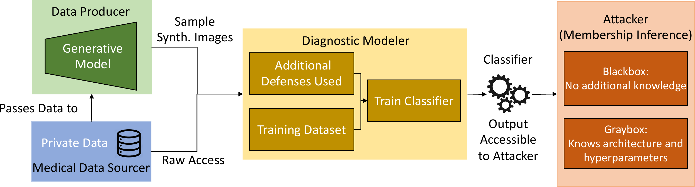
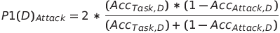
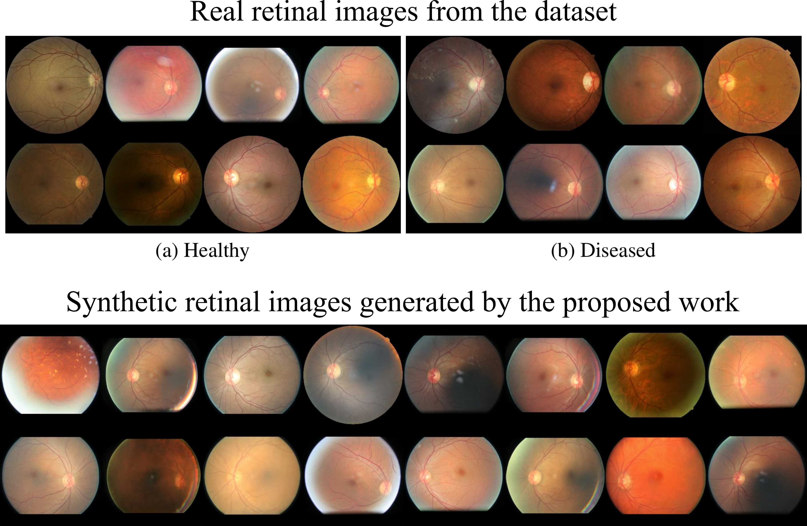
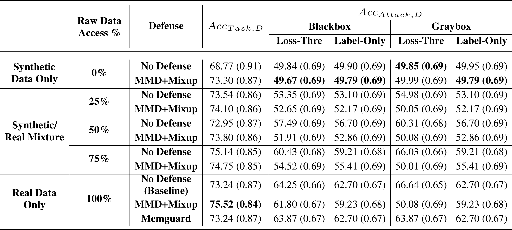
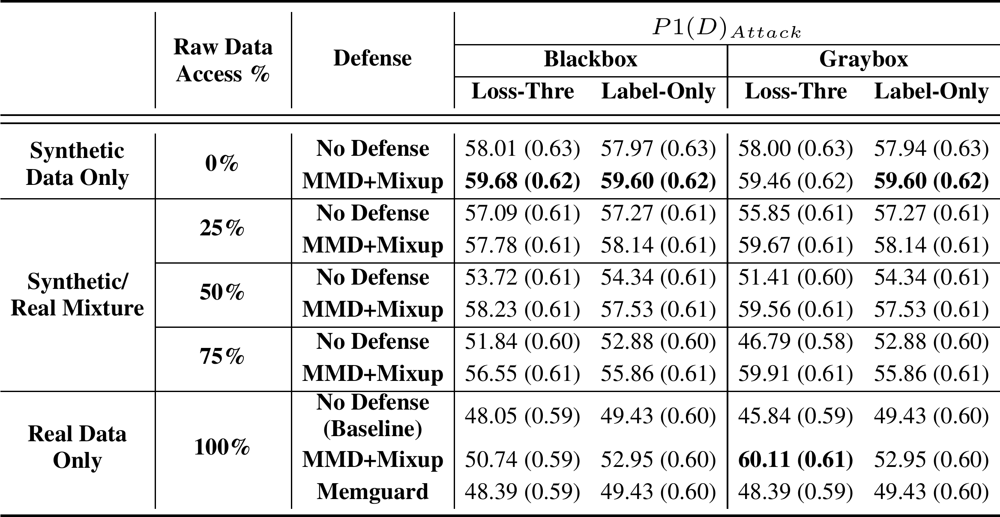

<!-- TODO(a11y): 5 localized body image(s) have empty alt text -->

_This is the summary of the paper ‘Defending Medical Image Diagnostics against Privacy Attacks using Generative Methods’ that was presented at MICCAI PPML 2021_

**Summary:**

-   Medical images collected from patients need to be protected against membership inference attacks, and associated training data reconstruction attacks.
-   The proposed approach reduces the dependence of a data sourcer on the modeler to implement privacy-preservation schemes during model training.
-   The use-case of retinal imagery classification was used to evaluate the effectiveness of synthetic data for privacy.
-   The generated retinal images were found to have acceptable quality for classification purposes but needed further refinement.
-   The authors also introduced P1(D) attack metric that is the harmonic mean of classifier’s accuracy and the attack’s error rate, to evaluate privacy versus privacy tradeoff.

---

The answers to smaller questions can lead to the big picture.

### Why do medical images need privacy protection?

The advances in computer vision have greatly enabled AI-based medical diagnostics that rely on patient images. Such medical images that are used to train AI models are specific to individuals and need to be protected against attribute and membership disclosures. While the owner of the images like a hospital or a laboratory may put in place strict privacy protection provisions, the model trained over these images still holds disclosure potential. Firstly, the trained model that is accessible to an attacker as a black-box or a gray-box can be used to infer an individual’s record that was present in the training dataset, also known as a **membership inference attack**. This knowledge could further be used to uncover the relationship between the individual and the source institution, thus providing metadata to execute further attacks. A skilled attacker may use the individual inference and relationship to carry out **training data reconstruction attack** that would lead to recovery of the training data from the model at hand.

---

### What are the existing strategies that were used to protect medical images?

We saw that the trained model, or let us assume a trained image classifier henceforth, could be the main source of leakage. So it would make sense to **enforce privacy-preserving schemes during its** **training and inference**. Some common strategies to make classifiers more robust against inference attacks include:

-   **Reducing overfitting on the training set**: Techniques like dropout, L2 regularization, MMD+Mixup have been found to contain overfitting
    -   _Pros_:
        -   Inherent performance boosts for the classifier.
    -   Cons:
        -   More related to generalization
-   **Adversarial methods**: A surrogate adversary is controlled by the modeler and aims at distinguishing between the training data and some provided reference data. One way to train a surrogate adversary is through the trained model’s logits, thereby testing the effects of perturbing the classifier’s logits. This method is called MemGuard.
    -   _Pros_:
        -   A classifier’s training process can be used to fool a surrogate adversary.
        -   Suitable for both black-box and gray-box scenarios.
    -   _Cons_:
        -   Turning training into an adversarial game increases the complexity of training classifiers
-   **Methods that affect the training data**: Synthetic data that does not contain any identifying information can be created. Theoretical methods like Differential Privacy (DP) that add perturbations to the data to be released may also be used.
    -   _Pros_:
        -   Extent of de-identification can be controlled for desired utility.
        -   Some networks like GANs are inherently useful for synthetic data generation.
        -   DP and similar perturbation methods have been widely used and tested.
    -   _Cons_:
        -   Certain degree of trust is required to assume that collaborators will not filter out private information from modified/synthetic data.
        -   DP may seem opaque to the modeler causing issues such as inducing disparity concerning subpopulations.

---

### What was proposed in this paper?

The paper evaluated the effectiveness of synthetic data for privacy, considering the use-case of retinal imagery collected for diabetic retinopathy. The proposed solution was driven by the principle of **rejecting potentially vulnerable samples from generative models** which depended only on the source of the data and required no change in procedure in training. The authors identified different roles or agents for the problem.

<figure class="">

<figcaption>Overview of the proposed approach and division of duties among agents. Source: The original paper</figcaption></figure>

The medical data sourcer is a healthcare entity, such as a hospital, that had amassed a collection of valuable and private data from individuals. For the use-case, it is the retina images collected from the patients. The data sourcer is approached by the diagnostic modeler for access to the private data, needed to learn a diagnostic classifier for some medical task, such as diagnosing diabetic retinopathy. At the end of their process, the modeler desires to have a model that generalizes the task to unseen data and is accessible to model consumers and attackers. In the case where the data sourcer wants to mitigate privacy leaks from sharing too much data, they turn to a data producer to de-identify images, as they might not have the technical expertise themselves.

To produce data points usable by the modeler, there are three desirable properties for the generated data:

-   to preserve the original task, i.e. for classification this means being aligned with a certain class,
-   to be realistic so that the classifier trained on this dataset can generalize, and
-   to ensure that the generated data is not equivalent to the original data in the sense of ∼I, where ∼I is the equivalence relation that may work on an attribute like blood vessels in the retina. It measures how an image _x_ should be de-identified to produce the image such that _x is not similar to I of x-hat_.

The first two requirements can be fulfilled by resampling true data distribution from the original distribution p(x,y), where x is the set of images and y is the set of labels. To fully satisfy the third condition, influencing the sampling to move away from the original points was done by rejecting samples that are equivalent to ∼I.

As the medical data sourcer determined what degree of access the modeler had to the original data, metrics that combined the utility and the privacy leakage of the final model were needed for determining the level of access. **This paper proposed a novel metric to evaluate privacy versus utility performance**. It was modeled after the popular F1 score, and measured the harmonic mean of the classifier’s accuracy and the attack’s error rate:

<figure class="">

</figure>

where _Acc(Task,D)_ is the accuracy of the defended model, and _Acc(Attack,D)_ is the accuracy of the attacker on the defended model.

---

### How was the proposed approach implemented?

The experiment for the proposed approach required three models viz. a diagnostic classifier, a synthetic image generator (data producer in paper terminology), and a shadow adversary.

-   **The diagnostic classifier** was a ResNet50 that was initialized to pre-trained ImageNet weights. It used the Adam optimizer with a batch size of 64, a learning rate of 5 ∗10−5, with β1 = 0.9 and β2 = 0.999, and no validation set for the baseline model. The number of training epochs was fixed at 15 for all experimental runs.
-   **The synthetic image generator** was Stylegan2-ADA that used Adaptive Data Augmentation with a minibatch of 32, minibatch standard deviation layer with 8 samples, a feature map multiplier of 1, a learning rate of 0.0025, gamma of 1, and 8 layers in the mapping network.
-   **The shadow adversary** for the gray-box scenario matched the original classifier as much as possible. It was trained using the same architecture of a pre-trained ResNet50 and the same hyperparameters as for the diagnostic classifier. In the black-box scenario, a pre-trained VGG16 network was used with the number of training epochs set to 9. The remaining configuration was the same as for the gray-box and diagnostic classifier.
-   The **EyePACs dataset from the Kaggle Diabetic Retinopathy Detection challenge** provided the retinal images needed for the experiment. While the original dataset included 88,703 high-resolution retina images, 10,000 disjoint random images were chosen for each of the classifier’s and the attacker’s training and testing sets. The retinal images had been taken under a variety of imaging conditions and each had a label ranging from 0 to 4, representing the presence and severity of diabetic retinopathy. The images were cropped to the boundary of the fundus and resized to 256 by 256 pixels. The GAN was trained on this data, and the classifier had additional processing for contrast normalization.

The training set for the diagnostic classifier was used to train the GAN, with default training settings besides a batch size of 32, the learning rate of 2.5 ∗ 10−3, and R1 penalty of 1. For each mixture of synthetic data and real data, both trainings with no defenses and training with MMD+Mixup were evaluated.

To reject samples that were identifiable and to maintain the distinction, **the minimum L2 distance in pixel space** **was set as a threshold between images in the training dataset**. Consequently, a synthetic image that was a distance smaller than this threshold away from any training image was taken to have the same identity and rejected.

The **Frechet Inception Distance** (FID), a standard metric in GAN literature, was used to evaluate the quality of the generated images.

---

### How did the proposed approach measure up?

The first part of the experimental result evaluation compared the real and synthetic images. The clinical assessments focused on how real the generated images looked, and how well they represented potential vasculature issues since the retinal images showed four severity types of diabetic retinopathy.

<figure class="">

<figcaption>Images sourced from the original research article</figcaption></figure>

The generated images were found to have acceptable quality for classification purposes but needed further refinement in terms of blood vessel branching to enhance their realism.

The comparison of the accuracy of the diagnostic classifier versus the shadow adversary for test sets with original images only, synthetic images only, and a mix of both are listed below:

<figure class="">

</figure>

While using only synthetic images to train the classifier defeated the shadow adversary, it also decreased the accuracy. Using MMD+Mixup on synthetic data brought the accuracy on par with the original classifier. Due to its utility preserving nature, MemGuard did not outperform MMD+Mixup for attack accuracy nor task accuracy.

Now let us see what were the values of the newly introduced P1(D) metric.

<figure class="">

</figure>

It can be seen that **synthetic data only with MMD+Mixup was the best bet against all attacks except the gray-box loss-threshold attack**, for which the best performance was obtained by the MMD+Mixup on real data. But the difference between that and the second-best method which used 100% synthetic data with MMD+Mixup was barely significant.

---

### Can privacy of medical images be ensured through proxy data?

The experiments done by the authors of the paper demonstrated that **synthetic data can be used to recover similar accuracies as training with real data**. In addition, these are the potential future work that can extend the proposed technique:

-   Other measures such as F1 score, precision, or AUC could be used instead of the introduced P1(D) attack metric. But it cannot normalize changes in each metric to match user preferences. For example, the user may prefer a 3% increase in accuracy or a 0.05 increase in the F1 score over a 7% decrease in the attack accuracy.
-   Although the equivalence relation ∼I was effective in defeating adversaries, more sophisticated measures can help situations where an image is far away in pixel space but still retains the same identity.
-   The proposed work did not compare directly to differential privacy.

---

### Source:

[Defending Medical Image Diagnostics against Privacy Attacks using Generative Methods](https://arxiv.org/abs/2103.03078)
