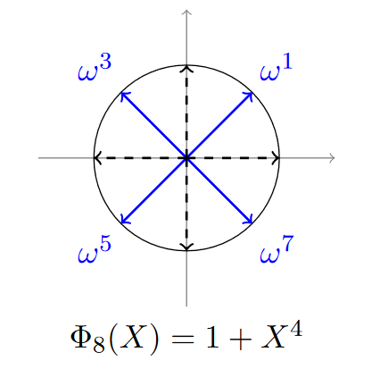

<!-- TODO(a11y): 1 localized body image(s) have empty alt text -->


__****This post is part of our [Privacy-Preserving Data Science, Explained](https://blog.openmined.org/private-machine-learning-explained/) series.****__

## CKKS explained series

[Part 1, Vanilla Encoding and Decoding](https://blog.openmined.org/ckks-explained-part-1-simple-encoding-and-decoding/)  
Part 2, Full Encoding and Decoding  
[Part 3, Encryption and Decryption](https://blog.openmined.org/ckks-explained-part-3-encryption-and-decryption/)  
[Part 4, Multiplication and Relinearization](https://blog.openmined.org/ckks-explained-part-4-multiplication-and-relinearization/)  
[Part 5, Rescaling](https://blog.openmined.org/ckks-explained-part-5-rescaling/)

## Introduction

In the previous article [CKKS explained: Part 1, Vanilla Encoding and Decoding](https://blog.openmined.org/ckks-explained-part-1-simple-encoding-and-decoding/), we learned that to implement the CKKS encryption scheme for computation on encrypted complex vectors, we must first build an encoder and a decoder to transform our complex vectors into polynomials.

This encoder-decoder step is necessary because the encryption, decryption, and other mechanisms work on polynomial rings. Therefore it is necessary to have a way to transform our vectors of real values into polynomials.

We also learned that by using the canonical embedding \\( \\sigma \\), which simply decodes a polynomial by evaluating it on the roots of \\( X^N + 1 \\), we are able to have an isomorphism between \\( \\mathbb{C}^N \\) and \\( \\mathbb{C}\[X\]/(X^N + 1) \\). Nevertheless, because we want our encoder to output polynomials in \\( \\mathbb{Z}\[X\]/(X^N + 1) \\) so as to exploit the structure of polynomial integer rings, we need to modify this first vanilla encoder to be able to output polynomials of the right ring.

Therefore, in this article we will explore how to implement the encoder and decoder used in the original paper [Homomorphic Encryption for Arithmetic of Approximate Numbers](https://eprint.iacr.org/2016/421.pdf), which will be our first step toward implementing CKKS from scratch.

## CKKS encoding

The difference with the previous post is that the plaintext space of the encoded polynomial is now \\( \\mathcal{R} = \\mathbb{Z}\[X\]/(X^N + 1) \\) instead of \\( \\mathbb{C}\[X\]/(X^N + 1) \\), so the coefficients of the polynomial of encoded values must have integer coefficients. Yet when we encode a vector in \\( \\mathbb{C}^N \\) we have learned that its encoding does not necessarily have integer coefficients.

To solve this issue, let’s take a look at the image of the canonical embedding \\( \\sigma \\) on \\( \\mathcal{R} \\).

Because polynomials in \\( \\mathcal{R} \\) have integer coefficients, i.e. real coefficients, and we evaluate them on complex roots, where half are the conjugates of the other (see the previous figure), we have that:  
\\( \\sigma(\\mathcal{R}) \\subseteq \\mathbb{H} = \\{ z \\in \\mathbb{C}^{N} : z\_j = \\overline{z\_{-j}} \\} \\).

Recall the picture earlier when \\( M = 8 \\) :

<figure class="">



<figcaption>Roots <strong>X</strong>⁴ + 1 (source: <a href="https://heat-project.eu/School/Chris%20Peikert/slides-heat2.pdf" rel="nofollow">Cryptography from Rings, HEAT summer school 2016</a>)</figcaption></figure>

We can see on this picture that \\( \\omega^1 = \\overline{\\omega^7} \\) and \\( \\omega^3 = \\overline{\\omega^5} \\). In general, because we evaluate a real polynomial on the roots of \\( X^N + 1 \\), we will also have that for any polynomial \\( m(X) \\in \\mathcal{R}, m(\\xi^j) = \\overline{m(\\xi^{-j})} = m(\\overline{\\xi^{-j}}) \\).

Therefore, any element of \\( \\sigma(\\mathcal{R}) \\) is actually in a space of dimension \\( N/2 \\), not \\( N \\). So if we use complex vectors of size \\( N/2 \\) when encoding a vector in CKKS, we need to expand them by copying the other half of conjugate roots.

This operation, which takes an element of \\( \\mathbb{H} \\) and projects it to \\( \\mathbb{C}^{N/2} \\), is called \\( \\pi \\) in the CKKS paper. Note that this defines an isomorphism as well.

Now we can start with \\( z \\in \\mathbb{C}^{N/2} \\), expand it using \\( \\pi^{-1} \\) (note that \\( \\pi \\) projects, \\( \\pi^{-1} \\) expands), and we get \\( \\pi^{-1}(z) \\in \\mathbb{H} \\).

A problem that we face is that we cannot directly use \\( \\sigma : \\mathcal{R} = \\mathbb{Z}\[X\]/(X^N + 1) \\rightarrow \\sigma(\\mathcal{R}) \\subseteq \\mathbb{H} \\), because an element of \\( \\mathbb{H} \\) is not necessarily in \\( \\sigma(\\mathcal{R}) \\). \\( \\sigma \\) does define an isomorphism, but only from \\( \\mathcal{R} \\) to \\( \\sigma(\\mathcal{R}) \\). To convince yourself that \\( \\sigma(\\mathcal{R}) \\neq \\mathbb{H} \\), you can notice that \\( \\mathcal{R} \\) is countable, therefore \\( \\sigma(\\mathcal{R}) \\) as well, but \\( \\mathbb{H} \\) is not, as it is isomorphic to \\( \\mathbb{C}^{N/2} \\).

This detail is important because it means that we must find a way to project \\( \\pi^{-1}(z) \\) on \\( \\sigma(\\mathcal{R}) \\). To do so, we will use a technique called “coordinate-wise random rounding”, defined in [A Toolkit for Ring-LWE Cryptography](https://web.eecs.umich.edu/~cpeikert/pubs/toolkit.pdf). This rounding technique allows to round a real \\( x \\) either to \\( \\lfloor x \\rfloor \\) or \\( \\lfloor x \\rfloor + 1 \\) with a probability that is higher the closer \\( x \\) is to \\( \\lfloor x \\rfloor \\) or \\( \\lfloor x \\rfloor + 1 \\). We will not go into the details of this algorithm, though we will implement it.

The idea is simple, \\( \\mathcal{R} \\) has an orthogonal \\( \\mathbb{Z} \\)-basis \\( \\{1, X, \\ldots, X^{N-1} \\} \\) and, given that \\( \\sigma \\) is an isomorphism, \\( \\sigma(\\mathcal{R}) \\) has an orthogonal \\( \\mathbb{Z} \\)-basis \\( \\beta = (b\_1, b\_2, \\ldots, b\_N) = (\\sigma(1), \\sigma(X), \\ldots, \\sigma(X^{N-1})) \\). Therefore, for any \\( z \\in \\mathbb{H} \\), we will simply project it on \\( \\beta \\) :

\\( z = \\sum\_{i=1}^{N} z\_i b\_i \\), with \\( z\_i = \\frac{\\langle z, b\_i \\rangle}{\\|b\_i\\|^2} \\in \\mathbb{R} \\).

Because the basis is orthogonal and not orthonormal, we have \\( z\_i = \\frac{\\langle z, b\_i \\rangle}{\\|b\_i\\|^2} \\). Note that we are using the Hermitian product here: \\( \\langle x, y \\rangle = \\sum\_{i=1}^{N} x\_i \\overline{y\_i} \\). The Hermitian product gives real outputs because we apply it on elements of \\( \\mathbb{H} \\); you can compute to convince yourself or notice that you can find an isometric isomorphism between \\( \\mathbb{H} \\) and \\( \\mathbb{R}^N \\), therefore inner products in \\( \\mathbb{H} \\) will yield real outputs.

Finally, once we have the coordinates \\( z\_i \\), we simply need to round them randomly, to the higher or the lower closest integer, using the “coordinate-wise random rounding”. This way we will have a polynomial which will have integer coordinates in the basis \\( (\\sigma(1), \\sigma(X), \\ldots, \\sigma(X^{N-1})) \\), therefore this polynomial will belong to \\( \\sigma(\\mathcal{R}) \\) and the trick is done.

Once we have projected on \\( \\sigma(\\mathcal{R}) \\), we can apply \\( \\sigma^{-1} \\) which will output an element of \\( \\mathcal{R} \\), which was what we wanted!

One final detail: because the rounding might destroy some significant numbers, we actually need to multiply by \\( \\Delta > 0 \\) during encoding, and divide by \\( \\Delta \\) during decoding to keep a precision of \\( \\frac{1}{\\Delta} \\). To see how this works, imagine you want to round \\( x = 1.4 \\) and you do not want to round it to the closest integer but to the closest multiple of \\( 0.25 \\) to keep some precision. Then, you want to set the scale \\( \\Delta = 4 \\), which gives a precision of \\( \\frac{1}{\\Delta} = 0.25 \\). Indeed, now when we get \\( \\lfloor \\Delta x \\rfloor = \\lfloor 4 \\cdot 1.4 \\rfloor = \\lfloor 5.6 \\rfloor = 6 \\). Once we divide it by the same scale \\( \\Delta \\), we get \\( 1.5 \\), which is indeed the closest multiple of \\( 0.25 \\) of \\( x = 1.4 \\).

So the final encoding procedure is :

-   take an element of \\( z \\in \\mathbb{C}^{N/2} \\)
-   expand it to \\( \\pi^{-1}(z) \\in \\mathbb{H} \\)
-   multiply it by \\( \\Delta \\) for precision
-   project it on \\( \\sigma(\\mathcal{R}) \\): \\( \\lfloor \\Delta \\cdot \\pi^{-1}(z) \\rceil\_{\\sigma(\\mathcal{R})} \\in \\sigma(\\mathcal{R}) \\)
-   encode it using \\( \\sigma \\): \\( m(X) = \\sigma^{-1}(\\lfloor \\Delta \\cdot \\pi^{-1}(z) \\rceil\_{\\sigma(\\mathcal{R})}) \\in \\mathcal{R} \\)

The decoding procedure is much simpler: from a polynomial \\( m(X) \\), we simply get \\( z = \\pi \\circ \\sigma(\\Delta^{-1} \\cdot m) \\).

## Implementation

Now that we finally managed to see how the full CKKS encoding and decoding works, let’s implement it! We will use the code we previously used for the Vanilla Encoder and Decoder. The code is available on [this Colab notebook](https://colab.research.google.com/drive/1cdue90Fg_EB5cxxTYcv2_8_XxQnpnVWg?usp=sharing).

For the rest of the article, let’s refactor and build on top of the `CKKSEncoder` class we have created from the previous post. In a notebook environment, instead of redefining the class each time we want to add or change methods, we will simply use `patch_to` from the `fastcore` package from [Fastai](https://github.com/fastai/fastai). This allows us to monkey patch objects that have already been defined. Using `patch_to` is purely for convenience and you could just redefine the `CKKSEncoder` at each cell with the added methods.

```python
# !pip3 install fastcore

from fastcore.foundation import patch_to
```

```python
@patch_to(CKKSEncoder)
def pi(self, z: np.array) -> np.array:
    """Projects a vector of H into C^{N/2}."""
    
    N = self.M // 4
    return z[:N]

@patch_to(CKKSEncoder)
def pi_inverse(self, z: np.array) -> np.array:
    """Expands a vector of C^{N/2} by expanding it with its
    complex conjugate."""
    
    z_conjugate = z[::-1]
    z_conjugate = [np.conjugate(x) for x in z_conjugate]
    return np.concatenate([z, z_conjugate])

# We can now initialize our encoder with the added methods
encoder = CKKSEncoder(M)
```

```python
z = np.array([0,1])
encoder.pi_inverse(z)
```

`array([0, 1, 1, 0])`

```python
@patch_to(CKKSEncoder)
def create_sigma_R_basis(self):
    """Creates the basis (sigma(1), sigma(X), ..., sigma(X** N-1))."""

    self.sigma_R_basis = np.array(self.vandermonde(self.xi, self.M)).T
    
@patch_to(CKKSEncoder)
def __init__(self, M):
    """Initialize with the basis"""
    self.xi = np.exp(2 * np.pi * 1j / M)
    self.M = M
    self.create_sigma_R_basis()
    
encoder = CKKSEncoder(M)
```

We can now have a look at the basis \\( \\sigma(1), \\sigma(X), \\sigma(X^2), \\sigma(X^3) \\).

```python
encoder.sigma_R_basis
```

`array([[ 1.00000000e+00+0.j, 1.00000000e+00+0.j, 1.00000000e+00+0.j, 1.00000000e+00+0.j],   [ 7.07106781e-01+0.70710678j, -7.07106781e-01+0.70710678j, -7.07106781e-01-0.70710678j, 7.07106781e-01-0.70710678j],   [ 2.22044605e-16+1.j, -4.44089210e-16-1.j, 1.11022302e-15+1.j, -1.38777878e-15-1.j],   [-7.07106781e-01+0.70710678j, 7.07106781e-01+0.70710678j, 7.07106781e-01-0.70710678j, -7.07106781e-01-0.70710678j]])`

Here we will check that elements of \\( \\mathbb{Z}(\\{ \\sigma(1), \\sigma(X), \\sigma(X^2), \\sigma(X^3) \\}) \\) are encoded as integer polynomials.

```python
# Here we simply take a vector whose coordinates are (1,1,1,1) in the lattice basis
coordinates = [1,1,1,1]

b = np.matmul(encoder.sigma_R_basis.T, coordinates)
b
```

`array([1.+2.41421356j, 1.+0.41421356j, 1.-0.41421356j, 1.-2.41421356j])`

We can check now that it does encode to an integer polynomial.

```python
p = encoder.sigma_inverse(b)
p
```

`x↦(1+2.220446049250313e-16j)+((1+0j))x+((0.9999999999999998+2.7755575615628716e-17j))x^2+((1+2.220446049250313e-16j))x^3`

```python
@patch_to(CKKSEncoder)
def compute_basis_coordinates(self, z):
    """Computes the coordinates of a vector with respect to the orthogonal lattice basis."""
    output = np.array([np.real(np.vdot(z, b) / np.vdot(b,b)) for b in self.sigma_R_basis])
    return output

def round_coordinates(coordinates):
    """Gives the integral rest."""
    coordinates = coordinates - np.floor(coordinates)
    return coordinates

def coordinate_wise_random_rounding(coordinates):
    """Rounds coordinates randomly."""
    r = round_coordinates(coordinates)
    f = np.array([np.random.choice([c, c-1], 1, p=[1-c, c]) for c in r]).reshape(-1)
    
    rounded_coordinates = coordinates - f
    rounded_coordinates = [int(coeff) for coeff in rounded_coordinates]
    return rounded_coordinates

@patch_to(CKKSEncoder)
def sigma_R_discretization(self, z):
    """Projects a vector on the lattice using coordinate-wise random rounding."""
    coordinates = self.compute_basis_coordinates(z)
    
    rounded_coordinates = coordinate_wise_random_rounding(coordinates)
    y = np.matmul(self.sigma_R_basis.T, rounded_coordinates)
    return y

encoder = CKKSEncoder(M)
```

Finally, because there might be loss of precision during the rounding step, we use the scale parameter \\( \\Delta \\) to achieve a fixed level of precision.

```python
@patch_to(CKKSEncoder)
def __init__(self, M:int, scale:float):
    """Initializes with scale."""
    self.xi = np.exp(2 * np.pi * 1j / M)
    self.M = M
    self.create_sigma_R_basis()
    self.scale = scale
    
@patch_to(CKKSEncoder)
def encode(self, z: np.array) -> Polynomial:
    """Encodes a vector by expanding it first to H,
    scaling it, projecting it on the lattice of sigma(R), and performing
    sigma inverse."""
    pi_z = self.pi_inverse(z)
    scaled_pi_z = self.scale * pi_z
    rounded_scale_pi_zi = self.sigma_R_discretization(scaled_pi_z)
    p = self.sigma_inverse(rounded_scale_pi_zi)
    
    # Round afterwards due to numerical imprecision
    coef = np.round(np.real(p.coef)).astype(int)
    p = Polynomial(coef)
    return p

@patch_to(CKKSEncoder)
def decode(self, p: Polynomial) -> np.array:
    """Decodes a polynomial by removing the scale, 
    evaluating on the roots, and projecting it on \( \mathbb{C}^{N/2} \)"""
    rescaled_p = p / self.scale
    z = self.sigma(rescaled_p)
    pi_z = self.pi(z)
    return pi_z

scale = 64

encoder = CKKSEncoder(M, scale)
```

We can now see it in action, the full encoder used by CKKS:

```python
z = np.array([3 +4j, 2 - 1j])
z
```

`array([3.+4.j, 2.-1.j])`

Now we have an integer polynomial as our encoding.

```python
p = encoder.encode(z)
p
```

`x↦160.0+90.0x+160.0x^2+45.0x^3`

And it actually decodes well!

```python
encoder.decode(p)
```

`array([2.99718446+3.99155337j, 2.00281554-1.00844663j])`

I hope you enjoyed this little introduction to encoding complex numbers into polynomials for homomorphic encryption. We will deep dive into this further in the following articles, so stay tuned!
