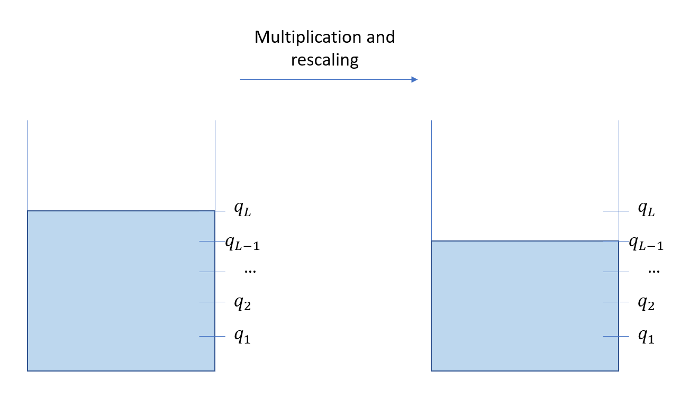
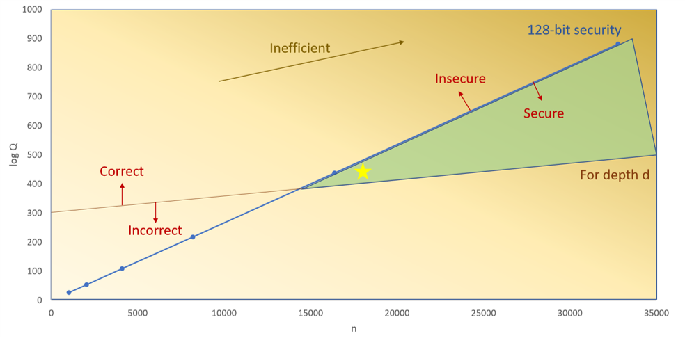

<!-- TODO(a11y): 2 localized body image(s) have empty alt text -->

__****This post is part of our [Privacy-Preserving Data Science, Explained](https://blog.openmined.org/private-machine-learning-explained/) series.****__

## CKKS explained series

[Part 1, Vanilla Encoding and Decoding](https://blog.openmined.org/ckks-explained-part-1-simple-encoding-and-decoding/)  
[Part 2, Full Encoding and Decoding](https://blog.openmined.org/ckks-explained-part-2-ckks-encoding-and-decoding/)  
[Part 3, Encryption and Decryption](https://blog.openmined.org/ckks-explained-part-3-encryption-and-decryption/)  
[Part 4, Multiplication and Relinearization](https://blog.openmined.org/ckks-explained-part-4-multiplication-and-relinearization/)  
Part 5, Rescaling

## Introduction

In the previous article of CKKS explained, [Part 4: Multiplication and Relinearization](https://blog.openmined.org/ckks-explained-part-4-multiplication-and-relinearization/), we saw how ciphertext multiplication works in CKKS, why we needed to relinearize the output in order to keep a constant ciphertext size and how to do it.

Nonetheless, as we will see, we need a final operation called rescaling to manage the noise and avoid overflow. This will be the last theoretical article of this series, and in the next and final article we will implement everything in Python!

In order to understand how this works we will first have a high level picture, then see how it works in detail.

## High level view of the modulus chain

So far we have dug pretty deep into the details of CKKS, but for this we will take a step back. CKKS works with what we call levels, in the sense that there will be a limited number of multiplications allowed before the noise is too big to correctly decrypt the output.

You can imagine this as a gas tank. Initially the gas tank is filled with gas, but as you perform more and more operations, the gas tank will be drained until there is no gas left and you can’t do anything anymore. Well the same thing is true for leveled homomorphic encryption schemes: you start with a certain amount of gas first, but as you do multiplications you have less and less gas, until you run out of it, and you can’t perform any operation anymore.

The following figure illustrates this. When you start, you have your initial full gas tank. But as you perform multiplications and rescaling, you will lose level, which is equivalent to consuming some of your gas. So if you start with \\(L\\) levels, denoted \\((q\_L, q\_{L-1}, \\dots, q\_1)\\), being at level \\(q\_l\\) means you have \\(l\\) multiplications left, and performing one multiplication will decrease the level from \\(q\_l\\) to \\(q\_{l-1}\\).

<figure class="">

<figcaption>Rescaling explained</figcaption></figure>

Now once you run out of gas, as in real life it is possible to fill your tank to be able to go farther down the road. This operation is called bootstrapping and we will not cover it in this article. So if we assume that we do not have the possibility to refill the gas tank, there is one interesting aspect one must take into account when using leveled homomorphic encryption scheme: **you need to know the amount of multiplications you will do in advance!**

Indeed, just like in real life, if you plan to travel quite far, you will need to have more gas than if you simply go around your neighborhood. The same applies here, and depending on how many multiplications you will need to perform, you will have to adjust the size of your tank. But the bigger the tank, the heavier the computations, and also the less secure your parameters are. Indeed, just like in real life, if you need a bigger tank, the heavier it will be, and it will make things slower, as well as making it less secure.

We will not go into all the details, but know that the hardness of the CKKS scheme is based on the ratio \\(\\frac{N}{q}\\), with \\(N\\) the degree of our polynomials, i.e. the size of our vectors, and \\(q\\) the coefficient modulus, i.e. our gas tank.

Therefore, the more multiplications we need, the bigger the gas tank, and therefore our parameters become less secure. To maintain the same level of security we then need to increase \\(N\\), which will increase the computational cost of our operations.

The following figure, from the [Microsoft Private AI Bootcamp](https://www.youtube.com/watch?v=SEBdYXxijSo), shows this tradeoff that one must consider when using CKKS. To guarantee 128 bits of security, we must increase the polynomial degree, even if we do not need the extra slots it provides, as the increased modulo could make our parameters insecure.

<figure class="">

<figcaption>Security as a function of polynomial degree and modulo</figcaption></figure>

So before we move on to the more theoretical part, let’s see what are the key takeaways:

-   Rescaling and noise management can be seen as managing a gas tank: you start with an initial budget that will decrease the more you use it. If you run out of gas, you can’t do anything anymore.
-   You need to know in advance how many multiplications you will do, which will determine the size of the gas tank, which will impact the size of the polynomial degree you will use.

## Context

So now that we see the high-level picture, let’s dig into the why and how it all works.

If you remember correctly from the [Part 2 about encoding](https://blog.openmined.org/ckks-explained-part-2-ckks-encoding-and-decoding/), if we had an initial vector of values \\(z\\), it is multiplied by a scale \\(\\Delta\\) during encoding to keep some level of precision.

So the underlying value contained in the plaintext \\(\\mu\\) and ciphertext \\(c\\) is \\(\\Delta \\cdot z\\). The problem is that when we multiply two ciphertexts \\(c, c’\\), the result holds the value \\(z \\cdot z’ \\cdot \\Delta^2\\). So it contains the square of the scale, which might lead to overflow after a few multiplications as the scale might grow exponentially. Moreover, as we saw before, the noise increases after each multiplication.

Therefore, the rescaling operation’s goal is to actually **keep the scale constant, and also reduce the noise present in the ciphertext.**

## Vanilla solution

So how can we solve this problem? Well, to do so we need to see how to define \\(q\\). Remember that this parameter \\(q\\) is used as the modulo of the coefficients in our polynomial ring \\(\\mathcal{R}\_q = \\mathbb{Z}\_q\[X\]/(X^N+1)\\).

As described in the high-level view, \\(q\\) will be used as a gas tank that we will progressively empty for our operations.

If we suppose we must do \\(L\\) multiplications, with a scale \\(\\Delta\\), then we will define \\(q\\) as:  
\\(q = \\Delta^L \\cdot q\_0\\)  
with \\(q\_0 \\geq \\Delta\\), which will dictate how many bits we want before the decimal part. Indeed, if we suppose we want 30 bits of precision for the decimal part, and 10 bits of precision for the integer part, we will set:  
\\(\\Delta = 2^{30}, \\quad q\_0 = 2^{\\text{\\# bits integer}} \\cdot 2^{\\text{\\# bits decimal}} = 2^{10+30} = 2^{40}\\)

Once we have set the precision we want for the integer and decimal parts, chosen the number \\(L\\) of multiplications we want to perform, and set \\(q\\) accordingly, it is pretty easy to define the rescaling operation: we simply divide and round our ciphertext.

Indeed, suppose we are at a given level \\(l\\), so the modulo is \\(q\_l\\). We have a ciphertext \\(c \\in \\mathcal{R}\_{q\_l}^2\\). Then we can define the rescaling operation from level \\(l\\) to \\(l-1\\) as:  
\\\[  
RS\_{l \\rightarrow l-1}(c) = \\left\\lfloor \\frac{q\_{l-1}}{q\_l} \\cdot c \\right\\rceil \\mod q\_{l-1} = \\left\\lfloor \\Delta^{-1} \\cdot c \\right\\rceil \\mod q\_{l-1}  
\\\]  
because \\(q\_l = \\Delta^l \\cdot q\_0\\).

So by doing so, there are two things we manage to do:

-   Once we decrypt the product of two ciphertexts \\(c,c’\\), with underlying values \\(\\Delta.z, \\Delta.z’\\), after applying rescaling we have \\(\\Delta.z.z’\\). Therefore the scale remains constant throughout our computations as long as we rescale after each multiplication.
-   The noise is reduced, because we divide both the underlying plaintext values, but also the noisy part of the decryption, which is of the form \\(\\mu + e\\) if you remember well. Therefore rescaling also serves the purpose of noise reduction.

So if we put everything together, to actually do a multiplication in CKKS you need to do three things:

1.  Compute the product: \\(c\_{mult}=\\texttt{CMult}(c,c’) = (d\_0,d\_1,d\_2)\\)
2.  Relinearize it: \\(c\_{relin} = \\texttt{Relin}((d\_0,d\_1,d\_2),evk)\\)
3.  Rescale it: \\(c\_{rs} = \\texttt{RS}\_{l \\rightarrow l-1}(c)\\)

Once you do all this, decryption with the secret key will provide the right result and we are all set! Well, almost there, as there is one last detail we will have to cover.

## Chinese remainder theorem

So we saw we had everything we needed, but there is one technical problem: computations are done on huge numbers! Indeed we have that operations are done with huge moduli \\(q\_l = \\Delta^l.q\_0\\). Imagine for instance we want 30 bits of precision for the decimal part, 10 for the integer part, and 10 multiplications. Then we have \\(q\_L = \\Delta^l.q\_0 = 2^{30 \\times 10 + 40} = 2^{340}\\)!

Because we handle sometimes huge polynomials, such as the uniformly sampled ones, some computations won’t fit in usual 64 bits systems so we have to find a way to make it work.

That’s where the [Chinese remainder theorem](https://en.wikipedia.org/wiki/Chinese_remainder_theorem) comes in! This theorem states that if we have \\(L\\) coprime numbers \\(p\_1, \\dots, p\_L\\), \\(p = \\prod\_{l=1}^L p\_l\\) their product, then the map  
\\(\\mathbb{Z}/p \\mathbb{Z} \\to \\mathbb{Z}/p\_1 \\mathbb{Z} \\times \\dots \\times \\mathbb{Z}/p\_L \\mathbb{Z} : x \\ (\\text{ mod } p) \\mapsto (x \\ (\\text{ mod } p\_1), \\dots, x \\ (\\text{ mod } p\_L))\\)  
is a ring isomorphism, i.e. if you want to perform arithmetic on the “big” ring \\(\\mathbb{Z}/p \\mathbb{Z}\\), you could instead perform it independently on the “small” rings \\(\\mathbb{Z}/p\_l \\mathbb{Z}\\) where you will not have the problem of performing computation on more than 64 bits.

So in practice, instead of having \\(q\_L = \\Delta^L.q\_0\\), we first choose \\(p\_1, \\dots, p\_L, q\_0\\) prime numbers, with each \\(p\_l \\approx \\Delta\\) and \\(q\_0\\) a prime number greater than \\(\\Delta\\) depending on the integer precision desired, then set \\(q\_L = \\prod\_{l=1}^L p\_l \\cdot q\_0\\).

This way, we can use the Chinese remainder theorem, and do the little trick described above to be able to perform arithmetic with big modulo. The rescaling operation has to be slightly modified:  
\\(RS\_{l \\rightarrow l-1}(c) = \\left\\lfloor \\frac{q\_{l-1}}{q\_l} c \\right\\rceil \\ (\\text{mod } q\_{l-1}) = \\left\\lfloor p\_l^{-1} c \\right\\rceil \\ (\\text{mod } q\_{l-1}) \\)

So we have seen in this article what is rescaling, why we need it, and how one could implement it in practice. In the next and last article we will put everything together and code a CKKS-like homomorphic encryption scheme ourselves in Python!
