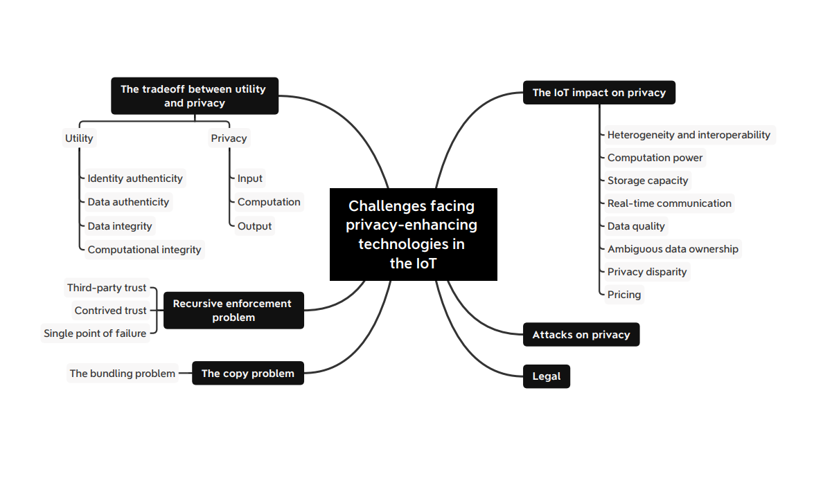

The rise of Privacy Enhancing Technologies (PETs) has witnessed tremendous growth in recent years. A recent research publication from MIT \[1\] has placed their annual growth at 178% compared to other technologies. Although PETs have found early adopters in a few large corporations, academia or government institutions, their mainstream adoption could spur access to data among Business to Business enterprises.

The awareness of end users on data privacy and the expansion of regional regulation on data protections could lead to more adoption. However, like most emerging technologies, PETs have inherent challenges affecting its maturity and most notably in the IoT space. The following sections discuss some of these problems as gleaned from G. M. Garrido et al.’s “Revealing the Landscape of Privacy-Enhancing Technologies in the Context of Data Markets for the IoT: A Systematic Literature Review” study \[2\]. To learn more about privacy techniques in the future, please follow [Callis Ezenwaka](https://twitter.com/callezenwaka) and [OpenMined](https://twitter.com/openminedorg) on twitter.

## Classification of PETs Shortcomings

These challenges can be fanned-out into two categories namely the narrow challenges and the broad challenges each having distinct sub-categories as shown in the figure 1 below:

-   The narrow challenges consists of (i) the trade-off between utility and privacy, (ii) the Recursive Enforcement Problem (REP) and (iii) the Copy Problem (CP)
-   The broad challenges comprises (i) the IoT impact on privacy, (ii) the attacks on privacy and (iii) the Legal challenges.

<figure class="">

<figcaption>Figure 1: An overview of challenges for PETs in the IoT space</figcaption></figure>

### The Narrow Challenges

**The Utility and Privacy trade-off**: The dilemma between preserving the privacy of data producers and deriving useful insight from released data by consumers has posed a considerable challenge for practitioners \[3\]. The need to validate data authenticity has further widened these differences – as producers strive to maintain maximum privacy, data consumers demand maximum utility thus increasing the complexity of the trade-off \[4\]. While PETs ensure plausible deniability, they inadvertently reduce data authenticity and accountability.

Contextually, this could be the desired benefit while at other times like during a health emergency, it could be a barrier for such activities like contact tracing. In order to strike an optimal balance between the trade-off, practitioners should clearly define the accountability threshold and set up deterrents for parties that contravene such. Appropriate measures like outright ban could be adopted to deter participants from peddling unauthentic data.

**The recursive enforcement problem (REP)**: The existence of trust relationship between a data producer (the trustor) and a data consumer (the trustee) \[5\] is based on the principle that the trustee will always act within agreed threshold without further supervision. However, this is not always the case as evidenced in the increasing number of data breaches. The issue of trust \[6\] and cost \[7\] of third party supervision has significantly slowed the advancement of the IoT data market.

The recursive enforcement problem manifests itself in a multi-layered supervision structure. A trustee needs a gatekeeper A to enforce proper oversight, then this gatekeeper A needs another authority gatekeeper B, who in turn needs another authority gatekeeper C and so the whole process cascades into an onion-like form. Using PETs like differential privacy and homomorphic encryption could reduce the need for such third party supervision and ultimately reduce single point of failure and contrived trust – i.e. accepting the sometimes poor privacy conditions in a monopoly.

**The Copy Problem (CP)**: The idea of perceiving data as a tradable asset could create an aversion for data owners to share them. The fear of potentially forgoing the benefits derived from shared data or releasing information that could be potentially used against someone reinforces such aversion. Copy Problem could impose a barrier, both in the industry and among customers, for data owners to engage in data markets.

The notion that shared data would not preserve its value as soon as it is released and the inability of data owners to allow a non-agreed computation could potentially make original  data scarce. In order to make access to data more appealing and attractive to data producers, secure and outsourced computation could be adopted. The use of PETs such as trusted execution environments or homomorphic encryption can tackle the CP by allowing other entities to extract value without ever losing control over the input data beyond the specific information sold.

### The Broad Challenges

**The IoT impact on privacy**: The advent of IoT brought about ubiquitous and proliferation of large amounts of data. The effect  of data generated by these devices could be seen in digital transformation across both the legacy industries like manufacturing and in other consumer products and services.

However, IoT devices have inherent shortcomings that could affect privacy. Since privacy could be constrained by such factors like context and employed technologies, underscores the need for strict adherence to privacy-by-design principles \[8\]. Therefore, a call for practitioners working within the domain to pull resources in order to tackle the diverse issues that IoT devices entail for privacy.

The table below contains an overview of these shortcomings and briefly highlights some of their impact on privacy.

<table style="border:none; border-collapse:collapse; table-layout:fixed; width:468pt"><colgroup><col> <col> <col></colgroup><tbody><tr style="height:0pt"><td style="border-left:solid #000000 1pt; border-right:solid #000000 1pt; border-bottom:solid #000000 1pt; border-top:solid #000000 1pt; vertical-align:top; padding:5pt 5pt 5pt 5pt; overflow:hidden; overflow-wrap:break-word">
Challenge
</td><td style="border-left:solid #000000 1pt; border-right:solid #000000 1pt; border-bottom:solid #000000 1pt; border-top:solid #000000 1pt; vertical-align:top; padding:5pt 5pt 5pt 5pt; overflow:hidden; overflow-wrap:break-word">
Description
</td><td style="border-left:solid #000000 1pt; border-right:solid #000000 1pt; border-bottom:solid #000000 1pt; border-top:solid #000000 1pt; vertical-align:top; padding:5pt 5pt 5pt 5pt; overflow:hidden; overflow-wrap:break-word">
Impact of privacy
</td></tr><tr style="height:0pt"><td style="border-left:solid #000000 1pt; border-right:solid #000000 1pt; border-bottom:solid #000000 1pt; border-top:solid #000000 1pt; vertical-align:top; padding:5pt 5pt 5pt 5pt; overflow:hidden; overflow-wrap:break-word">
Heterogeneity and Interoperability
</td><td style="border-left:solid #000000 1pt; border-right:solid #000000 1pt; border-bottom:solid #000000 1pt; border-top:solid #000000 1pt; vertical-align:top; padding:5pt 5pt 5pt 5pt; overflow:hidden; overflow-wrap:break-word">
The IoT consists of billions of IoT devices from different manufacturers, running different software on different local networks and geographic regions, with different computation power and storage capacity. Furthermore, different com- munications standards, connectivity and availability aggravate the interplay of IoT devices.
</td><td style="border-left:solid #000000 1pt; border-right:solid #000000 1pt; border-bottom:solid #000000 1pt; border-top:solid #000000 1pt; vertical-align:top; padding:5pt 5pt 5pt 5pt; overflow:hidden; overflow-wrap:break-word">
An IoT data market should be agnostic to these differences and minimize any additional requirements; however, it is unclear how global data markets should harmonize data coming from different jurisdictions with different privacy regulations and how an IoT device can interact with another whose, e.g., verification schemata are inadequate from its perspective. In addition to these obstacles, a lack of interoperability may re- strain PETs that involve the communication between many devices, e.g., SMC.
</td></tr><tr style="height:0pt"><td style="border-left:solid #000000 1pt; border-right:solid #000000 1pt; border-bottom:solid #000000 1pt; border-top:solid #000000 1pt; vertical-align:top; padding:5pt 5pt 5pt 5pt; overflow:hidden; overflow-wrap:break-word">
Computation power
</td><td style="border-left:solid #000000 1pt; border-right:solid #000000 1pt; border-bottom:solid #000000 1pt; border-top:solid #000000 1pt; vertical-align:top; padding:5pt 5pt 5pt 5pt; overflow:hidden; overflow-wrap:break-word">
Manufacturers produce many IoT devices designed to consume low energy and require minimal volume, limiting these IoT devices to the core functionalities of monitoring and communication
</td><td style="border-left:solid #000000 1pt; border-right:solid #000000 1pt; border-bottom:solid #000000 1pt; border-top:solid #000000 1pt; vertical-align:top; padding:5pt 5pt 5pt 5pt; overflow:hidden; overflow-wrap:break-word">
Any additional computation requires a higher investment in resources and manufacturing, and running some PETs becomes infeasible without this extra investment. Consequently, a set of PETs is excluded without more computation power, e.g., cryptography-based PETs such as HE, SMC, ZKP, some digital signatures, or consensus algorithms.This limitation, however, may only apply to contexts where it might not be possible to connect IoT devices acting as clients with proprietary or trusted third-party nodes where these PETs are executed.
</td></tr><tr style="height:0pt"><td style="border-left:solid #000000 1pt; border-right:solid #000000 1pt; border-bottom:solid #000000 1pt; border-top:solid #000000 1pt; vertical-align:top; padding:5pt 5pt 5pt 5pt; overflow:hidden; overflow-wrap:break-word">
Storage capacity and real-time communication
</td><td style="border-left:solid #000000 1pt; border-right:solid #000000 1pt; border-bottom:solid #000000 1pt; border-top:solid #000000 1pt; vertical-align:top; padding:5pt 5pt 5pt 5pt; overflow:hidden; overflow-wrap:break-word">
Minimizing the physical volume of an IoT device reduces their price but limits their storage capacity, forcing IoT devices to transmit the data to a data warehouse or a data market as quickly as possible. This tendency intensifies in some IoT applications where the time delay tolerance is low to enhance the utility of real-time information
</td><td style="border-left:solid #000000 1pt; border-right:solid #000000 1pt; border-bottom:solid #000000 1pt; border-top:solid #000000 1pt; vertical-align:top; padding:5pt 5pt 5pt 5pt; overflow:hidden; overflow-wrap:break-word">
Processing time constrains the number of usable PETs, excluding those that require long execution times, such as fully homomorphic encryption or creating a zero-knowledge proof.
</td></tr><tr style="height:0pt"><td style="border-left:solid #000000 1pt; border-right:solid #000000 1pt; border-bottom:solid #000000 1pt; border-top:solid #000000 1pt; vertical-align:top; padding:5pt 5pt 5pt 5pt; overflow:hidden; overflow-wrap:break-word">
Data quality
</td><td style="border-left:solid #000000 1pt; border-right:solid #000000 1pt; border-bottom:solid #000000 1pt; border-top:solid #000000 1pt; vertical-align:top; padding:5pt 5pt 5pt 5pt; overflow:hidden; overflow-wrap:break-word">
An unreliable IoT design may afflict thousands of IoT devices mass-produced by a manufacturer, which at deployment may lead to millions of unreliable data points. Furthermore, networks may also be unreliable, further worsening the quality.
</td><td style="border-left:solid #000000 1pt; border-right:solid #000000 1pt; border-bottom:solid #000000 1pt; border-top:solid #000000 1pt; vertical-align:top; padding:5pt 5pt 5pt 5pt; overflow:hidden; overflow-wrap:break-word">
The impact may seem beneficial in terms of privacy; however, unreliable data leads to verification and secure computation schemata to fail and anonymization technologies to over-perturb the data as the underlying data is not entirely truthful.
</td></tr><tr style="height:0pt"><td style="border-left:solid #000000 1pt; border-right:solid #000000 1pt; border-bottom:solid #000000 1pt; border-top:solid #000000 1pt; vertical-align:top; padding:5pt 5pt 5pt 5pt; overflow:hidden; overflow-wrap:break-word">
Ambiguous data ownership
</td><td style="border-left:solid #000000 1pt; border-right:solid #000000 1pt; border-bottom:solid #000000 1pt; border-top:solid #000000 1pt; vertical-align:top; padding:5pt 5pt 5pt 5pt; overflow:hidden; overflow-wrap:break-word">
When purchasing a device or a cluster of IoT devices, e.g., a phone, consumers also expect to own the data they are generating. However, the phone manufacturer and service providers expect to receive parts of this data nowadays with meager consent. In addition to this clash of interests, there are scholars that ponder whether data belongs to anyone in the first place.
</td><td style="border-left:solid #000000 1pt; border-right:solid #000000 1pt; border-bottom:solid #000000 1pt; border-top:solid #000000 1pt; vertical-align:top; padding:5pt 5pt 5pt 5pt; overflow:hidden; overflow-wrap:break-word">
Having unclear data ownership leads to a misguided deployment of PETs, which may cause detrimental consequences if the privacy measures fall short. On the other hand, if the practitioner knows who has the right to the data and what the owner is reticent to share with a third party, then selected PETs and their privacy tuning can be optimized accordingly.
</td></tr><tr style="height:0pt"><td style="border-left:solid #000000 1pt; border-right:solid #000000 1pt; border-bottom:solid #000000 1pt; border-top:solid #000000 1pt; vertical-align:top; padding:5pt 5pt 5pt 5pt; overflow:hidden; overflow-wrap:break-word">
Privacy disparity
</td><td style="border-left:solid #000000 1pt; border-right:solid #000000 1pt; border-bottom:solid #000000 1pt; border-top:solid #000000 1pt; vertical-align:top; padding:5pt 5pt 5pt 5pt; overflow:hidden; overflow-wrap:break-word">
Depending on the IoT devices’ deployment location, the degree of privacy measures should be higher or lower, e.g., sensors in vehicles, smart homes, phones, and wearables. Furthermore, IoT deployments should adapt the monitoring time to an adequate amount depending on the context.
</td><td style="border-left:solid #000000 1pt; border-right:solid #000000 1pt; border-bottom:solid #000000 1pt; border-top:solid #000000 1pt; vertical-align:top; padding:5pt 5pt 5pt 5pt; overflow:hidden; overflow-wrap:break-word">
Some PETs, such as semantic and syntactic technologies, allow adjusting the degree of privacy; however, others are more rigid. Selecting and adapting a PET to the IoT devices’ deployment context requires expertise.
</td></tr><tr style="height:0pt"><td style="border-left:solid #000000 1pt; border-right:solid #000000 1pt; border-bottom:solid #000000 1pt; border-top:solid #000000 1pt; vertical-align:top; padding:5pt 5pt 5pt 5pt; overflow:hidden; overflow-wrap:break-word">
Pricing
</td><td style="border-left:solid #000000 1pt; border-right:solid #000000 1pt; border-bottom:solid #000000 1pt; border-top:solid #000000 1pt; vertical-align:top; padding:5pt 5pt 5pt 5pt; overflow:hidden; overflow-wrap:break-word">
There are multiple variables imposing the price of data aside from supply and demand: the truthfulness, the source, either purchasing the data or the access, and the privacy level. These factors add additional complexity to pricing, e.g., the sources have become disparate with the IoT, which drives pricing to a more granular task than before, when aggregated data could be sold as a unit.
</td><td style="border-left:solid #000000 1pt; border-right:solid #000000 1pt; border-bottom:solid #000000 1pt; border-top:solid #000000 1pt; vertical-align:top; padding:5pt 5pt 5pt 5pt; overflow:hidden; overflow-wrap:break-word">
Aside from payment enforcement mechanisms, pricing involves negotiations, which frequently must ensure privacy. This adds an extra layer of complexity to the deployment of PETs.Furthermore, as data markets trade with more granular data points, PETs that need aggregation might be excluded in some contexts, e.g., syntactic technologies such as k-anonymity.
</td></tr></tbody></table>

Table 1: Explaining the issues that the IoT will bring in the domain of privacy.

**The attacks on privacy**: Agents could establish malicious attacks on users’ privacy with the intention of data re-identification or to reveal hidden insights on the collected information. Such adversary attacks within the context of the IoT assume various forms and are extensively prevalent \[9\]. Furthermore, other attack vectors have been discussed \[10\] including data forwarding, roles collision, and side channel attacks.

The benefits which IoT devices could bring to the data markets such as facilitation of access to large quantities of data from different domains could be offset by the impact of increasing number of these attacks and the potential harms they portend to individuals. Hence, IoT data markets may require more robust security standards and adoption of PETs such as Differential Privacy should be considered.

**Legal challenges**: The past decades has witnessed an increasing number of regulations that addressed the right to data and the ability of both individuals and businesses to commercially exploit their data. These extant laws have inadvertently uncovered the untapped potential of data for innovations and have created a leeway for data markets to thrive \[11\]. Unfortunately, the inability to realistically monitor online privacy violations, coupled with the shrewdness of adversary agents and the existence of illegal shadow markets portrays these laws as reactionary rather than proactive measures.

This sets off a conundrum as more stringent privacy regulation could stifle free markets and innovations \[9\]. A number of mitigation steps that address these challenges could be explored such as the standardization of data market and IoT devices. Also, compliance and the enforcement of regional legislation such as GDPR \[12\] could fast track the maturity of both PETs, IoT devices and data markets.

## Conclusion

There is the need to optimally balance the trade-off between data authenticity and privacy in order for data markets to thrive. The maturity of PETs could help reduce the recursive enforcement problem and the copy problem. An approach like privacy-enhancing verification could improve trust among practitioners leading to more accountability.

Additionally, the current constraints that affect IoT devices, particularly bring a new set of challenges for privacy enhancement. The adoption of PETs such as differential privacy and homomorphic encryption for IoT devices could reduce the attack surface for malicious agents and ultimately impact data markets positively. More robust legislation that determines the sovereignty layer in data market design should be pursued. This is because the ownership and management rules for the participants’ data impact the PETs selection for the rest of the layers.

## **Acknowledgements:**

Special thanks to [Abinav Ravi](https://twitter.com/AbinavRavi) for thorough editing and [Gonzalo Munilla Garrido](https://www.linkedin.com/in/gonzalo-munilla/) for holistic review of this article.

## Resources:

\[1\] Singh, A., Triulzibe, G., Magee, C. L. (2021). Technological improvement rate predictions for all technologies: Use of patent data and an extended domain description.

\[2\] Garrido, G. M., Sedlmeir, J., Uludağ, Ö., Alaoui, I. S., Luckow, A. and Matthes, F. (2021). Revealing the Landscape of Privacy-Enhancing Technologies in the Context of Data Markets for the IoT: A Systematic Literature Review.

\[3\] S. Spiekermann, A. Novotny, A vision for global privacy bridges: Technical and legal measures for international data markets, Computer Law and Security Review 31 (2) (2015) 181–200. doi:10.1016/j.clsr.2 015.01.009. URL http://dx.doi.org/10.1016/j.clsr.2015.01.009

\[4\] Z. Zheng, W. Mao, F. Wu, G. Chen, Challenges and opportunities in IoT data markets, SocialSense 2019 – Proceedings of the 2019 4th International Workshop on Social Sensing (2019) 1–2doi:10.1145/3313294. 3313378.

\[5\] A. Colman, M. J. M. Chowdhury, M. Baruwal Chhetri, Towards a trusted marketplace for wearable data, Proceedings – 2019 IEEE 5th International Conference on Collaboration and Internet Computing, CIC 2019 (Cic) (2019) 314–321. doi:10.1109/CIC48465.2019.00044

\[6\] E. M. Schomakers, C. Lidynia, M. Ziefle, All of me? Users’ preferences for privacy-preserving data markets and the importance of anonymity, Electronic Markets (2020). doi:10.1007/s12525-020-00404-9.

\[7\] Z. Guan, X. Shao, Z. Wan, Secure, Fair and Efficient Data Trading without Third Party Using Blockchain, 2018 IEEE International Conference on Internet of Things (iThings) and IEEE Green Computing and Communications (GreenCom) and IEEE Cyber, Physical and Social Computing (CPSCom) and IEEE Smart Data (SmartData) (2018) 1349– 1354doi:10.1109/Cybermatics.

\[8\] A. Cavoukian, The 7 Foundational Principles (2011) 2. URL https://sites.psu.edu/digitalshred/2020/11/13/pr ivacy-by-design-pbd-the-7-foundational-principles-ca voukian/

\[9\] L. M. Zagi, B. Aziz, Privacy Attack on IoT: A Systematic Literature Review, in: 7th International Conference on ICT for Smart Society: AIoT for Smart Society, ICISS 2020 – Proceeding, Institute of Electrical and Electronics Engineers Inc., 2020.

\[10\] W. Dai, C. Dai, K. K. R. Choo, C. Cui, D. Zou, H. Jin, SDTE: A Secure Blockchain-Based Data Trading Ecosystem, IEEE Transactions on Information Forensics and Security 15 (2020) 725–737. doi:10.1109/TIFS .2019.2928256

\[11\] M. Zichichi, M. Contu, S. Ferretti, V. Rodr´ıguez-Doncel, Ensuring personal data anonymity in data marketplaces through sensing-as-a-service and distributed ledger technologies, CEUR Workshop Proceedings 2580 (2020).

\[12\] European Parliament and Council of the European Union, Regulation (eu) 2016/679 directive 95/46/ec (general data protection regulation): General data protection regulation (4 May 2016). URL https://eur-lex.europa.eu/legal-content/EN/TXT/?uri=CELEX%3A32016R0679
