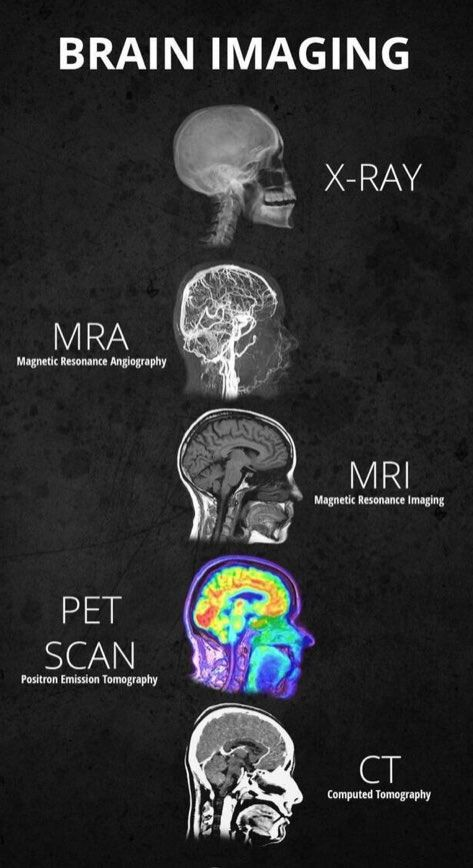
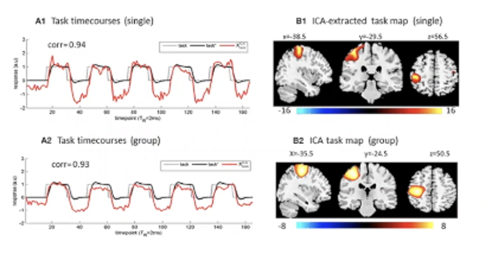
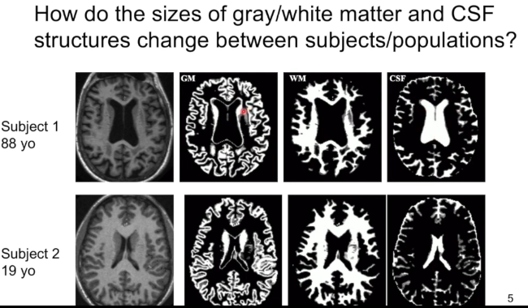
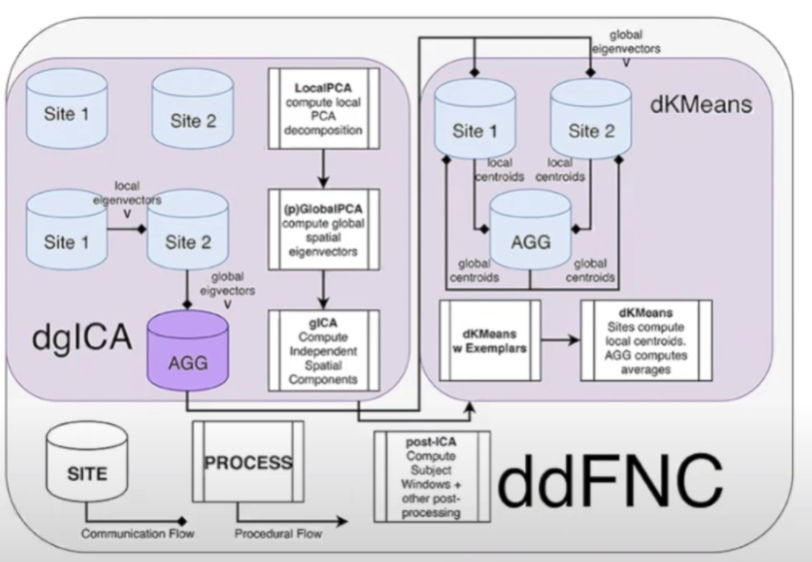
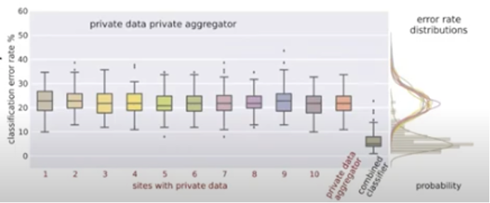

<!-- TODO(content): 12 unrecoverable figure(s) removed — dead Google-Docs/social paste artifacts (404 on live for years, no archive). Recreate if valuable. -->
<!-- TODO(a11y): 1 localized body image(s) have empty alt text -->

> Summary of Talk by Eric Verner, Associate Director of Innovation at Centre for Translation Research in Neuroimaging and Data Science.

**MOTIVATION BEHIND THE TALK**

This Talk focuses on developing, applying, and sharing advanced analytical approaches and neuroimaging tools that leverage advanced brain imaging and omics data with COINSTAC.

COINSTAC (Collaborative Informatics and Neuroimaging Suite Toolkit for Anonymous Computation) is a decentralised & differentially private framework that performs Machine learning & Signal processing of Neuroimages,  intending to translate Neuroimaging into Biomarkers, which help in treating or learning about brain health & disease.

It provides a platform to analyse data stored locally across multiple organisations without the need for pooling the data at any point during the analysis, enabling decentralisation.

It’s a Web-based standalone application that is written in JavaScript using electron which has a user-friendly interface that runs on Windows/Mac/Linux that is Opensource and free software. It can be processed inside a docker container.

**WHAT IS NEUROIMAGING?**

Neuroimaging is the discipline that deals with the Vivo depiction of anatomy and function of the central nervous system(Brain & spinal cord) in health and disease. Some common types of Neuroimaging that you may have heard of are  Xray, CAT Scans, MRA, MRI, PET Scans, FMRI, while some allow seeing the structure of the Brain and others allow the activity of the Brain.

<figure class="">

</figure>

**AND, WHY COINSTAC FOR NEUROIMAGING?**

The field of neuroimaging has embraced the need for sharing and collaboration. Data sharing mandates from public funding agencies and major journal publishers have spurred the development of data repositories and neuroinformatic consortia. However, efficient and effective data sharing still faces several hurdles. For example, open data sharing is on the rise but is not suitable for sensitive data that are not easily shared, such as genetics. Current approaches can be cumbersome (such as negotiating multiple data-sharing agreements). There are also significant data transfer, organisation, and computational challenges. Centralised repositories only partially address the issues. To overcome such challenges, a dynamic, decentralised platform for large scale analysis called COINSTAC is a proposed solution that provides the below advantages:

-   Enables analysis without sharing.
-   Collaboration with researchers around the world.
-   Neuroimaging pre-processing.
-   Advanced Statistical and machine learning analyses.
-   Differentially private computations.

**OK, LET’S UNDERSTAND A BIT ABOUT THE DATA !!**

The data is generated from the MRI(Magnetic Resonance imaging). MRI bounces radio waves off of water molecules of the brain, which allows to imaging the brain.

**STRUCTURAL MRI**

High detail static image of the brain. Useful for identifying which part of the brain is involved in mental disorders. For example, Schizophrenics have some parts of the brain smaller. Autism spectrum disorder has other parts of the brain abnormalities. The Grey matter represents the cell bodies and the white matter represents the strands between the neurons and CSF (cerebral spinal fluid is the grey & white matter).

**FUNCTIONAL MRI**

Functional MRI involves brain scanned, while a specific given task is asked to be performed. For example, Identifying the colour of the words rather not focusing on what the words say. It challenges the ability of the brain to work for this kind of task since we are so used to focus on the meaning of words and not the colours. The above image show time courses of stimulus(find the colour of the word) and model fitting using regression and the right side of the image shows the visual cortex of the brain that is lit up by reading the words.

**DIFFUSION MRI**

Diffusion MRI tracks the molecules in the brain, it gives you tractography. The paths between different areas of the brain. It is useful for identifying differences between people with mental problems and people who control them.

**KEY CHALLENGES IN DATA SHARING & HOW TO OVERCOME THEM!**

While sharing neuroimaging data either before or after a study’s completion is becoming more commonplace, key challenges are emerging and some are mentioned below:

1) Volume of data that needs to be processed.

In the most widely used computational model (centralised sharing), all shared data are downloaded and processed locally. This entails significant computational and storage requirements, which become barriers to access as data sets increase in size—many groups lack sufficient infrastructure for processing.

2) Policy restrictions on openly sharing the data that should take care of:

In the most widely used computational model (centralised sharing), all shared data.

-   IP/Confidentiality Issues
-   Fear of being scooped
-   Mis-use/Misinterpretation of data
-   Preserve Subject privacy
-   Lack of permission of the institution
-   Governmental or proprietary restrictions

When pooling data for sharing and analysis at a central site is not possible, one approach is to isolate data providers from each other by either locally performing a centrally coordinated analysis or relying on a trusted central computation entity. In both approaches, the data is decentralised as it is stored with their respective entities. Keeping the data in their original locations provides a level of control and privacy that is significantly higher than that open sharing. Such an approach also lowers the entry barrier for data providers[1](https://www.frontiersin.org/articles/10.3389/fnins.2016.00365/full#note1) (e.g., research or clinical sites). This approach can potentially allow storing and protecting large-scale data within a decentralised schema. Models such as ENIGMA take this approach, using manual coordination while  ([Thompson et al., 2014](https://www.frontiersin.org/articles/10.3389/fnins.2016.00365/full#B77), [2015](https://www.frontiersin.org/articles/10.3389/fnins.2016.00365/full#B76)) leaving the data at the site. The goal of this work is to automate access and computation to allow larger-scale analyses on locally managed data.

**COMPUTATIONS**

Computations used for neuroimaging can be local or decentralised and are deployed using a containerised model. COINSTAC simulator, a simulation environment for algorithm developers to build COINSTAC computations is also available. Below are a few lists of computations available which are followed by a brief description of each computation.

1.  Regression on Free surfer Volumes and Voxel-based Morphometry Maps
2.  Voxel-based Morphometry
3.  fMRI Pre-processing
4.  Decentralised Group ICA
5.  Decentralised Dynamic Functional Connectivity Pipeline
6.  Decentralised MANCOVA
7.  Decentralised t-SNE
8.  Differentially private support vector machine / Logistic regression

Computations in Progress:

1.  Decentralised Mixed Effects Regression
2.  Decentralised Neural networks
3.  Canonical Correlation Analysis
4.  Source-based Morphometry
5.  Logistic Regression
6.  Diffusion Tensor Imaging
7.  White Matter Hypersensitivity
8.  Brain Age
9.  Parallel ICA
10.  Genetics pipelines

**Regression on Free surfer Volumes and Voxel-based Morphometry Maps**

Free surfer volume is a program that neuro imagers use to segment the brain into different parts and then computes the volume of each part of the brain and this is useful for a regression model, where you are trying to model with certain co-variates (Such as age, gender, control Vs patient, total intracranial volume, particular gender who smokes,.. etc),  against the size of somebody’s amygdala or their frontal-parietal cortex.

**Voxel-based Morphometry**

Voxel-based morphometry is viewing the brain into different sectors(voxels) and finding the probability of each of several hundred or thousands of voxels being Gray matter(GM) or white matter(WM) or Cerebral Spinal Fluid(CSF) and few other tissue types. So it’s a good way to see how much Gray matter is in someone’s brain and its very useful as a pre-processing computation for neuroimaging. Below is the example of viewing GM/WM/CSF of subject1(88 years) & Subject2(19 years) old.

The remaining computations are mentioned in the above image.

**Decentralised dynamic functional network connectivity (ddFNC)**

It is an algorithm, synthesises a new, decentralised group independent component analysis algorithm (dgICA) with algorithms for decentralised _k_\-means clustering.

In the process, it combines several distinct and useful algorithms used primarily in neuroimaging analysis. The resulting multistep framework includes versions for each step of the standard dFNC pipeline, involving novel decentralise algorithms like GlobalPCA(Principal component analysis) and dgICA (Independent component analysis) as well as application of decentralised k-Means clustering to completely reproduce the full dFNC pipeline.

**Decentralised Group ICA**

Independent component analysis can be thought of as isolating independent signals of a specific part of the brain out of mixed signals from different parts of the brain given a specific task.

The Below Image shows the independent signals from different parts of the brain (Frontal lobe in Blue, Occipital lobe in yellow, etc).

Signals from each of these parts of the brain have their time course. When you can co-relate between each other to understand which areas of the brain are working together. For example, The Reading task needs language area and visual area of the brain both to be active at the same time.

If a Cross-Correlation matrix is created with rows and columns with signals represented from different domains of the brain. Then use a clustering algorithm to group the signals together which represent the physical states of the brain. We can observe that there is a high correlation between certain networks and a low correlation between the rest of them.

Just looking at the connectivity matrix it is hard to see the differences but the figure on the right side shows their low correlation between the healthy control and patients, while we see some statistically significant differences.

**Decentralised t-stochastic Neighbour embedding**

It is a way of visualising very large high-dimensional data and projected onto a 2D plane in a way that preserves the actual relationships in the data. Below shows the image representation of neuroimaging.

**Decentralised neural networks**

This computation is important in Medical data analysis. The below figure shows a comparison between centralised and decentralised. There is about 5% accuracy hit. When we compare to both individual sites the Decentralised algorithms show a big performance difference.

**Regression**

We have a central node on the left and right we have three sites which are research centers or just individual sites that own their data. Site1 is the consortium owner. Suppose, all the sites decide to analyse neuroimaging data to understand the volume of the brain against the age of the person and whether they are in control. Consortium owner chooses co-variates which are dependable variables. The model is sent by the consortium owner to the Central node and further sent to the individual sites. Then each site matches its data to those variables in the equation.

Each site computes the model on its data. Then the fitted model is back to the Central node.

The central site aggregates all the models and computes a global model is sent back to the individual sites.

Each site sees how will the global model fits their data. Hence, we have many regression equations based on each site data which can be further used in case there are new sites added to understand similar neuroimaging data.

**Differentially private support vector machine(DP-SVM)**

DP-SVM is used to train a classifier for specific site A’s using consortium while protecting the privacy of each member’s data. Final training may also be private data.

Local sites do private training using SVM on their local data. Use locally learned rules to get soft labels on-site A’s data. Site A uses private training using soft labels as features.

Each site uses objective perturbation which is a method of approximating empirical risk minimisation(ERM) which includes adding noise to the regularised ERM objective function before minimising to train a local classifier.

Each site does compute weights(W) and shares those weights with the Private SVM Aggregator which does its second level of training using those weights and helps in building a better model.

Applying the DP-SVM to schizophrenia diagnoses with a Restricted Boltzmann Machine (RBM)  was used on structural MRI(398 subjects: 198 cases/191 controls) for pre-processing the data. The RBM was able to compress the information to 50 features and those were used as inputs to the SVM classifier.

Below shows that the local sites performed poorly with an error rate of 20% to 25% as of compared private data aggregator with combined classifier got a significant reduction of an error rate of 5%.

> **ACKNOWLEDGEMENT**  
> Thank you Abhinav Ravi for taking time to review this blog.

**References**:

1\. [COINSTAC: A Privacy enabled model and prototype for leveraging and processing decentralised brain imaging data.](https://www.ncbi.nlm.nih.gov/pmc/articles/PMC4990563/)

2\. [Decentralised Analysis of Brain Imaging Data: Voxel-Based Morphometry and Dynamic Functional Network Connectivity](https://www.researchgate.net/publication/327243871_Decentralized_Analysis_of_Brain_Imaging_Data_Voxel-Based_Morphometry_and_Dynamic_Functional_Network_Connectivity)

3\. [Decentralised dynamic functional network connectivity: State analysis in collaborative settings](https://onlinelibrary.wiley.com/doi/full/10.1002/hbm.24986)

4\. [See without looking: Joint visualisation of sensitive multi-sites datasets](https://www.ijcai.org/proceedings/2017/372)

5\. [Cooperative learning: Decentralised data neural network](https://jhu.pure.elsevier.com/en/publications/cooperative-learning-decentralized-data-neural-network)

6\. [Differentially Private Empirical Risk Minimisation](https://jmlr.org/papers/volume12/chaudhuri11a/chaudhuri11a.pdf)

7\. [Sharing privacy-sensitive access to neuroimaging and genetics data: a review and preliminary validation](https://www.frontiersin.org/articles/10.3389/fninf.2014.00035/full)
