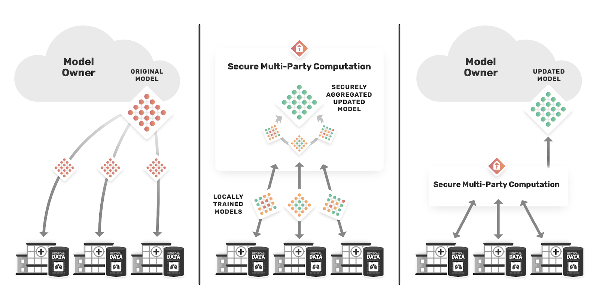
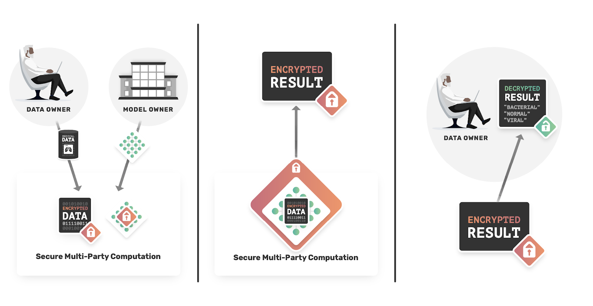

<!-- TODO(a11y): 2 localized body image(s) have empty alt text -->

**Speaker**: Dr.Georgios Kaisssis, MHBA

**Video Link**: [https://www.youtube.com/watch?v=F46lX5VIoas&t=21m50s](https://www.youtube.com/watch?v=F46lX5VIoas&t=21m50s)

### Motivation:

AI in medical imaging has approached clinical applicability and has helped improve diagnosis and early detection of disease. This development can help us counter the lack of radiologists in disadvantaged areas. However, the current methodology of central data collection and training of models is a key problem. Even with the proper consent of patients, the data collection process has huge problems in facets of accumulation, storage, and transmission. This impinges on the patient’s right to be informed about their data usage and storage. In disadvantaged communities, these rights may not be informed to the patient. This is where privacy-preserving machine learning comes into the picture. It bridges the gap between deriving insights from data and protecting the data of the individuals. Federated learning involves training the data to remain on-premises which allows the hospital to retain control over it and enforce its governance. Encrypted computation services, which are an integral part, allow us to protect both the data and algorithm and provide end-to-end services. It also allows for single-use accountability; that is the notion that the data is used only for a singular purpose.

### PriMIA:

Privacy-preserving machine learning \[1\] has remained in the proof of concept stage for some time now. A new tool called PriMIA has been introduced as part of the OpenMined libraries. PriMIA stands for Private Medical Image Analysis. PriMIA is a library for doing federated learning and encrypted inference on medical imaging data.

The main goal of the library is to provide securely aggregated federated learning in a Multi-Institutional setting and provide training algorithms in an encrypted inference scenario.  Some features that ensure that the goals are achieved are

1.  Cloud-ready
2.  Integrated with pysyft and pygrid libraries
3.  State of the art federated learning algorithms
4.  Also includes medical imaging specific innovations and tricks

The library’s main design goal is to enable a moderate tech-savvy user to perform not more than 3 steps to achieve the task. This varies depending on the roles.

##### Data Owner

-   Clone the repository with a git clone call
-   Put data in folders,
-   Run a single CLI,

Support is offered for DICOM and other important imaging formats, even a mixture such as DICOM and Jpeg formats are supported.

##### Data Scientist

-   Training the model:
-   Have a single configuration file
-   Run the train.py script

There are pre-existing scripts for hyperparameter configuration available over the entire federation.

<figure class="">

</figure>

### Architecture

As for the architecture: A hub and spoke configuration is used which is preferred over serial processing topologies from previous work on such architectures in the medical imaging community. This architecture also supports synchronous training. For example, when nodes drop out in synchronous training. Secure aggregation is done by secure multi-party computation using the secret-sharing function. There were tests done to break the secure aggregation and they generally failed, which shows robust secure aggregation.

### Encrypted Inference

To perform encrypted inference, computational nodes such as a crypto provider and the model server have to be set up, then the data owner initiates a request and receives the result locally. Most of the work is driven from the client-side, including the output of encrypted JSON files. This encryption happens under a zero-knowledge end-to-end premise.

<figure class="">

</figure>

### Case Study:

To show the application of the library, there is a case study attached. This case study contains data of chest X-rays for detecting pediatric pneumonia. This is an example of a remote diagnosis as a service model. There are 5163 training images and 2 external validation datasets.

The main goal is to train a federated remote diagnostic model. The recently introduced confidential computing node has been used for the training. A total of 3 computing nodes have been used for the case study training. The whole system relies on memory encryption of computing nodes and computer wide trusted execution.  

To assess the performance of the trained model it has been compared with a locally trained neural network as well as with two human experts. The results of the study show that the Federated trained model performed better than the human experts on both datasets and is comparable to the results of the locally trained model.

Some of the key challenges which are quite common among the medical community are

-   Clinical data is heterogeneous in nature and must be carefully curated.
-   It is quite challenging to assess individual data point contributions to the model.
-   There can be a lot of I/O operations which can be solved by using smaller algorithms and efficient data compression schemes.
-   Encrypted computation is very expensive and cannot be carried out with the required precision.

The library is soon to be released in the OpenMined GitHub repository and a current version can be found at [**https://github.com/gkaissis/PriMIA**](https://github.com/gkaissis/PriMIA). The website for the library can be found in **[https://g-k.ai/PriMIA/](https://g-k.ai/PriMIA/)** .

References:\[1\] : [https://www.nature.com/articles/s42256-020-0186-1](https://www.nature.com/articles/s42256-020-0186-1)
