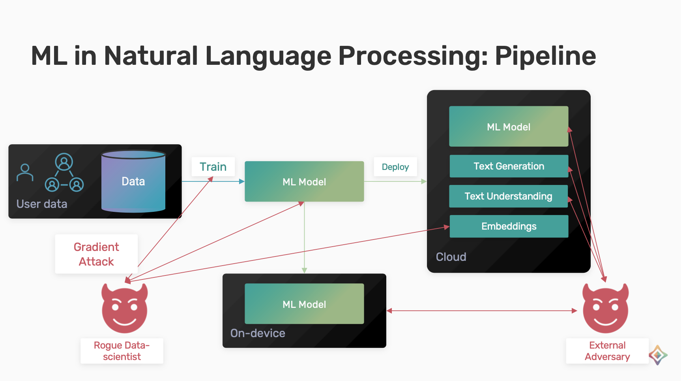
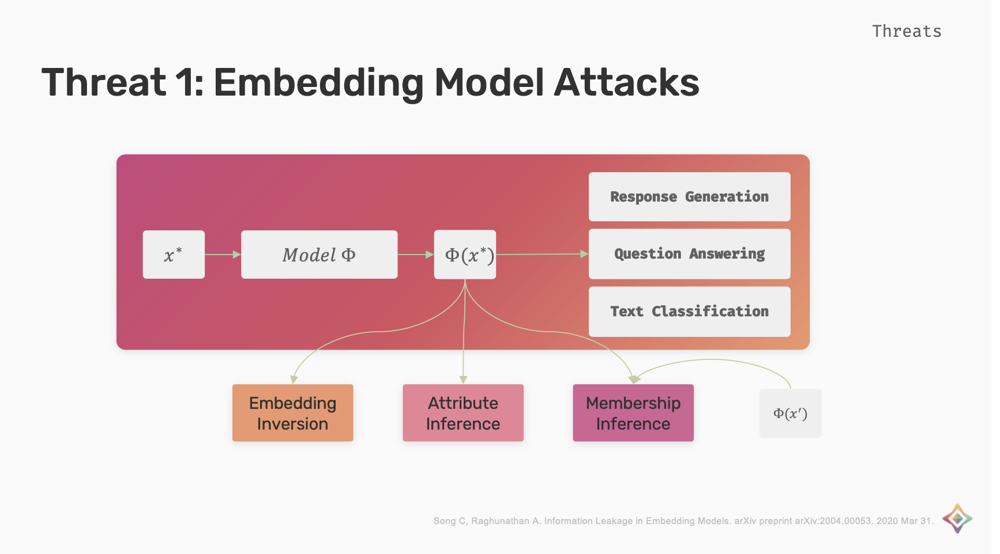
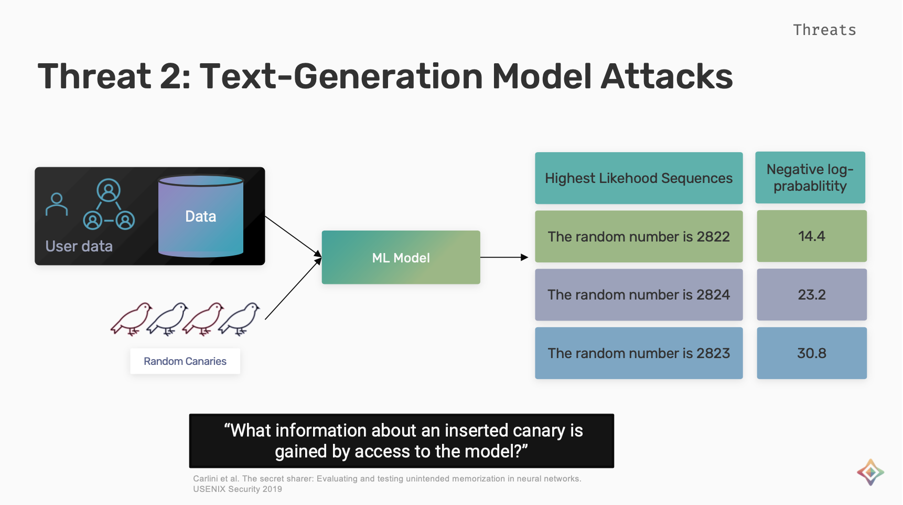
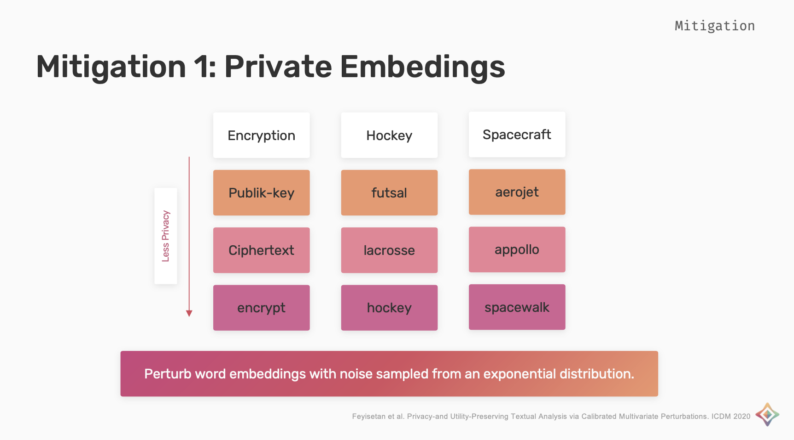
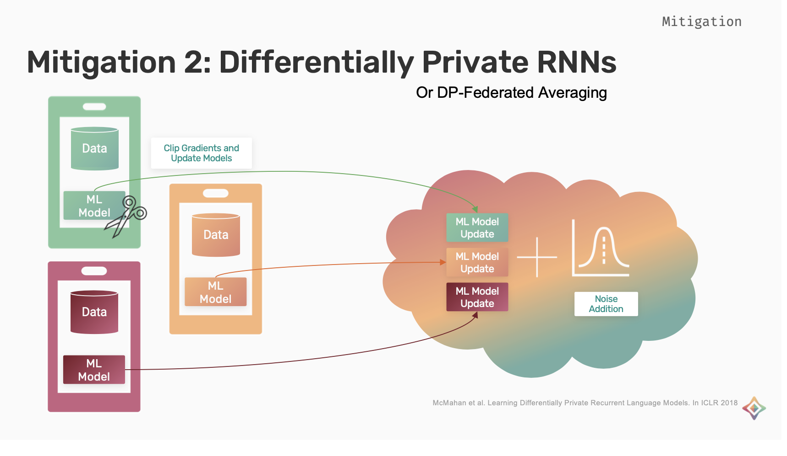

<!-- TODO(a11y): 5 localized body image(s) have empty alt text -->

**Summary**: This blog post summarizes Fatemeh’s Talk on privacy preserving NLP, showing the threats and mitigations with vulnerabilities in the NLP pipeline.

The main objective of Natural Language Processing (NLP) is to read, decipher, understand and make sense of the human language. The general pipeline is to collect data and train a model and deploy it for various applications such as text generation, text understanding and embeddings.

## Vulnerabilities in NLP Pipeline

Assuming we have a rogue Data Scientist with access to training process. They could make gradient attack and try to infer personal information or attack the trained model or the embeddings.

External Threats include querying the model to extract private information about the data contributors.

<figure class="">

</figure>

### Embedding Model Attacks

Embeddings are a type of real valued vector representations that allow words with similar meanings to have similar representations. The embeddings can be used for response generation, question answering and text classification.

_Embedding Inversion_ attack is when the attacker tries to invert the embedding and find the actual sequence access. _Attribute Inference_ is when attacker tries to infer attributes of x\*. _Membership Inference_ attack is when the attacker tries to infer if x\* or its context x’ is used for the training of the embedding model.

<figure class="">

</figure>

### Text-Generation model Attacks

To measure the unintended memorization in text-generation models. Carlin et. al proposed the exposure metric which answers the question of what information can be gained about an inserted canary with the access to the model. To measure this metric, random canaries (strings of random tokens) are inserted in the training data of the model. The probability that is assigned to different sequences and different possible canaries is measured. This probability is used to rank different canaries and the exposure for each canary is based on the ranking of different possible canaries.

The higher the exposure the easier it is to extract the secret for the secret canary.

<figure class="">

</figure>

## Mitigations

As we have seen the vulnerabilities, let’s look at what are the mitigations for the above threats to privacy in NLP.

### Private Embeddings

The word embeddings are perturbed with noise sampled from an exponential distribution, this distribution is calibrated such that the perturbed representations are more likely to be words with similar meanings.

Considering the examples shown in the below image, the perturbed embeddings for words encryption, hockey and spacecraft to have a high privacy is publik-key, futsal and aerojet and the lowest privacy would be the words itself.

The indistinguishability is used to make sure that the perturbations within the context radius we want them to be and not map to random unrelated words.

<figure class="">

</figure>

### ****Differentially**** Private RNNs

This is a mixture of federated learning and differentially private deep learning. Each user trains a separate model on their own device with their own data. During the training, the gradients of the individual models are clipped and then the updates are applied. These updates are aggregated and are sent to the cloud where noise is added to it and the final update is generated

In this scheme, since each user is training their own model and updates are clipped  for each user. User level privacy is achieved as opposed to private work DP-SGD, which targeted example level privacy

In this scheme, since each user is training their own model and updates are clipped  for each user. User level privacy is acheived as opposed to private work DP-SGD, which targeted example level privacy

<figure class="">

</figure>

Other mitigations which mainly target sensor data privacy but can be extended and used for NLP tasks as well due to the sequential nature of the data.

However, this area is heavily under explored and there is definitely a lot of room for improvement both in the sense of the attacks that exist and the mitigations.

**Watch the full talk on YouTube.**

<figure class=""><iframe width="480" height="270" src="https://www.youtube.com/embed/F46lX5VIoas?start=6708&amp;feature=oembed" frameborder="0" allow="accelerometer; autoplay; clipboard-write; encrypted-media; gyroscope; picture-in-picture" allowfullscreen=""></iframe><figcaption>Openmined Privacy Conference Day-1 Part-2</figcaption></figure>

## Private NLP Paper List

### Mitigations

-   Leveraging Hierarchical Representations for Preserving Privacy and Utility in Text: [https://ieeexplore.ieee.org/stamp/stamp.jsp?arnumber=8970912&casa\_token=q0ZUEKNqkYQAAAAA:UTYZ22zxid\_sxfQfLgIKEYb8WAaZqTCOHUSVtvbpDvy6r4JhGZwD4JZZT\_eccQM1YoJ9c9vhMg&tag=1](https://ieeexplore.ieee.org/stamp/stamp.jsp?arnumber=8970912&casa_token=q0ZUEKNqkYQAAAAA:UTYZ22zxid_sxfQfLgIKEYb8WAaZqTCOHUSVtvbpDvy6r4JhGZwD4JZZT_eccQM1YoJ9c9vhMg&tag=1)
-   Privacy- and Utility-Preserving Textual Analysis via Calibrated Multivariate Perturbations: [https://dl.acm.org/doi/pdf/10.1145/3336191.3371856?casa\_token=tmLV7Y4uv4UAAAAA:TyLytDqFal7p7JnBUBP\_-Oxyiy8M9D53PHnFbwpQ4um-UUZ5Cb3FvzPVCRx7MnbUeH34RM0ahzW2](https://dl.acm.org/doi/pdf/10.1145/3336191.3371856?casa_token=tmLV7Y4uv4UAAAAA:TyLytDqFal7p7JnBUBP_-Oxyiy8M9D53PHnFbwpQ4um-UUZ5Cb3FvzPVCRx7MnbUeH34RM0ahzW2)
-   Privacy-preserving Neural Representations of Text: [https://arxiv.org/pdf/1808.09408.pdf](https://arxiv.org/pdf/1808.09408.pdf)
-   Differentially Private Recurrent Language Models: [https://arxiv.org/abs/1710.06963](https://arxiv.org/abs/1710.06963)
-   Olympus: Sensor Privacy through Utility Aware Obfuscation: [https://users.cs.duke.edu/~ashwin/pubs/OLYMPUS-PoPETS2019-final.pdf](https://users.cs.duke.edu/~ashwin/pubs/OLYMPUS-PoPETS2019-final.pdf)
-   Differentially Private Set Union: [https://arxiv.org/abs/2002.09745](https://arxiv.org/abs/2002.09745)

### Attacks

-   Information Leakage in Embedding Models: [https://arxiv.org/pdf/2004.00053.pdf](https://arxiv.org/pdf/2004.00053.pdf)
-   The Secret Sharer: Evaluating and Testing Unintended Memorization in Neural Networks: [https://www.usenix.org/conference/usenixsecurity19/presentation/carlini](https://www.usenix.org/conference/usenixsecurity19/presentation/carlini)
-   LOGAN: Membership Inference Attacks Against Generative Models
-   Auditing Data Provenance in Text-Generation Models: [https://arxiv.org/pdf/1811.00513.pdf](https://arxiv.org/pdf/1811.00513.pdf)
-   THIEVES ON SESAME STREET! MODEL EXTRACTION OF BERT-BASED APIS: [https://arxiv.org/pdf/1910.12366.pdf](https://arxiv.org/pdf/1910.12366.pdf)
-   Analyzing Information Leakage of Updates to Natural Language Models: [https://arxiv.org/pdf/1912.07942.pdf](https://arxiv.org/pdf/1912.07942.pdf)
-   How To Backdoor Federated Learning: [http://proceedings.mlr.press/v108/bagdasaryan20a/bagdasaryan20a.pdf](http://proceedings.mlr.press/v108/bagdasaryan20a/bagdasaryan20a.pdf)
