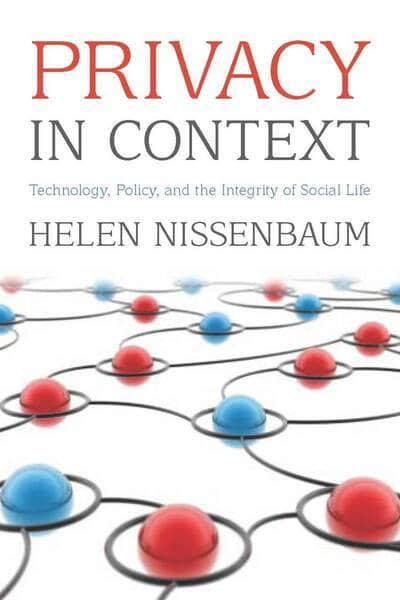
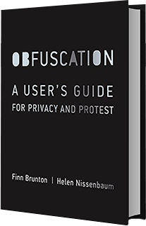

<!-- TODO(a11y): 2 localized body image(s) have empty alt text -->

Dr. Helen Nissenbaum is one of the world’s most influential philosophers in the privacy space. She is the author of “[_Privacy in Context: Technology, Policy, and the Integrity of Social Life_](https://books.google.com/books?id=_NN1uGn1Jd8C) ”(Helen Nissenbaum, 2009) in which she explains her theory of **Contextual Integrity** which frames functional relationships between: the information we share, the expected relationship with that information, and those we share it with. For example, sharing our medical history with a doctor has a fiduciary purpose – there is some expected benefit for doing so. This is not a reciprocal sharing of data – we don’t expect to have the doctor share their medical situation with us. This is a **one way flow of information for a specific purpose intended to benefit the individual**.

<figure class="">

</figure>

Helen approaches privacy from a **_computer ethics_** _**perspective**_. She looks from the _ground up_ to contextual integrity instead of top down from a broad definition of privacy. Considering all the different social platforms and communication media technologies today, we can see how they now: monitor, track, capture, hold onto, and analyze our data. When people complain, they are concerned about their privacy being violated. What is at the root of their concerns? What is stirring people’s anxieties? Helen has aggregated observations that **society was already detecting itself**. Here we see societal emotions are peaked while at the same time, there are also costs and risks in locking down and hoarding data. **_Privacy needs to be a concept where we can stick a stake in the ground to defend and protect where it carries moral weight_.**

### **Privacy is about the appropriate flow of information.**

Google maps street view photos can capture individuals on camera either in a bar, or on a beach. Those are public places so you have no claim to privacy. Does that seem reasonable? There is some incompatibility here. Helen asks “Do we have privacy in public?” and [wrote an article](https://philpapers.org/rec/NISTAA) arguing that well, yes we do! In fact, there is a _**significant difference**_ between walking by and others seeing you in public versus capturing a photograph of you in public.

**What characterizes appropriate and inappropriate flow?**

Different information flow rules or norms hold in different domains. This provides data protection and also because _**these rules are productive**_ for those domains.

Taking the Hippocratic oath, physicians vow not to speak about patients within their own personal spaces **because** this is the only way patients will be _**truthful about their symptoms**_ and in turn this _**influences the success of treatment**_ **_and how physicians go about their work_**. The outcome results in far better medical care for the patient and a more accurate treatment methodology for others. This is a positive, productive norm that enables truth to surface for the benefit of all patients.

It is a federal crime to interfere with the postal service. In the USA, Benjamin Franklin was very clear that the postal system had to have very strong rules in order to guarantee confidentiality. If people do not have confidence in the postal system, the system fails and people don’t use it. Protecting the integrity of the postal service protects this crucial social system.

**How is contextual integrity to be implemented?**

Do we simply hard code the appropriate flows through regulation? Build an encryption tool? **There seems to be a need for a broader incentive structure to include more influencers in the community all acting proactively to out-compete.** What are the roles for individuals? Regulators? VCs? Philanthropies?

Let’s think of **domains** in terms of _**ontologies**_. Ontologies refer to people acting within certain roles or capacities, and the nature of information types. How do we describe that information flow with enough information that we can think about it and discuss it?

You need to be able to describe the information flow in terms of:

1.  The ontology of the sender.
2.  The ontology of the receiver.
3.  The ontology of the data subject.
4.  The type and nature of the information.
5.  The **transmission principle** which refers to the constraints under which the information flows.

To express a rule of information flow **you will need to specify each of these five parameters**. Such parameters **can** be formalized in computer science. There are still a lot of tough questions to answer but _this is a theory that could hop over to computational systems._

Contextual integrity says _**there is no information where there isn’t at least some set of rules**_ _**that constrain the information flow**_.

Consider an App developer working on an android OS who then creates three levels of permission:

-   Resources (camera, microphone, etc).
-   Sensitive information (collected from user at installation).
-   Dangerous information (triggers a pop up for user permission).

Then the developer abdicates any further responsibility around privacy as these are the current policies. **That is antithetical to integrity. _We need systems that map onto the appropriate ontologies._** We are currently operating under tools that are built on an old definition of privacy.

**_The current privacy policy of consent is not meaningfully doing anything_**.  The majority of people do not understand privacy policy so they don’t know what they are consenting to. The _**complexity of the world**_ **_excuse_** and that _**data flows are impossible to describe**_ have fallen flat. There is no thought given to whether a data flow is **good for the user** and **good for society.** There is a real need for creative, philosophical research thinking around productive data flows _**within various social domains**_. In building a system, you may not have the insight on how the information should flow.  However, your system needs to be expressive enough so that you can at least identify these five parameters so that you can **_set them at the ground level to something that makes sense for your domain_**.

## Obfuscation

We are in a power imbalanced environment. Every single web search you conduct is surveilled, saved and **you are profiled**. Search company regulators are not listening. You are a spec in a huge system that is provided by someone **whose interests are in direct opposition to yours**. What can you do? You cannot hide, you can only obfuscate in protest. We need to come to the table and agree on the values this data will serve.

[AdNauseam](https://adnauseam.io/) is free and works over top of an open source ad blocker. It goes onto a page, identifies all the ads on that page and clicks them all. What happens to that information? Who knows? **It blocks all the ads and clicks all the ads**. You can visualize the ads in the ad vault so you can see how you’re profiled and internet profiles are different for every person. AdNauseam is banned on the chrome store so it is not advertised but you can still install. Firefox has labelled it as a great add on! Add [TrackMeNot](https://addons.mozilla.org/en-US/firefox/addon/trackmenot/) as well and your pages will load faster.

<figure class="">

</figure>

## Source

[PriCon2020 – Day 1 Livestream](https://www.youtube.com/watch?v=oM_cgRkN6MQ&t=14691s) with Helen Nissenbaum beginning at 1:59:48

### Further reading

“[_Privacy in Context: Technology, Policy, and the Integrity of Social Life_](https://books.google.com/books?id=_NN1uGn1Jd8C) ”(Helen Nissenbaum, 2009)

“[_Obfuscation: A User’s Guide for Privacy and Protest_](https://books.google.ca/books?id=pDeFCgAAQBAJ&redir_esc=y) ” (Brunton & Nissenbaum, 2015)

### Further listening

Good Code Podcast:  Helen Nissenbaum on Post-Consent Privacy — March 2019

Inclusionism: Show #33 Inclusionism with Philosopher Helen Nissenbaum, author of Obfuscation — Dec 2019
