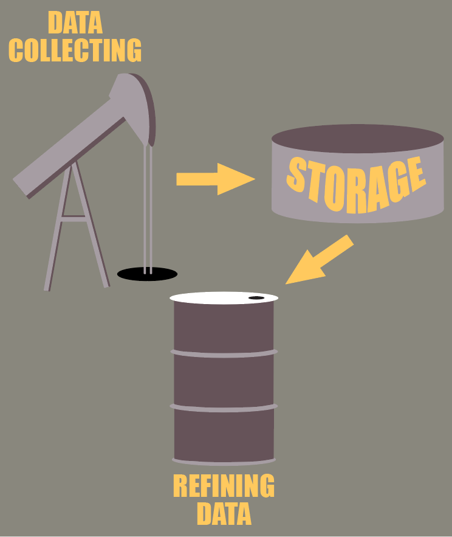
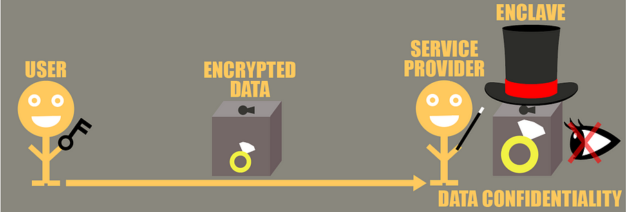

<!-- TODO(a11y): 4 localized body image(s) have empty alt text -->

<figure class="">

<figcaption>Image by <a href="https://pixabay.com/users/kranich17-11197573/?utm_source=link-attribution&amp;utm_medium=referral&amp;utm_campaign=image&amp;utm_content=4103102" data-href="https://pixabay.com/users/kranich17-11197573/?utm_source=link-attribution&amp;utm_medium=referral&amp;utm_campaign=image&amp;utm_content=4103102" class="markup--anchor markup--figure-anchor" rel="noopener" target="_blank">Kranich17</a> from&nbsp;<a href="https://pixabay.com/?utm_source=link-attribution&amp;utm_medium=referral&amp;utm_campaign=image&amp;utm_content=4103102" data-href="https://pixabay.com/?utm_source=link-attribution&amp;utm_medium=referral&amp;utm_campaign=image&amp;utm_content=4103102" class="markup--anchor markup--figure-anchor" rel="noopener" target="_blank">Pixabay</a></figcaption></figure>

**Confidential computing explained:**

Part 1 : introduction

[Part 2 : attestation](https://blog.openmined.org/confidential-computing-explained-part-2-attestation/)

**I — Introduction**

<figure class="">

<figcaption>Data life cycle (by <a href="https://www.linkedin.com/in/sterenn-corre-2302a5205/" data-href="https://www.linkedin.com/in/sterenn-corre-2302a5205/" class="markup--anchor markup--figure-anchor" rel="noopener" target="_blank">Sterenn&nbsp;CORRE</a>)</figcaption></figure>

While many people call data the “21st century oil”, we are still a long way from reaching a state where we will have exploited data to its full potential, and made society advance as a whole.

As expected by most forecasters, we have witnessed an explosion of data that is collected from public to private organisms, from IoT to social behavior on the internet, and all this data is improving our lives better in various domains such as :

1.  Health : IoT paves the way for a better health through a much more precise and affordable monitoring while allowing accurate potential disease prediction.
2.  Finance : the Payment Service Directive makes it possible for newcomers to leverage people’s banking information to provide innovative services and lower the costs in this sector.
3.  Personalized services such as tailor-made experiences for sport, shopping, leisures, etc.

However just by looking at these examples we see that all these innovations rely on accessing people’s private and highly confidential data. This is a real cause of concern today as we see with the various privacy breaches such as medical data leak, spamming campaigns based on leaked information such as email, or even impersonation for frauds.

So, we see with these frightening examples that while we are on a verge of a great advancement with data technologies, it also opens new risks that could have profound impacts on our lives. So where are we on this ?

**II — Data**

To go further with the oil analogy, we might say that the oil drills capacities are here: we know today how to collect data as proven by the explosion of data available. Then we also know how to make secure pipelines that enable the confidential data to be moved and stored in “data terminals”. However, the tricky part is the refining of the data. We know that oil is a precious resource but it is often raw and needs to be processed to truly extract its value. The same can be said for data, where we often need to clean it, cross it, analyze it and so on to fully get meaningful insight.

However, this refining process often involves other parties for several reasons : the data collecting party does not necessarily have the expertise to extract value from the data, nor have the time, the resources, or even complementary data that could be combined with the original data.

Therefore for all these reasons data value extraction process is often externalized to third parties but this where the risks begin. Even if we are able to securely store the data in our facilities and send data with best security standards, once the third party gets access to the data we will never know what it truly does on the data and we have no physical means to prevent several things that could happen:

1.  It can sell your data on the darknet
2.  It can use it for other purposes, like train some model on it and never tell you a word
3.  It can get compromised and have your data leaked

Thus, while we saw the opportunities that this new oil can create, there are still many issues to solve before tackling the use cases we mentioned at the beginning.

**III — Confidential Computing**

Now that we saw the opportunities of data exploitation and the issues that come with it, what can we do ? Well, there are several techniques that could allow several parties to collaborate on confidential data without having to reveal their data in clear. My previous article on [Homomorphic Encryption](https://towardsdatascience.com/homomorphic-encryption-intro-part-1-overview-and-use-cases-a601adcff06c), briefly presented the three main solutions currently :

1.  Homomorphic encryption
2.  Secure multi-party computation
3.  Confidential computing

Throughout this series we will focus on the Confidential Computing (CC) which is based on the use of Intel SGX. To better understand how it works, let us use a metaphor with a ring.

Imagine you have a treasured asset, let us say the gold ring of your grand-dad, which even has personal scriptures of your family. You really love it, but you realize that it should be slightly expanded to fit your finger. There is a jeweller in town that could do it for you as he is an expert.

As your ring is very precious, you want to safely send it to the jeweller, so you put your ring inside a locked box with a key that only you and the jeweller have. You send it to the jeweller who will be able to open the box and work on it. However you need to trust the jeweller now as he will necessarily access your precious ring to work on it. So if you really need the jeweller to work on your ring, you can only trust him to do what he says he would with your ring, and hope he does nothing else with it.

The ring here represents your data, the box an encryption mechanism, and the jeweler is a third party service provider.

<figure class="">

<figcaption>Usual data analysis without data in use protection (by <a href="https://www.linkedin.com/in/sterenn-corre-2302a5205/" data-href="https://www.linkedin.com/in/sterenn-corre-2302a5205/" class="markup--anchor markup--figure-anchor" rel="noopener" target="_blank">Sterenn&nbsp;CORRE</a>)</figcaption></figure>

Today most of the time when you want to benefit from someone’s service you often have to send your data to them, and even though the communication is secure, at the end of the day the service provider will have your data in clear and can do anything it wants with it. While there are contractual clauses around it, you never know what they will actually do, and they could even get hacked.

Now how does Confidential Computing help solve this issue ? Let’s come back to the ring and imagine now that there is a new actor in town, a magician specialized in ring handling with a magic hat.

How is this process different ? Well you will still have to send him your ring locked in a box, but this time with a key that only **you have**. The magician will receive this box but will have no way of knowing what is inside. Instead of opening it himself and working over the ring, he simply put a magic hat on the box. And then the magic happens ! If you have agreed to let the magic hat be used on your box, it will open the box inside the hat, expand your ring, put the expanded ring back into the box and lock it.

All this happens while the magician is not able to peek into the hat to see what your ring looks like. He is also not able to lift the hat during the process because magic will seal it. It will only be liftable once the hat has finished its treatment but then the ring will be put back into the box, so it will be safe. At this moment, the magician will simply lift the hat and send the box containing the expanded ring to you.

At no time the magician will be able to see what your ring looks like, so your secret is kept safe, while at the same time the magician has been able to provide you a great service ! If the magician sells the ring to your cousin or gets robbed, the malicious acquiring third-party will only acquire a locked box (impossible to open).

<figure class="">

<figcaption>Secure data processing with enclaves (by <a href="https://www.linkedin.com/in/sterenn-corre-2302a5205/" data-href="https://www.linkedin.com/in/sterenn-corre-2302a5205/" class="markup--anchor markup--figure-anchor" rel="noopener" target="_blank">Sterenn&nbsp;CORRE</a>)</figcaption></figure>

In the end, Confidential Computing with Intel SGX works the same way. Intel processors with SGX allow you to create what we call enclaves, which are the magic hats. The special property they have is that the service provider that wants to analyze the data on your behalf will not be able to know what happens inside the enclave, as the memory is encrypted and you cannot have a look at what is happening inside. Using a secure channel between you and the enclave, you will be able to send your sensitive encrypted data to the enclave with a key only you and the enclave know, and the service provider will never be able to know what data it fed to the enclave as it is encrypted with a key it does not have access to.

There is one important point that we have not covered : how does the enclave / magic hat know what to do with the input they are given ? Well it is simply because both are simply code : if we know what the input looks like in advance, we just have to write an algorithm/magic spell that will take care of it, and the enclave / magic hat will now follow the algorithm and know what to do on the data/the locked box content, without requiring external help.

We will come back to this, but this means that it is really important we know as much as possible what the data we will handle looks like to make this process work. There are ways to have a more interactive process but it will be harder to preserve the same levels of confidentiality.

**Conclusion**

In the end, enclaves are really promising as they allow service providers to handle confidential data without having to see the data in clear. Even more interesting, the cloud providers would also not see the data that is handled if the enclave was to be managed on the cloud. This makes the enclave technology a key asset to address the ever growing challenge of deploying confidential applications in the cloud.

We can imagine that enclaves could be applied in the scenarios we mentioned at the beginning, like analyzing your personal health data, while never having to let anyone access your data in clear.

We hope that you enjoyed reading this article. We will see in the next one, one important principle : remote attestation which is the glue that links everything together. Then we will get our hands dirty and start coding applications using enclaves, so stay tuned!
