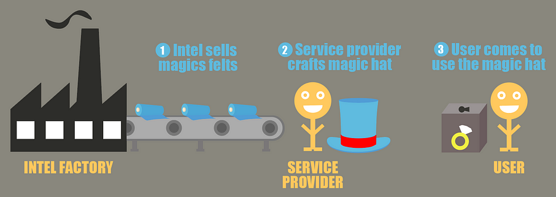
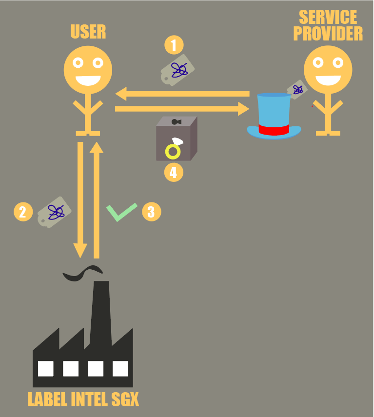

<!-- TODO(a11y): 6 localized body image(s) have empty alt text -->

<figure class="">

<figcaption>Image by <a href="https://pixabay.com/users/darkmoon_art-1664300/?utm_source=link-attribution&amp;utm_medium=referral&amp;utm_campaign=image&amp;utm_content=2098011" data-href="https://pixabay.com/users/darkmoon_art-1664300/?utm_source=link-attribution&amp;utm_medium=referral&amp;utm_campaign=image&amp;utm_content=2098011" class="markup--anchor markup--figure-anchor" rel="noopener" target="_blank">Darkmoon_Art</a> from&nbsp;<a href="https://pixabay.com/?utm_source=link-attribution&amp;utm_medium=referral&amp;utm_campaign=image&amp;utm_content=2098011" data-href="https://pixabay.com/?utm_source=link-attribution&amp;utm_medium=referral&amp;utm_campaign=image&amp;utm_content=2098011" class="markup--anchor markup--figure-anchor" rel="noopener" target="_blank">Pixabay</a></figcaption></figure>

**Confidential computing explained:**

[Part 1 : introduction](https://blog.openmined.org/confidential-computing-explained-part-1-introduction/)

Part 2 : attestation

**I — Introduction**

We saw in the previous article why we need techniques such as confidential computing to secure sensitive workloads, and how different it is from regular methods.

<figure class="">

<figcaption>Secure data processing with enclaves (by <a href="https://www.linkedin.com/in/sterenn-corre-2302a5205/" data-href="https://www.linkedin.com/in/sterenn-corre-2302a5205/" class="markup--anchor markup--figure-anchor" rel="noopener nofollow noopener noopener" target="_blank">Sterenn&nbsp;CORRE</a>)</figcaption></figure>

The above scheme used in the last article sums it up :

-   The user encrypts their data using a key only they have access to
-   They send the encrypted data to the service provider
-   The service provider then uses an enclave on the data in a way that prevents the service provider to see the data in clear
-   Finally the transformed data is encrypted using another key, only available to the user, and the encrypted result is sent back to the client

This scenario seems relatively simple, but many things happen behind the scenes to make it possible.

Especially there are hardware features allowing service providers to launch enclaves, load it with code but protect the enclave contents from being read by anyone external to the enclave. We will not cover this feature too much for now as we will see it in the technical articles. All you need to remember is that enclaves are like the magic hats, it allows someone to manipulate someone else’s data without being able to see what the data is.

Instead, we will cover here one fundamental property of Intel SGX enclaves that make this solution extremely interesting : code integrity with attestation.

**II — The problem**

Once we assume that only an enclave can handle sensitive data, using a secure communication channel directly between the enclave and the user, and the fact that the service provider has no way to know what data is sent to the enclave, we still have one question : how can one be convinced that the right code is loaded in the enclave, and that this code will not be malicious?

Indeed, we know that only the enclave code will be applied to the data, and that the service provider will not be able to know what is happening inside. But what if the enclave code contains a backdoor to allow the service provider to retrieve information from its users? Even worse, what proof do I have that the service provider actually uses a genuine enclave to handle my data?

If we continue with the magic hat analogy, the two questions we have are :

-   What proof do I have that the magic hat that the magician shows me, is indeed a magic hat, and not a regular hat that could leak all my belongings?
-   Supposing that the hat is indeed a magic hat, what proof do I have that this magic hat is not malicious and secretly leaks things to the service provider?

<figure class="">

<figcaption>Different types of&nbsp;hats</figcaption></figure>

To answer these two questions, Intel provides a very interesting mechanism called **attestation.** The idea of attestation is to show evidence to someone, external to the platform where the enclave is hosted, that this person is talking to a genuine enclave with the right code loaded inside.

**III — Attestation**

Let us come back to the analogy with the ring and the magic hat. The magician wants to open a business to handle people’s rings with magic hats so that her clients never have to send their rings directly, but still benefit from her expertise. To do so, she will handle the rings in magic hats that are ready to be used on the sealed boxes containing the ring, but how does she actually create such magic hats ?

Well, suppose there is a very famous felt manufacturer in your town, Intel Magic Felt, that sells felt to magicians who want to craft magic hats, and only hats made from their magic felt can be considered a magic hat. Felts are sold in packs, and each pack has a special and unique component added, which is known only to Intel and makes each felt pack unique.

<figure class="">

<figcaption>From the factory to the&nbsp;client</figcaption></figure>

Magicians will then buy magic felt packs, and specially design their magic hats to answer their clients’ needs with a specific magic hat. At the end of the fabrication, the magic hat is appended a small ticket, which attests the materials used, and what the hat does exactly once it is put on objects. Because magic felt from Intel Magic Felt was used, this label is signed with special properties that only Intel Magic Felt can bestow. This means other people than Intel Magic Felt will not be able to reproduce labels that look like ones from genuine Intel. This is possible thanks to the components Intel added to each felt pack.

Therefore, when someone wants to know if they should trust a magic hat, they simply need to ask Intel, and Intel will tell them:

-   Whether or not the hat they are shown indeed comes with the protection provided by hats made with Intel magic felt
-   What the hat will do exactly, as hats made with magic felt will have an unforgeable and unique label saying what the hat will do. Each hat is uniquely identifiable and will have an exact purpose

<figure class="">

<figcaption>Each magic hat has an unique purpose and unique&nbsp;label</figcaption></figure>

For a service provider to convince the user that the hat is indeed magical before precious secrets are sent, the following process happens:

-   1 : the service provider gives the label of the hat they will use on the user’s belongings
-   2 : the user takes the label attached to the hat and sends it to Intel
-   3 : Intel replies by saying whether or not the hat the label is attached to is indeed magical. Because Intel has a list of all felt packs it sold, Intel will be able to know whether or not the label they are shown indeed comes from one of their factories. Moreover, the label on the hat contains information about what the hat does, and this cannot be forged as they used magic felt
-   4 : the user can then send their belongings securely to the service provider once they know that they indeed deal with a magic hat doing what exactly what they want

<figure class="">

<figcaption>Attestation workflow</figcaption></figure>

If the magician tries to trick their clients by asking them to send them their precious belongings to a hat that is not magical, or a malicious magic hat, we will know right away during the attestation, before anything is given to the magician.

As you would guess, the same process is similar with Intel SGX: in addition to the security feature securing enclaves, tamper-proof secrets are written on the hardware.

Once code is loaded to the enclave, a report can be generated, containing a hash of the code. This report is signed by a key derived by the hardware secrets and negotiated with Intel. Then the user wanting to consume the service provided by the enclave will ask Intel if the report indeed comes from an enclave, and Intel will approve or reject it.

The real process is a little more involved than that in practice, but if you understand all this it is already a great thing! So stay tuned because we will cover the technical details in the next article.
