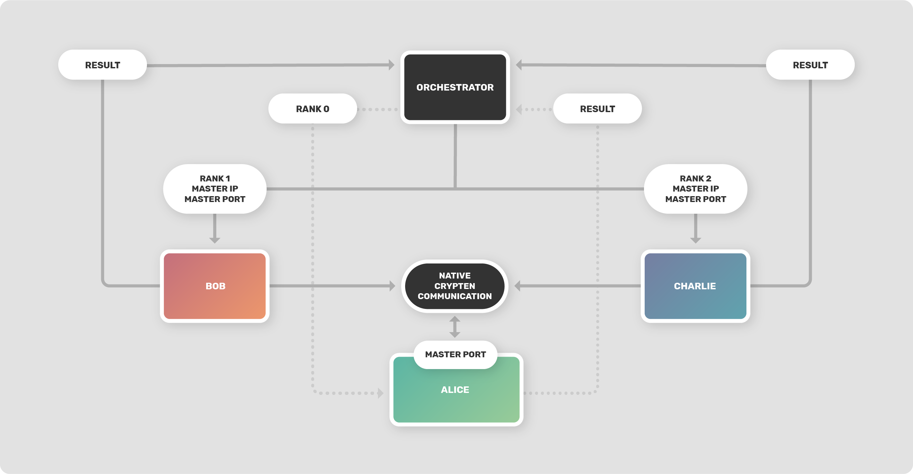
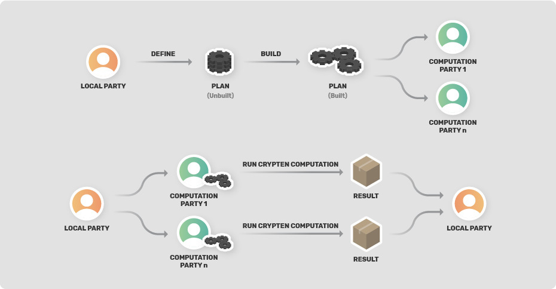
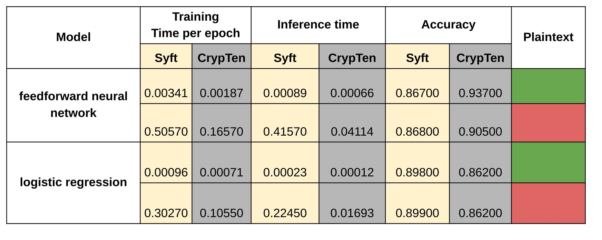

<!-- TODO(a11y): 2 localized body image(s) have empty alt text -->


**_Update as of November 18, 2021: The version of PySyft mentioned in this post has been deprecated. Any implementations using this older version of PySyft are unlikely to work. Stay tuned for the release of PySyft 0.6.0, a data centric library for use in production targeted for release in early December._**

After announcing the [project for CrypTen integration](https://blog.openmined.org/openmined-pytorch-fellowship-crypten-project/) in December 2019, we are now pleased to share the different outcomes of the project. We start with a quick overview of what CrypTen is, then jump into the use case that the integration is about. Next we look at the technical aspects and challenges of the project. Finally, we go through a demo and do some benchmarks.

## CrypTen

[CrypTen](https://github.com/facebookresearch/CrypTen) is a framework developed by [Facebook Research](https://research.fb.com/) for Privacy Preserving Machine Learning built on PyTorch. Its goal is to make secure computing techniques accessible to Machine Learning practitioners and efficient for server to server interactions. It currently implements [Secure Multi-Party Computation](https://blog.openmined.org/what-is-secure-multi-party-computation/) as its secure computing backend. More information can be found on the [project repo on Github](https://github.com/facebookresearch/CrypTen).

## Use Case

The project goal was mainly to be able to use CrypTen as a backend in PySyft so we inherit most of CrypTen’s use cases, you can learn more about them in this [introductory tutorial](https://github.com/facebookresearch/CrypTen/blob/master/tutorials/Introduction.ipynb), but we will list them below:

-   **Feature Aggregation:** In the first scenario, multiple parties hold distinct sets of features, and want to perform computations over the joint feature set without sharing data. For example, different health providers may each have part of a patient’s medical history, but may wish to use the patient’s entire medical history to make better predictions while still protecting patient privacy.
-   **Data Labeling:** Here, one party holds feature data while another party holds corresponding labels, and the parties would like to learn a relationship without sharing data. This is similar to the feature aggregation with the exception that one party has labels rather than other features. For example, suppose that in previous healthcare scenario, one healthcare provider had access to health outcomes data, while other parties had access to health features. The parties may want to train a model that predicts health outcomes as a function of features, without exposing any health information between parties.
-   **Dataset Augmentation:** In this scenario, several parties each hold a small number of samples, but would like to use all the examples in order to improve the statistical power of a measurement or model. For example, when studying wage statistics across companies in a particular region, individual companies may not have enough data to make statistically significant hypotheses about the population. Wage data may be too sensitive to share openly, but privacy-preserving methods can be used to aggregate data across companies to make statistically significant measurements or models without exposing any individual company’s data.
-   **Model Hiding:** In the final scenario, one party has access to a trained model, while another party would like to apply that model to its own data. However, the data and model need to be kept private. This can happen in cases where a model is proprietary, expensive to produce, and/or susceptible to white-box attacks, but has value to more than one party. Previously, this would have required the second party to send its data to the first to apply the model, but privacy-preserving techniques can be used when the data can’t be exposed.

## Technical Implementation Details

The original blog post announcing the project left open questions, here we provide answers and a big picture of how those have been implemented.

The first design choice was to leave the communication as is between CrypTen parties during computation, so we wouldn’t add extra serialization: CrypTen parties synchronize and exchange data as usual. PySyft is responsible for initiating the computation across workers, the computation is then run mainly using CrypTen mechanisms, and finally PySyft takes back control to exchange results between workers. The figure below shows the typical workflow of running a CrypTen computation using PySyft.

<figure class="">



<figcaption>Typical workflow with 3 parties</figcaption></figure>

The user starts by initiating the computation from the orchestrator worker, which is responsible for sending messages to the workers involved in the computation, assigning them ranks which are needed by CrypTen, the rank 0 party will listen to incoming connections by the other parties in order to synchronize and start the computation collaboratively, so it’s obvious that the other workers will also need to know the address and port the master party will listen to. The computation can then start and will involve native CrypTen computation: PySyft doesn’t have any control over it. At the end of the computation, the workers will send back returned values to the orchestrator to report the successful run of the computation.

To run a CrypTen computation successfully, all workers involved must run the same function, however, those functions are defined by the user at the time initiating it and aren’t known in advance by remote workers, so how to send this function to the remote workers? There is a technical issue on how to serialize a Python function as well as a security issue, as we can’t just allow arbitrary functions to be executed.

### Jails vs. Plans

Plans were the goto in PySyft to perform a series of operations on remote workers while making sure only a pre-defined list of operations are allowed for security reasons. However, they weren’t ready to handle CrypTen operations and the features that come with it, so we started Jails as an experimental feature for moving forward with integrating CrypTen features into PySyft. Jails simply send the source code of functions to remote workers, which will run them in a restricted environment that can only execute torch, crypten and syft operations. The environment is also restricted to some global variables and functions and can’t import other modules. But at the end of the day, Plans and Jails can be used interchangeably to perform different tasks, and Plans will be used exclusively when they will support all CrypTen functionalities as Jails might offer more functionalities at the time of writing this post. On the other hand, Plans offer better security guarantees for users.

#### Plans

Syft has an in-house developed method for running a computation on a remote worker which we refer to as Plans. In layman’s terms, a Plan represents a serialized function or model. For CrypTen integration we used only the feature to serialize functions, so in the next lines when we refer to a Plan, just think of it as a serialized function.

Currently, in Syft someone could annotate a given function with the `@sy.func2plan` decorator and this will transform that function into a Plan. For the “real” serialization to take place, the local worker – the one that defined the function – should _build_ the Plan. What does this means? Basically, it means that we need a way to record the operations that are executed in the specified Plan. To do this, the local worker should execute the Plan on a _dummy input_ such that each operation will be traced and placed in a list of _actions_.

The challenge regarding Plans is that PySyft is tensor oriented — the actions that were recorded when running the plan with the dummy input were traced at a tensor level. For supporting Plans with CrypTen operations, we needed to add Module level tracing because we could have scenarios like loading a model, doing a feedforward through a network.

When running the CrypTen computation, we presume we are taking data/models from other workers. Because of this, simply building the plan will not work. If we try to load data that is not on our local worker, we will get a nasty Python error. To cope with this, some CrypTen functions and methods are hooked during the build process, such that they return _shell_ like objects, for us to be able to trace them and replace them with placeholders. At the end of the building process, we undo all the hooking operations. All that remains now is to send the Plan to the parties that are involved in the computation and after this we can run the plan.

There are also some downsides regarding using CrypTen with Plans. Firstly, currently we have not implemented a mechanism to “trace” a loop operation. In this scenario, if we have a loop that iterates 5 times, we would trace all the operations from that loop 5 times (we might end up with a big Plan) – this can be solved if we implement a trace like operation for loops. Another negative aspect of using Plans is that there might exist functions that are not yet added to the plan hooking logic (used when building the plan), but this can easily be solved by simply adding a (key, value) pair in a dictionary where the key represents which function to hook and the value represents what _shell_ value the local worker should return.

<figure class="">



<figcaption>Running a CrypTen computation using Plans</figcaption></figure>

### Sending CrypTen Models

We also needed a mechanism to send CrypTen models to remote workers to enable users to train models on distributed private data without revealing their weights. The issue was that CrypTen models can’t be serialized and deserialized. A solution could be to send the weights of the parameters only, but this would require the remote workers to know the model architecture in advance, which wasn’t our case because we needed our solution to work on any type of model. Fortunately, CrypTen models are built by first serializing PyTorch models to ONNX then build the CrypTen model from that stream of bytes. Hence, in PySyft, when we know the PyTorch architecture, we can send CrypTen models this way: we just interrupt the build at the ONNX level, send that stream of bytes, then construct the CrypTen model on the remote worker based on that. This gives us a way to move CrypTen models between different machines.

### PySyft as a Distributed Data and Model Store

CrypTen allows for loading data/models from files that are stored remotely, but this lacks the ability to search which data/models are on which node. PySyft provide users with a way to search data/models on a Grid (or _network_) of workers using tags so that we can define which data will be used during the computation just by providing data/models tags. We have hooked the `crypten.load` function to allow for loading encrypted data using PySyft tags instead of file names. So all the user will need to do is to first search for the data/model he needs using PySyft, then define his computation and loading data/models using the appropriate tags.

## Demo

For the demo, we will use Plans to do an inference using data that is not on the orchestrator (the party that will start the computation) and a model that is also not known by the orchestrator (neither the architecture of the model, nor the weights).

In our scenario, we will use Alice and Bob as remote workers. Alice has the pre-trained weights for the model and Bob has the data. Here are the different imports we need to run the demo:

```python
# For having Syft and CrypTen support
import syft as sy
import crypten

# Used for loading data
import torch
import torch.nn as nn
import torch.nn.functional as F

# Connecting to parties and running Syft with CrypTen
from syft.frameworks.crypten.model import OnnxModel
from syft.workers.node_client import NodeClient
from syft.frameworks.crypten.context import run_multiworkers
```

The computation is defined as below and the orchestrator would have only to run the _run\_encrypted\_inference_ decorated function to get back the labels for the first 100 entries (for showcasing purposes).

```python
@run_multiworkers([ALICE, BOB], master_addr="127.0.0.1")
@sy.func2plan()
def run_encrypted_inference(crypten=crypten):
    # data will be loaded at BOB and known only by it
    data_enc = crypten.load("crypten_data", 1)

    data_enc2 = data_enc[:100]
    data_flatten = data_enc2.flatten(start_dim=1)

    # This should load the crypten model that is found at all parties
    model = crypten.load_model("crypten_model")

    # model's weights present at ALICE will be encrypted and known only by it
    model.encrypt(src=0)
    model.eval()

    result_enc = model(data_flatten)
    # the result is shared to all parties involved but we can choose
    # to decrypt at a specific worker only
    result = result_enc.get_plain_text()

    return result
```

The notebook that is doing inference on private data can be found [here](https://github.com/OpenMined/PySyft/blob/crypten/examples/experimental/CrypTen/CrypTen%20-%20Private%20Model%20Inference%20-%20Plans.ipynb). Some other notebooks are also available, which showcase [Training with Plans](https://github.com/OpenMined/PySyft/blob/crypten/examples/experimental/CrypTen/CrypTen%20-%20Traing%20Encrypted%20Neural%20Network%20-%20Plans.ipynb) and [Training with Jails](https://github.com/OpenMined/PySyft/blob/crypten/examples/experimental/CrypTen/CrypTen%20-%20Training%20an%20Encrypted%20Neural%20Network%20across%20Workers%20using%20Jails.ipynb).

## Benchmark

We benchmarked native CrypTen computation using the benchmark scripts available in the [official repository](https://github.com/facebookresearch/CrypTen/blob/master/benchmarks/benchmark.py), then converted those to use PySyft and ran the benchmarks again, the results are summarized in the table below.



The results must be taken with a pinch of salt because for PySyft we used TCP to initialize the communication while for native CrypTen a filesystem based initialization was used.  
Also, for PySyft, there results are for 2 parties that are involved in the computation and for native CrypTen there is only one party, due to some issue related to the benchmarking script of CrypTen.

## Conclusion

We have seen which use cases this project covers, explained some technical details around the implementation and the different challenges faced. We also demonstrated how to use this new feature to do inference on private data, using a private model.

Using CrypTen in PySyft adds new features for data and model searchability across a grid of PySyft workers. It also makes it possible to send arbitrary models across workers, increasing CrypTen’s flexibility as it can handle scenarios where the model might not be known in advance. Last, it offers the ability to orchestrate all the computation from a single point.  
All this in your favourite privacy-preserving machine learning library!
