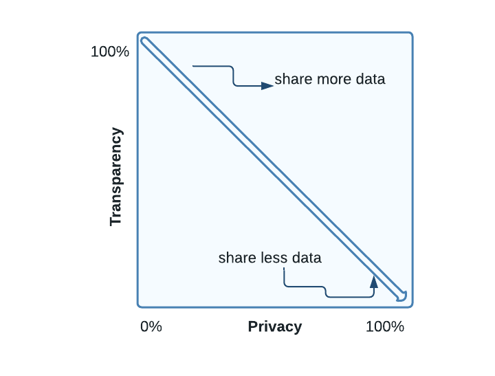
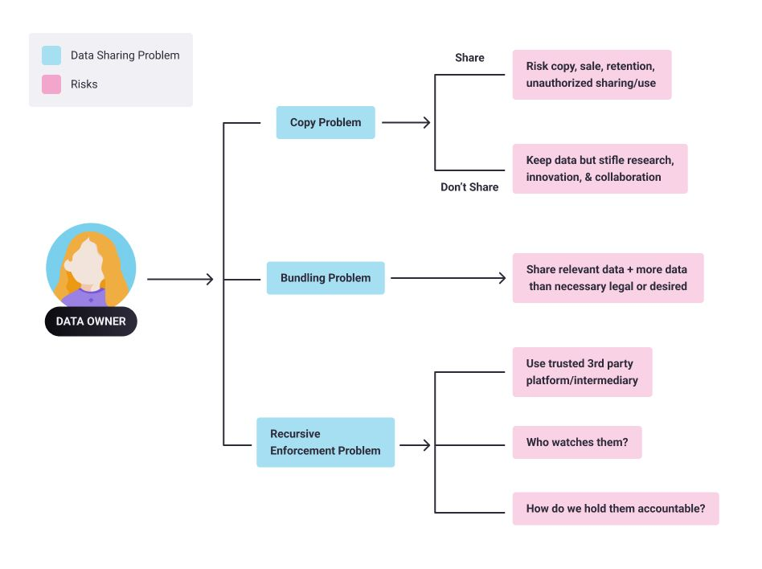

<!-- TODO(a11y): 2 localized body image(s) have empty alt text -->

This blog post is a summary of the lessons from the Private AI series, Course-1: Our Privacy Opportunity. In this post we will talk about the fundamental trade-off of data and about broken information flows in detail.

## Data’s Fundamental Trade-off

In today’s digital world, there’s a basic privacy trade-off in every data interaction – we can either benefit from data or keep data private, but you can’t do both!

This is known as the **privacy-transparency dilemma** – an underlying tension between using data and keeping data secret.

<figure class="">

<figcaption>Figure 1: Transparency and privacy are inversely proportional. The more data you reveal, i.e., the more transparent you become, the less privacy you will have.</figcaption></figure>

Despite an increase in consumer concerns over privacy \[1\] in recent years, we are largely resigned \[2\] to giving away troves of personal data. Data breaches,  data abuse, and the increased use of personal bio-metric information for security purposes are often regarded as the unavoidable costs of living in a connected society.

For most people, the value of products and services that require personal data outweighs any privacy concerns. So, _transparency_ _often wins at the expense of our privacy_.

At the same time, many highly valuable social activities that rely on sensitive information, such as forging effective global public health policies, gaining global insights from data to fight COVID, building smart cities, advancing medical and scientific research and fighting financial crime, are all hampered by outdated regulations, privacy concerns and lack of trust and accountability.

As a result, there is an unseen cost to progress as well as a wasted commercial opportunity. In all of these circumstances, privacy wins at a high societal cost.

But what if we could tackle society’s most pressing issues while safeguarding our most important data? What if the seemingly inevitable privacy-transparency tradeoff had a technical solution?

The team at OpenMined, an open source community developing private AI technologies, think we could resolve some of humanity’s most burning questions by creating a more privacy preserving world. OpenMined’s free online course,Our Privacy Opportunity\[3\] shines a light on the world’s privacy dilemma and untapped privacy opportunities.

## Broken Information Flows  

There are three fundamental problems with our current information flows. These problems force us to choose between privacy and transparency, and compromise one at the expense of the other.

<figure class="">

<figcaption>Figure 2: Three problems of Information flow</figcaption></figure>

### The Copy Problem  

If I share my data with you, you could copy, share, retain or sell it without my knowledge or consent. The risk can be somewhat mitigated through _NDAs_ (Non Disclosure Agreements), privacy policies or contractual guarantees. But these controls are notoriously tricky to enforce. The alternative is to not share data, no matter how valuable it may be for research or other forms of collaboration.

### The Bundling Problem  

If I share some data with you for a particular purpose (say, to receive certain goods or services), I usually have to share more data than what is desirable, necessary or relevant.  For example, drivers’ licences are used for identity or age proof, but they also share a person’s full name, address and date of birth.

Usually, it’s too difficult or impractical to isolate or remove certain data so we simply share more than what is necessary or avoid sharing data altogether. Banking, telecoms or energy service providers, for example, do not tend to share data with each other – even though that could improve their collective insights and services – for fear of sharing customer data, valuable IP or infringing privacy laws.

### The Recursive Enforcement Problem    

We might be able to solve the above two problems by using third-party oversight institutions or some sort of trusted intermediaries or platforms to enable data sharing, guard data or ensure compliance. But this solution presents a third issue: How do we choose a trusted intermediary? Who watches the watchers? How do we hold that third party accountable?

The above three hurdles are the source of a great number of data sharing dilemmas: either useful-but-sensitive data remains unused or society must accept and absorb the costs of sharing information with misaligned actors.

Please follow this series for further summary of lessons from the course \[3\].

## References

\[1\] [https://www.techrepublic.com/article/data-privacy-is-a-growing-concern-for-more-consumers/](https://www.techrepublic.com/article/data-privacy-is-a-growing-concern-for-more-consumers/)

\[2\] [https://www.businesswire.com/news/home/20190910005841/en/Consumers-are-Largely-Resigned-to-Data-Breaches-Where-Value-is-Perceived-Finds-Strategy-Analytics](https://www.businesswire.com/news/home/20190910005841/en/Consumers-are-Largely-Resigned-to-Data-Breaches-Where-Value-is-Perceived-Finds-Strategy-Analytics)

\[3\] [https://courses.openmined.org/courses/our-privacy-opportunity](https://courses.openmined.org/courses/our-privacy-opportunity)

## Acknowledgements

Thanks to  Kyoko (design team)  for helping with the diagrams.
