<!-- TODO(a11y): 15 localized body image(s) have empty alt text -->


## Extant paper implementation: Differential Identifiability

[Notebook](https://github.com/gonzalo-munillag/Blog/blob/main/Extant_Papers_Implementations/Differential_Identifiability/Differential_identifiability.html)  
(The HTML file is too large for viewing in GitHub, the fastest way to access the content is to download the HTML file and open it with your browser)

## Goal

The goal of this notebook is to implement the following paper from 2012 with around 50 citations. _**Differential Identifiability**_ is a work by Jaewoo Lee et al., which you may find [here](https://dl.acm.org/doi/10.1145/2339530.2339695).  
For more background of what differential privacy is, check this old [post](https://github.com/gonzalo-munillag/Blog/blob/main/Posts/Basic_Definitions_of_Differential_Privacy.pdf).

## Notebook contributions

1.  I explain the steps involved in the proof of differential identifiability in a more granular way than the ones provided in the paper so that other researchers can quickly and deeply understand the publication
2.  I provide the source code to implement differential identifiability
3.  I provide my humble thoughts about the usefulness of this publication
4.  I verify that the results from the computations in the paper are correct
5.  All the results check out; however, I have not been able to replicate the sensitive range of the standard deviation

## Paper summary

Anonymization is crucial to perform any analytics or data exchange. Among anonymization techniques, differential privacy (DP) is unique in its guarantees, as one can mathematically limit the privacy loss to provable bounds.  
While DP (Semantic method) has mathematical guarantees of indistinguishability and avoids modeling the prior knowledge of an adversary (A) unlike any other syntactic method such as k-anonymity, DP does not include an intuitive or systematic process to select the parameter ε. How can we go from extant data privacy regulation to actionable DP algorithms? ε limits how much an individual may affect the resulting model, not how much information is revealed from an individual, which is to what regulation refers. This work from Jaewoo Lee strives to make this process simpler by introducing a new parameter **ρ, which indicates the probability that an individual contributes to the results of the query**. Jaewoo calculated the worst-case probability that an individual is in the US Census (Looking at people older than 85), rounding the probability to 1.5%, and using this number to set his new parameter. If the algorithm executed in a set of possible worlds yields a posterior for at least one of them larger than ρ, then the data of individuals in the dataset may be linked to their identities, or the data may be linked to other datasets.  
This new formulation of DP, called differential identifiability (DI), offers the same guarantees, i.e., offers protection against an arbitrarily strong adversary.  
Additionally, there is a connection between ε and ρ, which one can exploit to set ε based on ρ.

In this paper, Jaewoo proves how to achieve DI and gives examples of how to use it.

Great knowledge nugget:  
“The protection of differential privacy measures only the impact of an individual on the output, not the ability to identify an individual, or even the ability to infer data values for an individual.”

## My thoughts on the paper

I very much liked this paper, it is concise and informative. He makes the math beautifully simple yet powerful. It helps to see DP from another angle and increases your understanding of the technology. However, I think it is also non-trivial to go from regulation to a probability that tells you how likely it is to find someone in the dataset. In the paper, Jaewoo calculates the chances that someone is in the dataset when that person is older than 85, but he does not consider the additional information from other datasets, which may increase this probability. While DP with ε allows you to avoid considering prior knowledge (Only the worst-case but straightforward scenario of an informed adversary), ρ makes you consider it, and finding datasets that can be linked and therefore increase the probability of identification is again a difficult task.

## Selected replicated plots

All the plots were successfully replicated.

This plot shows the upper bound formulated in the paper.

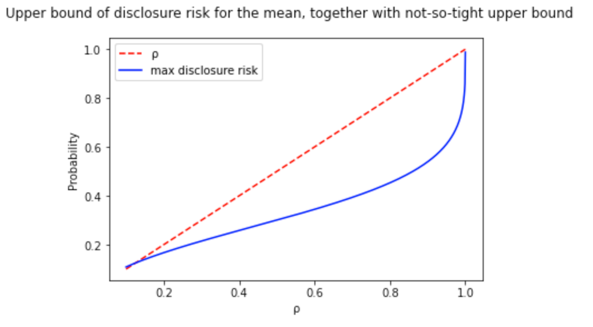

I performed a binary search to find the optimal value of ε per value of risk disclosure (ρ). This way, I went from the previous image to a tight upper bound curve:

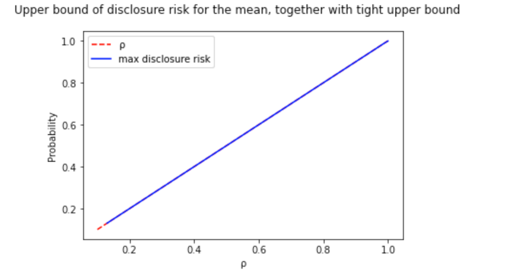

However, for some functions like the median, there is no need to go beyond the formulation because the upper bound is an equality, and therefore, you get precisely the amount of noise you need.

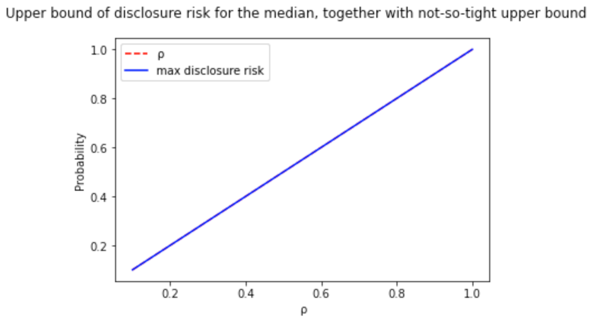

We can see here how the noise range widens the less disclosure risk is accepted:

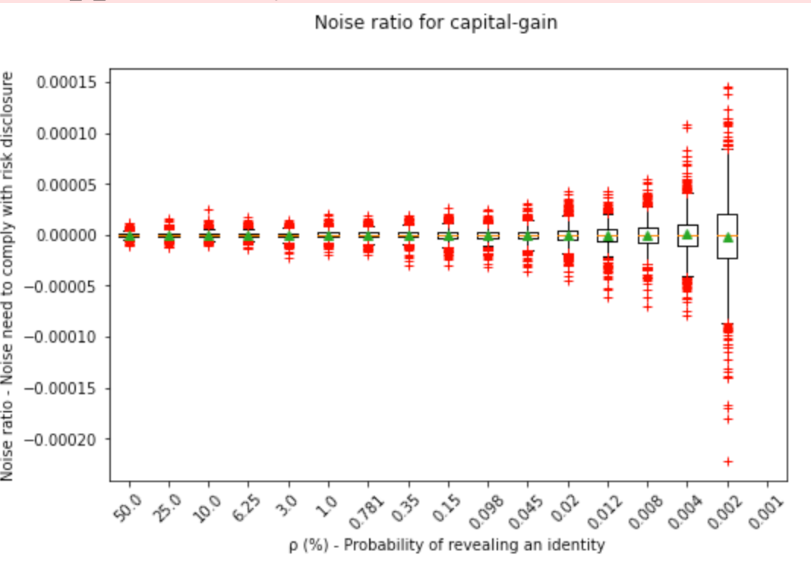

Also for values of ε for the DP enthusiasts:

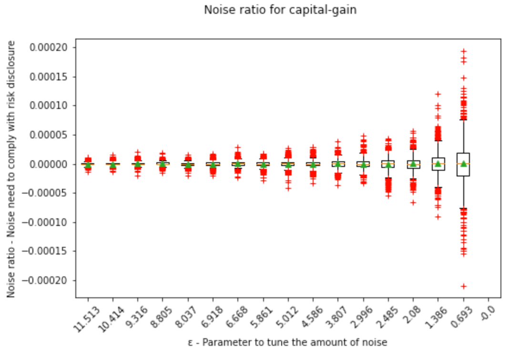

Finally, we can see that varying the dataset size; we need less noise the larger the dataset is:

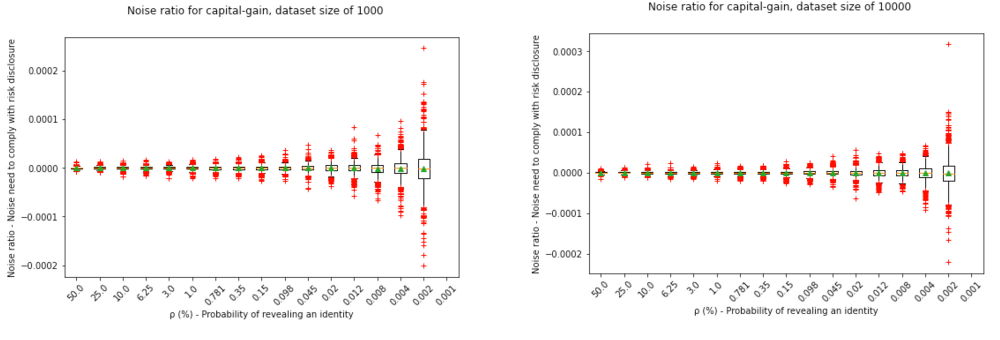

I hope you enjoy the [notebook](https://github.com/gonzalo-munillag/Blog/blob/main/Extant_Papers_Implementations/Differential_Identifiability/Differential_identifiability.html)!

## Notebook

### Adversary model and context

For more details, you may go to point 3 of the paper. Here is a summary of the context:

A universe **U** of data points belong to individuals **i**, an individual’s identity is **I(i)**, and the identities that belong to a dataset **D** are in the set **I\_D**. A multiset of these data points forms **D**, which we as privacy professionals want to protect while letting data scientists make queries to this inaccessible dataset. An adversary (A) of the type _informed adversary_ is assumed to know all individuals in **U** and knows every single individual included in **D** except for one, which we want to protect, and the A wants to single out certain information hidden in the inaccessible dataset **D**. This individual could be any, and thus it applies to anyone who is or is not in the dataset. Therefore, A knows **D’**, which is one data point (Individual) less than **D** (**|D|** = **|D’|** + 1). Aside from **U**, and **|D’|** and the identities of the people in **D’**, the A also knows the privacy mechanism **M\_f**, i.e., we are using the Laplace distribution to generate our random noise. If the A finds out **D** because it knows **D’**, it is trivial to know which data point belongs to the victim.  
Having this prior knowledge, the A will construct with **U** and **D’** all the possible **D**‘s that may exist. Toy example: if the **U** is of size 10 and **D** is of size 9, i.e., **|D’|**\=8, then there are (10-8 choose 9-8)=2 possible worlds (ω ∈ Ψ) the A will test. Process of the A:

(i) A queries our dataset D and obtains a DP response M\_f(D) = R = f(D) + Noise, where f(.) is an analytics query such as the mean.  
(ii) Consequently, A tests these worlds using conditional probabilities, Pr\[ω\_i = D | M(D) = R\].  
(iii) A then calculates the posterior probability of each word assuming a uniform prior, i.e., before seeing R, any world had the same probability of being the correct one.  
(iv) The world ω with the highest posterior is the most likely candidate to be the true D, and if it is indeed D, then the privacy of the individuals in the dataset has been violated.

**Math**

Before continuing, I must introduce some definitions the author explains in the preliminaries of the paper

<figure class="">

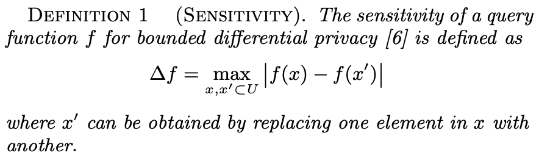

</figure>

Sensitivity is one of the parameters that tunes the noise in DP. It depends on the query type f(.), e.g., the mean, median, or even a machine learning algorithm, and the universe of data points. The higher the sensitivity, i.e., the higher the difference an individual’s data point makes in the query result, the higher the DP mechanism’s noise. There are some queries whose sensitivity is lower than others, e.g., the mean’s sensitivity is lower than the one from the sum, given the same universe. x and x’ in this definition act as D and D’. (The author forgot to add the extra bars to represent the norm, or he was just refering to one dimensional space). The author of the paper uses this notion and building block of DP to define “Contribution of an individual” and “Sensitive range S(f):

<figure class="">

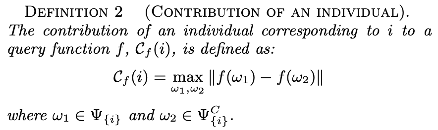

</figure>

This is just like sensitivity, but it only considers the worlds where an individual is included Ψ\_{i} and the worlds where such individual is not included Ψ\_{i}^C. For example, an individual is in 3 worlds and is not in 2 worlds. This definition calculates f(ω) for each possible world and finds all the differences between them. In this toy example, it would yield 6 values (3×2 combinations). The maximum of these values is the contribution of an individual.

<figure class="">

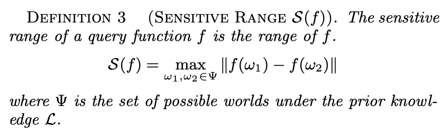

</figure>

<figure class="">

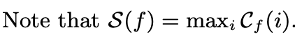

</figure>

However, we need to position ourselves in the worst-case scenario. What could happen if we choose an individual whose sensitivity (Contribution of such individual) is not the largest?  
Well, then the noise would be smaller than it should be.  
What would happen then?  
The individual with the highest contribution would be unprotected if she were the one being attacked in D. This is because the result R would be too different from the other possible results R when this individual is not in the dataset. More specifically, because the standard deviation of the noise is proportional to the sensitivity, which we said was smaller than needed because we chose a smaller sensitivity, then the noise range will not cover the largest contributor’s value. So if the attacker queries and obtains R and then does experiments with all the possible worlds, the attacker will have an easier time singling out which world is the correct one.  The probability of the individual being in D would be higher than in the rest of possible D’s (worlds), i.e., the posterior is higher. To have a picture in mind, check Jaewo’s previous [paper](https://link.springer.com/chapter/10.1007/978-3-642-24861-0_22), Figure 1. To ameliorate this, we choose the individual with the largest contribution, which the author does with definition 3.  
This is why S(f) is the maximum value of the set of possible C\_f(i).

<figure class="">

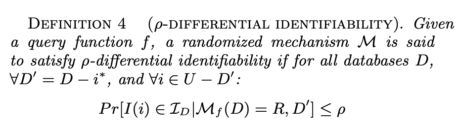

</figure>

This means that in order to comply with DI with a parameter of ρ, i.e., the upper bound of the risk to identify someone in the dataset, the following must be fulfilled: The probability that A asserts that the identity of an individual **I(i)** is in the set of identities **I\_D** of the dataset under attack **D**, given the knowledge of A about **D’** and with the output of the query **R**, is less than or equal to ρ.

Now, I am going to do my best to explain the steps of the proof:

<figure class="">

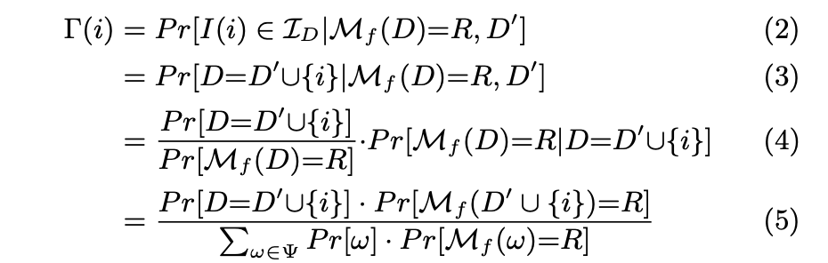

</figure>

(2) Risk of disclosure = Probability that the identity being attacked I(i) belongs to the set of identities in D, given that the mechanism M executed on D yields R and that the neighboring dataset is D’.

(2) to (3)  
That an identity belongs to the set of identities in the dataset D (Possible world) is the same as constructing the dataset D with the known D’ and the data point that belongs to an individual that is not in D’. This individual i is under attack, but it could be anyone that is not in D’ (Like you :D).

(3) to (4)  
Applies Bayes Rule: Posterior = (Prior \* Revised beliefs) / Normalization

Prior: The author assumes that each D is equally likely – uninformative prior, i.e., without any information, the attacker’s best guess is that the probability that {i} belongs to D is equally likely among possible D’s (worlds).  
   Revised Beliefs: Probability that in a reality where D contains {i} (A possible world) we would obtain R  
   Normalization: M\_f(ω) is a random variable that maps a sample space of possible events (Possible worlds) to a one-dimensional real space. The probability of a possible world to go to any R is 1, the probability of one world to go to a specific R is less than one, and the probability of all worlds to go to a specific R is also less than 1 (And more than the previous one).  Not all R’s are equally likely, as it is a random variable that follows a Laplace distribution.  
   The normalization in Bayes Rule is there because we focus on the case where we obtain a particular R, which is a subset (one value) of the rest of possible R’s. Therefore, to study these events with the conditions of the numerator, these events’ probabilities within the studied sample space must be normalized to add up to 1 (The normalization axiom of probability theory).

The condition of given D’ in **Pr\[D=D’ U {i} | M\_f(D) = R, D’\]** disappears because knowing D’ will not affect in any way which {i} will be included in D, so it is uninformative. This may not be true, e.g., if you know the friends and family of someone in D’, it is more likely that some are in D as well, but this is not considered.

(4) to (5)  
In the numerator, the author compresses **Pr\[M\_f(D) = R | D=D’ U {i}\]** into **Pr\[M\_f(D’ U {i}) = R\]**, he does this because the attacker is already considering D  in the probability the she wants to calculate, the condition does not add new information. The denominator follows from the total probability theorem, and the author went from **Pr\[ω\]xPr\[M\_f(D) = R | ω\]** directly to **Pr\[ω\]xPr\[M\_f(ω) = R\]**, like he did in the numerator.

<figure class="">

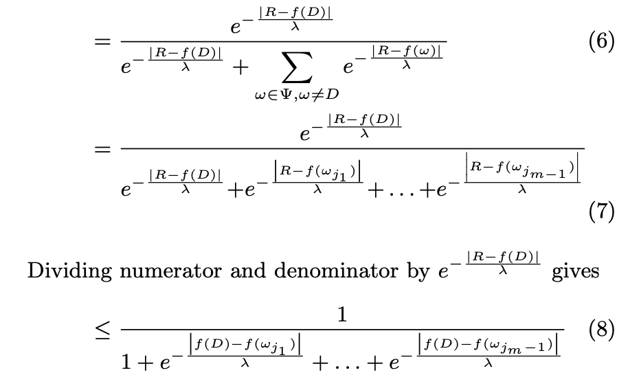

</figure>

(5) to (6)  
Here the author uses the Laplace distribution, it is the substitution of **Pr\[M\_f(D’ U {i}) = R\]**, ditto for **Pr\[M\_f(ω) = R\]**, this means _the probability that applying Mf to ω yields the output R_. However, how do you go from there to the Laplace probability density function (pdf):

(i) Because **M\_f(.) = f(.) + Noise = R**, you may also do **Noise = R – f(.)**.  
(ii) Given the true result f(ω), i.e., we assume this is the correct world, the probability of obtaining R is the same as the probability of obtaining the Noise. So **Pr\[M\_f(ω) = R\] = Pr\[Noise\]**  
(iii) **Pr\[Noise\] = 1/(2λ)exp(-|Noise – μ|/λ) = 1/(2λ)exp(-|R – f(ω) – μ|/λ)**. We sample from a centered noise distribution, μ=0. The coefficient 1/(2λ) cancels out as every single component of the numerator and denominator is multiplied by it.

What happened to **Pr\[D’ U {i})\]** and to **Pr\[ω\]**?  
They cancel out.  
Why?  
Because the author assumes that the prior is uniform, i.e., the probability of having **Pr\[ω\_i\]**, like **D** in the numerator, over another **Pr\[ω\_j\]** is the same.  
Furthermore, the author takes out from the sum in the denominator the value that is equal to the numerator. This is convenient, and visually, it conveys that we are trying to find the posterior of the world ω that is actually D, the real world. This is the only interesting posterior for the formulation of the proof, as we know there is only one world that is true, and the only one we must ensure is protected. This, of course, has no loss of generality; it could be any D.  
(6) to (7)  
The author unfolds the Sum. **m** is the number of possible worlds ω. Because we already took out the ω corresponding to D outside, the unfolding only goes until m-1.  
(7) to (8)  
As it shows in the picture, it divides the numerator and denominator by the numerator. The 1’s are trivial, but what about the other expressions in the denominator? Here are the intermediate steps, I take one value in the denominator to show how it computes:

<figure class="">

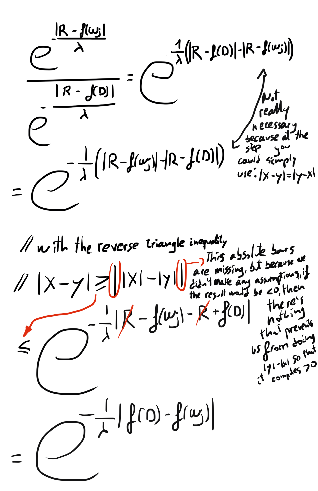

</figure>

Ups, that is larger than expected…

What is next?

<figure class="">

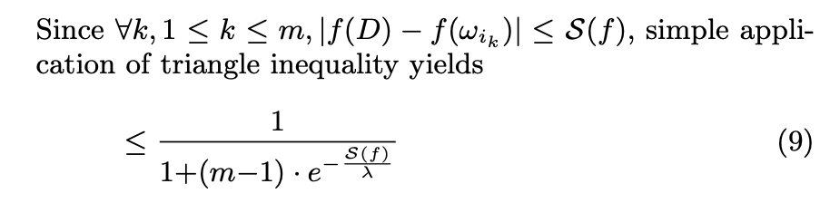

</figure>

(8) to (9)  
We know that S(f), the sensitivity range of f(.), will contribute to an individual that yields the largest difference in outputs. Therefore, it will be larger than any other possible contribution. That is why we can make this inequality by substituting |f(D) – f(ω)| with S(f) in the exponent in all the components of the sum. Because the exponent will be larger and negative, the numerator will be smaller, making the fraction larger. It is a convenient substitution because now we have to only deal with S(f), which can be calculated theoretically. This provides an upper bound, which might not be tight.

The author trivially shows what the lower bound is. Because (m-1)\*exp(-S(f)/λ) <= (m-1), then the lower bound of the expression is (1/m). In his words, “This implies that it is impossible to protect the privacy of individuals in the database with the probability less than an adversary’s probability of a correct random guess.” This is because m is the number of possible worlds, so you naturally cannot protect more than randomly picking a dataset with equal probability.

<figure class="">

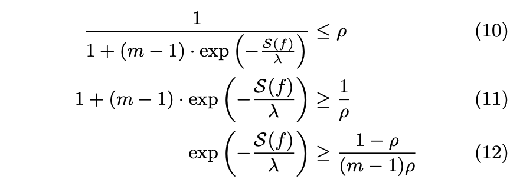

</figure>

(9) to (10)  
In (10), the author does the algebra so that we can easily determine which value of λ fulfills this upper bound when the upper bound is set to ρ. Expression 9 is the **disclosure risk**, and it has to be smaller than ρ (shown in (10)).  
(10) to (12)  
In essence, arithmetic to get closer to find the expression for λ.

<figure class="">

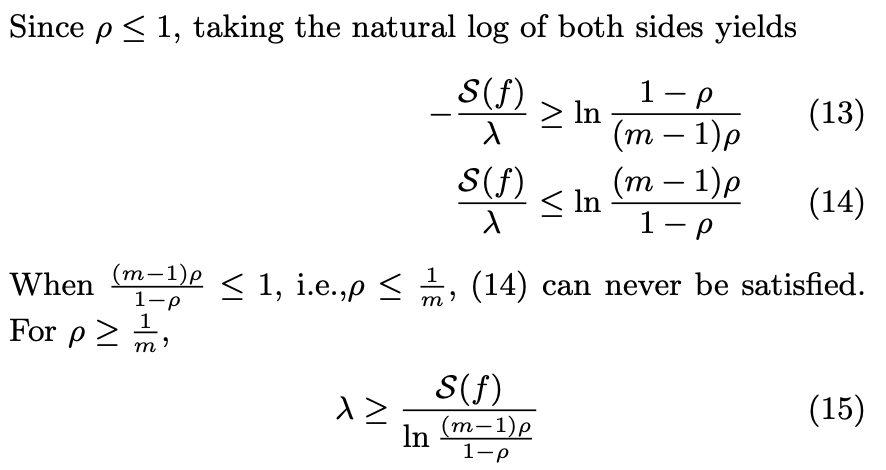

</figure>

(12) to (15)  
Arithmetic to find the lower bound of λ.  
The comment between (14) and (15) is because if ρ = 1/m, then the natural log of the expression (ln\[(m-1)ρ /(1-ρ )\]) is zero or negative, which cannot be, given that S(f)/λ will always be larger than 0. This also makes sense because 1/m is the lower bound previously defined; 1/m is the random guess from the attacker, so, as we said before, you cannot get lower than that.

On another note: Referring to what I mentioned before, the possible worlds’ priors might be different (If someone is in D’, her friends or family are more likely to be in D). in case a prior is higher than ρ, then privacy is violated inherently. I.e., if **Pr\[D = D′ ∪ {i}\] > ρ**, then the attacker already guesses with a probability of being correct higher than the upper bound we would like to impose.  
The author then says that for less severe cases, i.e., the prior is different between possible worlds but with less ρ, one can substitute **m = 1 / max Pr\[D = D′ ∪ {i}\]** in Ψ. What I understand with this is that for example, if you have 9 worlds whose probability is equally likely and equal to 8.88…%, and one world that is likely with probability 20% (In total 10 worlds), to make things easier, this is equivalent to say that you have 5 options (1/0.2) from which to pick, each of the five options is equally likely, and the probability is equal to the worst-case scenario when you had 10 options. This is an elegant way to keep the proof simple, even for non-uniform priors. Beautiful 🙂 And avoids an attack by the reviewer 😀

Finally, he makes a connection to DP because all along, ε was hidden **λ = S(f)/ ε**. Surprise!  
In the beginning, we mentioned that DP adds random noise to deterministic results from a query and that this noise’s standard deviation is proportional to the sensitivity, and there it is. The tails of the Laplacian will become longer the larger S(f). Furthermore, we can have an impact on the tails by manually selecting ε. The smaller it is, the longer these tails and the more noise is added, as more possibilities become relatively more likely. And how do we do this? Well, this is what the paper is about, we define the risk ρ, and from there, we get ε.

<figure class="">

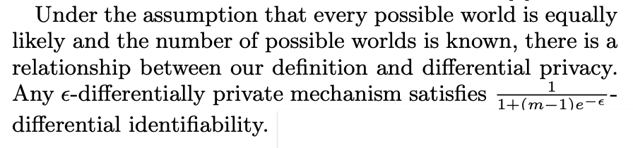

</figure>

Let me show this and then we get on with the code!

<figure class="">

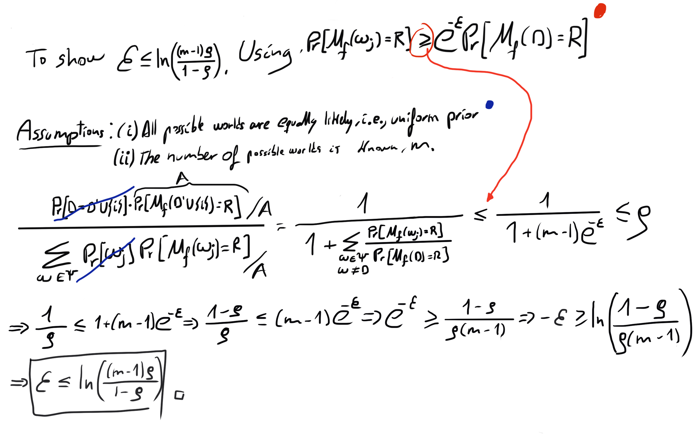

</figure>

<figure class="">

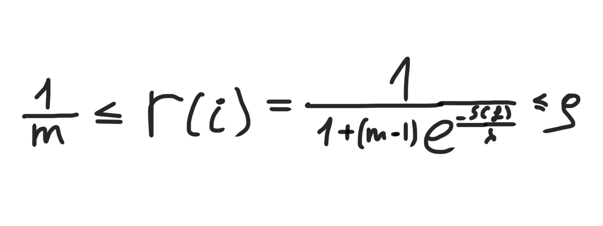

</figure>

These are the lower and upper bonds of the disclosure risk.

### Code

**Datasets**

Toy example of section 4 of the paper

```python
w_1 = [1, 2, 3]
w_2 = [1, 3, 4]
w_3 = [1, 3, 5]
w_4 = [1, 3, 6]
w_5 = [1, 3, 7]
w_6 = [1, 3, 8]
w_7 = [1, 3, 9]
w_8 = [1, 3, 10]
worlds = [w_1, w_2, w_3, w_4, w_5, w_6, w_7, w_8]
```

Adult dataset for section 5 of the paper. In the paper, the author only uses numerical values: as age, education-num, capital-gain, capital-loss, hours-per-week.  
Therefore, we will filter only these attributes.

```python
df = pd.read_csv("adult.csv")
census_df =  df.filter(['age', 'educational-num', 'capital-gain', 'capital-loss', 'hours-per-week'], axis=1)
census_df.head(5)
```

<figure class="">

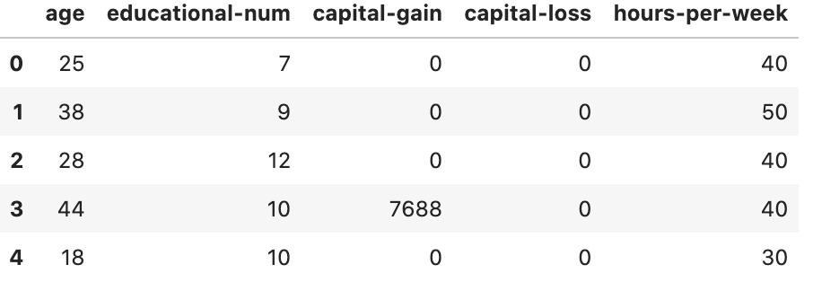

</figure>

**Helper functions**

In this [blog post](https://github.com/gonzalo-munillag/Blog/tree/main/My_implementations/Global_sensitivity) I made the functions to calculate empirically the sensitivites of queries based on the datasets from scratch, this time however I will use theoretical formulations.

```python
def mean_sensitive_range(deterministic_query_outputs):
    
    return np.abs(np.max(deterministic_query_outputs) - np.min(deterministic_query_outputs)) / len(deterministic_query_outputs)
    
def calculate_λ(sensitive_range, m, ρ):
    
    return sensitive_range / (np.log((m-1)*ρ/(1-ρ)))

def calculate_ε_i(sensitive_range, m, ρ):
    """
    Description:
    It calculates ε based on the calculation of λ and the sensitive range, m, ρ
    """
    
    return sensitive_range / calculate_λ(sensitive_range, m, ρ)

def calculate_ε_ii(m, ρ):
    """
    Description:
    It calculates ε based only based on m, ρ
    """  
    return np.log(((m-1)*ρ)/(1-ρ))
    
def laplace_noise(Response, deterministic_query_outputs, λ):

    return np.exp(-np.abs(Response - deterministic_query_outputs)/λ)
    
def noise_ratio(Noise, U_range):
    
    return Noise/U_range
    
def ε_binary_search(ρ_target, w, worlds, R, sensitive_range, query):
    """
    INPUT
        ρ_target - this is the disclosure risk we are willing to accept
        w - the world that provides the worst-case scenario
        worlds - the different worlds that could be the real dataset
        R - The random response of the query, it should also be the worst-case scenario
        sensitive_range - this is the range of values that the deterministic output of the query can make based on the possible worlds
        query - the query we are dealing with, it could be mean, median,... 
    OUTPUT
        ε - the closest ε we can get to comply with ρ_target with an error of 0.01%
    Description
        Executes binary search to find ε based on a ρ_target - risk disclosure target; this way, we can find the best utility for reasonable privacy. To simplify things, 
        we perform a binary search with λ instead. And then calculate ε from λ
    """
        
    m = len(worlds)
    λ_high = calculate_λ(sensitive_range, m, ρ_target)
    λ_low = 0
    λ = (λ_high + λ_low)/2
    ρ = calculate_disclosure_risk(w, worlds, R, λ, np.mean)
        
    while np.abs(ρ_target - ρ) > 0.0001:
        
        if ρ_target < ρ:
            
            λ_low = λ
        
        if ρ_target > ρ:
            
            λ_high = λ    
            
        λ = (λ_high + λ_low)/2
        ρ = calculate_disclosure_risk(w, worlds, R, λ, np.mean)
        
    ε = sensitive_range/λ
    return ε    

 
    
 
```

**Main function**

```python
def calculate_disclosure_risk(attacked_world, worlds, R, λ, query):
    
    numerator = laplace_noise(R, query(attacked_world), λ)
    denominator = 0
    for world in worlds:
        
        denominator += laplace_noise(R, query(world), λ)
            
    return numerator / denominator
```

After the definition of these functions, the [notebook](https://github.com/gonzalo-munillag/Blog/blob/main/Extant_Papers_Implementations/Differential_Identifiability/Differential_identifiability.html) goes on to replicate the various calculations that have been performed in the paper. I encourage you to follow up there and delve deeper into the various things one can do with just the few functions defined above.

**THE END**
