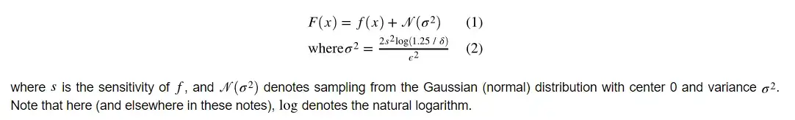

<!-- TODO(content): 4 unrecoverable figure(s) removed — dead Google-Docs/social paste artifacts (404 on live for years, no archive). Recreate if valuable. -->

### Importance of Data:

Every company around the globe is increasing the usage of data in building their products and services. This is because data gives clear insight into what the users like or dislike about the company’s products and services and this helps companies to improve accordingly.

### Importance of Differential Privacy:

Due to the large amounts of data collected, a major issue raised in today’s world is Data Privacy because no one wants their sensitive information to be leaked from the data collected. Here comes the importance of Differential Privacy, as it allows companies to collect user data without hampering their privacy.

One way to protect user privacy is Anonymization which means removing Personally Identifiable Information (PII). But by removing PII we drastically limit the data’s capabilities and usage and it is also not a fully trusted method. In this users have to blindly trust the company for the anonymization process like the removal of names. But the anonymized data can be combined with other datasets to de-anonymize the data and this process is called De-Anonymization. This is highly risky as the de-anonymized data if leaked can again intrude on user privacy and this kind of data attack is called Linkage Attack.

Differential Privacy on the other hand adds some noise to the data to flip some of the actual data with other values. Since the actual data is not sent to servers so there is no chance that the personal information can be identified very easily and leaked.  

### Types of Noise Mechanisms in Differential Privacy:

The noise is used to alter the data so that patterns of the data can be analyzed without the fear of sensitive data leakage. The Noise Mechanisms are mainly of 3 types –

1\. _**Laplace Mechanism:**_

_Method 1~_

We define a parameter called l1 Sensitivity which gives an upper bound on how much noise we should add to conserve the data privacy of an individual.

[Reference](https://becominghuman.ai/differential-privacy-noise-adding-mechanisms-ede242dcbb2e)

_Method 2~_

One more way is to compute the Laplace Distribution of x divided by the value b which is the distribution with a probabilistic density function.

[Reference](https://becominghuman.ai/differential-privacy-noise-adding-mechanisms-ede242dcbb2e)

_Method 3~_

Another way is to derive the Laplace Mechanism of the given function with the help of the given formula.

[Reference](https://becominghuman.ai/differential-privacy-noise-adding-mechanisms-ede242dcbb2e)

_**2\. Exponential Mechanism:**_

A scoring function is specified that gives a score as output for each element in the set and also defines what needs to be picked from the set. All of this is defined by the Analyst.

Instead of adding noise to the output of the function separately, the exponential mechanism draws output o from a probability distribution.

[Reference](https://becominghuman.ai/differential-privacy-noise-adding-mechanisms-ede242dcbb2e)

**_3\. Gaussian Mechanism:_**

Instead of adding Laplacian noise to the data, we need to add Gaussian noise to the data. Gaussian Mechanism doesn’t work on pure ε-differential privacy but does work on (ε, δ)-differential privacy.

[Reference](https://becominghuman.ai/differential-privacy-noise-adding-mechanisms-ede242dcbb2e)

### Strengths & Weaknesses in Differential Privacy:  

**_Strengths:_**

1\. Differential privacy paves the way to certain mathematics that ensures data privacy and prevents Linkage problems.

2\. Computing the privacy loss for a database is possible with differential privacy when too much data is involved.

3\. Data Privacy violations are reduced with differential privacy and customers can rely more on the organization’s services and products.

4\. After a differential privacy algorithm is released, it is not possible to make the statistic or model less private through post-processing.

5\. As long as the attacker knows nothing about the database except the row in question, the differential privacy guarantee holds.

**_Weaknesses:_**

1\. Privacy-preserving algorithms like differential privacy often need to be more accurate than their non-private counterparts.

2\. With differential privacy, your privacy guarantee for a database weakens as you run an algorithm twice over it. As a result, it can be difficult to maintain a reasonable balance between privacy and accuracy when multiple queries are required.

3\. The inaccuracy brought to the table by differential privacy after inducing noise to the dataset can be ignored for large datasets but not for small ones.

4\. The restructured data after applying differential private algorithms hinders organization analysts from finding valuable insights from the data present.

5\. Unless frameworks like JAXX are used, differential privacy works very slowly with other frameworks.

[References](https://laurenwatson.github.io/blogposts/2020-10-25-dp/)

### Data Dependent Differential Privacy:

Differential Privacy is dependent on data because it ensures privacy on sensitive datasets, and is always centering extensive usage of data. Experiments have proved that differential privacy doesn’t work well with databases comprised of tuple correlation that signifies relations between different tables in the database. DP also changes those records which don’t contain numerical/statistical trends, i.e it can add noise only to the records with categorical data. This is because adding noise to numerical/statical data can lead to an improper analysis of graphical trends. Now since no noise is added to them, they are still prone to leaking information about the users and again leading to privacy issues. Thus improved algorithms and different privacy metric measures are introduced to deal with differential privacy for correlated data which falls under Dependent Differential Privacy (DDP).
