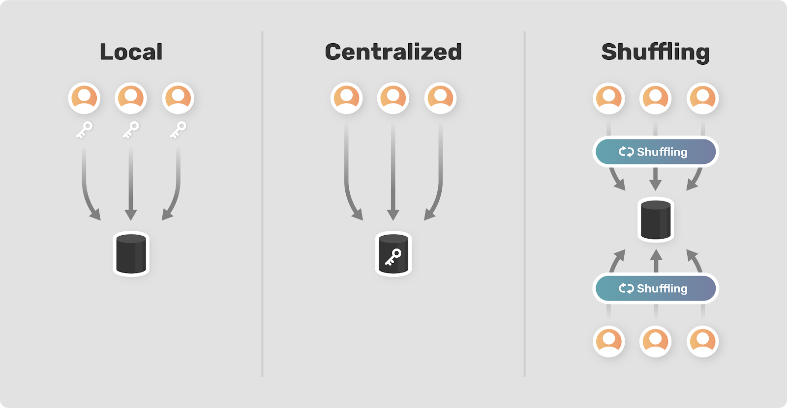

<!-- TODO(a11y): 1 localized body image(s) have empty alt text -->

_**This post is part of our [Privacy-Preserving Data Science, Explained](https://blog.openmined.org/private-machine-learning-explained/) series.**_

Differential privacy has been established as the gold standard for measuring and guaranteeing data privacy, but putting it into practice has [proved challenging until recently](https://journalprivacyconfidentiality.org/index.php/jpc/article/view/689). Practitioners often face a difficult choice between privacy and accuracy. Privacy amplification by shuffling is a relatively new idea that aims to provide greater accuracy while preserving privacy by shuffling batches of similar data. This approach has the potential to allow for richer, more reliable data analysis while preserving privacy.

## Background

Traditionally there have been two models for implementing differential privacy: the local model and the centralized model. In the local model, users apply privacy-preserving measures to their data (for example, adding noise) before sending it to a server for analysis. This guarantees privacy without the need to trust an outside source. Unfortunately, this approach introduces a lot of error into the data and it requires huge amounts of data to get meaningful results. Additionally, it precludes many forms of data analysis, because individual pieces of data are by design unreliable. In practice, only the biggest companies in the world (Apple, Google) have access to enough data to leverage local differential privacy successfully.

In the centralized model, the raw data is sent to a trusted server, which then analyzes the data using privacy-preserving techniques. This method requires far less data to get reliable results and, if everything goes to plan, privacy is still preserved. The problem is that when all the raw data is in one place, it can easily be abused, lost, or stolen. Given the [many known examples of data breaches](https://www.informationisbeautiful.net/visualizations/worlds-biggest-data-breaches-hacks/), these concerns are all too real.

Needless to say, there is a tradeoff between privacy and accuracy in choosing between the local and the centralized model. In some cases neither option provides an acceptable level of both privacy and accuracy. **The idea behind shuffling is that by taking a middle approach between local and centralized, combined with some clever math, it’s possible to maintain privacy while achieving a higher level of accuracy.**

## How It Works

<figure class="">

</figure>

Interest in shuffling was sparked by a [2017 paper by Andrea Bittau et al. at Google](https://arxiv.org/abs/1710.00901). They describe their architecture as Encode, Shuffle, Analyze (ESA). In the encode step, users encode their data locally with two layers of encryption. They can also apply local privacy-preserving measures.

The shuffler is a separate service that is responsible for receiving, grouping, and shuffling the data. **It removes explicitly identifying features as well as metadata that could associate information with a specific user such as arrival time or IP address.** It’s also responsible for **ensuring that data is grouped together in a big enough batch for individual information to be “lost in the crowd.**” The shuffler undoes the first layer of encryption before passing the data on to the analyzer.

The analyzer decodes the second layer of encryption in order to access and analyze the data. The paper provides plenty of implementational details, but its novelty is **introducing an intermediary shuffling step** between users and the centralized server.

**Therefore, shuffling isn’t a privacy model in itself but a layer that can be compatible with various existing privacy strategies.** Other researchers ([Balle et al.](https://arxiv.org/abs/1906.09116) and [Cheu et al.](https://arxiv.org/abs/1808.01394)) have built on this concept and proposed different algorithms with the same basic structure.

## Conclusion

The authors of the ESA paper lamented that “techniques that can guarantee privacy exist mostly as theory, as limited-scope deployments, or as innovative-but-nascent mechanisms.” **Perhaps the most exciting part of privacy by shuffling is its potential for allowing more widespread real-world use of differential privacy.** In a time when apps that can access sensitive information without compromising privacy are desperately needed, shuffling could be part of the way forward.
