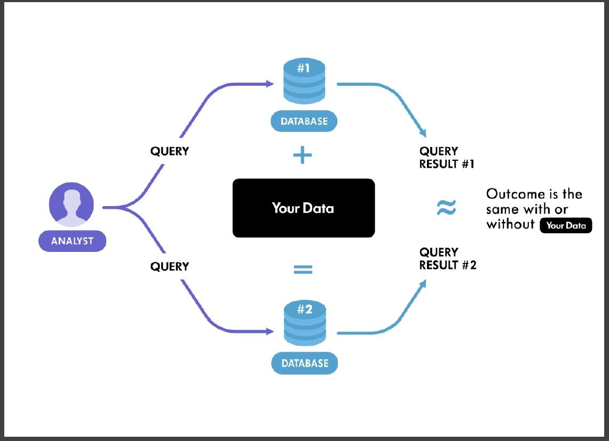
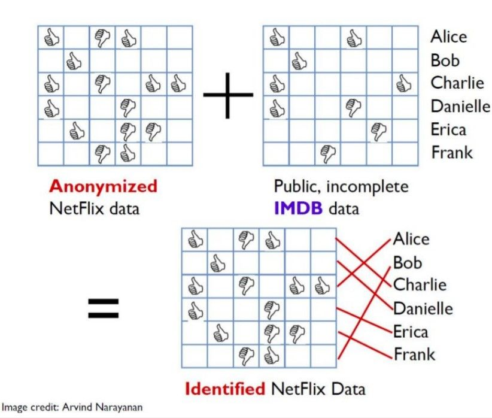
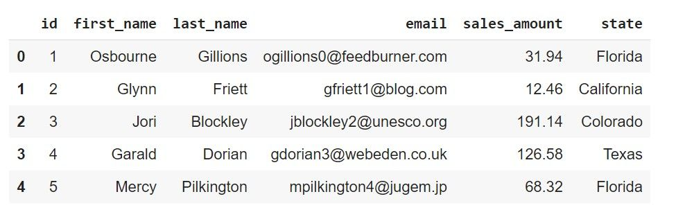
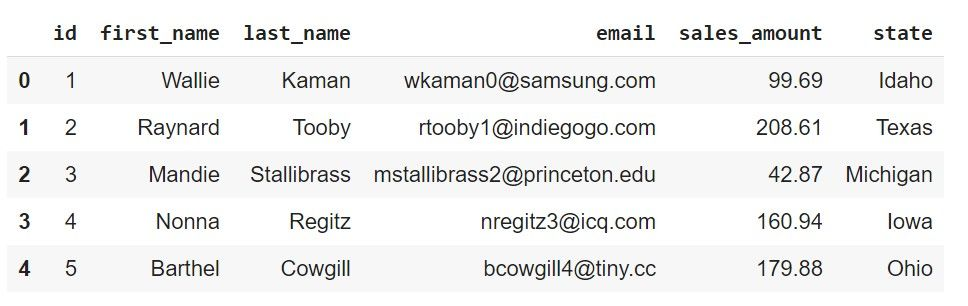
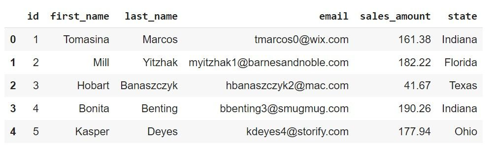
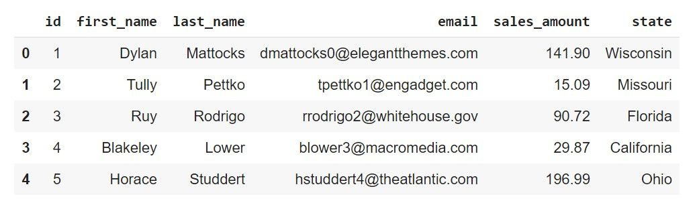
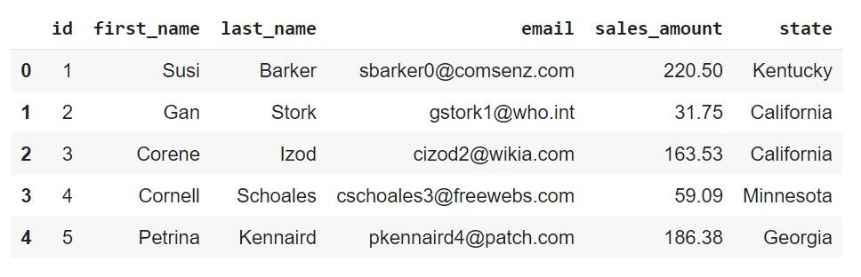
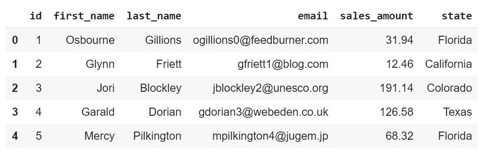
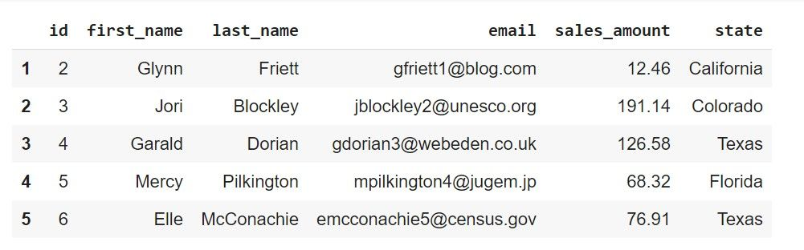

<!-- TODO(a11y): 8 localized body image(s) have empty alt text -->


### Outline

-   What does **Differential Privacy** try to address?
-   Why doesn’t **anonymization** suffice?
-   PyDP Example Walkthrough

### What does Differential Privacy try to address?

Differential privacy aims at addressing the paradox of **learning nothing about an individual while learning useful information about a population**. In essence, it describes the following promise, made by a data holder, or curator, to a data subject:

> “You will not be affected, adversely or otherwise, by allowing your data to be used in any study or analysis, **no matter what other studies, data sets, or information sources, are available**.”– _**Cynthia Dwork** in [The Algorithmic Foundations of Differential Privacy.](https://www.cis.upenn.edu/~aaroth/Papers/privacybook.pdf)_

Differential Privacy ensures that _any sequence of outputs_, which are _responses to queries_ is ‘essentially’ equally likely to occur, **independent** of the **presence** or **absence** of any individual’s record. Consider the illustration below, where the two databases `Database#1` and `Database#2` differ by only one record, say, _your data_. If the results obtained from querying the database under these two different settings, are almost the _same or similarly distributed_, then they essentially are **indistinguishable to an adversary**.

<figure class="">



<figcaption>Illustration of Differentially Private Database Mechanism <a href="https://github.com/chinmayshah99/pricon20/blob/master/ChinmayShah-Differential%20Privacy%20using%20PyDP.pdf">(Image Source)</a></figcaption></figure>

Mathematically,  
( Pr{M(d) in S} leq exp(epsilon)Pr{M(d’) in S} )  
where, `d` and `d’` are two subsets of data that differ by a single training example. `M(d)` is the output of the training algorithm for the training subset `d` and `M(d’)` is the output of the training algorithm for the training subset `d’`. The probabilities that these outputs belong to a specific set S under both these conditions should be arbitrarily close. The above equation should hold for all subsets `d` and `d’`.**Smaller the value of Ɛ, stronger the privacy guarantees.**

**Membership Inference Attack** (MIA) attempts at determining the **presence of a record** in a machine learning model’s **training data** by querying the model. From the discussion above, as the inclusion or exclusion of an individual’s data record cannot be inferred, differential privacy ensures protection against such attacks.

> Differentially private database mechanisms can therefore, make confidential data widely available for accurate data analysis.

### Why doesn’t Anonymization suffice?

The **Netflix Prize** was an open competition for the best collaborative filtering algorithm for movie recommendations. The dataset released was anonymized, **without** the **users** or the films being **identified** except by numbers assigned for the contest. Such **anonymized movie records** were published by Netflix as training data for the competition. However, there were several users who could be identified by linkage with the Internet Movie Database (**IMDb**) which was **non-anonymized** and **publicly available**. Researchers Arvind Narayanan and Vitaly Shmatikov, at the University of Texas at Austin present their studies in their work [Robust De-anonymization of Large Datasets (How to Break Anonymity of the Netflix Prize Dataset)](https://arxiv.org/abs/cs/0610105).

> Therefore, such linkage attacks can be used to **match** “**anonymized**” records with **non-anonymized** records in a different dataset.

Differential privacy aims at neutralizing such **linkage attacks.** As Differential Privacy is a property of the **data access mechanism**, and is **unrelated** to the **presence** or **absence** of **auxiliary information available to the adversary.**

> Therefore, access to the IMDb would no longer permit a linkage attack to someone whose history is in the Netflix training set than to someone not in the training set.

<figure class="">



<figcaption>De-anonymization of users in the Netflix Prize contest <a href="https://github.com/chinmayshah99/pricon20/blob/master/ChinmayShah-Differential%20Privacy%20using%20PyDP.pdf">(Image Credit: Arvind Narayanan)</a></figcaption></figure>

### PyDP Example Walkthrough

PyDP is OpenMined’s Python wrapper for Google’s [Differential Privacy](https://github.com/google/differential-privacy) project. The library provides a set of ε-differentially private algorithms, which can be used to produce aggregate statistics over numeric datasets containing private or potentially sensitive information.

### Installing PyDP

```python
!pip install python-dp # installing PyDP
```

### Necessary Imports

```python
import pydp as dp # by convention our package is to be imported as dp (dp for Differential Privacy!)
from pydp.algorithms.laplacian import BoundedSum, BoundedMean, Count, Max
import pandas as pd
import statistics 
import numpy as np
import matplotlib.pyplot as plt
```

### Fetch all the required data!

The dataset used here contains 5000 records, and is stored across 5 files, each file containing 1000 records. More specifically, the dataset contains details such as the first and last names, email addresses of customers and the amount they spent on purchasing goods, and the state in the US they’re from. Let’s fetch all the records, read them into pandas DataFrames and take a look at the head of each of the DataFrames.

```python
url1 = 'https://raw.githubusercontent.com/OpenMined/PyDP/dev/examples/Tutorial_4-Launch_demo/data/01.csv'
df1 = pd.read_csv(url1,sep=",", engine = "python")
print(df1.head())
```

<figure class="">



<figcaption>Head of DataFrame df1</figcaption></figure>

```python
url2 = 'https://raw.githubusercontent.com/OpenMined/PyDP/dev/examples/Tutorial_4-Launch_demo/data/02.csv'
df2 = pd.read_csv(url2,sep=",", engine = "python")
print(df2.head())
```

<figure class="">



<figcaption>Head of DataFrame df2</figcaption></figure>

```python
url3 ='https://raw.githubusercontent.com/OpenMined/PyDP/dev/examples/Tutorial_4-Launch_demo/data/03.csv'
df3 = pd.read_csv(url3,sep=",", engine = "python")
df3.head()
```

<figure class="">



<figcaption>Head of DataFrame df3</figcaption></figure>

```python
url4 = 'https://raw.githubusercontent.com/OpenMined/PyDP/dev/examples/Tutorial_4-Launch_demo/data/04.csv'
df4 = pd.read_csv(url4,sep=",", engine = "python")
print(df4.head())
```

<figure class="">



<figcaption>Head of DataFrame df4</figcaption></figure>

```python
url5 = 'https://raw.githubusercontent.com/OpenMined/PyDP/dev/examples/Tutorial_4-Launch_demo/data/05.csv'
df5 = pd.read_csv(url5,sep=",", engine = "python")
print(df5.head())
```

<figure class="">



<figcaption>Head of DataFrame df5</figcaption></figure>

Now that we’ve fetched records from all the 5 files, let us concatenate all the DataFrames into a single large DataFrame and this constitutes our original dataset. Note that our dataset has 5000 rows(records) and 6 columns.

```python
combined_df_temp = [df1, df2, df3, df4, df5]
original_dataset = pd.concat(combined_df_temp)
print(original_dataset.shape)

# Result
# (5000,6)
```

### Creating a Parallel Database

Let us now create a parallel database that differs by only one record, say, Osbourne’s record and name it `redact_dataset`. We then inspect the heads of both DataFrames to verify that Osbourne’s record has been removed.

```python
redact_dataset = original_dataset.copy()
redact_dataset = redact_dataset[1:]
print(original_dataset.head())
print(redact_dataset.head())
```

<figure class="">



</figure>

<figure class="">



</figure>

At this point, let us ask ourselves the following question.

> Is the amount of money we spend at our neighbourhood store private or sensitive information? Well, it may not seem all that sensitive! But, what if the same information can be used to identify us?

In the example that we have, let us say we remove all personal information such as name and email address. Given that there’s some access to the store’s sales record, will the sales amount in itself not suffice to infer Osbourne’s identity? Yes!

And to do that, we sum up all entries in the `sales_amount` column in our original dataset, and the `redact_dataset`. The difference between these two sums exactly gives us the amount that Osbourne spent, and is verified as shown in the code snippet below. This is a simple example where membership inference was successful even after removal of personally identifiable information.

```python
sum_original_dataset = round(sum(original_dataset['sales_amount'].to_list()), 2)
sum_redact_dataset = round(sum(redact_dataset['sales_amount'].to_list()), 2)
sales_amount_Osbourne = round((sum_original_dataset - sum_redact_dataset), 2)
assert sales_amount_Osbourne == original_dataset.iloc[0, 4]
```

### Differentially Private Sum

Now, we illustrate how **differentially private sum** in place of **simple sum** can help in rendering membership inference attacks unsuccessful. For the example above, let’s assume that the customers should spend a minimum of 5$ at the store and no more than 250$ for a particular purchase.

We then go ahead and compute **differentially private sum** on both original and the parallel dataset that differed by one record, as shown in the code snippets below.

```python
dp_sum_original_dataset = BoundedSum(epsilon= 1.5, lower_bound =  5, upper_bound = 250, dtype ='float') 
dp_sum_og = dp_sum_original_dataset.quick_result(original_dataset['sales_amount'].to_list())
dp_sum_og = round(dp_sum_og, 2)
print(dp_sum_og)

# Output dp_sum_og
# 636723.61
```

```python
dp_redact_dataset = BoundedSum(epsilon= 1.5, lower_bound =  5, upper_bound = 250, dtype ='float')
dp_redact_dataset.add_entries(redact_dataset['sales_amount'].to_list())
dp_sum_redact=round(dp_redact_dataset.result(), 2)
print(dp_sum_redact)

# Output dp_sum_redact
# 636659.17
```

Let’s proceed to summarize a few observations.

-   Now that we’ve calculated the differentially private sum on the original and the second dataset, it’s straightforward to verify that that the differentially private sums are not equal to sums under the non-differentially private setting.
-   Also, the difference is no longer equal to the amount that Osbourne spent indicating that membership attacks would now be unsuccessful, regardless of access to any other customer records.
-   Interestingly, the differentially private sum values are still comparable and are not very different.
-   We’ve therefore succeeded in ensuring differential privacy in our simple example!

```python
print(f"Sum of sales_value in the orignal dataset: {sum_original_dataset}")
print(f"Sum of sales_value in the orignal dataset with DP: {dp_sum_og}")
assert dp_sum_og != sum_original_dataset

# Output
Sum of sales_value in the orignal dataset: 636594.59
Sum of sales_value in the orignal dataset with DP: 636723.61

print(f"Sum of sales_value in the second dataset: {sum_redact_dataset}")
print(f"Sum of sales_value in the second dataset with DP: {dp_sum_redact}")
assert dp_sum_redact != sum_redact_dataset

# Output
Sum of sales_value in the second dataset: 636562.65
Sum of sales_value in the second dataset with DP: 636659.17

print(f"Difference in Sum with DP: {round(dp_sum_og - dp_sum_redact, 2)}")
print(f"Actual Difference in Sum: {sales_amount_Osbourne}")
assert round(dp_sum_og - dp_sum_redact, 2) != sales_amount_Osbourne

# Output
Difference in sum using DP: 64.44
Actual Value: 31.94
```

Hope this introductory post helped in understanding the intuition behind differential privacy and protection against membership inference attacks. We shall look at a few more examples in subsequent blog posts.?

---

### References

\[1\] [The Algorithmic Foundations of Differential Privacy](https://www.cis.upenn.edu/~aaroth/Papers/privacybook.pdf) by Cynthia Dwork.

\[2\] [PyDP Tutorial by Chinmay Shah](https://www.youtube.com/watch?v=15OgnNsvEo8) at OpenMined Privacy Conference 2020

Cover Image of Post: Photo by [Jared Arango](https://unsplash.com/@jaredrossarango?utm_source=ghost&utm_medium=referral&utm_campaign=api-credit) on Unsplash.
