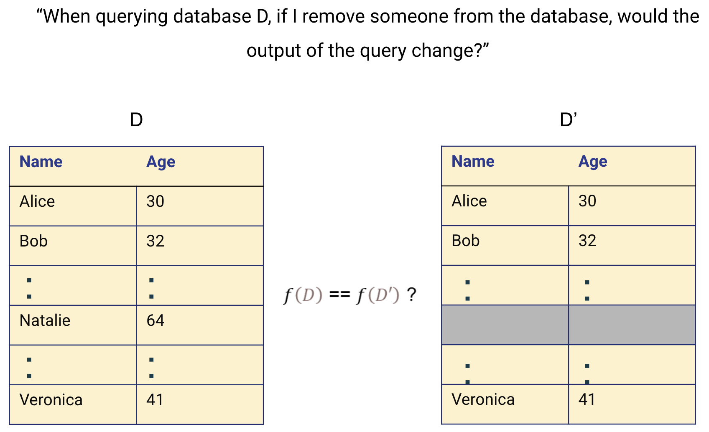
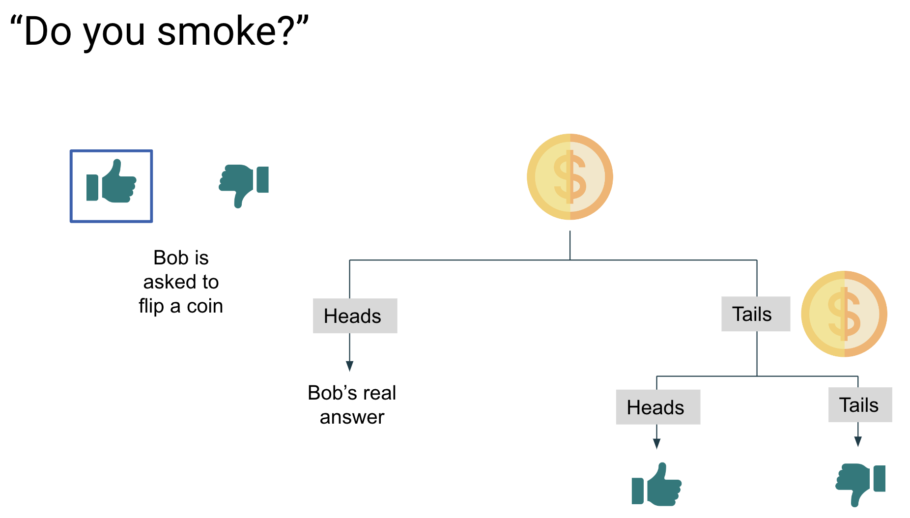
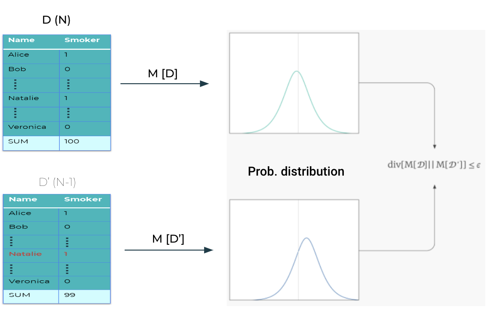
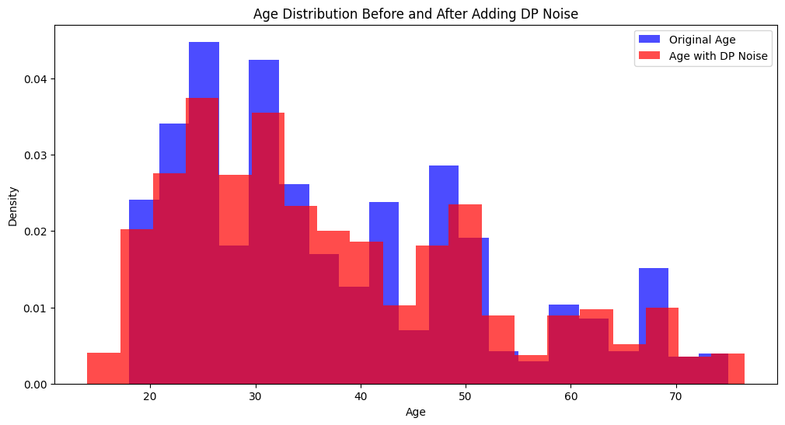
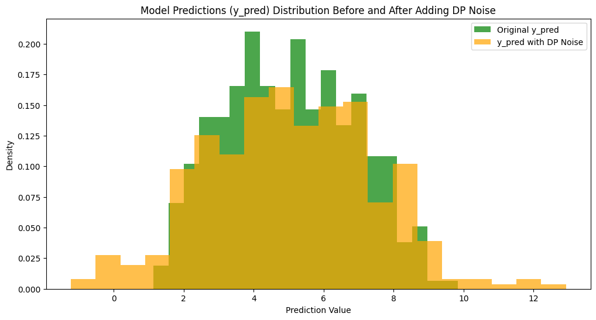
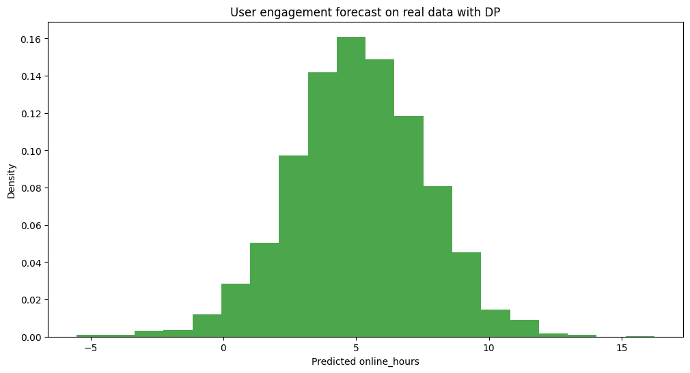

<!-- TODO(a11y): 6 localized body image(s) have empty alt text -->


<!-- TODO(content): gallery (flattened to images — verify) -->

Welcome to our guide! In this tutorial, we are going to cover the following topics:

-   What is differential privacy?
-   PySyft & differential privacy
-   Tutorial: privacy-preserving machine learning using PySyft & OpenDP

If you’re already familiar with Differential Privacy, you can dive straight into the details [here](#)!

## Background: What is differential privacy?

Imagine you have a dataset `D`, which is a list of people’s ages. Now, let’s say you want to check if removing someone’s age would significantly change the result of the query, such as finding the average age. As the dataset owner, you should wonder:

> _“If I remove one person’s data from this list, would the result of my query change?”_

To figure this out, you can create a slightly modified version of the original dataset `D’` by removing or changing one person’s data. Then, you run the same query on both `D` and `D'`. If the results are nearly identical, it means that the query doesn’t rely heavily on that specific person’s data. In other words, someone looking at the results wouldn’t be able to tell whether that person’s data was included or not.

When this holds true for every individual in the dataset, you can say that the privacy of each person’s data is protected.

When this holds true for every individual in the dataset, their privacy is protected. **This concept is known as differential privacy, which guarantees that the output of a query is nearly the same whether or not a single individual’s data is included.** It ensures that removing or replacing any one person’s data has little to no effect on the overall result, thus safeguarding privacy by making it difficult to infer anyone’s inclusion in the dataset.

<figure class="wp-block-image size-large">



</figure>

## Example: A privacy-preserving survey

Imagine we want to conduct a survey to determine the percentage of people who smoke. Participants are asked a sensitive question: “Do you smoke?” However, because some might hesitate to answer honestly due to privacy concerns, we introduce a method to protect their privacy.

Let’s say Bob’s truthful answer is “Yes.” Instead of directly recording his response, we ask him to flip a coin. If it lands heads, he answers “Yes,” regardless of the truth. If it lands tails, he flips a second coin—answering “Yes” if it’s heads and “No” if it’s tails.

This randomized process adds noise to Bob’s true response, creating a layer of uncertainty. While there’s a 50% chance his Bob’s response reflects his real answer, there’s also a 25% chance it’s determined solely by the coin flips. This mechanism provides plausible deniability — Bob can always claim his answer was determined by the coin toss, protecting his privacy since we can never be certain whether Bob is actually a smoker.

<figure class="wp-block-gallery has-nested-images columns-default is-cropped wp-block-gallery-4 is-layout-flex wp-block-gallery-is-layout-flex"><figure class="wp-block-image size-large">



</figure></figure>

### Case 1: Smoking Survey without DP Noise

Let’s consider a scenario where no noise mechanism is applied to a survey dataset where responses are binary (0 or 1). An attacker who wants to determine if Bob is a smoker could compare the sum of responses in two datasets, D and D’. If the sum in D’ is one less than that in D, it reveals that Bob’s response was 1, indicating that he is a smoker.

The important takeaway here is that the maximum difference between the sums of `D` and `D'` is 1. This defines the `sensitivity (δ)` of the sum query – **the maximum change in the query result when a single individual is added or removed from the dataset.**

### Case 2: Smoking Survey with DP Noise

Now, if noise is introduced through a randomization mechanism, such as the coin flip mechanism before recording the response, it becomes much harder for an attacker to determine whether Bob’s response reflects his true answer or the randomized outcome of the coin flip. This noise effectively hides Bob’s actual response, thereby protecting it from direct inference attacks.

## Measure Privacy Loss: Privacy Budget

Even with the added noise, Bob’s response is not entirely protected, as repeated queries could increase the likelihood of inferring his true answer. To limit this risk, we use a **privacy budget**, denoted by `epsilon (ϵ)`.

When a randomized mechanism is applied to a dataset D, it slightly alters the probability distribution of outcomes when an individual is removed from the dataset D’, as we can see in the bottom diagram. The difference between two probability distributions is called **Renyi Divergence**. Therefore, if the Renyi divergence between `M[D]` and `M[D’]` is less than or equal to epsilon ϵ, then we can say that the mechanism is epsilon-differentially private.

A **smaller ϵ** provides stronger privacy but less accuracy, while a **larger ϵ** offers better accuracy at the cost of reduced privacy.

<figure class="wp-block-image size-large">



</figure>

In the above figure, M \[●\] is a Randomized Mechanism. The mechanism is ϵ – differentially private if and only if

\\( \\text{div } \[M\[D\] \\parallel M\[D’\]\] \\leq \\epsilon \\)

The above is an equation of Renyi divergence, a measure of the difference between two probability distributions. In fact, ϵ is the privacy budget that denotes how large the divergence can be between the distributions.

If you are still curious about DP, it’s various practical use-cases and more interesting stuffs, make sure to check out this [great blog series by Damien Desfontaines](https://desfontain.es/blog/friendly-intro-to-differential-privacy.html) and for more mathematical depth into the guarantees of DP, original book by Cynthia Dwork [The Algorithmic Foundations of Differential Privacy](https://www.cis.upenn.edu/~aaroth/Papers/privacybook.pdf) is a great resource!

## In Practice: Differential Privacy in PySyft

PySyft serves as a platform for Privacy-Enhancing Technologies (PETs), but without having a built-in DP integration. Think of PySyft as a “car” that provides the infrastructure for secure, privacy-preserving analysis, allowing third-party PETs library to use together or individually on the platform. Therefore, you can use any Python-based third-party DP library.

It is entirely up to the researchers and data owners how they would like to collaborate using DP. For instance, researchers can implement DP directly within the syft function (output privacy), with data owners specifying a privacy budget, so both parties must account if the budget is appropriately used. Otherwise, one can also upload mock or private data that is DP-syntethically generated (input privacy). In short, **PySyft is structured in such a way that you can easily integrate any arbitrary third-party DP library within this framework, just as you would in a regular Python environment**.

There are a lot of third-party libraries you could use:

1.  [OpenDP](https://github.com/opendp/opendp/tree/main): A comprehensive library designed for privacy-aware computations adhereing to the principles of differential privacy, which has Python and R binding available (which makes it a good candidate for PySyft!).
2.  [IBM Diffprivlib](https://github.com/IBM/differential-privacy-library): A scikit-learn extension for differential privacy (DP) in machine learning tasks, offering DP versions of common models and data operations.
3.  [SmartNoise SDK](https://github.com/opendp/smartnoise-sdk): A Python library built on top of OpenDP, simplifying DP in data analysis and machine learning, with SQL interfaces and data platform compatibility.
4.  [TensorFlow Privacy](https://github.com/tensorflow/privacy): Extends TensorFlow with DP tools for training deep learning models, offering DP optimizers, accounting, and noise mechanisms.
5.  [Differentially Private Follow-the-Regularized-Leader (DP-FTRL)](https://github.com/google-research/DP-FTRL): This Python library implements a differentially private algorithm for deep learning that does not rely on shuffling or subsampling like DP-SGD. This library supports DP for both centralised learning and federated learning.

In this tutorial, we are going to use one of first, [OpenDP](https://docs.opendp.org/en/stable/index.html).

## Rule of thumb: When to use DP

You might have more depth to your questions in the resources mentioned above, such as the [blog series by Damien Desfontaines](https://desfontain.es/blog/friendly-intro-to-differential-privacy.html). Here are a few rules of thumb you can follow:

**When to Use**

-   **Sensitive Data Analysis:** For personal or sensitive data (e.g., healthcare, finance, user behavior) to protect individual privacy.
-   **Statistical Aggregation:** Ideal for scenarios involving aggregation on large datasets, like computing averages or histograms, where privacy leakage through individual data points needs to be minimized.
-   **Machine Learning with Sensitive Data:** When training machine learning models on sensitive data to prevent exposure of individual data points (e.g., medical records).

**When Not to Use**

-   **Small Datasets or Subsets:** Avoid DP when working with small datasets or limited data subjects, as the added noise can significantly distort the results, reducing their utility and making the analysis ineffective.
-   **High Precision Requirements:** Do not use DP in applications requiring highly precise or critical results, such as financial trading systems or safety-critical machine learning models, where the noise introduced could lead to errors.
-   **Non-Sensitive Data:** If the data is already public or non-sensitive, such as weather data or aggregated metrics with no privacy concerns, the use of DP may not be needed and may unnecessarily degrade data quality.

## Tutorial: Using DP for Machine Learning Predictions

In this section of the blog, we will see an example of using Differential Privacy inside PySyft.

Let’s saw we would like to predict user engagement and specifically, forecast their screentime. However, as these are individuals, we want to protect their privacy. We are not the first ones doing this, so we adapted this analysis to be done against private data, without seeing the data, and to use differential privacy to protect individuals in PySyft.

```
Installing the libraries
$ pip install syft skops opendp
```

For more insights on how to install PySyft, refer to our [docs](https://docs.openmined.org/).

### Step 1: Uploading the data to PySyft

#### A. Prepare data for upload

At first, let’s download the dataset for this tutorial.

```
!curl -o pings_small.csv https://openminedblob.blob.core.windows.net/syft-files/pings_small.csv
```

```
import pandas as pd
df = pd.read_csv("pings_small.csv")
df.head()
```

You will see the a sample of the data as the output.

```
# Remove unnecessary columns 
df = df.drop(columns=['Unnamed: 0', 'number_of_kids'])
```

Next, we would have to generate the mock data. However, as this is not the focus of the tutorial, we will split this dataset into real and mock data. In practice, you would need to have a mock data that is fake or syntethically generated ot look like the real one.

```
ids = df['id'].drop_duplicates().sample(n=900)
print("No. of randomly selected ids for real data:", len(ids))

real_df = df[df['id'].isin(ids)]
tmp_df = df[~df['id'].isin(ids)]
ids = tmp_df['id'].drop_duplicates().sample(n=100)
print("No. of randomly selected ids for mock data:", len(ids))

mock_df = tmp_df[tmp_df['id'].isin(ids)]

print("Real data size:", real_df.shape)
print("Mock data size:", mock_df.shape)

df.head()
```

#### B. Upload Data to Server

```
import syft as sy
data_site = sy.orchestra.launch(name="user_engagement_data_center")

# Once the server is up and running, we can login into the server:
owner_client = data_site.login(email="info@openmined.org", password="changethis")
owner_client
```

Next, we will create the PySyft wrapper assets from the real and mock data:

```
pings_asset = sy.Asset(
    name="User pings data.",
    data = real_df, # real data
    mock = mock_df  # mock data
)

# Test the outputs
pings_asset.data.head(n=3)
pings_asset.mock.head(n=3)
```

We can wrap these assets into a `syft.Dataset` object to approprietly provide the additional metadata (e.g. description, citation, contributors) that further describe the data.

```
# Metadata
description = """
About this data:

1. id: Unique customer id whose ping has been received.
2. gender: Gender of the customer
3. age: Customer’s age
4. timestamp: The Unix epoch timestamp when ping was received by the
system.

"""
citation = "Kaggle: https://www.kaggle.com/code/tanishqjazz/user-engagement-prediction-screentime-forecasting"
summary = "The user engagement dataset contains user id, gender, age and the timestamp they made pings. The dataset can be used for screen time forecasting."

# Dataset creation
pings_dataset = sy.Dataset(
    name="User Engagement Dataset",
    description=description,
    summary=summary,
    citation=citation
)

# Add assets to the dataset
pings_dataset.add_asset(pings_asset)

# Check the dataset 
pings_dataset
```

```
# Upload the dataset
owner_client.upload_dataset(dataset=pings_dataset)
```

```
# Check available datasets 
owner_client.datasets
```

### Step 2: Create credentials for external researcher

Let’s say someone who is not part of my company wants to study my data and try forecast the screentime. We can create an account for him and send him the credentials.

```
ds_account_info = owner_client.users.create(
    email="bobivans@datascience.inst",
    name="Dr. Bob Ivans",
    password="syftrocks",
    password_verify="syftrocks",
    institution="Data Science Institute",
    website="https://datascience_institute.research.data"
)

print(f"New User: {ds_account_info.name} ({ds_account_info.email}) registered as {ds_account_info.role}")
```

### Step 3: Researcher connects to server

```
ds_client = data_site.login(email="bobivans@datascience.inst", password="syftrocks")

# Inspect available datasets
ds_client.datasets
```

Once identified the dataset the data scientist is interested in, the researcher can access its metadata:

```
user_eng_dataset = ds_client.datasets["User Engagement Dataset"]user_eng_dataset
```

Simiarly, the researcher can access the mock data hosted by this dataset:

```
assets = user_eng_dataset.assets[0]
assets
```

As an external data scientist, users only have access to the mock data, not the private data.

### Step 4: Researcher submits analysis using DP

#### A. How to use DP to protect my data?

As a data scientist, you can incorporate Differential Privacy (DP) at various stages of your data analysis or machine learning pipeline. Primarily, DP can be applied to safeguard either the input data or the output results. This formulation is inspired by [Structured Transparency](https://arxiv.org/pdf/2012.08347) and can be detailed as follows:

-   **Input Privacy:** Adding DP noise to input features, masking their true values to protect sensitive information before it is used.
-   **Output Privacy:** DP noise is added to the final results, such as aggregated statistics or model outputs, providing protection at the end of the pipeline.

You might say – _“it seems much simpler to add it at the beginning, so any computation after stays privacy-preserving”_. That’s true! However, there is always a trade-off between privacy and utility. Excessive noise can make the results useless, while too little noise may leave private data vulnerable. If you use input privacy, you might need to add a lot of noise to make sure every single individual is protected – making indeed some analysis less informative. However, the output privacy empowers you to control better where you need the noise and get back more utility under the same _privacy budget_.

Guidelines to decide on the ‘right’ privacy budget is outside the scope of this tutorial. Feel free to refer to this [tutorial](https://medium.com/multiple-views-visualization-research-explained/visualizing-the-accuracy-privacy-trade-off-to-improve-budget-decisions-with-differential-privacy-66fc3efb34a).

In this example, we will show how to add a **Laplacian DP noise** using `OpenDP`. To understand what goes underneath, we also present you with the `NumPy` alternative. Additionally, we’ll showcase both input and output privacy.

---

##### Case 1: Input Privacy

Let’s start with input privacy and test it locally.

```
from datetime import datetime
import numpy as np
import matplotlib.pyplot as plt

import opendp.prelude as dp

## This function contains some data preprocessing details for the data to fit the ML model. 
## Feel free to skip the details inside this function.
def data_preprocessing(df):
    """
    helper fuction for preprocessing the data to extract required features for better model accuracy
    """

    # Data preprocessing
    df.dropna(how='any', inplace=True)
    df['gender'] = df['gender'].replace({'MALE':1, 'FEMALE':0})
    df['timestamp_decode'] = df['timestamp'].apply(lambda x: datetime.fromtimestamp(x))

    # Feature engineering
    df['date'] = pd.to_datetime(df['timestamp_decode'].dt.date)

    df['online_hours'] = (df.groupby(by=['id','date'])['timestamp'].diff())/(60*60)
    df['online_hours']  =  df['online_hours'].apply(lambda x: x if x< (2/60) else (2/60))

    tmp_df = (df.groupby(by = ['id','date'])['online_hours'].sum()).reset_index()
    tmp_df['online_hours'] = round(tmp_df['online_hours'], 1) #runding off hours

    df = pd.merge(df[['id', 'date', 'gender', 'age']], tmp_df, on=['id', 'date'], how = 'inner')
    df.drop_duplicates(inplace=True)

    df['day_name'] = df['date'].dt.day_name()
    df['day'] = df['date'].dt.day
    df['month'] = df['date'].dt.month
    df['month_name'] = df['date'].dt.month_name()
    df['year'] = df['date'].dt.year
    df['dayofweek'] = df['date'].dt.dayofweek
    df['week']= df['date'].dt.isocalendar().week

    week_names = {'Sunday':0,'Monday':'1','Tuesday':2,'Wednesday':3, 'Thursday':4,'Friday':5,'Saturday':6}
    month_names = {'January':0, 'February':1,'March':2,'April':3,'May':4,'June':5,'July':6,
                    'August':7, 'September':8,'October':9,'November':10,'December':11}

    df['day_name'] = df['day_name'].map(week_names)
    df['month_name'] = df['month_name'].map(month_names)

    print("Final preprocessed data size:", df.shape)

    display(df.head())

    return df

# Function for adding DP to an input feature
def dp_in_input_privacy(df, column="age", noise_lib="odp"):
    
    # Parameters for DP noise
    epsilon = 0.9  # Privacy budget, smaller means more noise
    sensitivity = 1.0  # Sensitivity of the 'age' column, assuming change by 1 unit
    
    if noise_lib == "numpy":
    
        # Adding laplace noise using Numpy
        laplace_noise = np.random.laplace(loc=0, scale=sensitivity/epsilon, size=len(df))
        df['age_noisy'] = df[column] + laplace_noise
    
    else:

        # Differential privacy
        dp.enable_features("contrib")
        input_space = dp.atom_domain(T=float), dp.absolute_distance(T=float)
        
        # Adding laplace noise using OpenDP
        laplace_noise = dp.m.make_laplace(*input_space, scale=sensitivity/epsilon)
        df[column] = df[column].astype(float)
        df['age_noisy'] = df[column].apply(lambda x: laplace_noise(x))

    # Plotting the bell curve distribution of 'age' before and after adding noise
    plt.figure(figsize=(12, 6))
    plt.hist(df[column], bins=20, alpha=0.7, label='Original Age', color='blue', density=True)
    plt.hist(df['age_noisy'], bins=20, alpha=0.7, label='Age with DP Noise', color='red', density=True)
    plt.title('Age Distribution Before and After Adding DP Noise')
    plt.xlabel('Age')
    plt.ylabel('Density')
    plt.legend()
    plt.show()

    
mock_df_proc = data_preprocessing(mock_df)
# Add input privacy using OpenDP
dp_in_input_privacy(mock_df_proc, column="age", noise_lib="odp")  

# Try running using noise_lib="numpy" to see if there are differences
```

<figure class="wp-block-image size-full">



</figure>

As we can see in the above plot, the density of `age` distribution has slightly shifted after adding the DP noise.

---

##### Case 2: Output Privacy

Let’s see how that looks like.

```

from sklearn.model_selection import train_test_split
from sklearn.ensemble import RandomForestRegressor
from sklearn.metrics import mean_squared_error
from sklearn.preprocessing import MinMaxScaler

# Function for adding DP to the model output
def dp_in_output_privacy(df, noise_lib="odp"):
    
    # Parameters for DP noise
    epsilon = 0.9  # Privacy budget, smaller means more noise
    sensitivity = 1.0  # Sensitivity of the 'age' column, assuming change by 1 unit
    
    X = df.drop(['id', 'date', 'online_hours'], axis=1)
    y = df['online_hours']
    
    X_train, X_test, y_train, y_test = train_test_split(X, y, test_size=0.2, random_state=42)
    
    scaler = MinMaxScaler()
    X_train = scaler.fit_transform(X_train)
    X_test  = scaler.transform(X_test)

    # Regressor model 
    model = RandomForestRegressor(n_estimators=100, random_state=42)

    # Training the model
    model.fit(X_train, y_train)
    
    # Evaluation
    y_pred = model.predict(X_test)
    
    if noise_lib == "numpy":
    
        # Adding laplace noise using Numpy
        pred_noise = np.random.laplace(loc=0, scale=sensitivity/epsilon, size=len(y_pred))
        y_pred_noisy = y_pred + pred_noise
    
    else:
        
        # Differential privacy
        dp.enable_features("contrib")
        input_space = dp.atom_domain(T=float), dp.absolute_distance(T=float)
        
        # Adding laplace noise using OpenDP
        laplace_noise = dp.m.make_laplace(*input_space, scale=sensitivity/epsilon)
        y_pred_noisy = pd.Series(y_pred).apply(lambda x: laplace_noise(x))
    

    # Plotting the bell curve distribution of y_pred before and after adding noise
    plt.figure(figsize=(12, 6))
    plt.hist(y_pred, bins=20, alpha=0.7, label='Original y_pred', color='green', density=True)
    plt.hist(y_pred_noisy, bins=20, alpha=0.7, label='y_pred with DP Noise', color='orange', density=True)
    plt.title('Model Predictions (y_pred) Distribution Before and After Adding DP Noise')
    plt.xlabel('Prediction Value')
    plt.ylabel('Density')
    plt.legend()
    plt.show()
    

dp_in_output_privacy(mock_df_proc, noise_lib="odp")

# Try running using noise_lib="numpy" to see if there are differences
```

<figure class="wp-block-image size-full">



</figure>

Feel free to play with the `epsilon` and `sensitivity` to see the impact on the distribution, specially the **change in distribution for a lower `epsilon` versus a higher `epsilon`**.

---

#### B. Prepare code submission

Now that we understood how to apply DP in different stages of our code, it is time to convert them to a `syft` code so that we can submit it to the Data Owner’s server and run them on real private data.

To do that, we wrap our code that trains the ML model on the data in a function and add its syft function decorator as such:

```
def user_engagement_forecast_using_dp(df, seed: int = 12345): #-> tuple[float, float]:
    
    # include the necessary imports in the main body of the function
    # to prepare for what PySyft would expect in the submitted code.
    
    from datetime import datetime
    import pandas as pd 
    
    from sklearn.model_selection import train_test_split
    from sklearn.ensemble import RandomForestRegressor
    from sklearn.metrics import mean_squared_error
    from sklearn.preprocessing import MinMaxScaler
    
    from skops.io import dumps, loads #get_untrusted_types, dump, load

    import numpy as np
    
    import opendp.prelude as dp
    from opendp.transformations import make_count
    # from opendp.measurements import make_geometric
    from opendp.measurements import make_gaussian
    
    ## This function contains some details for the data to fit properly to the ML model. 
    ## Feel free to skip this function.
    def data_preprocessing(df):
        """
        helper fuction for preprocessing the data to extract required features for better model accuracy
        """
        
        # Data preprocessing
        df.dropna(how='any', inplace=True)
        df['gender'] = df['gender'].replace({'MALE':1, 'FEMALE':0})
        df['timestamp_decode'] = df['timestamp'].apply(lambda x: datetime.fromtimestamp(x))

        # Feature engineering
        df['date'] = pd.to_datetime(df['timestamp_decode'].dt.date)

        df['online_hours'] = (df.groupby(by=['id','date'])['timestamp'].diff())/(60*60)
        df['online_hours']  =  df['online_hours'].apply(lambda x: x if x< (2/60) else (2/60))

        tmp_df = (df.groupby(by = ['id','date'])['online_hours'].sum()).reset_index()
        tmp_df['online_hours'] = round(tmp_df['online_hours'], 1) #runding off hours

        df = pd.merge(df[['id', 'date', 'gender', 'age']], tmp_df, on=['id', 'date'], how = 'inner')
        df.drop_duplicates(inplace=True)

        df['day_name'] = df['date'].dt.day_name()
        df['day'] = df['date'].dt.day
        df['month'] = df['date'].dt.month
        df['month_name'] = df['date'].dt.month_name()
        df['year'] = df['date'].dt.year
        df['dayofweek'] = df['date'].dt.dayofweek
        df['week']= df['date'].dt.isocalendar().week

        week_names = {'Sunday':0,'Monday':'1','Tuesday':2,'Wednesday':3, 'Thursday':4,'Friday':5,'Saturday':6}
        month_names = {'January':0, 'February':1,'March':2,'April':3,'May':4,'June':5,'July':6,
                        'August':7, 'September':8,'October':9,'November':10,'December':11}

        df['day_name'] = df['day_name'].map(week_names)
        df['month_name'] = df['month_name'].map(month_names)

        print("Final training data size:", df.shape)
        
        display(df.head())
        
        return df
    
    
    def dp_in_input_privacy(df, column="age"):

        # Parameters for DP noise
        epsilon = 0.9  # Privacy budget, smaller means more noise
        sensitivity = 1.0  # Sensitivity of the 'age' column, assuming change by 1 unit

        # Differential privacy
        dp.enable_features("contrib")
        input_space = dp.atom_domain(T=float), dp.absolute_distance(T=float)
        
        # Adding laplace noise using OpenDP
        laplace_noise = dp.m.make_laplace(*input_space, scale=sensitivity/epsilon)
        df[column] = df[column].astype(float)
        df['age_noisy'] = df[column].apply(lambda x: laplace_noise(x))
        
        return df
        
        
    def dp_in_output_privacy(y_pred):

        # Parameters for DP noise
        epsilon = 0.9  # Privacy budget, smaller means more noise
        sensitivity = 1.0  # Sensitivity of the 'age' column, assuming change by 1 unit

        # Differential privacy
        dp.enable_features("contrib")
        input_space = dp.atom_domain(T=float), dp.absolute_distance(T=float)
        
        # Adding laplace noise using OpenDP
        laplace_noise = dp.m.make_laplace(*input_space, scale=sensitivity/epsilon)
        y_pred_noisy = pd.Series(y_pred).apply(lambda x: laplace_noise(x))
        
        return y_pred_noisy
    

    # Apply preprocessing steps to df
    df = data_preprocessing(df)
    
    # Apply the noise to 'age'
    df = dp_in_input_privacy(df)

    # Train-test split
    X = df.drop(['id', 'date', 'online_hours', 'age'], axis=1)
    y = df['online_hours']
    
    X_train, X_test, y_train, y_test = train_test_split(X, y, test_size=0.2, random_state=42)
    
    scaler = MinMaxScaler()
    X_train = scaler.fit_transform(X_train)
    X_test  = scaler.transform(X_test)

    # Regressor model 
    model = RandomForestRegressor(n_estimators=100, random_state=42)

    # Training the model
    model.fit(X_train, y_train)

    # Convert model into a serialized format using skops [https://skops.readthedocs.io/en/stable/persistence.html]
    # This step is necessary to make the output type compatible with PySyft.
    serialized_model = dumps(model)
    loaded = loads(serialized_model, trusted=type(model))
    
    print("Original model datatype:", type(loaded))
    print("Returned model datatype:", type(serialized_model))
    
    # Evaluation
    y_pred = model.predict(X_test)
    y_pred_noisy = dp_in_output_privacy(y_pred)
    
    mse = mean_squared_error(y_test, y_pred)
    rmse = np.sqrt(mse)

    print(f'Mean Squared Error: {mse}')
    print(f'Root Mean Squared Error: {rmse}')
    
    return serialized_model, mse, rmse, y_pred_noisy
```

```
# Test before executing on mock data
serialized_model, mse, rmse, y_pred_noisy = user_engagement_forecast_using_dp(mock_df)
```

```
remote_user_code = sy.syft_function_single_use(df=assets)(user_engagement_forecast_using_dp)
```

Now, we can use the `create_code_request` method to attach our new code request to our `syft.Project` instance.

```
# Desribe the project
description = """The purpose of this study will be to run a machine learning experimental pipeline on user pings engagement data. As first attempt, the pipelines includes a normalisation steps for features and labels using a MinMaxScaler. Then it adds differential privacy noise on the 'age' column and finally on the model predictions. The selected ML model is RandomForest regression, with the intent to gather the mean squared error scores on both training, and testing  data partitions, randomly generated.
"""

# Create a project

research_project = ds_client.create_project(
    name="User Engagement Forecasting ML Project",
    description=description,
    user_email_address="bobivans@datascience.inst"
)

code_request = research_project.create_code_request(remote_user_code, ds_client)
code_request
```

Until the request is approved by the Data Owner, the data scientist cannot execute the code on the high side datasite on private data.

```
ds_client.code.user_engagement_forecast_using_dp(df=assets)
```

### Step 5: Data Owner reviews submission

```
# Reveiew the request
request = owner_client.requests[0]

# Read the submitted code
request.code
```

The data owner can judge how their data is being used, if differential privacy is applied appropriately with a reasonable amount of noise and decide whether to apply

```
# Let's say our request is approved
request.approve()
```

### Step 6: Researchers gets the result

On the data scientist end, the user can now see the changed status of their code request. If it is `Approved`, the user will be able to retrieve the results.

If we were to check the status of our request, we can do so by accessing `client.requests`:

```
ds_client.requests
```

```
# Get the dataset on which the code was requested
user_engage_dataset = ds_client.datasets["User Engagement Dataset"]
df = user_engage_dataset.assets[0]

result = ds_client.code.user_engagement_forecast_using_dp(df=df)
```

The output is returned as `result` which is a tuple containing the returned objects from `user_engagement_forecast_using_dp`. We can access the objects from this tuple by indices.

```
print("mse:", result[1])
print("rmse:", result[2])
```

It’s important to remember that the trained model was returned as a `syft AnyActionObject` object. Inside `AnyActionObject` the model is stored as a serialized bytesarray. Therefore, in order to get the model to make predictions on new data, we have to first extract the serialized model from the element at `result[0]`, then load it back as a `sklearn` model.

```
from skops.io import dump, loads

# Extract the first element from the tuple and obtain the serialized data
syft_model = result[0]
model_bytes = syft_model.syft_action_data

# Load the serialized model as a desrialized sklearn model
loaded_model = loads(model_bytes, trusted='sklearn.ensemble._forest.RandomForestRegressor')

# Make screentime forecast on a new user
new_data = pd.DataFrame({
    'gender': [1],
    'age': [45],
    'day_name': [3], 
    'day': [2],
    'month': [8],
    'month_name': [5],
    'year': [2018],
    'dayofweek': [6],
    'week': [23]
})

predicted_hour = loaded_model.predict(new_data)
print(f'Predicted screentime hour: {predicted_hour[0]}')
```

```
# Plot the predicted target of the real data
preds = result[3].syft_action_data

plt.figure(figsize=(12, 6))
plt.hist(preds, bins=20, alpha=0.7, color='green', density=True)
plt.title('User engagement forecast on real data with DP')
plt.xlabel('Predicted online_hours')
plt.ylabel('Density')
plt.show()
```

<figure class="wp-block-image size-full">



</figure>

You now understand differential privacy and how to use it to safeguard data while making flexible machine learning predictions with PySyft! We’re excited to see the innovative projects you build with this tool.

For more in-depth study, feel free to dive into the resources listed below. Looking forward to seeing you in the next tutorial!

## List of resources shared in this tutorial

1.  [Differential Privacy Blog series by Damien Desfontaines](https://desfontain.es/blog/friendly-intro-to-differential-privacy.html)
2.  [The Algorithmic Foundations of Differential Privacy](https://www.cis.upenn.edu/~aaroth/Papers/privacybook.pdf) by Cynthia Dwork
3.  [Generating synthetic dataset](https://docs.openmined.org/en/latest/getting-started/part1-dataset-and-assets.html#create-mock-data)
4.  [Structured Transparency paper](https://arxiv.org/pdf/2012.08347)
5.  [Ways to decide on the privacy budget](https://medium.com/multiple-views-visualization-research-explained/visualizing-the-accuracy-privacy-trade-off-to-improve-budget-decisions-with-differential-privacy-66fc3efb34a)
6.  [OpenDP](https://docs.opendp.org/en/stable/index.html)
