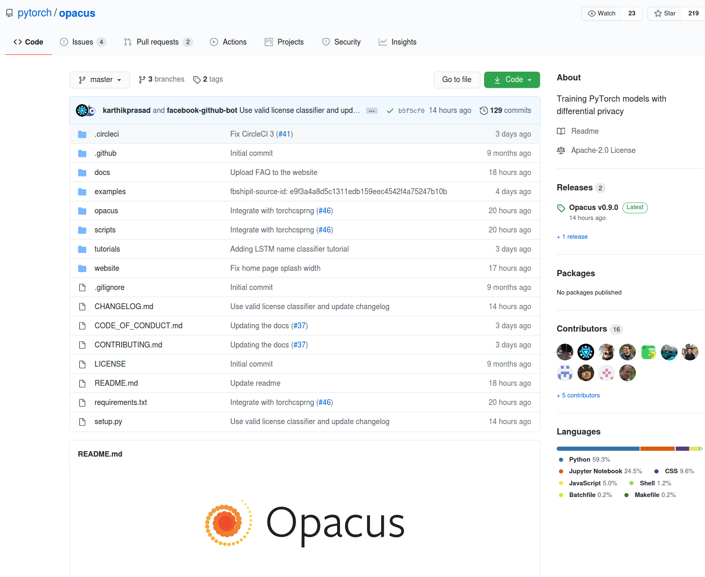

<!-- TODO(a11y): 1 localized body image(s) have empty alt text -->


**Summary:** I learn best from toy code I can play with. This tutorial teaches Differentially Private Deep Learning using a recently released library called Opacus by PyTorch ([full code example here](https://github.com/Kritikalcoder/pytorch-dp/blob/master/MNIST_blog.ipynb)). For more on Differential Privacy, you can follow [@kritipraks](https://twitter.com/kritipraks) or [@openminedorg](https://twitter.com/openminedorg) on Twitter.

We at OpenMined are collaborating with the PyTorch team in moving towards our shared mission of making privacy-preserving AI easier to build. We actively support the use of Opacus in our community as well as its integration with the tools we’re building.

Differential Privacy is one of the most important tools for use within privacy-preserving AI because it allows us to train AI models which can learn high level patterns (such as how to identify cancerous tumors) without memorising sensitive personal data (unique attributes about specific patients).

The implication of this technology becoming mainstream is a rapid increase in the amount of training data available for scientific inquiry into humanity’s most important and sensitive issues.

This is a step-by-step tutorial on how to train a simple PyTorch classification model on MNIST dataset using a differentially private – stochastic gradient descent optimizer in 20 lines of code using the [PyTorch Opacus library](https://github.com/pytorch/opacus).

<figure class=""><div class=""><div class=""><div class="">



</div></div></div></figure>

[Opacus](https://opacus.ai/) is a library that enables training PyTorch models with differential privacy. It supports training with minimal code changes required on the client, has little impact on training performance and allows the client to online track the privacy budget expended at any given moment.

### This blogpost will cover:

Step 1: Importing PyTorch and Opacus  
Step 2: Loading MNIST Data  
Step 3: Creating a PyTorch Neural Network Classification Model and Optimizer  
Step 4: Attaching a Differential Privacy Engine to the optimizer  
Step 5: Training the private model over multiple epochs

### Pre-requisite knowledge:

1\. Basic Deep Learning in PyTorch ([Tutorial](https://iamtrask.github.io/2017/01/15/pytorch-tutorial/%20))  
2\. Installing PyTorch  
3\. Installing [PyTorch Opacus](https://github.com/pytorch/opacus)

---

### Step 1: Importing PyTorch and Opacus

For private image classification on MNIST, we will require the use of PyTorch, `numpy`, and Opacus. We will need `tqdm` to visualize the progress we make during the training process.

```python
import torch
from torchvision import datasets, transforms
import numpy as np
from opacus import PrivacyEngine
from tqdm import tqdm
```

### Step 2: Loading MNIST Data

We load MNIST data using a `DataLoader` and split it into train and test datasets. The data is shuffled, and normalized using the mean (0.1307) and the standard deviation (0.3081) of the dataset. The training set is divided into batches of 64 images each, whereas the testing set is divided into batches of 1024 images each.

```python
train_loader = torch.utils.data.DataLoader(datasets.MNIST('../mnist',
			   train=True, download=True,
               transform=transforms.Compose([transforms.ToTensor(),
               transforms.Normalize((0.1307,), (0.3081,)),]),),
               batch_size=64, shuffle=True, num_workers=1,
               pin_memory=True)

test_loader = torch.utils.data.DataLoader(datasets.MNIST('../mnist',
			  train=False,
              transform=transforms.Compose([transforms.ToTensor(),
              transforms.Normalize((0.1307,), (0.3081,)),]),),
              batch_size=1024, shuffle=True, num_workers=1,
              pin_memory=True)
```

### Step 3: Creating a PyTorch Neural Network Classification Model and Optimizer

Now, let us create a `Sequential` PyTorch neural network model which predicts the label of images from our MNIST dataset. We create a simple network consisting of 2 convolutional layers, followed by 2 fully connected layers, interspersed with multiple `ReLu` and `MaxPooling` layers. The first layer takes images of size `(28 x 28)` as input. The final layer returns a vector of probabilities of size `(1 x 10)`, so that we can predict which digit (from 0 – 9) the image represents.

Finally, we use a Stochastic Gradient Descent (SGD) optimizer to improve our classification model, and we set the learning rate to 0.05.

```python
model = torch.nn.Sequential(torch.nn.Conv2d(1, 16, 8, 2, padding=3),
							torch.nn.ReLU(),
                            torch.nn.MaxPool2d(2, 1), 
                            torch.nn.Conv2d(16, 32, 4, 2), 
                            torch.nn.ReLU(), 
                            torch.nn.MaxPool2d(2, 1), 
                            torch.nn.Flatten(), 
                            torch.nn.Linear(32 * 4 * 4, 32), 
                            torch.nn.ReLU(), 
                            torch.nn.Linear(32, 10))

optimizer = torch.optim.SGD(model.parameters(), lr=0.05)
```

### Step 4: Attaching a Differential Privacy Engine to the Optimizer

So far, we have a regular PyTorch classification model. Now, we want to make our model differentially private. So, we create and attach a `PrivacyEngine` from the opacus library to our model and it will make our model differentially private and help us track our privacy budget.

The `sample_size` here is the size of the training set, the list of `alphas` are the different orders at which Renyi Differential Privacy is computed.

The `noise_multiplier` is ratio of the standard deviation of the Gaussian noise distribution to the `L2` sensitivity of the function to which it is added.

`max_grad_norm` indicates the value of the upper bound of the `L2` norm of the loss gradients.

```python
privacy_engine = PrivacyEngine(model, 
							   batch_size=64, 
                               sample_size=60000,  
                               alphas=range(2,32), 
                               noise_multiplier=1.3, 
                               max_grad_norm=1.0,)

privacy_engine.attach(optimizer)
```

### Step 5: Training the private model over multiple epochs

Finally, we create a function to train the model using the differentially private SGD optimizer. We want to minimize the cross entropy loss.

Within a single training step, we iterate over all the training batches of data and make our model predict the label of the data. Based on this prediction, we obtain a loss, whose gradients we back-propagate using `loss.backward()`.

Now the key difference brought by the privacy engine, is that the norms of the gradients propagated backwards are clipped to be less than `max_grad_norm`. This is done to ensure that the overall sensitivity of the data is bounded.

After that, the gradients for a batch are averaged and randomly sampled Gaussian noise is added to it based on the value of `noise_multiplier`. This is done to ensure that the process satisfies the guarantee of Renyi Differential Privacy of a specified alpha order value.

Finally, the optimizer takes a step in a direction opposite to that of the largest noisy gradient using `optimizer.step()`. We repeat this entire training iteration for 10 epochs, to decrease the overall loss.

```python
def train(model, train_loader, optimizer, epoch, device, delta):
    model.train()
    criterion = torch.nn.CrossEntropyLoss()
    losses = []
    for _batch_idx, (data, target) in enumerate(tqdm(train_loader)):
        data, target = data.to(device), target.to(device)
        optimizer.zero_grad()
        output = model(data)
        loss = criterion(output, target)
        loss.backward()
        optimizer.step()
        losses.append(loss.item())
    
    epsilon, best_alpha = 
    	optimizer.privacy_engine.get_privacy_spent(delta)
        
    print(
        f"Train Epoch: {epoch} t"
        f"Loss: {np.mean(losses):.6f} "
        f"(ε = {epsilon:.2f}, δ = {delta}) for α = {best_alpha}")
    
for epoch in range(1, 11):
    train(model, train_loader, optimizer, epoch, device="cpu", delta=1e-5)
```

The epsilon and delta parameters help us determine the shape and size of the Gaussian noise distribution. Together, the epsilon, delta and alpha values give us a quantification of the Renyi Differential Privacy guarantee and the privacy budget we have spent.

This is how opacus neatly adds support for Differential Privacy to a PyTorch model by attaching a discreet Privacy Engine to its model, ensuring that the overall model creation and training process is just the same.

### Putting it all together

```python
# Step 1: Importing PyTorch and Opacus
import torch
from torchvision import datasets, transforms
import numpy as np
from opacus import PrivacyEngine
from tqdm import tqdm

# Step 2: Loading MNIST Data
train_loader = torch.utils.data.DataLoader(datasets.MNIST('../mnist', train=True, download=True,
               transform=transforms.Compose([transforms.ToTensor(), transforms.Normalize((0.1307,), 
               (0.3081,)),]),), batch_size=64, shuffle=True, num_workers=1, pin_memory=True)

test_loader = torch.utils.data.DataLoader(datasets.MNIST('../mnist', train=False, 
              transform=transforms.Compose([transforms.ToTensor(), transforms.Normalize((0.1307,), 
              (0.3081,)),]),), batch_size=1024, shuffle=True, num_workers=1, pin_memory=True)

# Step 3: Creating a PyTorch Neural Network Classification Model and Optimizer
model = torch.nn.Sequential(torch.nn.Conv2d(1, 16, 8, 2, padding=3), torch.nn.ReLU(), torch.nn.MaxPool2d(2, 1),
        torch.nn.Conv2d(16, 32, 4, 2),  torch.nn.ReLU(), torch.nn.MaxPool2d(2, 1), torch.nn.Flatten(), 
        torch.nn.Linear(32 * 4 * 4, 32), torch.nn.ReLU(), torch.nn.Linear(32, 10))

optimizer = torch.optim.SGD(model.parameters(), lr=0.05)

# Step 4: Attaching a Differential Privacy Engine to the Optimizer
privacy_engine = PrivacyEngine(model, batch_size=64, sample_size=60000, alphas=range(2,32), 
                               noise_multiplier=1.3, max_grad_norm=1.0,)

privacy_engine.attach(optimizer)

# Step 5: Training the private model over multiple epochs
def train(model, train_loader, optimizer, epoch, device, delta):
    model.train()
    criterion = torch.nn.CrossEntropyLoss()
    losses = []    
    for _batch_idx, (data, target) in enumerate(tqdm(train_loader)):
        data, target = data.to(device), target.to(device)
        optimizer.zero_grad()
        output = model(data)
        loss = criterion(output, target)
        loss.backward()
        optimizer.step()
        losses.append(loss.item())    
    epsilon, best_alpha = optimizer.privacy_engine.get_privacy_spent(delta) 
    print(
        f"Train Epoch: {epoch} t"
        f"Loss: {np.mean(losses):.6f} "
        f"(ε = {epsilon:.2f}, δ = {delta}) for α = {best_alpha}")
    
for epoch in range(1, 11):
    train(model, train_loader, optimizer, epoch, device="cpu", delta=1e-5)
```
