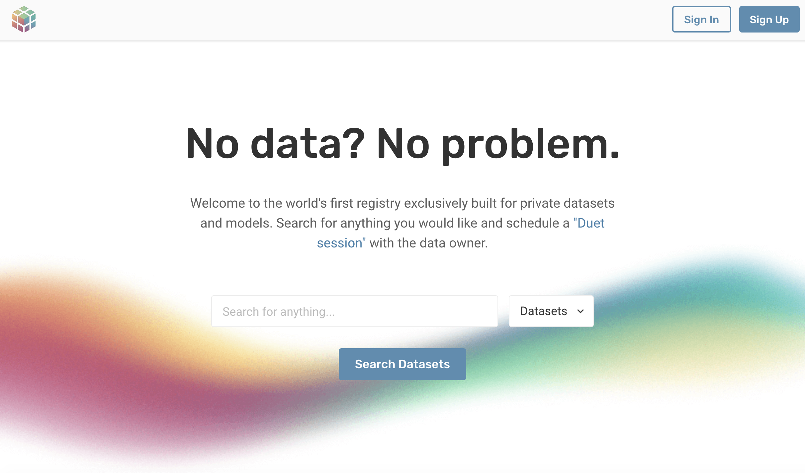
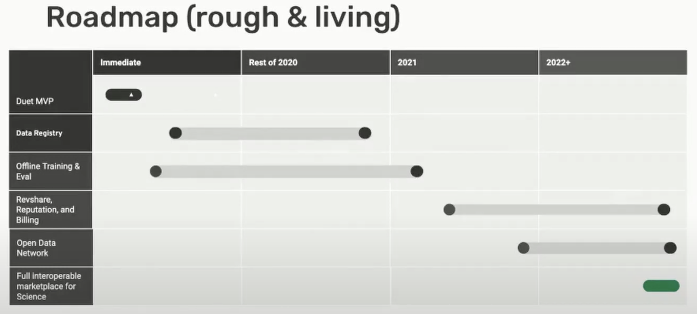

<!-- TODO(a11y): 2 localized body image(s) have empty alt text -->


<!-- TODO(content): shortcode(s) present (verify) -->

Across research institutions, personal devices, and private companies, humankind is gathering a huge amount of information about ourselves at an incredible rate.

This _could_ be an amazing thing: [the open data movement](http://parisinnovationreview.com/articles-en/a-brief-history-of-open-data) has done a great job of explaining the benefits of increased access to data: **advancing science, increasing human knowledge, democratizing knowledge.**

But we know **not all data _can_ be open**:

-   Sometimes, important **data privacy** protections that make it difficult to share data across institutions.
-   Sometimes (especially in the private sector), sensitive data is **financially valuable**: every institution you share data with then becomes a competitor.

As a result, a lot of scientific information is often kept safely locked away in data silos – sometimes at the expense of our ability to **make scientific progress and collaborate**. The inability to share data also contributes to our issues with reproducibility, accountability and transparency in science.

---

### The Solution: Data Science Without Access  

**We want to make it possible to learn from data you can’t have access to, without sacrificing privacy.**

We’re building infrastructure for **easy remote data science.**

We want to allow you to **extract insights, train models, and evaluate results** on data — _**without**_ **anyone copying, sending, or sharing that data.**

**You get your stats/model/results, the data owner keeps the data.**

---

### What _could_ we do – if this was _possible_ and _easy_?

-   **Perform larger, aggregate statistical studies**  — [sample size and generalization is an issue in many areas of research](https://link.springer.com/article/10.1007/s11121-015-0585-4)
-   **Frictionless collaboration between research institutions and departments**
-   **Use more real-world representative datasets** — [so models don’t fail when they reach the clinic](https://techcrunch.com/2020/04/27/google-medical-researchers-humbled-when-ai-screening-tool-falls-short-in-real-life-testing/?guccounter=1&guce_referrer=aHR0cHM6Ly93d3cuZ29vZ2xlLmNvbS8&guce_referrer_sig=AQAAAL7D9kIV7CQucEQMlvoRdPMGAq1iHQ8QyONqR8YWe3-ki09Z0lR0RzSb8O44qxwMCf0U7agva4gt2iu2rcsac5Ghgfd7uh5d06y2ScHMTCan9Xg1MfR1IoekPusC_hqzliAkwD7v8Nv8TtA2vIBlZvkpapSZbCZIC1J-8vLrGyXM)
-   **Use more [diversified datasets](https://www.apa.org/monitor/2010/05/weird) to ensure our research better serves our world’s population** — current datasets can often feature a disproportionate number of young, university student subjects, which results in training data that is not representative of our patient populations
-   **Improve academic transparency and accountability** — not everyone can publish their data alongside their journal article
-   **More meaningful comparison of results** — imagine being able to easily test your method on another group’s dataset to fairly compare your results to theirs – this is the standard in machine learning research, but not common in many scientific fields

This would be very powerful — and it will take us time to reach that vision. **But how do we get started?**

---

### Step 1 – Introducing ‘Duet’

Before we can have massive open networks for data, we need to be able to let two people – one with data, and the other with data science expertise – **do an experiment without revealing the data itself.**

We call this _**[OpenMined Duet](https://github.com/OpenMined/PySyft/tree/syft_0.5.0/packages/syft/examples/duet).**_

This is our MVP (minimum viable product) of that final goal.

Duet enables remote execution and permissioning of tensor requests from a data scientist to a data owner’s private data **with a simple python notebook.** How? Skip below to the ‘technical details’ section to see how.

### What’s Next? Introducing OpenGrid

<figure class="">



</figure>

1.  **Create a Data Registry:** The data scientist needs to know what data is out there. A data owner can register their dataset (describing details about it – _not_ uploading it anywhere). [The OpenGrid Registry](https://opengrid.openmined.org/) is a website to connect these people, so they can schedule a Duet. [The OpenGrid Registry](https://opengrid.openmined.org/) also hosts models. It’s like craigslist, but for datasets and models. [**Go ahead and register a dataset or model today.**](https://opengrid.openmined.org/)
2.  **Offline Training & Evaluation:** Sometimes, scheduling a call is difficult across time zones. Offline training & evaluation would make this accessible across time zones, on an as needed basis.
3.  **Revshare, Reputation & Billing:** For some institutions, these will be the strongest incentives. [You can listen to Nick Rose explain these in more detail at 7:40 in his PriCon 2020 Talk.](https://youtu.be/QUTRN3G1l0I?t=462)

---

### The Details: How exactly do I use Duet?

I encourage you to [watch Nick Rose explain this at 5:10 in his PriCon 2020 talk](https://youtu.be/QUTRN3G1l0I?t=310), but to demonstrate the code at a glance:

1\. The Data Scientist and Data Owner each open their own python notebook (located anywhere worldwide).

2\. The Data Owner creates a Duet object and connects to the grid. Easy to copy and paste instructions are provided containing a unique identifier which can be passed to a scientist over chat or verbally.

```python
import syft as sy
duet = sy.launch_duet()
> Send the following code to your Duet Partner!
> import syft as sy
> duet = sy.join_duet('40a9c3d4a93bd37ae43fe06673fef351')
```

3\. The Data Scientist takes the ID and connects to Duet, receiving a unique Client ID to provide back to the Data Owner to confirm the connection.

```python
import syft as sy
duet = sy.join_duet('40a9c3d4a93bd37ae43fe06673fef351')

> Send the Duet Client ID back to your Duet Partner!
> Duet Client ID: 0c653d3d88097cff6638ec5d159e96fc
```

4\. The Data Owner imports torch, and then creates two normal tensors, adds special descriptive tags and  then hosts the data by calling send and setting searchable to True.

```python
import torch
data = torch.tensor([[0,0],[0,1]]).tag("data")
target = torch.tensor([[0],[0]]).tag("target")
data_ptr = target.send(duet, searchable=True)
target_ptr = data.send(duet, searchable=True) 
```

5\. The Data Scientist can now check the Duet store looking for objects tagged as “data” and “target”.

```python
duet.store.pandas

> ID	                                            Tags
> 0   <UID:593c562c-116b-419d-8c32-e97c271af6a2>    [data]	
> 1   <UID:6228f284-667d-493a-bbcd-3ec839604de1>    [target]	
```

6\. The Data Scientist can now get a pointer reference to these objects by indexing the store. This returns a pointer to that data, which can now be used as though it were a regular object.

```python
data_ptr = duet.store[0]
target_ptr = duet.store[1]

print(data_ptr)
> <syft.proxy.torch.TensorPointer at 0x138d06730>
```

7\. Actions executed on pointers return more pointers which can be chained, however to get the actual data behind the pointer a permission request must be made. These can be made as blocking or non-blocking requests depending on the need.

```python
sum_ptr = data_ptr.sum().item()
sum = sum_ptr.get(
    request_block=True,
    name="sum",
    reason="To see the result",
    timeout_secs=30,
)
print(sum)    <---- waiting for the above line to complete first
```

8\. On the Data Owner side a list of available requests can be viewed and accepted or denied.

```python
duet.requests.pandas

>    Request Name   Reason             Request ID
> 0  sum            To see the result  <UID:8633a6a0-...-cf2242a67f7c>

duet.requests[0].accept()
```

9\. Done! The next line of the Data Scientists notebook executes and prints the output as expected.

```python
print(sum)
> 1
```

For more on Duet, make sure to [See Nick’s talk for details.](https://www.youtube.com/watch?v=QUTRN3G1l0I&feature=youtu.be&t=310)

**Here’s our estimated development timeline:**

<figure class="">



</figure>

---

### Interested?

Duet and OpenGrid are free and open-source. [**Find us on GitHub**](https://github.com/OpenMined), or get in touch at **slack.openmined.org** or email **partnerships@openmined.org**!

**If you want to join our mission on making the world more privacy preserving:**

-   ****[OpenMined Welcome Package](https://github.com/OpenMined/OM-Welcome-Package) –**** You can see a map of all the projects we work on here!
-   ****[Join OpenMined](http://slack.openmined.org/)** [S](http://slack.openmined.org/)**[lack](http://slack.openmined.org/)****
-   **[**Check** out **OpenMined’s GitHub**](https://github.com/OpenMined)**
-   ****[Placements at OpenMined](https://placements.openmined.org/)****

---
