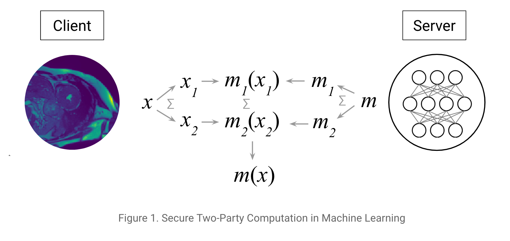

<!-- TODO(a11y): 2 localized body image(s) have empty alt text -->


**_Update as of November 18, 2021: The version of PySyft mentioned in this post has been deprecated. Any implementations using this older version of PySyft are unlikely to work. Stay tuned for the release of PySyft 0.6.0, a data centric library for use in production targeted for release in early December._**

**Summary:** Great theories need great implementations. We show in this blog how to use a private neural network to classify MNIST images using Secure Multi-Party Computation (SMPC). We achieve classification in **<33ms** with **\>98%** accuracy over local (virtualized) computation.

**Note:** If you want more posts like this just get in touch with [@theoryffel](https://twitter.com/@theoryffel) and [@OpenMinedOrg](https://twitter.com/openminedorg). Feel free to follow if you’d be interested in reading more and thanks for all the feedback!

<figure class="">

<video src="/blog/encrypted-deep-learning-classification-with-pysyft/mpc7.mp4" autoplay loop muted playsinline></video>

<figcaption>Encrypted classification with PySyft &amp; PyTorch</figcaption></figure>

## Your data matters, your model too

Data is the driver behind Machine Learning. Organizations who create and collect data are able to build and train their own machine learning models. This allows them to offer the use of such models as a service (MLaaS) to outside organizations. This is useful as other organizations who might not be able to create these models themselves but who still would like to use this model to make predictions on their own data.

However, a model hosted in the cloud still presents a privacy/IP issue. In order for external organizations to use it – they must either upload their input data (such as images to be classified) or download the model. Uploading input data can be problematic from a privacy perspective, but downloading the model might not be an option if the organization who created/owns the model is worried about losing their IP.

## Computing over encrypted data

In this context, one potential solution is to encrypt both the model and the data in a way which allows one organization to use a model owned by another organization without either disclosing their IP to one another. Several encryption schemes exist that allow for computation over encrypted data, among which Secure Multi-Party Computation (SMPC), Homomorphic Encryption (FHE/SHE) and Functional Encryption (FE) are the most well known types. We will focus here on Secure Multi-Party Computation ([introduced in detail in this tutorial](https://github.com/OpenMined/PySyft/blob/master/examples/tutorials/Part%2009%20-%20Intro%20to%20Encrypted%20Programs.ipynb) which consists of private additive sharing. It relies on crypto protocols such as SecureNN and SPDZ, the details of which are given [in this excellent blog post](https://mortendahl.github.io/2017/09/19/private-image-analysis-with-mpc/).

These protocols achieve remarkable performances over encrypted data, and over the past few months we have been working to make these protocols easy to use. Specifically, we’re building tools to allow you to use these protocols without having to re-implement the protocol yourself (or even necessarily know the cryptography behind how it works). Let’s jump right in.

## Set up

The exact setting in this tutorial is the following: consider that you are the server and you have some data. First, you define and train a model with this private training data. Then, you get in touch with a client who holds some of their own data who would like to access your model to make some predictions.

You encrypt your model (a neural network). The client encrypts their data. You both then use these two encrypted assets to use the model to classify the data. Finally, the result of the prediction is sent back to the client in an encrypted way so that the server (_i.e._ you) learns nothing about the client’s data (you learn neither the inputs or the prediction).

Ideally we would additively share the `client`‘s input between itself and the `server` and vice versa for the model. For the sake of simplicity, the shares will be held by two other workers `alice` and `bob`. If you consider that alice is owned by the client and bob by the server, it’s completely equivalent.

The computation is secure in the honest-but-curious adversary model which is standard in [many MPC frameworks](https://arxiv.org/pdf/1801.03239.pdf).

**We have now everything we need, let’s get started!**

<figure class="">



</figure>

### Imports and model specifications

Nothing special here, we first need to import torch, which a great toolkit for Deep Learning.

```python
import torch
import torch.nn as nn
import torch.nn.functional as F
import torch.optim as optim
from torchvision import datasets, transforms
```

We also need to execute commands specific to importing/starting PySyft. We create a few workers (named `client`, `bob`, and `alice`). Lastly, we define the `crypto_provider` who gives all the crypto primitives we may need ([See our tutorial on SMPC for more details](https://github.com/OpenMined/PySyft/blob/dev/examples/tutorials/Part%205%20-%20Intro%20to%20Encrypted%20Programs.ipynb)).

```python
import syft as sy  
hook = sy.TorchHook(torch) 
client = sy.VirtualWorker(hook, id="client") 
bob = sy.VirtualWorker(hook, id="bob")
alice = sy.VirtualWorker(hook, id="alice")
crypto_provider = sy.VirtualWorker(hook, id="crypto_provider") 
```

And the learning parameters:

```python
class Arguments():
    def __init__(self):
        self.batch_size = 64
        self.test_batch_size = 200
        self.epochs = 10
        self.lr = 0.001 # learning rate
        self.log_interval = 100

args = Arguments()
```

### Data loading and sending to workers

In our setting, we assume that the server has access to some data to first train its model. Here is the MNIST training set.

```python
train_loader = torch.utils.data.DataLoader(
    datasets.MNIST('../data', train=True, download=True,
                   transform=transforms.Compose([
                       transforms.ToTensor(),
                       transforms.Normalize((0.1307,), (0.3081,))
                   ])),
    batch_size=args.batch_size, shuffle=True)
```

Second, the client has some data and would like to have predictions on it using the server’s model. This client encrypts its data by sharing it additively across two workers `alice` and `bob`.

> SMPC uses crypto protocols which require to work on integers. We leverage here the PySyft tensor abstraction to convert PyTorch Float tensors into Fixed Precision Tensors using `.fix_prec()`. For example 0.123 with precision 2 does a rounding at the 2nd decimal digit so the number stored is the integer 12.

```python
test_loader = torch.utils.data.DataLoader(
    datasets.MNIST('../data', train=False,
                   transform=transforms.Compose([
                       transforms.ToTensor(),
                       transforms.Normalize((0.1307,), (0.3081,))
                   ])),
    batch_size=args.test_batch_size, shuffle=True)

# Convert to integers and privately share the dataset
private_test_loader = []
for data, target in test_loader:
    private_test_loader.append((
        data.fix_prec().share(alice, bob, crypto_provider=crypto_provider),
        target.fix_prec().share(alice, bob, crypto_provider=crypto_provider)
    ))
```

## Network specification & training

We use here a regular network and perform classic training in _pure PyTorch_. Nothing special here!

```python
class Net(nn.Module):
    def __init__(self):
        super(Net, self).__init__()
        self.fc1 = nn.Linear(784, 500)
        self.fc2 = nn.Linear(500, 10)

    def forward(self, x):
        x = x.view(-1, 784)
        x = self.fc1(x)
        x = F.relu(x)
        x = self.fc2(x)
        return x
```

```python
def train(args, model, train_loader, optimizer, epoch):
    model.train()
    for batch_idx, (data, target) in enumerate(train_loader):
        optimizer.zero_grad()
        output = model(data)
        output = F.log_softmax(output, dim=1)
        loss = F.nll_loss(output, target)
        loss.backward()
        optimizer.step()
        if batch_idx % args.log_interval == 0:
            print('Train Epoch: {} [{}/{} ({:.0f}%)]'.format(
                epoch, batch_idx * args.batch_size, len(train_loader) * args.batch_size,
                100. * batch_idx / len(train_loader)))
```

```python
model = Net()
optimizer = torch.optim.Adam(model.parameters(), lr=args.lr)

for epoch in range(1, args.epochs + 1):
    train(args, model, train_loader, optimizer, epoch)
```

Good, our model is now trained and ready to be provided as a service!

## Secure Evaluation

Now, as the server, we send the model to the workers holding the data. Because the model is sensitive information (you’ve spent time optimizing it!), you don’t want to disclose its weights so you secret share the model just like the client did with the test dataset earlier.

```python
model.fix_precision().share(alice, bob, crypto_provider=crypto_provider)
```

The following test function performs the encrypted evaluation. The model weights, the data inputs, the prediction and the target used for scoring are all encrypted!

However as you can observe, the syntax is very similar to normal PyTorch testing! Nice!

The only thing we decrypt from the server side is the final score at the end of our 200 items batches to verify predictions were on average good.

```python
def test(args, model, test_loader):
    model.eval()
    n_correct_priv = 0
    n_total = 0
    with torch.no_grad():
        for data, target in test_loader:
            output = model(data)
            pred = output.argmax(dim=1) 
            n_correct_priv += pred.eq(target.view_as(pred)).sum()
            n_total += args.test_batch_size
            
            n_correct = n_correct_priv.copy().get().float_precision().long().item()
    
            print('Test set: Accuracy: {}/{} ({:.0f}%)'.format(
                n_correct, n_total,
                100. * n_correct / n_total))
```

```python
test(args, model, private_test_loader)
```

```
Test set: Accuracy: 198/200 (99%)
Test set: Accuracy: 386/400 (96%)
Test set: Accuracy: 583/600 (97%)
Test set: Accuracy: 779/800 (97%)
Test set: Accuracy: 978/1000 (98%)
Test set: Accuracy: 1175/1200 (98%)
Test set: Accuracy: 1371/1400 (98%)
Test set: Accuracy: 1567/1600 (98%)
...
```

Et voilà! Here you are, you have learned how to do end to end secure predictions: the weights of the server’s model have not leaked to the client and the server has no information about the data input nor the classification output!

Regarding performance, classifying one image takes **less than 0.1 second**, approximately **33ms** on my laptop (2,7 GHz Intel Core i7, 16GB RAM). However, this is using very fast communication (all the workers are on my local machine). Performance will vary depending on how fast different workers can talk to each other.

## Conclusion & Future Work

You have seen how easy it is to leverage PyTorch and PySyft to perform practical Secure Machine Learning and protect users data, without having to be a crypto expert!

More on this topic will come soon, including convolutional layers to properly benchmark PySyft performance with respect to other libraries, as well as private encrypted training of neural networks, which is needed when a organisation resorts to external sensitive data to train its own model. Stay tuned!

If you enjoyed this and would like to join the movement toward privacy preserving, decentralized ownership of AI and the AI supply chain (data), you can do so in the following ways!

### Star PySyft on GitHub

The easiest way to help our community is just by starring the repositories! This helps raise awareness of the cool tools we’re building.

-   [Star PySyft](https://github.com/OpenMined/PySyft)

### Try our tutorials on GitHub!

We made really nice tutorials to get a better understanding of Privacy-Preserving Machine Learning and the building blocks we have created to make it easy to do!

-   [Checkout the PySyft tutorials](https://github.com/OpenMined/PySyft/tree/master/examples/tutorials)

### Join our Slack!

The best way to keep up to date on the latest advancements is to join our community!

-   [Join slack.openmined.org](http://slack.openmined.org)

### Join a Code Project!

The best way to contribute to our community is to become a code contributor! If you want to start “one off” mini-projects, you can go to PySyft GitHub Issues page and search for issues marked `Good First Issue`.

-   [Good First Issue Tickets](https://github.com/OpenMined/PySyft/issues?q=is%3Aopen+is%3Aissue+label%3A%22good+first+issue%22)

### Donate

If you don’t have time to contribute to our codebase, but would still like to lend support, you can also become a Backer on our Open Collective. All donations go toward our web hosting and other community expenses such as hackathons and meetups!

-   [Donate through OpenMined’s Open Collective Page](https://opencollective.com/openmined)
