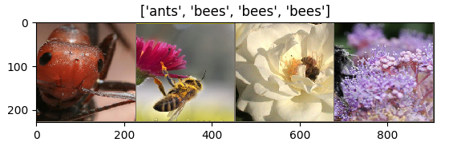

<!-- TODO(a11y): 2 localized body image(s) have empty alt text -->


**_Update as of November 18, 2021: The version of PySyft mentioned in this post has been deprecated. Any implementations using this older version of PySyft are unlikely to work. Stay tuned for the release of PySyft 0.6.0, a data centric library for use in production targeted for release in early December._**

##### **Summary**: We label encrypted images with an encrypted ResNet-18 using PySyft.

_**Note**: If you want more demos like this, I’ll tweet them out at [@theoryffel](https://twitter.com/theoryffel). Feel free to follow if you’d be interested in reading more and thanks for all the feedback!_

<figure class="">


</figure>

_Encrypted Machine Learning as a Service_ allows owners of sensitive data to use external AI services to get insights over their data. Let’s consider a practical scenario where a data owner holds private images and would like to use a service to have those images labeled, without disclosing the images nor the label predictions, and without having to get access the model, which is often considered to be a business asset by such services and is therefore not accessible.

To get a realistic example, we will consider [the task of distinguishing between bees and ants](https://pytorch.org/tutorials/beginner/transfer_learning_tutorial.html), which uses a ResNet-18 model to achieve around 95% accuracy. We will not consider the training of such a model, as we assume the AI service provider has already trained it using some data. Instead, we will showcase how we can use PySyft to encrypt both the model and some images and to label those images in a fully private way.

_You can also find an executable Jupyter notebook of this demo in the [PySyft Tutorial section](https://github.com/OpenMined/PySyft/tree/master/examples/tutorials), Part 11 bis._

## 1\. Did you just say _encrypted_?

First, let’s try to understand what mechanisms we use to make the data and the model private. If you want to jump straight to the code, you can [skip this section](#2showmethecode)! (`newcommand{shared}[1]{[ #1 ]}`)

### Secret Sharing

The cryptography protocol that we use to encrypt data is called Function Secret Sharing (FSS). It belongs to the family of [Secure Multi-Party Computation](https://blog.openmined.org/what-is-secure-multi-party-computation/) (SMPC) protocols, which involves several parties that share a secret to ensure privacy. A party alone holds a share of the private value and can’t reconstruct the value, and a quorum of parties (sometimes all parties) need to collaborate to reconstruct the private data. Therefore, saying that we _encrypt_ the data is an abuse of language and we should say that we _secret share_ it.

Other families of protocols exist like those based on Homomorphic Encryption, where data is truly encrypted and a party only needs a key to decrypt it. I recommend reading this [OpenMined blog](https://blog.openmined.org/what-is-homomorphic-encryption/) to learn more about Homomorphic Encryption.

### Function Secret Sharing

Unlike classical data secret sharing schemes like [SecureNN](https://eprint.iacr.org/2018/442.pdf) (which is also supported by PySyft), where a shared input (\\( \\text{shared}\\{x\\} \\)) is applied on a public function (\\( f \\)), function secret sharing applies a public input (\\( x \\)) on a private shared function (\\( \\text{shared}\\{f\\} \\)). Shares or _keys_ (\\( \\text{shared}\\{f\\}\_0, \\text{shared}\\{f\\}\_1 \\)) of a function (\\( f \\)) satisfy  
\\\[  
f(x) = \\text{shared}\\{f\\}\_0(x) + \\text{shared}\\{f\\}\_1(x).  
\\\]  
Both approaches output a secret shared result.

Let us take an example: say Alice and Bob respectively have shares \\( \\text{shared}\\{y\\}\_0 \\) and \\( \\text{shared}\\{y\\}\_1 \\) of a private input \\( y \\), and they want to compute \\( \\text{shared}\\{y \\geq 0\\} \\). They receive some crypto material, namely each get a share of a random value (or _mask_) \\( \\text{shared}\\{\\alpha\\} \\) and a share of the shared function \\( \\text{shared}\\{f\_\\alpha\\} \\) of  
\\\[  
f\_{\\alpha} : x \\mapsto (x \\geq \\alpha).  
\\\]

They first mask their shares of \\( \\text{shared}\\{y\\} \\) using \\( \\text{shared}\\{\\alpha\\} \\), by computing \\( \\text{shared}\\{y\\}\_0 + \\text{shared}\\{\\alpha\\}\_0 \\) and \\( \\text{shared}\\{y\\}\_1 + \\text{shared}\\{\\alpha\\}\_1 \\) and then revealing these values to reconstruct \\( x = y + \\alpha \\). Next, they apply this public \\( x \\) on their function shares \\( \\text{shared}\\{f\_\\alpha\\}\_{j=0,1} \\), to obtain a shared output  
\\\[  
(\\text{shared}\\{f\_\\alpha\\}\_0(x), \\text{shared}\\{f\_\\alpha\\}\_1(x)) = \\text{shared}\\{ f\_\\alpha(y + \\alpha) \\} = \\text{shared}\\{ (y + \\alpha) \\geq \\alpha \\} = \\text{shared}\\{ y \\geq 0 \\}.  
\\\]  
[Previous works on FSS](https://eprint.iacr.org/2018/707) have shown the existence of such function shares for comparison which perfectly hide \\( y \\) and the result.

For more details about how FSS can be implemented, [this article](https://arxiv.org/abs/2006.04593) details the FSS algorithms that we currently use in PySyft.

## 2\. Show me the code

Enough explications, let’s open the code!  
We will first load the data and the model and store them on the `data_owner` and the `model_owner`.

```python
import torch
torch.set_num_threads(1) # We ask torch to use a single thread 
# as we run async code which conflicts with multithreading
import torch.nn as nn
import numpy as np
import torchvision
from torchvision import datasets, models, transforms
import time
```

### Load the data

We download the data and load it on a `dataLoader` with small batches of size 2, to reduce the inference time and the memory pressure on the RAM.

```python
# First, download the dataset
# You can comment out this cell if you have already downloaded the dataset
!wget https://download.pytorch.org/tutorial/hymenoptera_data.zip
!unzip hymenoptera_data.zip
```

```python
data_transform = transforms.Compose([
    transforms.Resize(256),
    transforms.CenterCrop(224),
    transforms.ToTensor(),
    transforms.Normalize([0.485, 0.456, 0.406], [0.229, 0.224, 0.225])
])

data_dir = 'hymenoptera_data'
image_dataset = datasets.ImageFolder('hymenoptera_data/val', data_transform)
dataloader = torch.utils.data.DataLoader(image_dataset, batch_size=2, shuffle=True, num_workers=4)

dataset_size = len(image_dataset)
class_names = image_dataset.classes
```

Want to have a look at your data? Here you are:

<figure class="">



<figcaption>Preview of a batch of size 4.</figcaption></figure>

### Load the model

Now let’s download the trained ResNet-18

```python
# You can comment out this cell if you have already downloaded the model
!wget --no-check-certificate 'https://docs.google.com/uc?export=download&id=1-1_M81rMYoB1A8_nKXr0BBOwSIKXPp2v' -O resnet18_ants_bees.pt
```

_You can also download the file_ [from here](https://drive.google.com/file/d/1-1_M81rMYoB1A8_nKXr0BBOwSIKXPp2v/view?usp=sharing) _if the command above is not working._

```python
model = models.resnet18(pretrained=True)
# Here the size of each output sample is set to 2.
model.fc = nn.Linear(model.fc.in_features, 2)
state = torch.load("./resnet18_ants_bees.pt", map_location='cpu')
model.load_state_dict(state)
model.eval()
# This is a small trick because these two consecutive operations can be switched without
# changing the result but it reduces the number of comparisons we have to compute
model.maxpool, model.relu = model.relu, model.maxpool
```

Great, now we’re ready to start!

### Virtual Setup

First let’s create a virtual setup with 2 workers names `data_owner` and `model_owner`.

```python
import syft as sy

hook = sy.TorchHook(torch) 
data_owner = sy.VirtualWorker(hook, id="data_owner")
model_owner = sy.VirtualWorker(hook, id="model_owner")
crypto_provider = sy.VirtualWorker(hook, id="crypto_provider")
```

```python
# Remove compression to have faster communication, because compression time 
# is non-negligible: we send to workers crypto material which is very heavy
# and pseudo-random, so compressing it takes a long time and isn't useful:
# randomness can't be compressed, otherwise it wouldn't be random!
from syft.serde.compression import NO_COMPRESSION
sy.serde.compression.default_compress_scheme = NO_COMPRESSION
```

Let’s put some data on the `data_owner` and the model on the `model_owner`. _In a real setting, the data and the model would already be located respectively on the two workers and we would just ask for pointers to these objects._

```python
data, true_labels = next(iter(dataloader))
data_ptr = data.send(data_owner)

# We store the true output of the model for comparison purpose
true_prediction = model(data)
model_ptr = model.send(model_owner)
```

As usual, when calling `.send()`, we only have access to pointers to the data

```python
print(data_ptr)
```

```
(Wrapper)>[PointerTensor | me:85268602991 -> data_owner:95928743858]
```

### Encryption time!

We will now encrypt both the model and the data. To do this, we encrypt them remotely using the pointers and get back the encrypted objects.

```python
encryption_kwargs = dict(
    workers=(data_owner, model_owner), # the workers holding shares of the secret-shared encrypted data
    crypto_provider=crypto_provider, # a third party providing some cryptography primitives
    protocol="fss", # the name of the crypto protocol, fss stands for "Function Secret Sharing"
    precision_fractional=4, # the encoding fixed precision (i.e. floats are truncated to the 4th decimal)
)
```

```python
encrypted_data = data_ptr.encrypt(**encryption_kwargs).get()
encrypted_model = model_ptr.encrypt(**encryption_kwargs).get()
```

### Secure inference

We are now able to run our secure inference, so let’s do it and let’s compare it to the `true_labels`

```python
start_time = time.time()

encrypted_prediction = encrypted_model(encrypted_data)
encrypted_labels = encrypted_prediction.argmax(dim=1)

print(time.time() - start_time, "seconds")

labels = encrypted_labels.decrypt()

print("Predicted labels:", labels)
print("     True labels:", true_labels)
```

```
313.13965487480164 seconds
Predicted labels: tensor([0., 1.])
     True labels: tensor([0, 1])
```

Hooray! This works!! Well at least with a probability of 95% which is the accuracy of the model.

But is the computation _exactly_ the same than the plaintext model? Well not exactly, because we sometime use approximations, but let’s open the model output logits to verify how close we are from plaintext execution.

```python
print(encrypted_prediction.decrypt())
print(true_prediction)
```

```
tensor([[ 1.0316, -0.3674],
        [-1.3748,  2.0235]])
tensor([[ 1.0112, -0.3442],
        [-1.3962,  2.0563]], grad_fn=<AddmmBackward>)
```

As you can observe, this is quite close and in practice the accuracy of the model is preserved, as you can observe by running inference over more images. The approximations mentioned are due to approximated layers such as BatchNorm and the fixed precision encoding.

Regarding **runtime**, we manage to predict a batch of 2 images in ~400 seconds, which isn’t super fast but is already reasonable for our usecase!

## 3\. Extension

> Ok that’s good, but in real life I won’t use virtual workers!

That’s right, actually you can run exactly the same experiment using PyGrid and workers which live in a PrivateGridNetwork. Those workers are independent processes which can live on your machine or on remote machines.

To do so, first clone [PyGrid](https://github.com/OpenMined/PyGrid) and then start new nodes in your terminal (one per tab) as such:

```bash
cd PyGrid/apps/node
./run.sh --id data_owner      --port 7600 --host localhost --start_local_db
./run.sh --id model_owner     --port 7601 --host localhost --start_local_db
./run.sh --id crypto_provider --port 7602 --host localhost --start_local_db
```

And you replace the `syft` imports in this notebook as such:

```python
import syft as sy
from syft.grid.clients.data_centric_fl_client import DataCentricFLClient

hook = sy.TorchHook(th)
data_owner = DataCentricFLClient(hook, "ws://localhost:7600")
model_owner = DataCentricFLClient(hook, "ws://localhost:7601")
crypto_provider = DataCentricFLClient(hook, "ws://localhost:7602")

my_grid = sy.PrivateGridNetwork(data_owner, model_owner, crypto_provider)

sy.local_worker.object_store.garbage_delay = 1 # at time of writing, the garbage collection processus of remote values when using websockets should be batched to avoid sending too many messages to the remote workers. This is done by requesting the GC messages to be sent by batches every 1 second.
```

The computation will be exactly the same, and the runtime will roughtly double. You can run the experiment to verify this, and it’s a nice intro to PyGrid!

## 4\. What’s next?

Next is improving this first proof of concept! How can this be done?

-   First, we can optimize our implementation, for example by switching from Python to Rust.
-   Second, we can try to adapt the model structure or model layers to have a faster execution given our constraints without compromising accuracy. Think of the swap we made between maxpool and relu in the ResNet-18 architecture at thhe beginning.
-   Last, we can investigate new Function Secret Sharing crypto protocols, this is a new and promising field, we expect new breakthroughs to help us improving the inference time!

### Join us!

If you want to help, come and [apply to join one of our cryptography teams](https://forms.gle/BWmYQJrCwqe1m3ex5)!

### Star PySyft on GitHub

You can also help our community by starring the repositories! This helps raise awareness of the cool tools we’re building.

-   [Star PySyft](https://github.com/OpenMined/PySyft)

### Join our Slack!

The best way to keep up to date on the latest advancements is to join our community!

-   [Join slack.openmined.org](http://slack.openmined.org)
