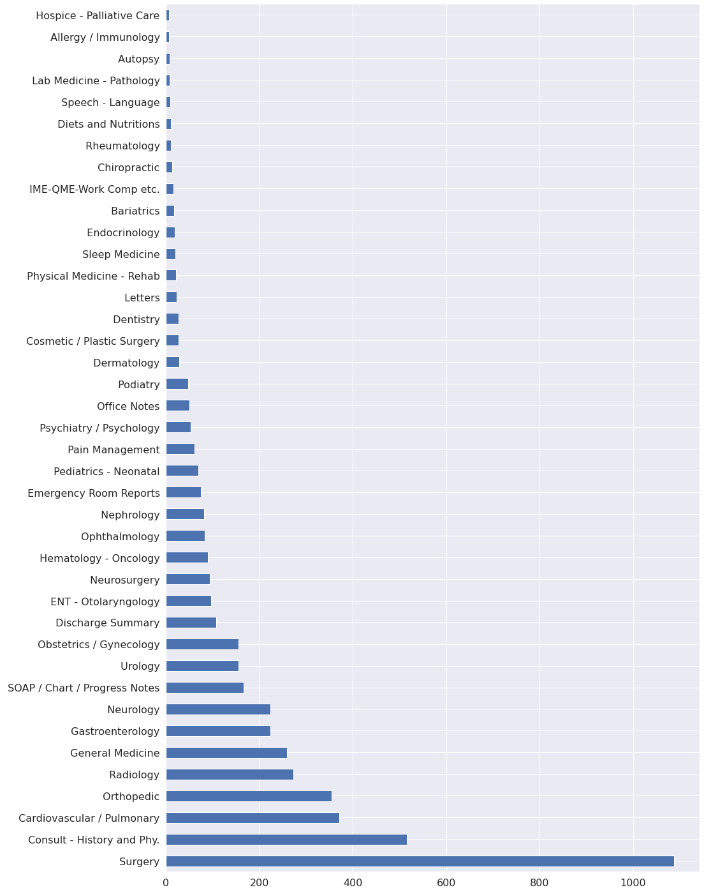
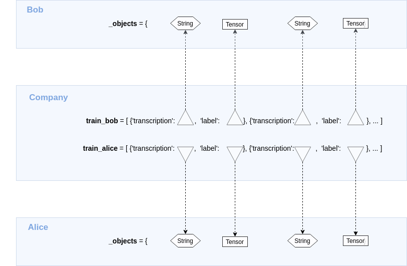
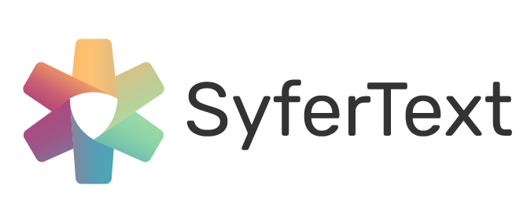
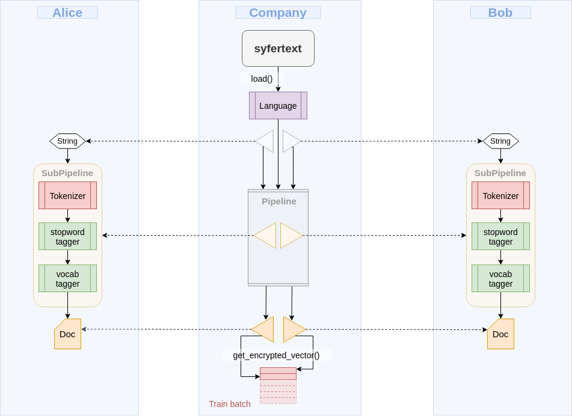
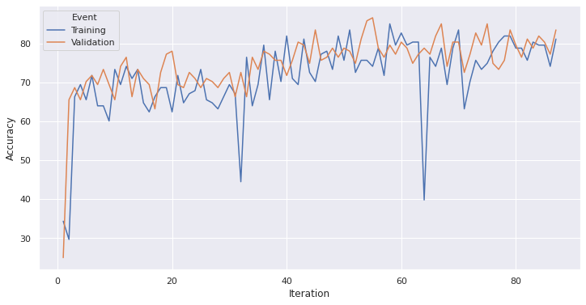
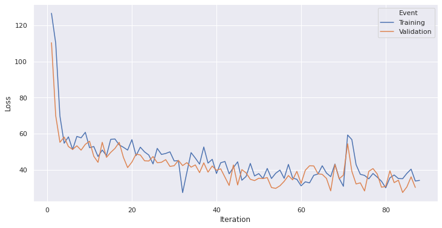

<!-- TODO(content): shortcode(s) present (verify) -->

**Author:**

-   Carlos Salgado – [email](mailto:csalgado@uwo.ca) | [GitHub](https://github.com/socd06) | [LinkedIn](https://blog.openmined.org/encrypted-training-medical-text-syfertext/www.linkedin.com/in/eng-socd)

---

## The problem

Bob MD and Alice MD are physicians running their respective medical practices and both have a database of private medical transcriptions. You own a Natural Language Processing (NLP) company and have been contacted by these physicians because both Bob MD and Alice MD have heard of the high quality of the Machine Learning as a Service (MLaaS) solutions you provide and want you to create a text classifier to help them automatically assign a medical specialty to each new patient text transcription.

## Limitations

Healthcare data is highly regulated and should be, for most intents and purposes, private. Therefore, if in a medical setting, the Machine Learning model being trained should not actually look at the data.

Combining both Bob’s and Alice’s datasets, you should be able to create a bigger, better dataset that you could use to train your model with higher accuracy, only that you can’t because it’s all sensitive and private data, which is why you will need [PySyft](https://github.com/OpenMined/pysyft/) and [SyferText](https://github.com/OpenMined/SyferText/) to complete the job at hand.

## Data exploration

In a secure and private scenario, we would not get access to the full dataset. Instead, we would be given only the files containing the features needed to train our model.

Assuming the owners of the data only shared two features with us:

-   `transcription`: The medical transcription text (corpus).
-   `medical_specialty`: The medical specialty tagged to the corpus.

The owners of the data could try to share some insight with us in order to help us design our model. Such insight could be generated from their own data exploration, for instance:


Or, for example:



Looking at the available information, we can determine that a model will produce better classification results as a binary classifier that is able to recognize if the `transcription` text refers to the `medical_specialty` of ‘Surgery’. For this experiment, we will assume we went back to the clients with this proposal and it was accepted.

## Natural Language Processing helper files

Now that we have the corpus of our data, we still need a stop words file and a vocabulary file. Normally, you would need to generate these on your own but for this and similar experiments, you can download or clone the [medical-nlp](https://github.com/socd06/medical-nlp) repo and use the files that are compiled within it.

You may also clone or download the [private\_nlp](https://github.com/socd06/private_nlp) repo containing the [encrypted training](https://github.com/socd06/private_nlp/blob/master/notebooks/medical-text-encrypted-training.ipynb) notebook demoed here as well as the aforementioned [data exploration](https://github.com/socd06/private_nlp/blob/master/notebooks/medical-text-data-exploration.ipynb) notebook where the displayed graphics were conceived. Both repos contain the data needed to replicate this experiment. If you wish, you can still go ahead and download the dataset in the second to next section.

## Disclaimer

This blog post is based on the [SyferText Sentiment Classification tutorial](https://github.com/OpenMined/SyferText/blob/master/tutorials/usecases/UC01%20-%20Sentiment%20Classifier%20-%20Private%20Datasets%20-%20\(Secure%20Training\).ipynb) by [Alan Aboudib](https://twitter.com/alan_aboudib). In this demo, we apply the same methodology to a completely new dataset of medical text to demonstrate a new use case.

---

## Downloading the dataset

The dataset will be downloaded in a folder called `data` in the root directory. The files will be downloaded using the `download_dataset` helper function. Note that **you don’t need to download** anything if you cloned the original repository:

-   [`classes.txt`](https://github.com/socd06/medical-nlp/blob/master/data/classes.txt). Text file describing the dataset’s classes: `Surgery`, `Medical Records`, `Internal Medicine` and `Other`
-   [`train.csv`](https://github.com/socd06/medical-nlp/blob/master/data/train.csv). Training data subset. Contains 90% of the `X.csv` processed file.
-   [`test.csv`](https://github.com/socd06/medical-nlp/blob/master/data/test.csv). Test data subset. Contains 10% of the `X.csv` processed file.
-   `clinical-stopwords.txt`: Clinical stop words compiled by [Dr. Kavita Ganesan](https://github.com/kavgan) from the [clinical-concepts](https://github.com/kavgan/clinical-concepts) repository.
-   `vocab.txt`: Vocabulary text file generated using the [Systematized Nomenclature of Medicine International (SNMI)](https://bioportal.bioontology.org/ontologies/SNMI) data.

<figure class=""><pre><code class="language-python">import sys
# see repos mentioned above
sys.path.append('../scripts')
from util import download_dataset
</code></pre><figcaption>Importing helper script for dataset downloading</figcaption></figure>

<figure class=""><pre><code class="language-python"># The URL template to all dataset files
url_template = 'https://raw.githubusercontent.com/socd06/medical-nlp/master/data/%s'
# File names to be downloaded from the using the URL template above
files = ['classes.csv','train.csv','test.csv', 'clinical-stopwords.txt', 'vocab.txt']
# Construct the list of urls
urls = [url_template % file for file in files]
# The dataset name and its root folder
dataset_name = 'data'
root_path = '../data'
# Create the dataset folder if it is not already there
if not os.path.exists('../data'):
    os.mkdir('../data')
# Start downloading
download_dataset(dataset_name = dataset_name, 
                 urls = urls, 
                 root_path = root_path
                )
print("Succesfully downloaded:",files)</code></pre><figcaption>Downloading chosen files</figcaption></figure>

## Importing libraries

**Important Note**: This experiment was done with _syft==0.2.5_. There is an incompatibility issue with 0.2.6 due to Tensorflow.

```python
# PySyft imports
import syft as sy
from syft.generic.string import String
# SyferText imports
import syfertext
from syfertext.pipeline import SimpleTagger

# PyTorch imports
import torch
import torch.nn.functional as F
from torch.utils.tensorboard import SummaryWriter
from torch.utils.data import DataLoader
from torch.utils.data import Dataset
import torch.optim as optim

# Useful imports
import numpy as np
import csv
from sklearn.model_selection import train_test_split
import os
from pprint import pprint
```

---

## Preparing the work environment

In this part, we assume each client owns a part of the full dataset and we prepare each worker to perform encrypted training.

## Virtual environment

If you have not setup [PyGrid](https://github.com/OpenMined/PyGrid/) yet or want to only focus on the training aspect of this demo, run the cell below and skip the next cell.

A work environment is simulated with three main actors, a company (us) and two clients owning two private datasets (Bob and Alice) but also a crypto provider which will provide the primitives for Secure Multi-Party Computation (SMPC).

```python
# Create a torch hook for PySyft
hook = sy.TorchHook(torch)

# Create some PySyft workers
me = hook.local_worker # This is the worker representing the deep learning company
bob = sy.VirtualWorker(hook, id = 'bob') # Bob owns the first dataset
alice = sy.VirtualWorker(hook, id = 'alice') # Alice owns the second dataset

crypto_provider = sy.VirtualWorker(hook, id = 'crypto_provider') # provides encryption primitive for SMPC
```

## Local PyGrid environment

A local grid work environment can be initialized using [PyGrid](https://github.com/OpenMined/PyGrid/) with three main actors, a company (us) and two clients owning two private datasets (Bob and Alice) but also a crypto provider which will provide the primitives for Secure Multi-Party Computation (SMPC). The implementation would look something like this:

**Warning: Highly Experimental, try at own risk.**

```python
from syft.workers.node_client import NodeClient

hook = sy.TorchHook(torch)

me = NodeClient(hook, "ws://localhost:3000")
bob = NodeClient(hook, "ws://localhost:3001")
alice = NodeClient(hook, "ws://localhost:3002")

crypto_provider = NodeClient(hook, "ws://localhost:3003")

my_grid = sy.PrivateGridNetwork(me, bob, alice, crypto_provider)
```

## Loading dataset locally

```python
# Set the path to the dataset file
dataset_path = '../data/train.csv'

# store the dataset as a list of dictionaries
# each dictionary has two keys, 'text' and 'label'
# the 'text' element is a PySyft String
# the 'label' element is an integer with 1 for each surgical specialty and a 0 otherwise
dataset_local = []

with open(dataset_path, 'r') as dataset_file:
    
    # Create a csv reader object
    reader = csv.DictReader(dataset_file)
    
    for elem in reader:
        
        # Create one entry
        # Check if the medical specialty contains 1 (label for surgery) 
        # otherwise mark it as 0"
        example = dict(text = String(elem['text']),                       
                       label = 1 if elem['label'] == '1' else 0
                      )
        
        # add to the local dataset
        dataset_local.append(example)
```

## Distributing documents privately

We simulate two private datasets owned by two clients (Bob and Alice):



<div style="width:600px; margin:30px auto 10px auto; text-align:center"><strong>Figure 1: </strong>The transcription text and their labels are remotely located in Bob and Alice’s remote worker machines, only pointers to them are kept by the local worker (the company’s machine).<p></p><p>Figure adapted from <a href="https://github.com/OpenMined/SyferText/blob/master/tutorials/usecases/UC01%20-%20Sentiment%20Classifier%20-%20Private%20Datasets%20-%20(Secure%20Training).ipynb">SyferText Sentiment Classification</a></p></div>

<figure class=""><pre><code class="language-python"># Create two datasets, one for Bob and another one for Alice
dataset_bob, dataset_alice = train_test_split(dataset_local[:25000], train_size = 0.5)
# Now create a validation set for Bob and another one for Alice
train_bob, val_bob = train_test_split(dataset_bob, train_size = 0.9)
train_alice, val_alice = train_test_split(dataset_alice, train_size = 0.9)
# Make a function that sends the content of each split to a remote worker
def make_remote_dataset(dataset, worker):
    # Got through each example in the dataset
    for example in dataset:
        # Send each transcription text
        example['text'] = example['text'].send(worker)
        # Send each label as a one-hot-encoded vector
        one_hot_label = torch.zeros(2).scatter(0, torch.Tensor([example['label']]).long(), 1)
        # print for debugging purposes
        # print("mapping",example['label']," to ",one_hot_label)
        # Send the transcription label
        example['label'] = one_hot_label.send(worker)</code></pre><figcaption>Every label corresponds to a 2-digit tensor of binary values (<code>[1,0]</code> or <code>[0,1]</code></figcaption></figure>

<figure class=""><pre><code class="language-python"># Bob's remote dataset
make_remote_dataset(train_bob, bob)
make_remote_dataset(val_bob, bob)
# Alice's remote dataset
make_remote_dataset(train_alice, alice)
make_remote_dataset(val_alice, alice)</code></pre><figcaption>Converting the data into a remote dataset</figcaption></figure>

## SyferText



[SyferText](https://github.com/OpenMined/SyferText/) is OpenMined’s Natural Language Processing tool and we will be using it throughout this demo.

Next, we will create a Language object and a processing pipeline made of three blocks: a tokenizer, a stop words tagger and a vocabulary tagger.

<figure class=""><pre><code class="language-python"># Create a Language object with SyferText
nlp = syfertext.load('en_core_web_lg', owner = me)</code></pre><figcaption>Loading the Web Core Large English language class as a Natural Language Processing object</figcaption></figure>

## NLP Pipeline

The nlp object comes loaded with a tokenizer already so next we need to add a stop words tagger and a vocabulary tagger. Stop words tokens will be excluded from the pipeline and the rest of the tokens will be filtered out if not marked as words from the vocabulary file. This pipeline will allow to process the text more efficiently and to assign weights to tokens correlated to the output classes.

```python
use_stop_tagger = True
use_vocab_tagger = True

# Token with these custom tags
# will be excluded from creating
# the Doc vector
excluded_tokens = {}
```

## Stop words tagger

```python
## Load the list of stop words
with open('../data/clinical-stopwords.txt', 'r') as f:
    stop_words = set(f.read().splitlines())
    
# Create a simple tagger object to tag stop words
stop_tagger = SimpleTagger(attribute = 'is_stop',
                           lookups = stop_words,
                           tag = True,
                           default_tag = False,
                           case_sensitive = False
                          )
                          
if use_stop_tagger:

    # Add the stop word to the pipeline
    nlp.add_pipe(name = 'stop tagger',
                 component = stop_tagger,
                 remote = True
                )

    # Tokens with 'is_stop' = True are
    # not going to be used when creating the 
    # Doc vector
    excluded_tokens['is_stop'] = {True}
```

## Vocab words tagger

<figure class=""><pre><code class="language-python">## Load list of vocab words                
with open('../data/vocab.txt', 'r') as f:
    vocab_words = f.read().splitlines()  
# Create a simple tagger object to tag stop words
vocab_tagger = SimpleTagger(attribute = 'is_vocab',
                           lookups = vocab_words,
                           tag = True,
                           default_tag = False,
                           case_sensitive = False
                          )
if use_vocab_tagger:
    # Add the stop word to the pipeline
    nlp.add_pipe(name = 'vocab tagger',
                 component = vocab_tagger,
                 remote = True
                )
    # Tokens with 'is_vocab' = False are
    # not going to be used when creating the 
    # Doc vector
    excluded_tokens['is_vocab'] = {False}</code></pre><figcaption>Creating a tagger of the SimpleTagger class</figcaption></figure>

## Creating a Dataset class

Now that the datasets are remote and ready along with the `Language` object and its pipeline we can create PyTorch loaders to make data batches for training and validation.

The batches will be composed of training examples coming from both Bob’s and Alice’s datasets as if it were only one big dataset.



<p style="width:600px; margin:30px auto 10px auto; text-align:center"><strong>Figure 2: </strong>A pipeline on the local worker only contains pointers to subpipelines carrying out the actual preprocessing on remote workers.<br>Figure adapted from <a href="https://github.com/OpenMined/SyferText/blob/master/tutorials/usecases/UC01%20-%20Sentiment%20Classifier%20-%20Private%20Datasets%20-%20(Secure%20Training).ipynb">SyferText Sentiment Classification</a></p>

```python
class DatasetMTS(Dataset):
    
    def __init__(self, sets, share_workers, crypto_provider, nlp):
        """Initialize the Dataset object
        
        Args:
            sets (list): A list containing all training OR 
                all validation sets to be used.
            share_workers (list): A list of workers that will
                be used to hold the SMPC shares.
            crypto_provider (worker): A worker that will 
                provide SMPC primitives for encryption.
            nlp: This is SyferText's Language object containing
                the preprocessing pipeline.
        """
        self.sets = sets
        self.crypto_provider = crypto_provider
        self.workers = share_workers
    
        # Create a single dataset unifying all datasets.
        # A property called `self.dataset` is created 
        # as a result of this call.
        self._create_dataset()
        
        # The language model
        self.nlp = nlp
        
    def __getitem__(self, index):
        """In this function, preprocessing with SyferText 
        of one transcription will be triggered. Encryption will also
        be performed and the encrypted vector will be obtained.
        The encrypted label will be computed too.
        
        Args:
            index (int): This is an integer received by the 
                PyTorch DataLoader. It specifies the index of
                the example to be fetched. This actually indexes
                one example in `self.dataset` which pools over
                examples of all the remote datasets.
        """
        
        # get the example
        example = self.dataset[index]
        
        # Run the preprocessing pipeline on 
        # the transcription text and get a DocPointer object
        doc_ptr = self.nlp(example['transcription'])
        
        # Get the encrypted vector embedding for the document
        vector_enc = doc_ptr.get_encrypted_vector(bob, 
                                                  alice, 
                                                  crypto_provider = self.crypto_provider,
                                                  requires_grad = True,
                                                  excluded_tokens = excluded_tokens
                                                 )
        

        # Encrypt the target label
        label_enc = example['label'].fix_precision().share(bob, 
                                                           alice, 
                                                           crypto_provider = self.crypto_provider,
                                                           requires_grad = True
                                                          ).get()

        return vector_enc, label_enc

    
    def __len__(self):
        """Returns the combined size of all of the 
        remote training/validation sets.
        """
        
        # The size of the combined datasets
        return len(self.dataset)

    def _create_dataset(self):
        """Create a single list unifying examples from all remote datasets
        """
        
        # Initialize the dataset
        self.dataset = []
      
        # populate the dataset list
        for dataset in self.sets:
            for example in dataset:
                self.dataset.append(example)
                
    @staticmethod
    def collate_fn(batch):
        """The collat_fn method to be used by the
        PyTorch data loader.
        """
        
        # Unzip the batch
        vectors, targets = list(zip(*batch))        
            
        # concatenate the vectors
        vectors = torch.stack(vectors)
        
        #concatenate the labels
        targets = torch.stack(targets)        
        
        return vectors, targets
```

Then we instantiate two dataset objects, one for training and one for validation

```python
# Instantiate a training Dataset object
trainset = DatasetMTS(sets = [train_bob,
                               train_alice],
                       share_workers = [bob, alice],
                       crypto_provider = crypto_provider,
                       nlp = nlp
                      )

# Instantiate a validation Dataset object
valset = DatasetMTS(sets = [val_bob,
                             val_alice],
                     share_workers = [bob, alice],
                     crypto_provider = crypto_provider,
                     nlp = nlp
                    )
```

And we use the `__getitem__` method to obtain the embedding vectors

<figure class=""><pre><code class="language-python">vec_enc, label_enc = trainset.__getitem__(1)
print(f' Training Vector size is {vec_enc.shape[0]}')</code></pre><figcaption>Training and Validation Vector size is 300‌‌</figcaption></figure>

## Training configuration

We will now describe the training hyper-parameters for training and validation and create the PyTorch data loaders:

<figure class=""><pre><code class="language-python">EMBED_DIM = vec_enc.shape[0]
BATCH_SIZE = 128 # chunks of data to be passed through the network
LEARNING_RATE = 0.001
EPOCHS = 3 # Complete passes of the entire data
NUN_CLASS = 2 # 2 classes since its a binary classifier 
# Instantiate the DataLoader object for the training set
trainloader = DataLoader(trainset, shuffle = True,
                         batch_size = batch_size, num_workers = 0, 
                         collate_fn = trainset.collate_fn)
# Instantiate the DataLoader object for the validation set
valloader = DataLoader(valset, shuffle = True,
                       batch_size = batch_size, num_workers = 0, 
                       collate_fn = valset.collate_fn)</code></pre><figcaption>Hyper-parameter setup</figcaption></figure>

## Creating an encrypted classifier model

The classifier we will use is a simple neural network of 3 fully connected layers with `300` input features, which is the size of the embedding vectors computed previously by SyferText. The network is a binary classifier that outputs a label for surgical specialties and another one for every other type of specialty.

<figure class=""><pre><code class="language-Python">class Classifier(torch.nn.Module):
    def __init__(self, in_features, out_features):
        super(Classifier, self).__init__()
        self.fc1 = torch.nn.Linear(in_features, 64)
        self.fc2 = torch.nn.Linear(64, 32)
        self.fc3 = torch.nn.Linear(32, out_features)
    def forward(self, inputs):
        x = F.relu(self.fc1(inputs.squeeze(1)))
        x = F.relu(self.fc2(x))
        logits = self.fc3(x)
        probs = F.relu(logits)
        return probs, logits</code></pre><figcaption>Neural Network Architecture</figcaption></figure>

Next, we initialize and encrypt the classifier. The encryption here must use the same workers that hold the share and the same primitives used to encrypt the document vectors.

```python
# Create the classifer
model = Classifier(in_features = EMBED_DIM, out_features = NUN_CLASS)

# Apply SMPC encryption
model = model.fix_precision().share(bob, alice, 
                                              crypto_provider = crypto_provider,
                                              requires_grad = True
                                              )
print(model)
```

The last thing to do before training is creating an optimizer. The optimizer doesn’t need to be encrypted since it operates separately within each worker holding the classifier and the embeddings’ shares. One thing to note is that the optimizer needs to operate on fixed precision numbers to be able to encode shares.

<figure class=""><pre><code class="language-python">optimizer = optim.SGD(params = model.parameters(),
                  lr = LEARNING_RATE, momentum=0.3)
optimizer = optimizer.fix_precision()</code></pre><figcaption>Initialize stochastic gradient descent (SGD) optimizer&nbsp;</figcaption></figure>

## Model Training and Tensorboard

We need to create a summary writer in order to view the training and validation curves for loss and accuracy. Then we will be able to run Tensorboard and see the information.

```python
# Create a summary writer for logging performance with Tensorboard
writer = SummaryWriter()
```

Next, open or split a terminal, navigate to the folder containing this notebook, and run:

```
$ tensorboard --logdir runs/
```

Then open you favorite web browser and go to localhost:6006.

You should now be able to see performance curves.

We are now ready to run the below cell to launch the training. `NLLLoss()` is not yet implemented in PySyft for SMPC mode so we will use Mean Squared Error (MSE) as a training loss even though is not the best choice for a classification task.

```python
# save losses for debugging/plotting
train_losses = []
train_acc = []
train_iter = []
val_losses = []
val_acc = []
val_iter = []

for epoch in range(EPOCHS):
    
    for iter, (vectors, targets) in enumerate(trainloader):
        
        # Set train mode
        model.train()

        # Zero out previous gradients
        optimizer.zero_grad()

        # Predict sentiment probabilities
        probs, logits = model(vectors)

        # Compute loss and accuracy
        loss = ((probs -  targets)**2).sum()

        # Get the predicted labels
        preds = probs.argmax(dim=1)
        targets = targets.argmax(dim=1)
        
        # Compute the prediction accuracy
        accuracy = (preds == targets).sum()
        accuracy = accuracy.get().float_precision()
        accuracy = 100 * (accuracy / BATCH_SIZE)
        
        # Backpropagate the loss
        loss.backward()

        # Update weights
        optimizer.step()

        # Decrypt the loss for logging
        loss = loss.get().float_precision()
        
        # get iteration number
        train_i = 1 + epoch * len(trainloader) + iter 
        
        # append to training losses for plotting
        train_losses.append(loss.item())
        train_iter.append(train_i)
        train_acc.append(accuracy)

        # print progress in training    
        print("epoch:",epoch+1,f'tLoss: {loss:.2f}(train)t|tAcc: {accuracy:.2f}%(train)', train_i)    
        
        
        # Log to Tensorboard
        writer.add_scalar('train/loss', loss, train_i)
        writer.add_scalar('train/acc', accuracy, train_i)

        # break if over 100 iterations to save time
        if train_i>100:
            break
        
        """ Perform validation on exactly one batch """
        
        # Set validation mode
        model.eval()

        for vectors, targets in valloader:
            
            probs, logits = model(vectors)

            loss = ((probs -  targets)**2).sum()

            preds = probs.argmax(dim=1)
            targets = targets.argmax(dim=1)

            accuracy = preds.eq(targets).sum()
            accuracy = accuracy.get().float_precision()
            accuracy = 100 * (accuracy / BATCH_SIZE)

            # Decrypt loss for logging/plotting
            loss = loss.get().float_precision()
            
            # get iteration    
            val_i = 1 + epoch * len(trainloader) + iter 
            
            # append to validation losses for plotting
            val_losses.append(loss.item())
            val_iter.append(val_i) 
            val_acc.append(accuracy)
            
            # print progress in validation                        
            print("epoch:",epoch+1,f'tLoss: {loss:.2f}(valid)t|tAcc: {accuracy:.2f}%(valid)', val_i)
            
            # Log to tensorboard
            writer.add_scalar('val/loss', loss, val_i)
            writer.add_scalar('val/acc', accuracy, val_i)
            
            break

            
writer.close()
```

## Results and Discussion

### Accuracy



### Loss



We can see that the model consistently achieved around 80% validation accuracy while the loss was reduced, but did not tend to cero. This can be attributed to several things, for example, to the use of a MSE optimizer since better optimizers are not yet available for this framework. These results did not improve neither by increasing epoch quantity nor by reducing the learning rate or batch size hyperparameters. We can make the assumption that a different, deeper network architecture (CNN or RNN) could potencially increase the model accuracy while at the same time reducing loss but in turn would escalate training time considerably.

SyferText and PySyft are still in development, therefore, inference and deployment of these models is still not documented and can actually be dangerous if used to protect data in production scenarios. We recommend you to stay tuned to the [blog](https://blog.openmined.org/), to **Star** [OpenMined](https://github.com/OpenMined/) repositories and also to **Follow** blog authors to stay up-to-date with the latest experiments and implementations.

## References

1.  [Sentiment Classification for Restaurant Reviews using CNN in PyTorch](https://towardsdatascience.com/sentiment-classification-using-cnn-in-pytorch-fba3c6840430)
2.  [Discovering Related Clinical Concepts Using Large Amounts of Clinical Notes](https://www.ncbi.nlm.nih.gov/pmc/articles/PMC5015701/)
3.  [Sentiment Classification – Private Datasets – (Training)](https://github.com/OpenMined/SyferText/blob/master/tutorials/usecases/UC01%20-%20Sentiment%20Classifier%20-%20Private%20Datasets%20-%20\(Secure%20Training\).ipynb)
4.  [Encrypted Training on MNIST](https://blog.openmined.org/encrypted-training-on-mnist/)
5.  [CNN Text Classification using Pytorch](https://github.com/Shawn1993/cnn-text-classification-pytorch)

## Time to Join the Community!

Congratulations on completing this notebook tutorial! If you enjoyed this and would like to join the movement toward privacy preserving, decentralized ownership of AI and the AI supply chain (data), you can do so in the following ways!

### Star PySyft on GitHub

The easiest way to help our community is just by starring the Repos! This helps raise awareness of the cool tools we’re building.

-   [Star PySyft](https://github.com/OpenMined/PySyft)

### Join our Slack!

The best way to keep up to date on the latest advancements is to join our community! You can do so by filling out the form at [http://slack.openmined.org](http://slack.openmined.org)

### Join a Code Project!

The best way to contribute to our community is to become a code contributor! At any time you can go to PySyft GitHub Issues page and filter for “Projects”. This will show you all the top level Tickets giving an overview of what projects you can join! If you don’t want to join a project, but you would like to do a bit of coding, you can also look for more “one off” mini-projects by searching for GitHub issues marked “good first issue”.

-   [PySyft Projects](https://github.com/OpenMined/PySyft/issues?q=is%3Aopen+is%3Aissue+label%3AProject)
-   [Good First Issue Tickets](https://github.com/OpenMined/PySyft/issues?q=is%3Aopen+is%3Aissue+label%3A%22good+first+issue%22)

### Donate

If you don’t have time to contribute to our codebase, but would still like to lend support, you can also become a Backer on our Open Collective. All donations go toward our web hosting and other community expenses such as hackathons and meetups!

[OpenMined’s Open Collective Page](https://opencollective.com/openmined)
