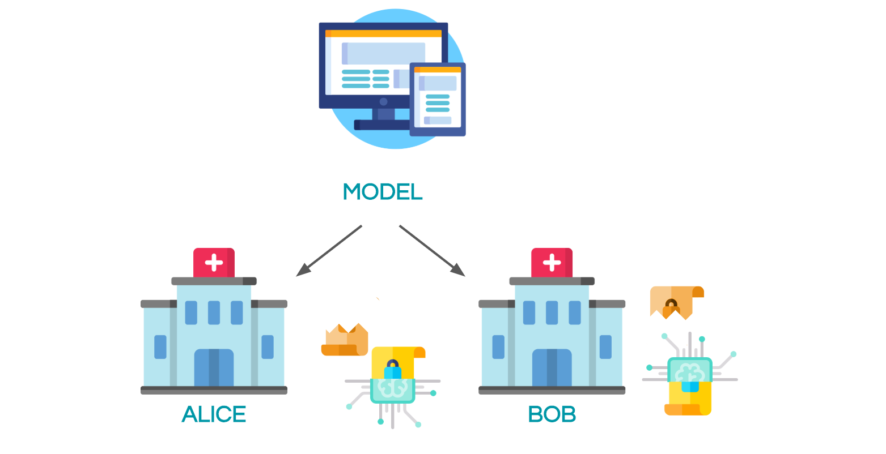
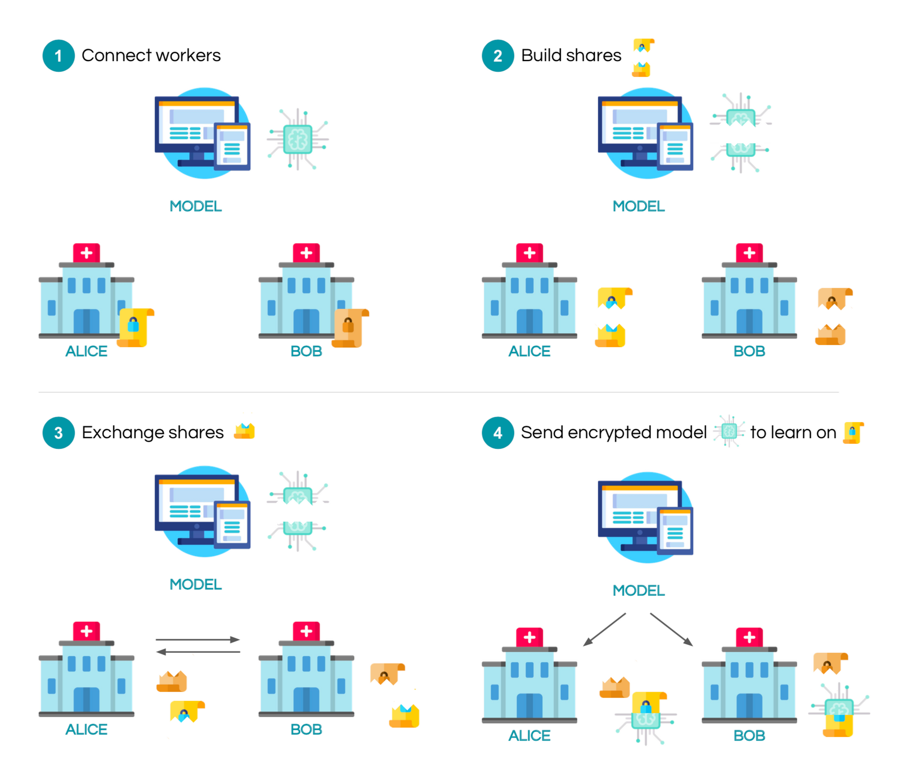

<!-- TODO(a11y): 1 localized body image(s) have empty alt text -->


<!-- TODO(content): shortcode(s) present (verify) -->

**_Update as of November 18, 2021: The version of PySyft mentioned in this post has been deprecated. Any implementations using this older version of PySyft are unlikely to work. Stay tuned for the release of PySyft 0.6.0, a data centric library for use in production targeted for release in early December._**

**Summary**: We train a neural network on encrypted values using Secure Multi-Party Computation and Autograd. We report good results on MNIST.

**Note**: If you want more posts like this, I’ll tweet them out when they’re complete at [@theoryffel](https://twitter.com/theoryffel) and [@OpenMinedOrg](https://twitter.com/OpenMinedOrg). Feel free to follow if you’d be interested in reading more and thanks for all the feedback!



## Privacy in ML

When building Machine Learning as a Service solutions (MLaaS), a company often need data from other partners to train its model. In healthcare or finance, both the model and the data are extremely critical: the model parameters represent a business asset while data is personal data and is tightly regulated.

In this context, one possible solution is to encrypt both the model and the data, and then to train the machine learning model over encrypted values. This guarantees that the company won’t access patients medical records for example, and that health facilities won’t be able to use the model to which they contribute if not authorized to do so. Several encryption schemes exist that allow for computation over encrypted data, among which Secure Multi-Party Computation (SMPC), Homomorphic Encryption (FHE/SHE) and Functional Encryption (FE). We will focus here on Secure Multi-Party Computation, which consists of private additive sharing and relies on the crypto protocols SecureNN and SPDZ, the details of which are given [in this excellent blog post](https://mortendahl.github.io/2017/09/19/private-image-analysis-with-mpc/). Throughout this article, we will abusively say _encrypt_ to mean _additively secret share_.

While this blog post focuses on encrypted training, [another post](https://blog.openmined.org/encrypted-deep-learning-classification-with-pysyft/) discusses in more details how to encrypt pre-trained models to perform encrypted predictions.

The exact setting here is the following: consider that you are the server and you would like to train your model on some data held by _n_ workers. The server secret shares his model and send each share to a worker. The workers also secret share their data and exchange it between them. In the configuration that we will study, there are 2 workers: alice and bob. After exchanging shares, each of them now has one of their own shares, one share of the other worker, and one share of the model. Computation can now start in order to privately train the model using the appropriate crypto protocols. Once the model is trained, all the shares can be sent back to the server to decrypt it. The mechanism is illustrated with the following figure:

<figure class="">



</figure>

To give an example of this process, let’s assume alice and bob both hold a part of the MNIST dataset and let’s train a model to perform digit classification!

## 1\. Encrypted Training demo on MNIST

In this section, we will go through a complete code example and highlight the key elements that we need to take into account when training data using Secure Multi-Party Computation.

## Imports and training configuration

```python
import torch
import torch.nn as nn
import torch.nn.functional as F
import torch.optim as optim

import time
```

This class describes all the hyper-parameters for the training. Note that they are all public here.

```python
class Arguments():
    def __init__(self):
        self.batch_size = 64
        self.test_batch_size = 64
        self.epochs = 20
        self.lr = 0.02
        self.seed = 1
        self.log_interval = 1 # Log info at each batch
        self.precision_fractional = 3

args = Arguments()

torch.manual_seed(args.seed)
```

Here are PySyft imports. We connect to 2 remote workers (alice and bob), and request another worker called the `crypto_provider` who gives all the crypto primitives that we will need.

```python
import syft as sy  # import the Pysyft library

# hook PyTorch to add extra functionalities like Federated and Encrypted Learning
hook = sy.TorchHook(torch) 

# simulation functions
from future import connect_to_workers, connect_to_crypto_provider

workers = connect_to_workers(n_workers=2)
crypto_provider = connect_to_crypto_provider()
```

## Getting access and secret share data

Here we’re using a utility function which simulates the following behaviour: we assume that each worker holds a distinct subset of the MNIST dataset. The workers then split their data in batches and secret share their data between each others. The final object returned is an iterable on these secret shared batches, that we call the **private data loader**. Note that during the process the local worker (so us) never had access to the data.

We obtain as usual a training and testing private dataset, and both the inputs and labels are secret shared.

```python
# We don't use the whole dataset for efficiency purpose, but feel free to increase these numbers
n_train_items = 640
n_test_items = 640

def get_private_data_loaders(precision_fractional, workers, crypto_provider):
    
    # Details are in the complete code sample
    
    return private_train_loader, private_test_loader
    
    
private_train_loader, private_test_loader = get_private_data_loaders(
    precision_fractional=args.precision_fractional,
    workers=workers,
    crypto_provider=crypto_provider,
    dataset_sizes=(n_train_items, n_test_items)
)
```

## Model specification

Here is the model that we will use, it’s a rather simple one but [it has proved to perform reasonably well on MNIST](https://towardsdatascience.com/handwritten-digit-mnist-pytorch-977b5338e627)

```python
class Net(nn.Module):
    def __init__(self):
        super(Net, self).__init__()
        self.fc1 = nn.Linear(28 * 28, 128)
        self.fc2 = nn.Linear(128, 64)
        self.fc3 = nn.Linear(64, 10)

    def forward(self, x):
        x = x.view(-1, 28 * 28)
        x = F.relu(self.fc1(x))
        x = F.relu(self.fc2(x))
        x = self.fc3(x)
        return x
```

## Training and testing functions

The training is done almost as usual, the real difference is that we can’t use losses like negative log-likelihood (`F.nll_loss` in PyTorch) because it’s quite complicated to reproduce it with SMPC. Instead, we use a simpler Mean Square Error loss.

> Note: regarding Negative Log-Likelihood, the likelihood is obtained using the [softmax](https://wikipedia.org/wiki/Fonction_softmax) function. Hence, `nll_loss` requires to run the logarithm and exponential functions or approximations of it, and this is not practical with fixed precision values.

```python
def train(args, model, private_train_loader, optimizer, epoch):
    model.train()
    for batch_idx, (data, target) in enumerate(private_train_loader): # <-- now it is a private dataset
        start_time = time.time()
        
        optimizer.zero_grad()
        
        output = model(data)
        
        # loss = F.nll_loss(output, target)  <-- not possible here
        batch_size = output.shape[0]
        loss = ((output - target)**2).sum().refresh()/batch_size
        
        loss.backward()
        
        optimizer.step()

        if batch_idx % args.log_interval == 0:
            loss = loss.get().float_precision()
            print('Train Epoch: {} [{}/{} ({:.0f}%)]tLoss: {:.6f}tTime: {:.3f}s'.format(
                epoch, batch_idx * args.batch_size, len(private_train_loader) * args.batch_size,
                100. * batch_idx / len(private_train_loader), loss.item(), time.time() - start_time))
            
```

> The .refresh() is just there to make sure the division works fine by refreshing the shares of the encrypted tensor. The reason for this is a bit technical, but just remember that it doesn’t affect the computation.

The test function does not change!

```python
def test(args, model, private_test_loader):
    model.eval()
    test_loss = 0
    correct = 0
    with torch.no_grad():
        for data, target in private_test_loader:
            start_time = time.time()
            
            output = model(data)
            pred = output.argmax(dim=1)
            correct += pred.eq(target.view_as(pred)).sum()

    correct = correct.get().float_precision()
    print('nTest set: Accuracy: {}/{} ({:.0f}%)n'.format(
        correct.item(), len(private_test_loader)* args.test_batch_size,
        100. * correct.item() / (len(private_test_loader) * args.test_batch_size)))
```

### Let’s launch the training !

A few notes about what’s happening here. First, we encrypt all the model parameters across our workers. Second, we convert optimizer’s hyperparameters to fixed precision. Note that we don’t need to secret share them because they are public in our context, but as secret shared values live in finite fields we still need to move them in finite fields using using `.fix_precision`, in order to perform consistently operations like the weight update:

> As a remainder, in order to work on integers in finite fields, we leverage the PySyft tensor abstraction to convert PyTorch Float tensors into Fixed Precision Tensors using `.fix_precision()`. For example 0.123 with precision 2 does a rounding at the 2nd decimal digit so the number stored is the integer 12.

```python
model = Net()
model = model.fix_precision().share(*workers, crypto_provider=crypto_provider, requires_grad=True)

optimizer = optim.SGD(model.parameters(), lr=args.lr)
optimizer = optimizer.fix_precision() 

for epoch in range(1, args.epochs + 1):
    train(args, model, private_train_loader, optimizer, epoch)
    test(args, model, private_test_loader)
```

```
Train Epoch: 1 [0/640 (0%)]	Loss: 1.128000	Time: 2.931s
Train Epoch: 1 [64/640 (10%)]	Loss: 1.011000	Time: 3.328s
Train Epoch: 1 [128/640 (20%)]	Loss: 0.990000	Time: 3.289s
Train Epoch: 1 [192/640 (30%)]	Loss: 0.902000	Time: 3.155s
Train Epoch: 1 [256/640 (40%)]	Loss: 0.887000	Time: 3.125s
Train Epoch: 1 [320/640 (50%)]	Loss: 0.875000	Time: 3.395s
Train Epoch: 1 [384/640 (60%)]	Loss: 0.853000	Time: 3.461s
Train Epoch: 1 [448/640 (70%)]	Loss: 0.849000	Time: 3.038s
Train Epoch: 1 [512/640 (80%)]	Loss: 0.830000	Time: 3.414s
Train Epoch: 1 [576/640 (90%)]	Loss: 0.839000	Time: 3.192s

Test set: Accuracy: 300.0/640 (47%)

...

Train Epoch: 20 [0/640 (0%)]	Loss: 0.227000	Time: 3.457s
Train Epoch: 20 [64/640 (10%)]	Loss: 0.169000	Time: 3.920s
Train Epoch: 20 [128/640 (20%)]	Loss: 0.249000	Time: 3.477s
Train Epoch: 20 [192/640 (30%)]	Loss: 0.188000	Time: 3.327s
Train Epoch: 20 [256/640 (40%)]	Loss: 0.196000	Time: 3.416s
Train Epoch: 20 [320/640 (50%)]	Loss: 0.177000	Time: 3.371s
Train Epoch: 20 [384/640 (60%)]	Loss: 0.207000	Time: 3.279s
Train Epoch: 20 [448/640 (70%)]	Loss: 0.244000	Time: 3.178s
Train Epoch: 20 [512/640 (80%)]	Loss: 0.224000	Time: 3.465s
Train Epoch: 20 [576/640 (90%)]	Loss: 0.297000	Time: 3.402s

Test set: Accuracy: 610.0/640 (95%)
```

Here we go! We just got 95% of accuracy using a tiny fraction of the MNIST dataset, using 100% encrypted training!

## 2\. Discussion

Let’s now discuss several points about this demonstration, among which the computation time, the encrypted backpropagation method we use and the threat model that we consider.

## 2.1 Computation time

First thing is obviously the running time! As you have surely noticed, it is far slower than plain text training. In particular, a iteration over 1 batch of 64 items takes 3.2s while only 13ms in pure PyTorch. Whereas this might seem like a blocker, just recall that here everything happened remotely and in the encrypted world: no single data item has been disclosed. More specifically, the time to process one item is 50ms which is not that bad. The real question is to analyze when encrypted training is needed and when only encrypted prediction is sufficient. 50ms to perform a prediction is completely acceptable in a production-ready scenario for example!

One main bottleneck is the use of costly activation functions: using relu activation with SMPC is very expensive because it uses private comparison and the SecureNN protocol. As an illustration, if we replace relu with a quadratic activation as it is done in several papers on encrypted computation like [CryptoNets](https://www.microsoft.com/en-us/research/publication/cryptonets-applying-neural-networks-to-encrypted-data-with-high-throughput-and-accuracy/), we drop from 3.2s to 1.2s.

As a general rule, the key idea to take away is to encrypt only what’s necessary, and this tutorial shows you that it can be done easily. In particular, keep in mind that you don’t have to encrypt both the data and the model if it’s not needed. You can keep the model in clear text for example and you will get significant speed improvements.

## 2.2 Backpropagation with SMPC

> If you know nothing about backpropagation and autograd in PyTorch, you may prefer to start [here](https://blog.paperspace.com/pytorch-101-understanding-graphs-and-automatic-differentiation/).

You might wonder how we perform backpropagation and gradient updates because we’re working with integers in finite fields, which are encrypted on top of that. To do so, we have developed a new syft tensor called AutogradTensor. This tutorial used it intensively although you might have not seen it! Let’s check this by printing a model’s weight:

```python
model.fc3.bias
```

```
Parameter containing:
Parameter>AutogradTensor>FixedPrecisionTensor>[AdditiveSharingTensor]
	-> [PointerTensor | me:60875986481 -> worker1:9431389166]
	-> [PointerTensor | me:97932769362 -> worker2:74272298650]
	*crypto provider: crypto_provider*
```

And a data item:

```python
first_batch, input_data = 0, 0
private_train_loader[first_batch][input_data]
```

```
(Wrapper)>AutogradTensor>FixedPrecisionTensor>[AdditiveSharingTensor]
	-> [PointerTensor | me:35529879690 -> worker1:63833523495]
	-> [PointerTensor | me:26697760099 -> worker2:23178769230]
	*crypto provider: crypto_provider*
```

As you observe, the AutogradTensor is there! It lives between the torch wrapper and the FixedPrecisionTensor which indicates that the values are now in finite fields. The goal of this AutogradTensor is to store the computation graph when operations are made on encrypted values. This is useful because when calling backward for the backpropagation, this AutogradTensor overrides all the backward functions that are not compatible with encrypted computation and indicates how to compute these gradients. For example, regarding multiplication which is done using the Beaver triples trick, we don’t want to differentiate that trick, all the more that differentiating a multiplication should be very easy: 

Here is how we describe how to compute these gradients for example:

```python
class MulBackward(GradFunc):
    def __init__(self, self_, other):
        super().__init__(self, self_, other)
        self.self_ = self_
        self.other = other

    def gradient(self, grad):
        grad_self_ = grad * self.other
        grad_other = grad * self.self_ if type(self.self_) == type(self.other) else None
        return (grad_self_, grad_other)
```

You can have a look [at this file](https://github.com/OpenMined/PySyft/blob/dev/syft/frameworks/torch/tensors/interpreters/gradients.py) if you’re curious to see how we implemented more gradients.

In terms of the computation graph, it means that a copy of the graph remains local and that the server which coordinates the forward pass also provides instructions on how to do the backward pass. This is a completely valid hypothesis in our setting.

## 2.3 Security guarantees

Last, let’s give a few hints about the security we’re achieving here: both data owners or model owners can be adversaries. These adversaries are however **honest but curious**; this means that an adversary can’t learn anything about the data by running this protocol, but a malicious adversary could still deviate from the protocol and for example try to corrupt the shares to sabotage the computation. Security against malicious adversaries in such SMPC computations including private comparison is still an open problem.

In addition, even if Secure Multi-Party Computation ensures that training data wasn’t accessed, many threats from the classic ML world are still present here. For example, as you can make requests to the model (in the context of MLaaS), you can get predictions which might disclose information about the training dataset. In particular you don’t have any protection against **membership attacks**, a common attack on machine learning services where the adversary wants to determine if a specific item was used in the dataset. Besides this, other attacks such as unintended memorization processes (models learning specific feature about a data item), model inversion or extraction are still possible.

One general solution which is effective for many of the threats mentioned above is to add **Differential Privacy**. It can be nicely combined with Secure Multi-Party Computation and can provide very interesting security guarantees. We’re currently working on several implementations and hope to propose an example that combines both shortly!

## Conclusion

As you have seen, training a model using SMPC is not complicated from a code point of view, even though we use rather complex objects under the hood. With this in mind, you should now analyse your use-cases to see when encrypted computation is needed either for training or for evaluation.

**Acknowlegments** This work is the result of a collective effort by our Cryto ML team at OpenMined, and I would like to specifically thank Mat Leonard, Jason Paumier, André Farias, Jose Corbacho, Bobby Wagner and the amazing Andrew Trask for all their support to make this happen.

If you enjoyed this and would like to join the movement toward privacy preserving, decentralized ownership of AI and the AI supply chain (data), you can do so in the following ways!

### Star PySyft on GitHub

The easiest way to help our community is just by starring the repositories! This helps raise awareness of the cool tools we’re building.

-   [Star PySyft](https://github.com/OpenMined/PySyft)

### Pick our tutorials on GitHub!

We made really nice tutorials to get a better understanding of what Federated and Privacy-Preserving Learning should look like and how we are building the bricks for this to happen.

-   [Checkout the PySyft tutorials](https://github.com/OpenMined/PySyft/tree/master/examples/tutorials)

### Join our Slack!

The best way to keep up to date on the latest advancements is to join our community!

-   [Join slack.openmined.org](http://slack.openmined.org)

### Join a Code Project!

The best way to contribute to our community is to become a code contributor! If you want to start “one off” mini-projects, you can go to PySyft GitHub Issues page and search for issues marked `Good First Issue`.

-   [Good First Issue Tickets](https://github.com/OpenMined/PySyft/issues?q=is%3Aopen+is%3Aissue+label%3A%22good+first+issue%22)

### Donate

If you don’t have time to contribute to our codebase, but would still like to lend support, you can also become a Backer on our Open Collective. All donations go toward our web hosting and other community expenses such as hackathons and meetups!

-   [Donate through OpenMined’s Open Collective Page](https://opencollective.com/openmined)
