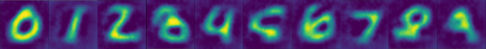
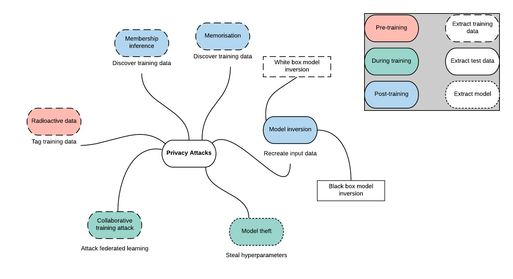
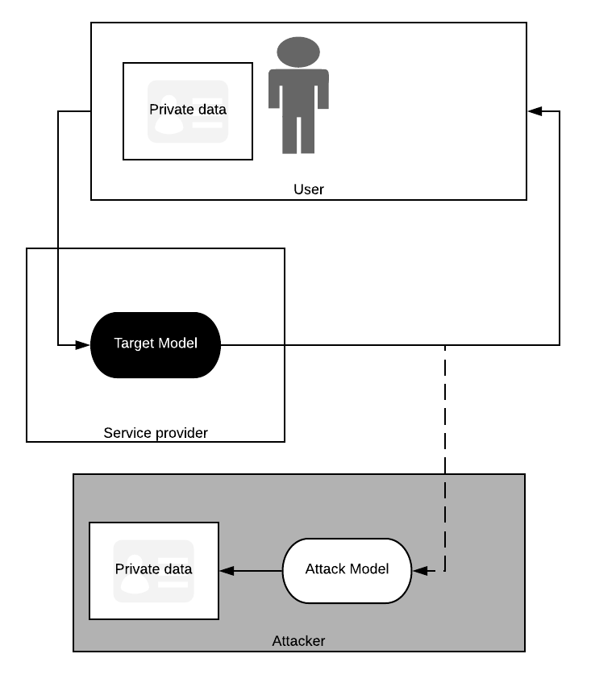
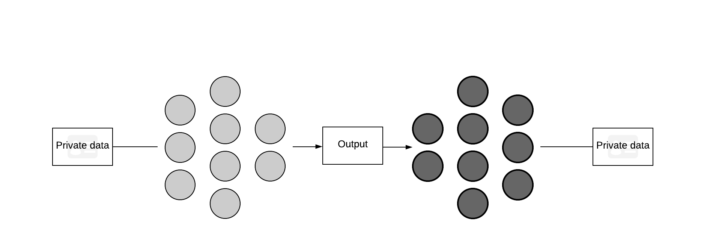
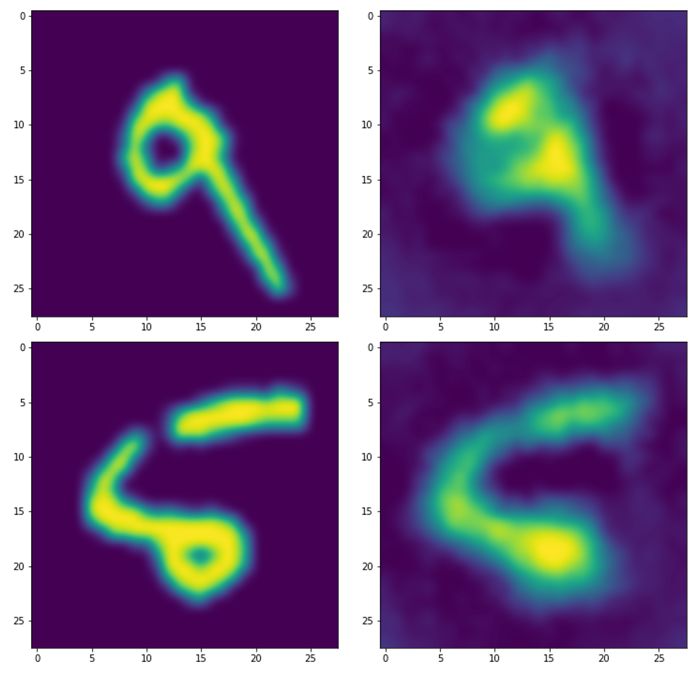

<!-- TODO(a11y): 6 localized body image(s) have empty alt text -->


<figure class="">



</figure>

**Summary:** _We demonstrate that neural networks are susceptible to an attack which recreates private input data from model outputs_

_Part of the work in this article was completed as part of Cortex – [Tessella’s AI Accelerator](https://www.tessella.com/)_

Deep learning has pervaded the systems which dominate our daily life at an unfathomable rate, with little sign of slowing down. Neural networks are now in our phones, categorising our photos; they are in our e-mail clients, predicting what we intend to say next; soon, they will be in our cars, chauffeuring us for all our journeys.

While much effort is spent on developing the latest models to achieve ever greater results, this is often done with great insouciance to their security and safety. Protecting a wifi network or data store is expected; protecting a model, less so.

Make no mistake, neural networks are, like all systems, fallible. And as the global volume of data routed through neural networks increases, the bounty models offer to nefarious actors grows with it. It is only a matter of time before sensitive information is extracted from a high-profile model.

In this article, we will demonstrate one such method for extracting supposedly private information from a model, known as a _model inversion attack_. We shall see that it is not a particularly tricky task. Loath to end on an ominous note, however, we shall discuss how such attacks can be mitigated with _privacy-preserving_ techniques and the _PySyft_ platform \[1\].

### Attacksonomy

As with any system, neural networks are susceptible to attack in a variety of settings. Some attacks, such as radioactive data \[2\], compromise data to allow training set identification from a trained model. Others, such as collaborative training attack \[3\], use gradient information from a process like federated learning to learn information about other participants’ training data.

Attacks vary in which stage of the model training and deployment process they exploit, what information they expose, the information required for them to work and how they can be defended against.

<figure class="">



<figcaption>A non-exhaustive taxonomy of neural network attacks</figcaption></figure>

The attack we are applying in this post is a type of _model inversion_ attack, in which we recreate data fed through a deployed model (that is to say we expose live data, not historic training data) from information it outputs.

### Model Inversion

Neural networks take some form of input data (be it photos, voice recordings, or medical data, to name a few examples) and learn to encode it into some new distribution from which inference can be made (what object is in the photo; what word was just said; whether or not somebody has cancer…).

If neural networks can transform input data into some encoded space, is it possible to transform the encoding _­back_ into the original data? If it were possible, there would be profound consequences for organisations and individuals deploying models publicly. For example, consider a well-intentioned engineer who worked tirelessly for weeks to develop a model for rapid identification of Covid-19, only for it to inadvertently leak the health information of anybody who used it. Not only would public trust in the system diminish rapidly, leading people to avoid a tool which may be vital to protect public health, there is a possibility that the researcher would be open for legal challenge.

Fredrikson, Jha and Ristenpart \[4\] demonstrated a method for discovering data on which a model was trained, leveraging the fact that training data leaves a sort of imprint on the pathways through a neural network.

<figure class="">


<figcaption><strong>Left: </strong>Recreated data<strong> Right: </strong>Actual images. Fredrikson, Jha and Ristenpart [4]</figcaption></figure>

### Black box model inversion

Fredrikson’s attack is what’s known as _white box_: for it to work you must have access to the internals of the model. Here we shall introduce a _black box_ attack \[5\], so called because knowledge of what’s going on inside a model is not required; the attacker just needs to be able to query it with data and observe the results. A black box attack setting is very common for _Machine-Learning-as-a-Service_ (MLaaS) models, such as a translator hosted on a web app.

In this setting, we (assuming of the role of an attacker) can attempt to train our own model to turn a target model’s **output** back into its **input** data. Quite literally, we are creating a model which _inverts_ another _model_. We could then recreate other people’s private data by intercepting outputs from the target and running it through our attacker.

<figure class="">



<figcaption>Diagram of a model inversion attack on MLaaS. The attacker intercepts the outputs of a service model and recreates the user’s private data.</figcaption></figure>

Conceptually, training a model to invert data is possible. Autoencoders are a type of neural network which first encode data into a small representation, which can be used for a range of tasks, before decoding it back into the original data. The primary difference between an autoencoder and what we are trying to do is that the _decoder_ (our attack model) is being trained on a fixed _encoder_ (the target model).

Because we can query the model with our own data, we can build up a dataset of input data (to the model we’re trying to attack) and output data, with which we can train our inversion model. The question which remains is how much our data must resemble the data on which the target model was trained. If they are too dissimilar, for example if we used images of dogs on a model which identifies tumours, then our attack model would only learn to invert a very niche part of the target’s encoded space; when new medical images are fed through the target model, our model would not have the knowledge to successfully recreate the data. On the other hand, having access to some of the target’s training data is unlikely in practice, save for a “classical” data breach.

<figure class="">



<figcaption>In this attack we’re training a model (the dark network) to decode output from a target (the light network) back into private input data</figcaption></figure>

### The Attack in Practice

We will now attempt to recreate outputs from a model which classifies the MNIST dataset of handwritten digits. While the attack can work on raw classification output from a model, it works far better on output from a layer at some intermediate stage of the network, which is what we’ll be doing.

This isn’t as contrived an example as it first appears. For example, Split Neural Networks (SplitNN) are a training paradigm in which part of a network is hosted on a data holder’s device and the second part of the network is hosted on another device \[6\]. The benefit of this is that the data owner does not need to send raw data to the other party for computation (a neural network’s encoding of the data is sent instead) and it’s less computationally demanding of the data holder than federated learning. However, as we shall see, if the data encodings are not suitably protected via encryption methods or limited model querying access, the data can nevertheless be exposed.

We start by creating a basic classifier in PyTorch, split into two parts to signify the data owner and the computational server of a SplitNN (both parts are on the same machine in this example, but you can use your imagination).

```python
from torch import nn, optim

class SplitNN(nn.Module):
  def __init__(self):
    self.first_part = nn.Sequential(
                           nn.Linear(784, 500),
                           nn.ReLU(),
                         )
    self.second_part = nn.Sequential(
                           nn.Linear(500, 500),
                           nn.ReLU(),
                           nn.Linear(500, 10),
                           nn.Softmax(dim=-1),
                         )

  def forward(self, x):
    return self.second_part(self.first_part(x))

target_model = SplitNN()
```

Let’s assume the target model has been trained on the MNIST dataset and that we can access the size `500` vector output from the model’s `first_part` . We will now create our attacker, which takes a size `500` vector as input (the output of the target’s first part) and outputs a size `784` vector (the data size).

```python
class Attacker(nn.Module):
  def __init__(self):
    self.layers= nn.Sequential(
                      nn.Linear(500, 1000),
                      nn.ReLU(),
                      nn.Linear(1000, 784),
                    )
 
  def forward(self, x):
    return self.layers(x)
```

Perhaps we don’t know exactly what data the target model has been trained on, but we do know that it’s some sort of handwritten images. Therefore we can use part of the EMNIST dataset \[7\] of handwritten letters to train our attacker.

```python
attacker = Attacker()
optimiser = optim.Adam(attacker.parameters(), lr=1e-4)

for data, targets in emnist_train_loader:
  # Reset gradients
  optimiser.zero_grad()

  # First, get outputs from the target model
  target_outputs = target_model.first_part(data)

  # Next, recreate the data with the attacker
  attack_outputs = attacker(target_outputs)

  # We want attack outputs to resemble the original data
  loss = ((data - attack_outputs)**2).mean()

  # Update the attack model
  loss.backward()
  optimiser.step()
```

Finally, we run unseen data through our attack model

```python
for data, targets in mnist_test_loader:
  target_outputs = target_model.first_part(data)
  recreated_data = attacker(target_outputs)
```

<figure class="">



<figcaption><strong>Left: </strong>Actual images. <strong>Right: </strong>Recreated data</figcaption></figure>

We can see that we have successfully recreated data which was input to a model, despite not having direct access to that model and not knowing exactly what the data was supposed to look like.

### Protecting our data

Fortunately for us all, there are several steps that can be taken — by data holders and model providers — to protect data from unintended exposure. Model inversion in particular is dependent on open access to model output, so a form of encryption could deter a would-be attacker. However, this would not help in the scenario of a malicious computational server; robust methods for verifying honest collaborators must be developed.

Of course, the black model inversion presented here is not the only type of attack, so other protections are also required. One powerful approach for decoupling a model from the data it uses is differential privacy, which, amongst other applications, will be used in the 2020 US Census to protect identities \[8\].

While these and other defences have been demonstrated to successfully protect data in some way, implementing them securely and correctly to live systems is an entirely separate challenge. Thus enter OpenMined. OpenMined is a community of developers and machine learning practitioners striving to lower the barrier of entry for privacy-preserving machine learning by developing open-source tools. With their privacy platform, _PySyft_, protecting data from a model inversion attack could become a triviality.

### Conclusions

We have shown a simple way data can be extracted from a model if not enough care is given to protect it. Through this article I hope we can coalesce on a simple fact: our models, and the data they use, are not perfectly safe. However, there are tools to defend our data; we just have to start using them.

### References

\[1\]: [https://www.openmined.org/](https://www.openmined.org/)

\[2\]: [https://arxiv.org/pdf/2002.00937.pdf](https://arxiv.org/pdf/2002.00937.pdf)

\[3\]: [https://arxiv.org/pdf/1805.04049.pdf](https://arxiv.org/pdf/1805.04049.pdf)

\[4\]: [https://www.cs.cmu.edu/~mfredrik/papers/fjr2015ccs.pdf](https://www.cs.cmu.edu/~mfredrik/papers/fjr2015ccs.pdf)

\[5\]: [https://www.ntu.edu.sg/home/tianwei.zhang/paper/acsac19.pdf](https://www.ntu.edu.sg/home/tianwei.zhang/paper/acsac19.pdf)

\[6\]: [https://arxiv.org/pdf/1810.06060.pdf](https://arxiv.org/pdf/1810.06060.pdf)

\[7\]: [https://www.nist.gov/itl/products-and-services/emnist-dataset](https://www.nist.gov/itl/products-and-services/emnist-dataset)

\[8\]: [https://www.census.gov/about/policies/privacy/statistical\_safeguards/disclosure-avoidance-2020-census.html](https://www.census.gov/about/policies/privacy/statistical_safeguards/disclosure-avoidance-2020-census.html)
