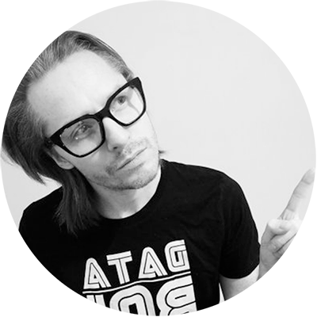

<!-- TODO(a11y): 1 localized body image(s) have empty alt text -->

<figure class="">

</figure>

## Interview with Nick Duddy

**Twitter:** [@nickduddy](https://twitter.com/nickduddy)   |   **Slack:**  [@nickduddy](https://app.slack.com/client/T6963A864/D82G1ACBU/user_profile/U75RGPDPC)

---

**Where are you based?**

> “I’m based in London.”

**What do you do?**

> “I’m the founder of a Marketing Consultancy (Miratrix).”

**What are your specialties?**

> “Marketing and Python.”

**How and when did you originally come across OpenMined?**

> “I saw Andrew Trask speak at a conference in Cambridge. I was like ‘I don’t fully understand this but dude is on to something’. Then I joined the slack, I think I was number 500.”

**What was the first thing you started working on within OpenMined?**

> “The first thing I did was create a word map of all the reasons people join the project.”

**And what are you working on now?**

> “I’m currently facilitating our decentralised approach to organising meetups. Helping hosts understand what they need to host and grow meetups.”

**What would you say to someone who wants to contribute?**

> “I’d say to newbies that can’t code but are excited about OpenMined, that there are loads of other things you can do to help support the project. I’ve never (and I’m unlikely to ever) commit to the code base. I’m kept very busy by helping to support the local communities spread the word.”
