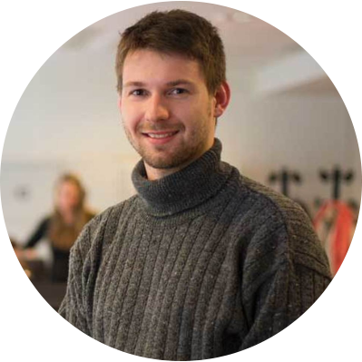

<!-- TODO(a11y): 1 localized body image(s) have empty alt text -->

<figure class="">

</figure>

## Interview with Théo Ryffel

**Twitter:** [@theoryffel](https://twitter.com/theoryffel)   |   **GitHub:**  [@lariffle](https://github.com/LaRiffle)   |   **Slack:**  [@Théo Ryffel](http://slack.openmined.org/)

---

**Where are you based?**

> “I live in Paris, since I came back from London in April 2018.”

**What do you do?**

> “I’m the co-founder of [Arkhn](https://arkhn.com/en/), a start-up based in Paris which helps hospitals leveraging healthcare data and promotes AI research projects to improve patient care. I’m also doing a PhD at ENS where I study privacy-preserving machine learning techniques. I try to develop practical tools for the ML community that provide high privacy guarantees.”

**What are your specialties?**

> “While my background is primarily in theoretical maths and physics, I’ve graduated in machine learning and have therefore a strong appetite for Python development. However, Javascript is never that far, as I spent a lot of time building websites a few years ago, so we might cross paths again.”

**How and when did you originally come across OpenMined?**

> “I started to be involved in OpenMined while I was doing my MSc research project in London. My supervisor Jonathan recommended to me several projects that were promoting privacy in the AI field, one was SEAL from Microsoft, the other was called OpenMined.”

**What was the first thing you started working on within OpenMined?**

> “I must say that joining the project at that time was tough! Big changes were going on, and I could wake up in the morning and see that the GitHub repo I was digging into the previous day was now completely empty! One of my very first contributions was a small bugfix as I was playing with the PySyft tools, in order to use PyTorch functions (like torch.matmul) on remote tensors. Then, I progressively started to understand more parts of the code, especially the stack traces which are really impressive at first. I don’t think there was a single decisive step which had me jumping on the bandwagon, but it was more a succession of small features and bug fixes to have my own projects working.”

**And what are you working on now?**

> “I’m now focused on integrating privacy features into the Federated Learning architecture that we’ve built for over a year. We have created a Crypto-ML team to gather all the contributions in this field and it’s a great and enriching opportunity for me to coordinate these efforts. In particular, we are working on implementing efficient Secure Multi-Party Computation protocols and I’m very excited to announce that we finally got encrypted training working! This is a very important goal for us to demonstrate that basically everything you do in Deep Learning can be done in a privacy-preserving way without having to be a security expert. This is a joint effort from the whole team which has been doing amazing work these last 3 months and I can’t wait to see what will be next.”

**What would you say to someone who wants to contribute?**

> “Joining a massive open-source project like OpenMined is a challenge. There is so much to explore and it’s very easy to get lost. We’ve been making a lot of efforts to build tutorials which highlight the key features of our libraries and to help people understand what they can do with them. But this might not be enough. I think the best way to contribute is when one has a project to complete. It can be a study project (like mine, or like those of [the Udacity course](https://eu.udacity.com/course/secure-and-private-ai--ud185)), a public project (like the [hacking challenge](https://github.com/OpenMined/PySyft/issues/2421) going on), or a personal/work project. In these situations, you might find out that a feature is missing or is not working as expected, and might want to understand how to fix this. The community is very active on [Slack](http://slack.openmined.org/) and will always try to help if you get stuck. In a nutshell, it might not be easy at the beginning, but your efforts will be worth it!”
