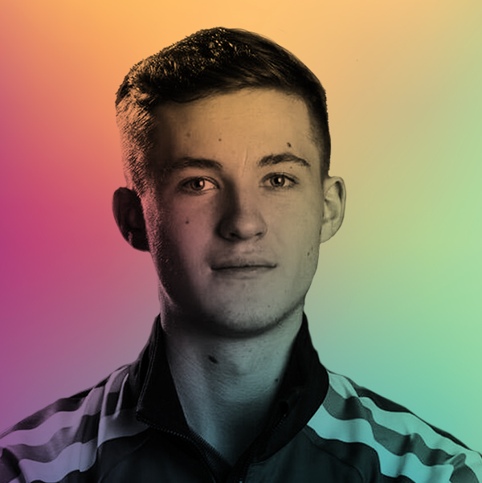
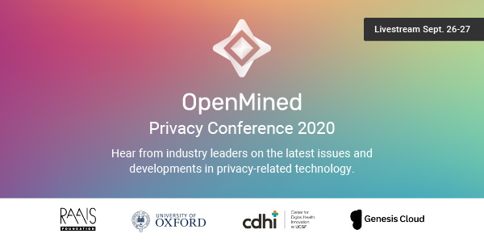

<!-- TODO(a11y): 2 localized body image(s) have empty alt text -->

**Featuring Dmitrii Usynin – Speaker at #PriCon2020 – Sept 26 & 27**

With the upcoming OpenMined Private Conference 2020 around the corner, we decided to highlight the major themes and talks to be expected.

On Saturday the 26th, from 9 to 10 pm BST, there’ll be six 10 minutes long talks covering different hot-off-the-press Privacy Research topics. Of special interest is the talk _**‘Private deep learning of medical data for hospitals using federated learning and differential privacy’.**_

This short chat will touch on the Private AI on healthcare series.

<figure class="">

</figure>

We briefly spoke with Dmitrii Usynin, a PhD student at the Technical University of Munich and Imperial College London specialising in private federated learning in oncology. He has extensive experience in privacy engineering in the medical domain.. He explained his interests and initial exposure to the field as well as the implications his work has on healthcare and society.

_**What made you immerse yourself in the private preserving techniques for medical purposes?**_

I initially became interested in privacy engineering during my placement at HSBC, where I had a chance to work with sensitive client data and conduct security tests of the applications that work with that data. Afterwards, I decided that privacy is the area I could contribute to during my final year at Imperial and started looking into individual projects in the domain of data science and privacy engineering. This is how I ended up working on Privacy-Preserving Machine Learning, which was the title of my project. This was by far the largest piece of work I have ever produced (with a word count of 50.000 words) and it consisted of a theoretical foundation of why privacy is important in the context of collaborative machine learning and how we can adapt it to the domain of medical image analysis and provide participants with provable security guarantees.

_**What was the highlight of your project looking at secure ways in which to handle medical image analysis at Imperial?**_

The main take from that project is that, at the moment, the expectations of medical researchers and privacy engineers are divergent: some of their goals are very conflicting. For instance, in order to obtain stronger privacy guarantees, we may need to sacrifice model utility through the use of Differential Privacy, which is one of the most commonly used privacy-preservation techniques in the domain of medical image analysis. Such trade-offs are inevitable in order to prevent malicious inference or reconstruction of sensitive data that is used to train collaborative models. In addition to this, there are other factors such as data heterogeneity, model incompatibility with privacy mechanisms and malicious actors that target the utility of the end model rather than attempting to infer sensitive data, that need to be taken into account when designing an efficient and secure collaborative learning context.  

_**What are your current projects and direction?**_

After a successful project, I have been offered a place at a Joint Academy of Doctoral Studies, which is a collaboration between TU Munich and Imperial College London. Currently I am working on a number of projects, which I will present at #PriCon2020, mostly concentrated on private inference in a medical collaborative context and secure federated systems for medical image analysis.   My long-term goal, as you might have already guessed, is connecting machine learning researchers to the world of privacy engineering in order to allow contributors from anywhere in the world to benefit from each other’s diverse datasets in a secure manner, making international collaboration in a medical domain a reality.

**For the #PriCon2020 Agenda, Outstanding Speakers & Free Tickets go here:** [**https://pricon.openmined.org/**](https://pricon.openmined.org/)

<figure class="">

</figure>

[**Join slack.openmined.org**](http://slack.openmined.org/)
