<!-- TODO(a11y): 15 localized body image(s) have empty alt text -->

**_Want bureaus to score your credit without hoarding your data? Find out how FL can enable privacy-preserving, cross-border credit assessment._**

**Published by [DataFleets](https://twitter.com/DataFleets) in partnership with OpenMined.**

> _“Just give me the [code](https://github.com/datafleets/horizontal-federated-learning-blog) for federated averaging experiments in non-IID settings”_

In 2017 [hackers cracked Equifax](https://www.csoonline.com/article/2130877/the-biggest-data-breaches-of-the-21st-century.html), exposing the personal information of nearly 150 million consumers. Security numbers, birth dates, addresses, and even license numbers were leaked.

Unfortunately, Equifax is not alone. Hackers have penetrated all 3 major credit bureaus in the United States. These bureaus are each a [single point of failure](https://medium.com/nuts-foundation/centralized-vs-decentralized-credit-scoring-system-advantages-and-drawbacks-7e8ef90d9a40) for consumer data.

What’s more, the absence of mutual trust between foreign bureaus [stifles](https://www.cnbc.com/id/41498097) [international collaboration](https://www.graydon.co.uk/blog/credit-score-systems-across-world). This holds immigrants back as they find their financial feet in new countries.

Promisingly, advances in federated learning make safe and cross-border credit scoring possible. In this post, we explore how this might work by tackling a major technical hurdle, non-IIDness.

## Outline

-   [**Part 1:** Improved credit scoring with federated learning](#part1)
-   [**Part 2:** Federated learning’s non-IID conundrum](#part2)
-   [**Part 3:** Learning to score credit in non-IID settings](#part3)

---

## Part 1: Improved credit scoring with federated learning

In the prevailing setup, approximately [10,000 data furnishers](https://files.consumerfinance.gov/f/201212_cfpb_credit-reporting-white-paper.pdf) — including banks, card issuers, and other financial institutions — send a person’s activity to bureaus for scoring purposes, illustrated below.

<figure class="">

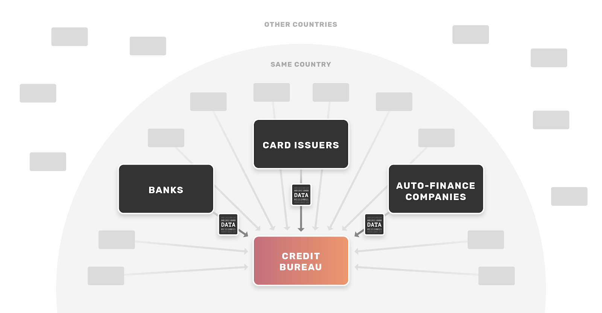

</figure>

With this centralized pile of data, the bureaus model historical data on consumers to produce credit scores that essentially represent how risky/safe it is to lend to us. Data furnishers can then request the bureau to provide a credit score on a specific consumer to assess the risk that he or she would default, determine if credit should be extended to the consumer, and if so decide the price and terms of the credit (e.g. interest rate).

Instead of data furnishers sending data to the bureaus, the bureaus can employ federated learning to generate credit scores for consumers. For those of you new to federated learning, [this](https://federated.withgoogle.com/) is a great place to start. In short, federated learning doesn’t aggregate data centrally, but instead optimizes a single machine learning model using data from multiple machines. When coupled with secure protocols and differential privacy, it can do so securely and privately with terabyte-level scalability for big datasets.

A federated system could work as follows:

1.  Data furnishers retain control over customer data and never move it outside their walls.
2.  By federating across the furnishers’ data, bureaus create a single, holistic credit scoring model without ever explicitly accessing consumer data.
3.  Upon request from a third party institution, bureaus employ secure inference to calculate a credit score with only that requester’s encrypted request, i.e. not exposing raw consumer data to the bureau.

We illustrate this proposed model below:

<figure class="">

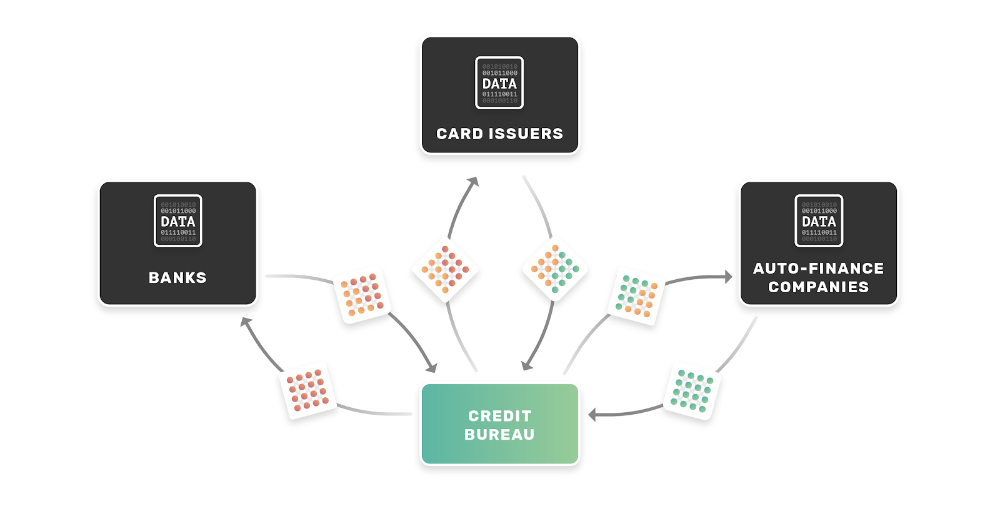

</figure>

If bureaus and data furnishers implemented a federated system, everyone would win:

###### Consumers:

-   **No more single point of failure.** Consumer data is protected from complete data exfiltration. Of course, hackers may still tap an institution, which compromises consumers. Yet this only exposes data from a single source, not an entire industry’s records (as is the prevailing case with bureaus).
-   **Internationally portable credit.** Consumers can “bring” their credit scores across borders. Of course, this is notional and would require a sea change of [governmental](https://fas.org/sgp/crs/misc/R44125.pdf) and industry practice, and navigating the complexity of data privacy and non-public information security regulations is non-trivial. But please indulge – at least _technologically_, it would be possible _today_ for governments and private institutions to run analytics on foreign parties’ data via federated learning. By so doing, they would securely glean insights on the creditworthiness of individuals without actually accessing the data itself or tripping privacy. That way, when people move to a new country, they do not have to restart entirely their financial track record. Clearly, this would benefit the lives of millions of expats and immigrants.

###### Financial institutions:

-   **Simplified control and compliance.** Federated learning lets financial institutions manage their customer data, avoiding the expensive and vulnerable process of data copy and transfer.

###### Bureaus:

-   **Strategic competitive positioning.** Bureaus can strategically maintain a competitive position in the market. Presently, they face new competitive pressures from startups and alternative data providers. Furnishers increasingly look to these new datasets to bolster their risk scoring models for underwriting consumer credit risk. Bureaus could box out such competitors with expanded consumer insights built on a trusted, private, and secure foundation.

### Cross-silo, horizontally partitioned federated learning

Before proceeding, let’s cover some of federated learning’s fundamentals. If you have experience in the field, skip ahead to [Federated Learning’s Non-IID conundrum](#part2).

#### Silo vs device schemes

Broadly speaking, there are two schemes for federated learning: [cross-silo](https://arxiv.org/pdf/2002.09843.pdf) and [cross-device](https://ai.googleblog.com/2017/04/federated-learning-collaborative.html). Cross-silo settings involve learning across databases that contain data for many users, i.e. our case of bureaus federating across banks and card issuers to analyze loan repayment records.

<figure class="">

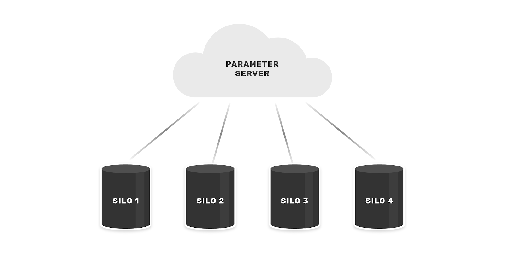

</figure>

In contrast, cross-device settings concern learning across user devices that have data created by a single user. This does not directly concern the bureau example, but we address it here for completeness. Cross-device is the original application of federated learning, wherein [Google trained next-word prediction](https://ai.googleblog.com/2017/04/federated-learning-collaborative.html) models on GBoard user data.

<figure class="">

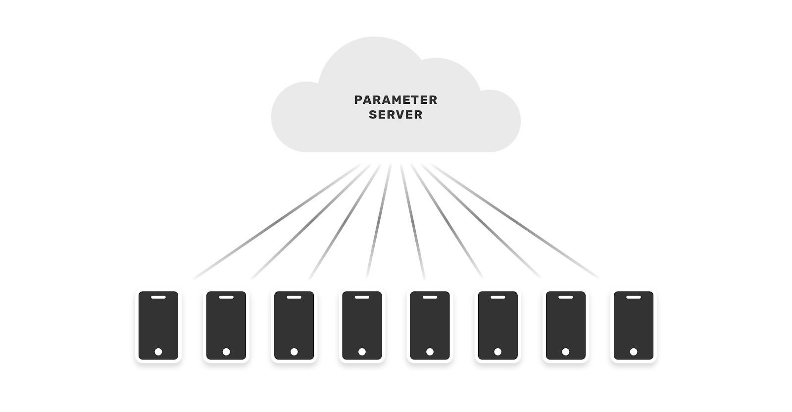

</figure>

#### Data partitions

Federated learning supports three types of data partitions: [horizontal, vertical, and federated transfer learning](https://dl.acm.org/doi/abs/10.1145/3298981). A brief summary of each is below:

-   **Horizontally partitioned federated learning (HFL):** data distributed in different silos contain the _same feature space_ and _different samples._
-   **Vertically partitioned federated learning  (VFL):** data distributed in different silos contain _different feature spaces_ and _the same samples._
-   __**Federated transfer learning (FTL):** data distributed in different silos contain _different feature spaces_ and _different samples.___

We frame our bureau credit scoring example as a horizontal case because each data silo has the same features represented by the same table schema.

Below are generalized manifestations of horizontally partitioned, cross-silo learning problems:

-   **Structured data:** Examples include application data from enterprise software, installed across many institutions and/or databases split across international boundaries in adherence to [data localization requirements](https://www.insightsforprofessionals.com/en-us/it/storage/data-sovereignty-data-residency-data-localization).
-   **Unstructured data:** Examples include clinical documentation, tomographic images, and/or VCF files from multiple cooperating healthcare institutions.

#### Simplifying assumptions

We make three simplifying assumptions in this post:

1.  100% of an individual’s data exists in a single data furnisher’s database.
2.  Each data furnisher has the same schema of information.
3.  We use Federated Averaging as our federated optimizer.

These are not entirely practical assumptions, but they allow us to model the solution exclusively as a horizontally partitioned federated learning problem. The reality is that consumers’  data is spread across multiple data furnishers, and data furnishers have different data schemas. The real-world scenario requires [federated transfer learning](https://ieeexplore.ieee.org/document/9005992) with [privacy-preserving entity linking](https://giorgiop.github.io/assets/paper/2017_ICML.pdf).

#### Federated learning vs SMC

We note that we could also approach this distributed and private learning scenario using secret-sharing protocols for secure multiparty learning (SMC). One of the benefits of SMC, for example, is protection in an [_active-adversary_](https://crypto.stanford.edu/pbc/notes/crypto/sfe.html) security model, but the approach creates severe efficiency and scalability issues. With federated learning, we relax the security model to [_honest-but-curious_](https://crypto.stanford.edu/pbc/notes/crypto/sfe.html)_,_ in favor of practical efficiency and scalability. Furthermore, we suggest a complete solution would employ secure inference wherein consumer  identifiers, the derived federated model, and consumer data residing at the data furnishers would be secret-shared in the final scoring apparatus. Thus, the two approaches are complementary in a complete solution.

---

## Part 2: Federated Learning’s Non-IID conundrum

Of course, one typically makes a variety of statistical assumptions (including IID) when performing machine learning. In a federated learning setting, these assumptions are no longer valid, often impacting overall model performance.

To understand the problem concretely, we need to understand 1) how Federated Averaging works and, 2) how/why non-IID presents as an issue.

### Federated Averaging

Federated Averaging, [proposed](https://arxiv.org/abs/1602.05629) by Google in 2017 and herein referred to as _FedAvg_, is the most popular federated optimizer. In this algorithm, we set up a coordinating server that orchestrates _federated averaging rounds_ across participating data controllers (e.g. the data furnishers)_._ We describe the algorithm’s steps below:

1.  The coordinating server (from hereon, the _coordinator_) initializes a model.
2.  The coordinator randomly selects some subset of data-holders (from hereon, _runners_) for a training round.
3.  The _coordinator_ sends the global model to the selected _runners._
4.  The _runners_ receive the global model and optimize its parameters locally before sending it back to the _coordinator._
5.  The _coordinator_ averages the parameters of each of the models received back from the _runners_ in the training round.
6.  We repeat steps 2-5 until a stopping criteria is met (e.g. max number of training rounds, model converges, early stopping, etc.).

A notable feature of this approach is that it is a _generalization_ of a similar method known as Federated Stochastic Gradient Descent (FedSGD), as outlined in [Privacy-Preserving Deep Learning](https://www.cs.cornell.edu/~shmat/shmat_ccs15.pdf). In FedSGD, the local model _gradients_ are averaged between rounds. Of course, the drawback of this approach is the high frequency of communication between the coordinating server and clients required for model convergence.

In contrast, FedAvg requires a minimum number of training epochs _before_ averaging. Naturally, this saves computation. Following the “small communication, large computation” principle,  FedAvg is mostly [CPU-bound](https://stackoverflow.com/questions/868568/what-do-the-terms-cpu-bound-and-i-o-bound-mean), whereas FedSGD is more [IO-bound](https://stackoverflow.com/questions/868568/what-do-the-terms-cpu-bound-and-i-o-bound-mean). While this helps us scale FedAvg to large data volumes, it also comes at a cost- the local models may potentially diverge too much between rounds, over-fitting to their local data. So, there is a tradeoff between the number of local training epochs and federated averaging training rounds. The crux of this tradeoff is non-IIDness, which we cover next.

### Non-independently and identically distributed data (non-IIDness)

In most machine learning settings, we make a _modelling assumption_ that data are independently drawn from the same joint distribution. This is referred to as assuming  the data are independently and identically distributed (IID). However, when we begin learning across multiple different silos, we quickly encounter violations of this modelling assumption. The data are _non-IID_, and that can make our typical learning algorithms [underperform (or even fall apart)](https://arxiv.org/pdf/1910.00189.pdf). In other words, our federated credit risk scoring wouldn’t work, so we need to explore how to overcome the challenge.

If that previous paragraph sounded like gobbledygook, don’t fret. We break it down in a simple example below. For those of you who are familiar with non-IIDness, skip ahead to [Non-IID data in federated credit scoring](#noni).

#### Non-IID on a field trip

To illustrate non-IIDness, we detour to a toy example.

Imagine a group of seven friends are at the zoo and want to create a machine learning model that classifies what animal is shown in an image. They create training data by each taking pictures of 10 different types of animals and collecting their photos in a central file server. In this fictitious example, the seven friends take 1307 pictures of the 10 types of animals. The mean number of photos per animal is ~130, with a standard deviation of ~30. The below stacked chart visualizes the distribution of the types of animals in the database.

<figure class="">

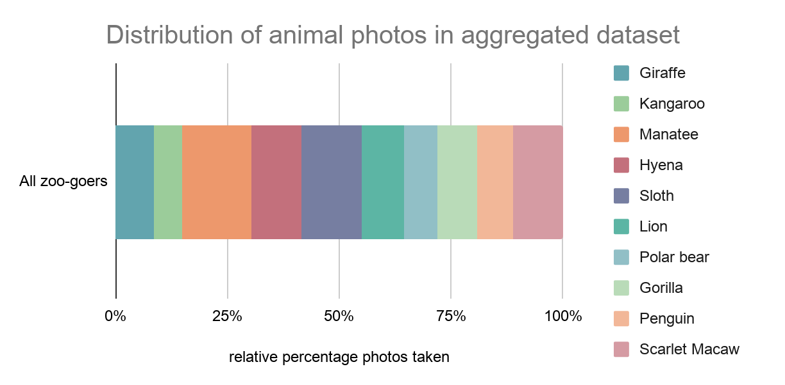

</figure>

The friends arrange the data into a matrix with two columns, 1) image RGB values, and 2) label of animal type. Using an open source ML package, they randomly shuffle the data and split it three ways. They use 80% of the data for training, another 10% for validation, and the remaining 10% for testing. Next, they train a model using an SGD optimizer and evaluate performance on the validation set for each round of training. They observe that the model is quickly converging:

<figure class="">

</figure>

The group wonders if they could also fit a model for the same task without having to aggregate all the pictures to the same place. They turn to FedAvg to get the job done, and decide they want to have an apples-to-apples comparison of the centralized model vs the federated model. To do so, they keep the validation and testing data sets and omit the samples contained therein from the FedAvg training process. For each round of FedAvg training, they evaluate the loss on the validation set, and immediately they observe a problem:

<figure class="">

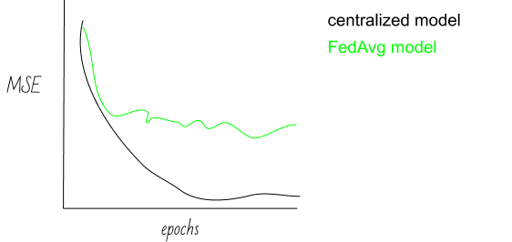

</figure>

Their model can’t seem to converge! Why? You guessed it…non-IIDness!

To find the core of the issue, let’s take a close look at the data the group collected. Though they all took pictures of the same 10 animals, they each liked some animals more than others, and they each took a different total number of pictures. We observe two patterns:

1.  The zoo-goers are focused on taking pictures of some animals more than others (_distribution skew_).
2.  Some zoo-goers have more overall pictures than others (_quantity skew_).

The chart below shows distribution skew via a breakdown of the percentage of pictures by animal taken by each zoo-goer:

<figure class="">

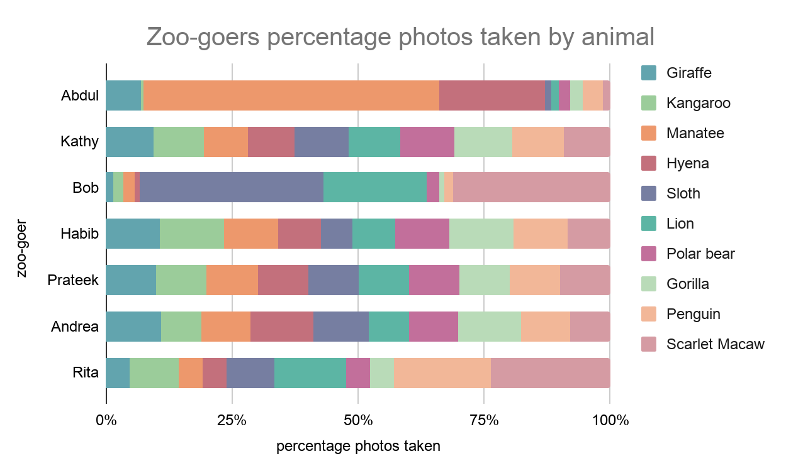

</figure>

Notice how much the photos vary by individual. Abdul, for example, is pretty obsessed with manatees (his favorite animal, with Hyena’s a distant second). Over half of his pictures were of the manatees at his local zoo. Meanwhile, Kathy, Habib, Prateek, and Andrea all had more similar distributions of pictures across the animals they viewed.

The next chart below show the quantity skew via a breakdown of the total amount of pictures by animal taken by each zoo-goer:

<figure class="">

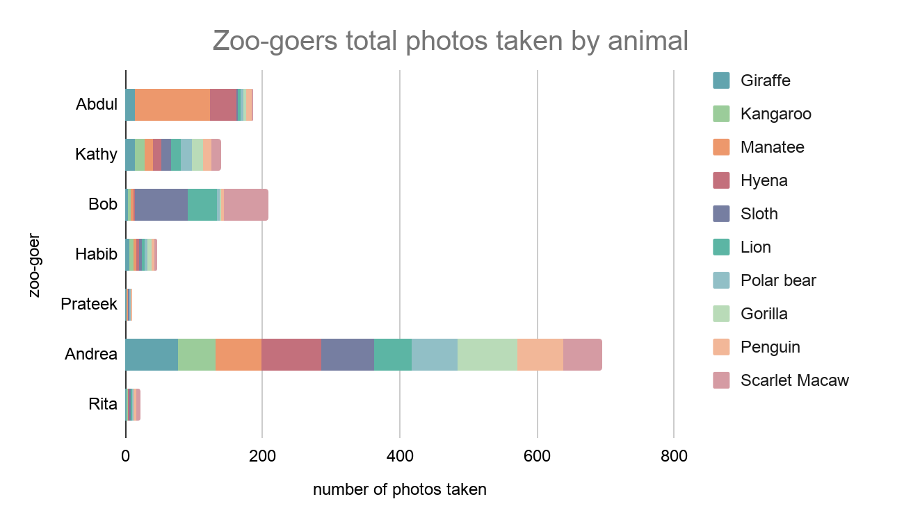

</figure>

We can see that the number of total pictures varies wildly between the zoo-goers- by two orders of magnitude! The _quantity_ is thus quite _skewed_ across zoo-goers.

These two charts illustrate that the data across our zoo-goers are _not_ identically distributed. This makes it difficult for FedAvg to fit the data. To explain, imagine the model training on Prateek’s data. He didn’t take many pictures, so in each training round the model is essentially overfitting to the handful of photos he took. Meanwhile, while a model is training on Abdul’s data, there may be batches of training in which the model is only optimizing its ability to predict “manatee” given the input features. This causes the models at Prateek and Abdul’s data to diverge to different local minima, and when the models are averaged between training rounds, they don’t produce a meaningful model.

This scenario illustrates how non-IID can negatively impact FedAvg. In [part three](#part3), we look at how to overcome this technical problem. For the curious, this [paper](https://arxiv.org/abs/1910.00189) outlines a helpful taxonomy of the different types of Non-IID data found in the “real world”, summarized below:

Violations of identicalness:  data tends to deviate from being identically distributed.

-   **Quantity skew:** different partitions can hold vastly different amounts of data.
-   **Label distribution skew:** kangaroos are only in Australia or zoos.
-   **Same label, different features:** images of parked cars in the winter will be snow-covered only in certain places.
-   **Same features, different label:** sentiment or next word predictors.

Violations of independence: data deviate from being independently drawn from an overall distribution.

-   **Intra-partition correlation:** consecutive frames in a video.
-   **Inter-partition correlation:** devices share a common feature, such as  temperature.

#### Non-IID data in federated credit scoring

By federating our credit scoring system, we introduce non-IIDness to the modelling scenario. This could manifest in several ways. Here are a couple intuitive examples of problematic non-IIDness in our credit scoring setting:

-   Brand new lending institutions will not have much data on their customers. (_quantity skew_)
-   Auto-finance companies typically extend credit with a shorter repayment period. Compare to mortgage lending, for example. (_distribution skew_)

As noted prior, non-IIDness deters model convergence. This is particularly concerning in scenarios where a data furnisher (or group thereof) contains a disproportionate amount of data on a particular class of people. The models fit on that data could get “washed out” in the averaging process with the models fit at other data silos. In the worst case scenario, that could cause the model to encode bias towards a particular class of people – race, gender, religious preference, sexual orientation, etc –  violating fairness and the [Equal Credit Opportunity Act](https://www.consumer.ftc.gov/articles/0347-your-equal-credit-opportunity-rights).

Let’s take a look at how we might overcome this conundrum.

---

## Part 3: Learning to score credit in non-IID settings

In this section we create a simple federated learning system in python and use it to experiment with various non-IID settings. We use the [Give Me Some Credit](https://www.kaggle.com/brycecf/give-me-some-credit-dataset) dataset, available on Kaggle, for the data, and sklearn as the ML library for the python implementation. The machine learning task is a classification problem to predict whether or not a consumer will face financial distress in the next two years. Our model implementation extends sklearn’s [BaseEstimator](https://scikit-learn.org/stable/modules/generated/sklearn.base.BaseEstimator.html), making it easy to experiment with.

> _You can find the [code here](https://github.com/datafleets/horizontal-federated-learning-blog) and the [data here](https://www.kaggle.com/brycecf/give-me-some-credit-dataset)._

### Implementing FedAvg

Let’s start by implementing FedAvg. We do so by following the six steps of the algorithm described in the section above, [Federated Averaging](#fedav).

The core of the implementation is a class named FedAvg that extends sklearn’s [BaseEstimator](https://scikit-learn.org/stable/modules/generated/sklearn.base.BaseEstimator.html). It implements the federated averaging optimization of a simple logistic regression model.

Before diving in, a quick note on nomenclature: our simple federated learning system has a [_Coordinator_](https://www.datafleets.com/technology) and [_Runners_](https://www.datafleets.com/technology) (these are the terms we use at [DataFleets](http://www.datafleets.com)). In case clarifying, [_Runners_](https://www.datafleets.com/technology) are roughly equivalent to [_Workers_](https://github.com/OpenMined/PySyft/blob/47680406433f89d946b02440b3236844f3435da6/syft/workers/abstract.py#L6) in [PySyft](https://github.com/OpenMined/PySyft) and [_Clients_](https://github.com/tensorflow/federated/blob/2da2a46ee77c4edcd642b1a26fcb7a34beffb337/tensorflow_federated/python/core/impl/compiler/building_blocks.py#L855-L898)_/_[_Executors_](https://github.com/tensorflow/federated/blob/master/tensorflow_federated/python/core/impl/reference_executor.py) in [TFF](https://www.tensorflow.org/federated).

The _coordinator_ is encapsulated in the logic of our FedAvg class, shown below. It is where most of the “magic” happens.

Because we’re extending sklearn’s BaseClassifier, we can make use of the rest of the sklearn ecosystem. Here’s an example of how we use this class:

<figure class="">

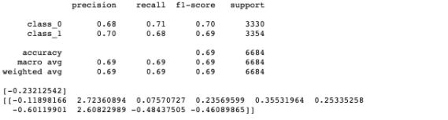

</figure>

And here’s a summary of the hyperparams dictionary:

-   ******n\_runners:** the number of runners the data will be partitioned across.****
-   **sample\_size:** the number of runners to select in a training round.
-   **rounds:** the number of training rounds to perform.
-   **combine:** the method for averaging the models in between rounds, options are _weighted_ and _mean_. The former provides an importance-weighted average of the models (based on number of samples in a runner), and the latter is a simple mean.
-   ******partition\_params:****** this parameter allows us to control the non-IIDness of the data. In our experiments, we focus on _label skew_.

******runner\_hyperparams:******

-   ******epochs:****** number of training epochs to be performed locally at each runner in a training round.
-   ******lr:** learning rate (for SGD).****
-   **batch\_size:** batch size (also for SGD).

The FedAvg class acts as the coordinator, controlling the training rounds performed together with runners. Implementation below:

The [runner](https://www.datafleets.com/technology#architecture) encapsulates a silo, or partition, of data. It contains data (X), labels (Y) and supports local optimization (optimise). The data is private to the runner, as the runner reveals _only_ one attribute: the number of rows the FedAvg algorithm needs to perform weighted averaging of the resulting model  (when parameterized to do so).

#### Step 1: Initializing the global model

Our first task is to initialize a global model that our coordinator will send to the runners.

Since we’re extending sklearn’s [BaseEstimator](https://scikit-learn.org/stable/modules/generated/sklearn.base.BaseEstimator.html), we create a simple utility function that sets these class variables _intercepts\__, _coef\__, and _classes\__ on our model. On the first round of training, we initialize these to vectors of 0s that match the shape of the model we’ll create.

In our first round of training, we pass the class variables _FedAvg.intercept\__ and _FedAvg.coef\__ to the sklearn model via the method _set\_weights_, as below:

#### Steps 2-3: Coordinator randomly selects Runners and sends model

These steps take place in a private method in our FedAvg class, _\_collect\_models_. We simply use _random.sample()_ to select the runners used in a given training round. We sample with replacement.

We “send” each runner in the selected sample the model parameters via _runner.optimise()_.

Note that we also store the locally trained models, so we can later compare them to the global model.

#### Step 4: Runners receive model and optimize locally

On the client side, we train our simple linear model using gradient descent. As with usual gradient descent, our runners train over mini-batches with optional shuffling .  Mini-batches provide an intermediary tradeoff between stochastic gradient descent and full-batch gradient descent. Stochastic updates weights after evaluating a single training instance. Alternatively, full-batch updates weights after evaluating the entire dataset.

For each batch, we update the model . Here we’ve used scikit-learn’s _[partial\_fit()](https://scikit-learn.org/stable/modules/generated/sklearn.linear_model.SGDClassifier.html#sklearn.linear_model.SGDClassifier.partial_fit)_ functionality, which trains the model using one epoch of (stochastic) gradient descent with the supplied data batch.

Then we wrap the above up into a new function, _batch\_train_, which applies batch\_update for a number of training epochs.

Next, we define a function to train a scikit-learn SGDClassifier starting from the supplied model coefficients. The _FedAvg.fit()_ method supplies these model coefficients between each round of federated averaging.

#### Step 5-6: Global model averaging and repeat until stopping criteria

Finally, we average the model in our FedAvg class method _fit()_:

We use only one type of stopping criteria: number of training rounds. This is captured in _FedAvg.rounds_ (note it is _self.rounds_ in the snippet above).

### Experimenting with non-IIDness

#### Setting up the experiments

**Learning algorithm hyperparameters**

Our custom scikit-learn model lets us leverage various features such as cross-validation and grid-search. This lets us easily evaluate the algorithm under different parameter settings. These settings include:

-   Number of federated averaging rounds.
-   Number of clients to randomly select between rounds.
-   Number of local training epochs.
-   Local batch size.
-   Learning rate.
-   Regularization parameters.

**Manufacturing non-IID data**

We create some tooling to automatically introduce non-IIDness into our learning setting. We focus on one type of non-IIDness: _label distribution skew_. With the helper function below, we can define a “degree of non-iidness”.

<figure class="">

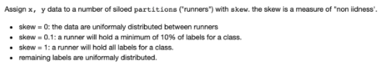

</figure>

Using this method, 0% non-iid would mean that the data labels are uniformly/evenly distributed between clients. 50% non-iid with 2 clients and 2 labels would mean 1 client holds _at least_ 50% of one of the labels, with the remaining uniformly distributed. At 100%, each client holds only 1 label  – this is of course the worst-case scenario.

#### Experiment 1: setting baseline in an IID setting (uniformly distributed)

For our first experiment, let’s establish a baseline by evaluating how FedAvg performs when data is uniformly distributed across the runners. To do this, we train models using FedAvg on runners with data uniformly distributed across them. This represents the unrealistic world in which all the data furnishers in our credit scoring example have the exact balance of data across them. Remember that we also keep track of the locally trained models in the class variable, self.models. We evaluate the performance of these models and the global, FedAvg models on a test set of data and record their F1 metrics across 100 simulations. Below is a plot of the models’ performance on average:

<figure class="">

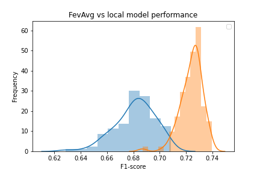

</figure>

The orange histogram shows the distribution of the global models’ performance and the blue shows the local models’. As is apparent in the plot, the global models outperform the local models on average with statistical significance:

<figure class="">

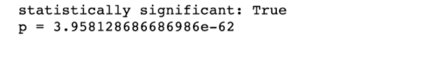

</figure>

If we filter down to just the best performing models in each simulation, we find that the global models perform as well as the best performing local models:

<figure class="">

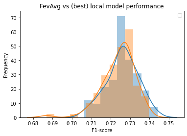

</figure>

#### Experiment 2: under what conditions does FedAvg perform well?

Now to the question at hand. What happens when we use FedAvg in a non-IID setting?

Here we evaluate the F1-score performance of FedAvg over a hold-out test set: the best and average F1-scores for the locally trained models for non-iid skew levels _0, 0.1, 0.2, 0.3, 0.4, 0.5, 0.6, 0.7, 0.8, 0.9, and 0.99_, respectively.

We run the experiments with fixed hyperparameters:

-   ******rounds:****** 1
-   ******learning rate:****** 0.15
-   ******epochs:****** 10
-   **batch\_size:** 0
-   ******combine:** weighted****

These parameters mean that each runner will perform 10 local epochs before sending the model to the coordinator. The coordinator then performs a weighted average of the models. Note that if we were to drop the local epochs to one, this would be strictly equivalent to FedSGD.

<figure class="">

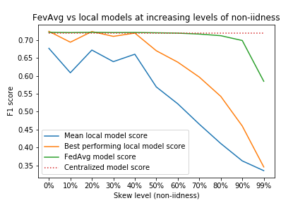

</figure>

As we can see in the graph above, FedAvg (green) consistently outperforms the average F1 score of the local models used in the averaging (blue). FedAvg performs _at least_ as well as the best-performing locally trained model (orange) up until ~40% skew, after which its performance declines at a much slower rate compared to local models. It also achieves parity with the centralized model (trained on the aggregated dataset) until ~80% skew.

From our brief experiments, we offer two observations:

-   FedAvg could be practical for settings in which we don’t find extreme skew across our data partitions. Namely, it could be fit to the challenge of federated credit scoring
-   In a simulated setting in which partitions cannot be combined, FedAvg outperforms local models with statistical significance on average

## Conclusion

In this post, we briefly overview federated learning for non-IID credit scoring data. This is by no means an exhaustive introduction. For those who are interested, [Advances and Open Problems in Federated Learning](https://arxiv.org/abs/1912.04977) offers an excellent overview of non-IID analytics.

In the next post, we continue our discussion on credit scoring data by addressing [vertical partitions](https://arxiv.org/abs/1711.10677), as opposed to horizontal. Vertical refers to the case where silos hold different features (columns) with partially overlapping instances (rows).

Even though federated learning is fairly nascent, it already has a kaleidoscope of applications. Better credit scoring is only a sliver in the promise of the technology.

Thanks for reading!

**If you enjoyed this content, follow us** [**@DataFleets**](https://twitter.com/DataFleets) **for more!**
