<!-- TODO(a11y): 11 localized body image(s) have empty alt text -->


_Questions? Contact or follow Kapil Chandorikar on [GitHub](https://github.com/kapilchandorikar/), [LinkedIn](https://www.linkedin.com/in/kapilchandorikar/), [Medium](https://towardsdatascience.com/@kapilchandorikar), or Slack @Kapil Chandorikar!_

**_Update as of November 18, 2021: The version of PySyft mentioned in this post has been deprecated. Any implementations using this older version of PySyft are unlikely to work. Stay tuned for the release of PySyft 0.6.0, a data centric library for use in production targeted for release in early December._**

## Federated Learning and Additive Secret Sharing using the PySyft framework

Federated Learning involves training on a large corpus of high-quality decentralized data present on multiple client devices. The model is trained on client devices and thus there is no need for uploading the user’s data. Keeping the personal data on the client’s device enables them to have direct and physical control of their own data.

<figure class="">

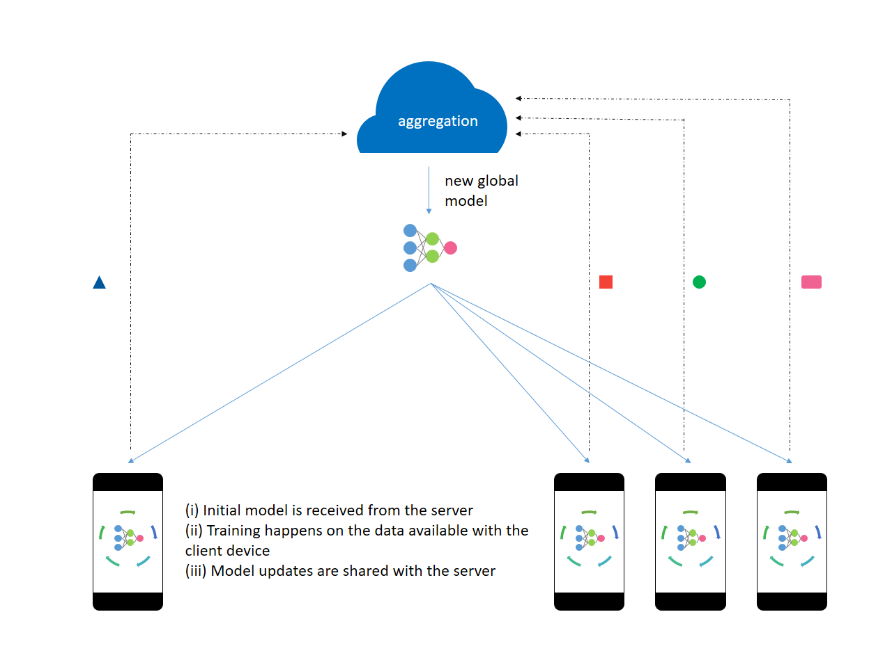

<figcaption>Figure 1: Federated Learning</figcaption></figure>

The server trains the initial model on proxy data available beforehand. The initial model is sent to a select number of eligible client devices. The eligibility criterion makes sure that the user’s experience is not spoiled in an attempt to train the model. An optimal number of client devices are selected to take part in the training process. After processing the user data, the model updates are shared with the server. The server aggregates these gradients and improves the global model.

All the model updates are __processed in memory__ and __persist for a very short period__ of time on the server. The server then sends the improved model back to the client devices participating in the next round of training. After attaining a desired level of accuracy, the on-device models can be tweaked for the user’s personalization. Then, they are no longer eligible to participate in the training. Throughout the entire process, the data does not leave the client’s device.

## How is this different from decentralized computation?

### Federated learning differs from decentralized computation as:

-   Client devices (such as smartphones) have limited network bandwidth. They cannot transfer large amounts of data and the upload speed is usually lower than the download speed.
-   The client devices are not always available to take part in a training session. Optimal conditions such as charging state, connection to an unmetered Wi-Fi network, idleness, etc. are not always achievable.
-   The data present on the device get updated quickly and is not always the same. \[Data is not always available.\]
-   The client devices can choose not to participate in the training.
-   The number of client devices available is very large but inconsistent.
-   Federated learning incorporates privacy preservation with distributed training and aggregation across a large population.
-   The data is usually unbalanced as the data is user-specific and is self-correlated.

> Federated Learning is one instance of the more general approach of “bringing the code to the data, instead of the data to the code” and addresses the fundamental problems of privacy, ownership, and locality of data.

### In Federated Learning:

-   Certain techniques are used to compress the model updates.
-   Quality updates are performed rather than simple gradient steps.
-   Noise is added by the server before performing aggregation to obscure the impact of an individual on the learned model. \[Global Differential Privacy\]
-   The gradients updates are clipped if they are too large.

---

## Introducing PySyft

We will use PySyft to implement a federated learning model. PySyft is a Python library for secure and private deep learning.

### Installation

PySyft requires Python >= 3.6 and PyTorch 1.1.0. Make sure you meet these requirements.

```python
pip install syft
# In case you encounter an installation error regarding zstd,
# run the below command and then try installing syft again.
# pip install - upgrade - force-reinstall zstd
```

### Basics

Let’s start by importing the libraries and initializing the hook.

```python
import torch as torch
import syft as sy
hook = sy.TorchHook(torch)
```

This is done to override PyTorch’s methods to execute commands on one worker that are called on tensors controlled by the local worker. It also allows us to move tensors between workers. Workers are explained below.

```python
jake = sy.VirtualWorker(hook, id="jake")
print("Jake has: " + str(jake._objects))
```

```
Jake has: {}
```

Virtual workers are entities present on our local machine. They are used to model the behavior of actual workers.

To work with workers distributed in a network, PySyft offers two types of workers:

-   Network socket workers
-   Web socket workers

Web sockets workers can be instantiated from the browser with each worker on a separate tab.

Here, Jake is our virtual worker which can be considered as a separate entity on a device. Let’s send him some data.

```python
x = torch.tensor([1, 2, 3, 4, 5])
x = x.send(jake)
print("x: " + str(x))
print("Jake has: " + str(jake._objects))
```

```
x: (Wrapper)>[PointerTensor | me:50034657126 -> jake:55209454569]
Jake has: {55209454569: tensor([1, 2, 3, 4, 5])}
```

When we send a tensor to Jake, we are returned a pointer to that tensor. All the operations will be executed with this pointer. This pointer holds information about the data present on another machine. Now, __x__ is a PointTensor.

Use the __get()__ method to get back the value of __x__ from Jake’s device. However, by doing so, the tensor on Jake’s device gets erased.

```python
x = x.get()
print("x: " + str(x))
print("Jake has: " + str(jake._objects))
```

```
x: tensor([1, 2, 3, 4, 5])
Jake has: {}
```

When we send the PointTensor __x__ (pointing to a tensor on Jake’s machine) to another worker – John, the whole chain is sent to John and a PointTensor pointing to the node on John’s device is returned. The tensor is still present on Jake’s device.

```python
john = sy.VirtualWorker(hook, id="john")
x = x.send(jake)
x = x.send(john)
print("x: " + str(x))
print("John has: " + str(john._objects))
print("Jake has: " + str(jake._objects))
```

```
x: (Wrapper)>[PointerTensor | me:70034574375 -> john:19572729271]
John has: {19572729271: (Wrapper)>[PointerTensor | john:19572729271 -> jake:55209454569]}
Jake has: {55209454569: tensor([1, 2, 3, 4, 5])}
```

<figure class="">

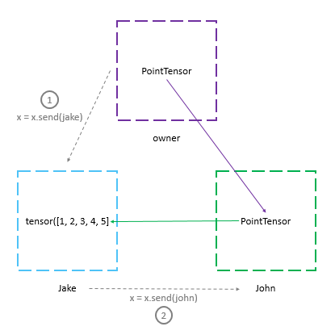

<figcaption>Figure 2: Using the send() method on a PointTensor [Step 2].</figcaption></figure>

The __clear\_objects()__ method removes all the objects from a worker.

```python
jake.clear_objects()
john.clear_objects()
print("Jake has: " + str(jake._objects))
print("John has: " + str(john._objects))
```

```
Jake has: {}
John has: {}
```

Suppose we wanted to move a tensor from Jake’s machine to John’s machine. We could do this by using the __send()__ method to send the ‘pointer to tensor’ to John and let him call the __get()__ method. PySfyt provides a __remote\_get()__ method to do this. There’s also a convenience method – __move()__, to perform the operation.

```python
y = torch.tensor([6, 7, 8, 9, 10]).send(jake)
y = y.move(john)
print(y)
print("Jake has: " + str(jake._objects))
print("John has: " + str(john._objects))
```

```
(Wrapper)>[PointerTensor | me:86076501268 -> john:86076501268]
Jake has: {}
John has: {86076501268: tensor([ 6,  7,  8,  9, 10])}
```

<figure class="">

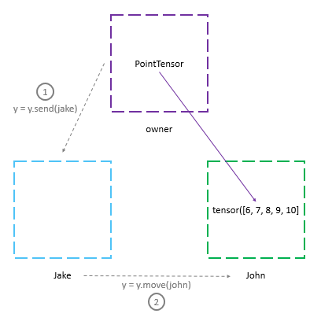

<figcaption>Figure 3: Using the move() method on a PointTensor. [Step 2]</figcaption></figure>

### Strategy

We can perform federated learning on client devices by following these steps:

1.  send the model to the device,
2.  do normal training using the data present on the device,
3.  get back the smarter model.

However, if someone intercepts the smarter model while it is shared with the server, he could perform __reverse engineering__ and extract sensitive data about the dataset. Differential privacy methods address this issue and protect the data.

When the updates are sent back to the server, the server should not be able to discriminate while aggregating the gradients. Let’s use a form of cryptography called additive secret sharing.

We want to encrypt these gradients (or model updates) before performing the aggregation so that no one will be able to see the gradients. We can achieve this by additive secret sharing.

### Additive Secret Sharing

In secret sharing, we split a secret \\(x\\) into a multiple number of shares and distribute them among a group of secret-holders. The secret \\(x\\) can be constructed only when all the shares it was split into are available.

For example, say we split \\(x\\) into 3 shares: \\(x\_1\\), \\(x\_2\\), and \\(x\_3\\). We randomly initialize the first two shares and calculate the third share as \\(x\_3 = x – (x\_1 + x\_2)\\). We then distribute these shares among 3 secret-holders. The secret remains hidden as each individual holds onto only one share and has no idea of the total value.

We can make it more secure by choosing the range for the value of the shares. Let \\(Q\\), a large prime number, be the upper limit. Now the third share, \\(x\_3\\), equals \\(Q – (x\_1 + x\_2) \\% Q + x\\).

```python
import random

# setting Q to a very large prime number
Q = 23740629843760239486723

def encrypt(x, n_share=3):
    r"""Returns a tuple containg n_share number of shares
    obtained after encrypting the value x."""

    shares = list()
    for i in range(n_share - 1):
        shares.append(random.randint(0, Q))
    shares.append(Q - (sum(shares) % Q) + x)
    return tuple(shares)

print("Shares: " + str(encrypt(3)))
```

```
Shares: (6191537984105042523084, 13171802122881167603111, 4377289736774029360531)
```

<figure class="">

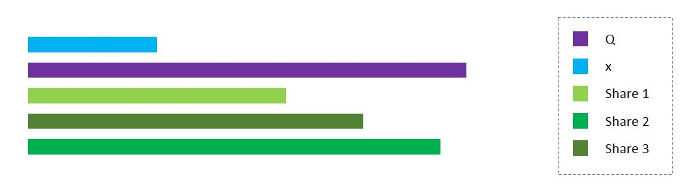

<figcaption>Figure 4: Encrypting x in three shares.</figcaption></figure>

The decryption process will be shares summed together modulus \\(Q\\).

```python
def decrypt(shares):
    r"""Returns a value obtained by decrypting the shares."""

    return sum(shares) % Q

print("Value after decrypting: " + str(decrypt(encrypt(3))))
```

```
Value after decrypting: 3
```

<figure class="">

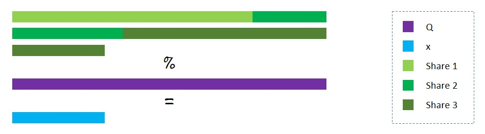

<figcaption>Figure 5: Decrypting x from the three shares.</figcaption></figure>

### Homomorphic Encryption

Homomorphic encryption is a form of encryption that allows us to perform computation on encrypted operands, resulting in encrypted output. This encrypted output when decrypted matches with the result obtained by performing the same computation on the actual operands.

The additive secret sharing technique already has a homomorphic property. If we split \\(x\\) into \\(x\_1, x\_2, x\_3\\), and \\(y\\) into \\(y\_1, y\_2, y\_3\\), then, \\(x+y\\) will be equal to the value obtained after decrypting the summation of the three shares: \\((x\_1 + y\_1), (x\_2 + y\_2), (x\_3 + y\_3)\\).

```python
def add(a, b):
    r"""Returns a value obtained by adding the shares a and b."""

    c = list()
    for i in range(len(a)):
        c.append((a[i] + b[i]) % Q)
    return tuple(c)

x, y = 6, 8
a = encrypt(x)
b = encrypt(y)
c = add(a, b)
print("Shares encrypting x: " + str(a))
print("Shares encrypting y: " + str(b))
print("Sum of shares: " + str(c))
print("Sum of original values (x + y): " + str(decrypt(c)))
```

```
Shares encrypting x: (17500273560307623083756, 20303731712796325592785, 9677254414416530296911)
Shares encrypting y: (2638247288257028636640, 9894151868679961125033, 11208230686823249725058)
Sum of shares: (20138520848564651720396, 6457253737716047231095, 20885485101239780021969)
Sum of original values (x + y): 14
```

We are able to calculate the value of the aggregate function – addition, without knowing the values of \\(x\\) and \\(y\\).

### Secret Sharing using PySyft

PySyft provides a __share()__ method to split the data into additive secret shares and send them to the specified workers. For working with decimal numbers, __fix\_precision()__ method is used to represent the decimals as integer values under the hood.

```python
jake = sy.VirtualWorker(hook, id="jake")
john = sy.VirtualWorker(hook, id="john")
secure_worker = sy.VirtualWorker(hook, id="secure_worker")

jake.add_workers([john, secure_worker])
john.add_workers([jake, secure_worker])
secure_worker.add_workers([jake, john])

print("Jake has: " + str(jake._objects))
print("John has: " + str(john._objects))
print("Secure_worker has: " + str(secure_worker._objects))
```

```
Jake has: {}
John has: {}
Secure_worker has: {}
```

The __share()__ method is used to distribute the shares among several workers. Each worker specified then receives a share and has no idea of the actual value.

```python
x = torch.tensor([6])
x = x.share(jake, john, secure_worker)
print("x: " + str(x))

print("Jake has: " + str(jake._objects))
print("John has: " + str(john._objects))
print("Secure_worker has: " + str(secure_worker._objects))
```

```
x: (Wrapper)>[AdditiveSharingTensor]
	-> (Wrapper)>[PointerTensor | me:61668571578 -> jake:46010197955]
	-> (Wrapper)>[PointerTensor | me:98554485951 -> john:16401048398]
	-> (Wrapper)>[PointerTensor | me:86603681108 -> secure_worker:10365678011]
	*crypto provider: me*
Jake has: {46010197955: tensor([3763264486363335961])}
John has: {16401048398: tensor([-3417241240056123075])}
Secure_worker has: {10365678011: tensor([-346023246307212880])}
```

As you can see, \\(x\\) now points to the three shares present on Jake’s, John’s and Secure\_worker’s machine respectively.

<figure class="">

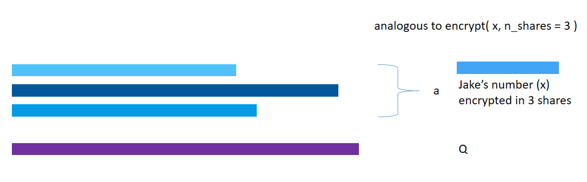

<figcaption>Figure 6: Encryption of x into three shares.</figcaption></figure>

<figure class="">

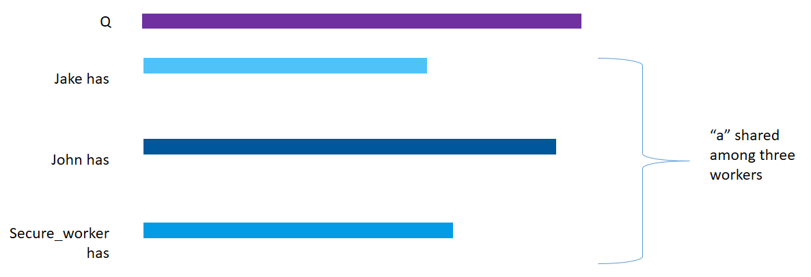

<figcaption>Figure 7: Distributing the shares of x among 3 VirtualWorkers.</figcaption></figure>

```python
y = torch.tensor([8])
y = y.share(jake, john, secure_worker)
print(y)
```

```
(Wrapper)>[AdditiveSharingTensor]
	-> (Wrapper)>[PointerTensor | me:86494036026 -> jake:42086952684]
	-> (Wrapper)>[PointerTensor | me:25588703909 -> john:62500454711]
	-> (Wrapper)>[PointerTensor | me:69281521084 -> secure_worker:18613849202]
	*crypto provider: me*
```

<figure class="">

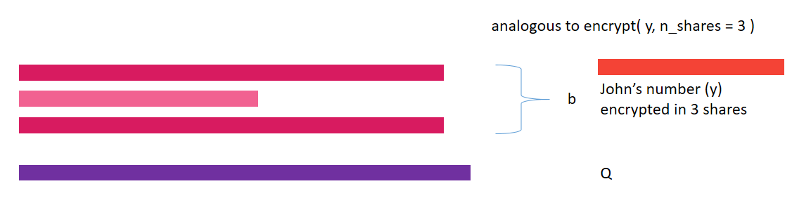

<figcaption>Figure 8: Encryption of y into 3 shares.</figcaption></figure>

<figure class="">

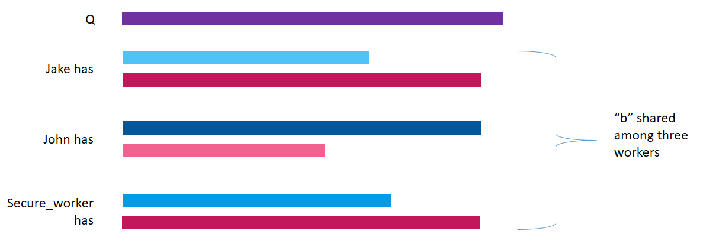

<figcaption>Figure 9: Distributing the shares of y among 3 VirtualWorkers.</figcaption></figure>

```python
z = x + y
print(z)
```

```
(Wrapper)>[AdditiveSharingTensor]
	-> (Wrapper)>[PointerTensor | me:42086114389 -> jake:42886346279]
	-> (Wrapper)>[PointerTensor | me:17211757051 -> john:23698397454]
	-> (Wrapper)>[PointerTensor | me:83364958697 -> secure_worker:94704923907]
	*crypto provider: me*
```

Notice that the value of \\( z \\) obtained after adding \\( x \\) and \\( y \\) is stored in the three workers’ machines. \\( z \\) is also encrypted.

<figure class="">

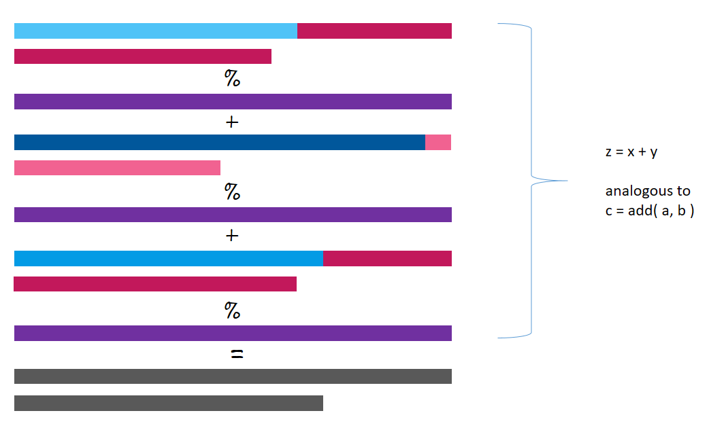

<figcaption>Figure 10: Performing computation on encrypted inputs.</figcaption></figure>

```python
z = z.get()
print(z)
```

```
tensor([14])
```

<figure class="">

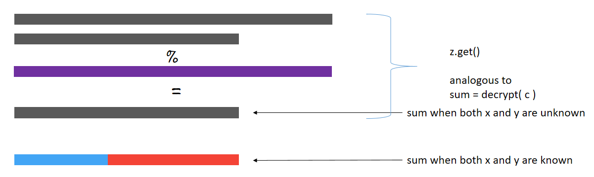

<figcaption>Figure 11: Decryption of result obtained after computation on encrypted inputs.</figcaption></figure>

The value obtained after performing addition on encrypted shares is equal to that obtained by adding the actual numbers.

### Federated Learning using PySyft

Now, we’ll implement the federated learning approach to train a simple neural network on the MNIST dataset using the two workers: Jake and John. There are only a few modifications necessary to apply the federated learning approach.

**1\. Import the libraries and modules.**

```python
import torch
import torchvision
from torch import nn
import torch.optim as optim
import torch.nn.functional as F
from torchvision import datasets, transforms
```

**2\. Load the dataset.**

In real-life applications, the data is present on client devices. To replicate the scenario, we send data to the VirtualWorkers.

```python
transform = transforms.Compose([
    transforms.ToTensor(),
    transforms.Normalize((0.5, ), (0.5, )),
])

train_set = datasets.MNIST(
    "~/.pytorch/MNIST_data/", train=True, download=True, transform=transform)
test_set = datasets.MNIST(
    "~/.pytorch/MNIST_data/", train=False, download=True, transform=transform)

federated_train_loader = sy.FederatedDataLoader(
    train_set.federate((jake, john)), batch_size=64, shuffle=True)

test_loader = torch.utils.data.DataLoader(
    test_set, batch_size=64, shuffle=True)
```

Notice that we have created the training dataset differently. The \\( \\text{train\\\_set.federate((jake, john))} \\) creates a \\( \\text{FederatedDataset} \\) wherein the \\( \\text{train\\\_set} \\) is split among Jake and John (our two VirtualWorkers). The \\( \\text{FederatedDataset} \\) class is intended to be used like the PyTorch’s \\( \\text{Dataset} \\) class. Pass the created \\( \\text{FederatedDataset} \\) to a federated data loader “\\( \\text{FederatedDataLoader} \\)” to iterate over it in a federated manner. The batches then come from different devices.

**3\. Build the model**

```python
class Model(nn.Module):
    def __init__(self):
        super(Model, self).__init__()
        self.fc1 = nn.Linear(784, 500)
        self.fc2 = nn.Linear(500, 10)

    def forward(self, x):
        x = x.view(-1, 784)
        x = self.fc1(x)
        x = F.relu(x)
        x = self.fc2(x)
        return F.log_softmax(x, dim=1)

model = Model()
optimizer = optim.SGD(model.parameters(), lr=0.01)
```

**4\. Train the model**

Since the data is present on the client device, we obtain its location through the \\( \\text{location} \\) attribute. The important additions to the code are the steps to get back the improved model and the value of the loss from the client devices.

```python
for epoch in range(0, 5):
    model.train()
    for batch_idx, (data, target) in enumerate(federated_train_loader):
        # send the model to the client device where the data is present
        model.send(data.location)
        # training the model
        optimizer.zero_grad()
        output = model(data)
        loss = F.nll_loss(output, target)
        loss.backward()
        optimizer.step()
        # get back the improved model
        model.get()
        if batch_idx % 100 == 0:
            # get back the loss
            loss = loss.get()
            print('Epoch: {:2d} [{:5d}/{:5d} ({:3.0f}%)]tLoss: {:.6f}'.format(
                epoch+1,
                batch_idx * 64,
                len(federated_train_loader) * 64,
                100. * batch_idx / len(federated_train_loader),
                loss.item()))
```

```
Epoch:  1 [    0/60032 (  0%)]	Loss: 2.306809
Epoch:  1 [ 6400/60032 ( 11%)]	Loss: 1.439327
Epoch:  1 [12800/60032 ( 21%)]	Loss: 0.857306
Epoch:  1 [19200/60032 ( 32%)]	Loss: 0.648741
Epoch:  1 [25600/60032 ( 43%)]	Loss: 0.467296
...
...
...
Epoch:  5 [32000/60032 ( 53%)]	Loss: 0.151630
Epoch:  5 [38400/60032 ( 64%)]	Loss: 0.135291
Epoch:  5 [44800/60032 ( 75%)]	Loss: 0.202033
Epoch:  5 [51200/60032 ( 85%)]	Loss: 0.303086
Epoch:  5 [57600/60032 ( 96%)]	Loss: 0.130088
```

**5\. Test the model**

```python
model.eval()
test_loss = 0
correct = 0
with torch.no_grad():
    for data, target in test_loader:
        output = model(data)
        test_loss += F.nll_loss(
            output, target, reduction='sum').item()
        # get the index of the max log-probability
        pred = output.argmax(1, keepdim=True)
        correct += pred.eq(target.view_as(pred)).sum().item()

test_loss /= len(test_loader.dataset)

print('nTest set: Average loss: {:.4f}, Accuracy: {}/{} ({:.0f}%)n'.format(
    test_loss,
    correct,
    len(test_loader.dataset),
    100. * correct / len(test_loader.dataset)))
```

```
Test set: Average loss: 0.2428, Accuracy: 9300/10000 (93%)
```

That’s it. We have trained a model using the federated learning approach. When compared to traditional training, it takes more time to train a model using the federated approach.
