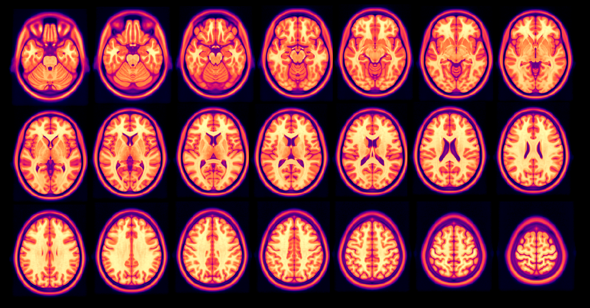
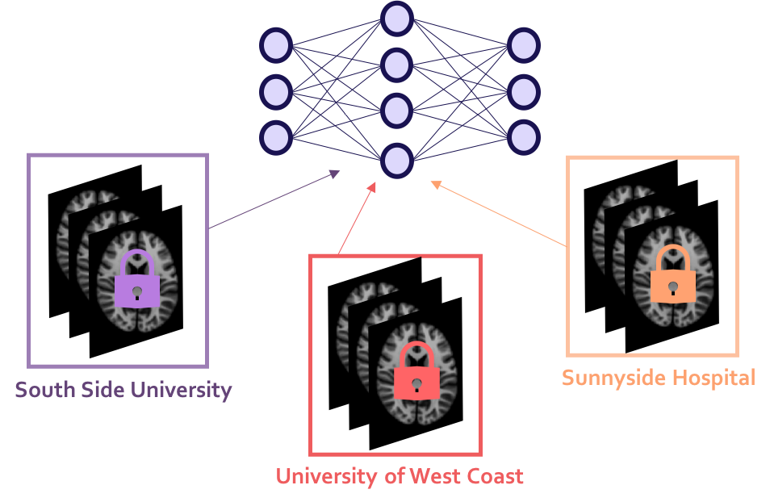

<!-- TODO(a11y): 2 localized body image(s) have empty alt text -->

_For more posts like this, follow [@emmabluemke](https://twitter.com/emmabluemke) and [@openminedorg](https://twitter.com/openminedorg)!_

## Summary:

-   In medical imaging, necessary privacy concerns limit us from fully maximizing the benefits of AI in our research.
-   Fortunately, with other industries also limited by regulations of private data, three cutting edge techniques have been developed that have huge potential for the future of machine learning in healthcare: federated learning, differential privacy, and encrypted computation.
-   These modern privacy techniques would allow us to train our models on encrypted data from multiple institutions, hospitals, and clinics _without sharing the patient data._
-   Recently, these techniques have become increasingly easier for researchers to implement, thanks to the efforts of scientists from Google, [DeepMind](https://deepmind.com/), Apple, [OpenAI](https://openai.com/), and many others.

<figure class="">

<figcaption>© <a href="http://nist.mni.mcgill.ca/?p=904">MNI152 atlas</a></figcaption></figure>

A main focus at our largest medical imaging research conferences this year was the emerging use of machine learning in all areas of our research. The success of segmentation, image analysis, texture analysis, and even [image reconstruction from sensor-domain data](https://www.nature.com/articles/nature25988), demonstrates that machine learning is an excellent tool for us when applied properly. It’s a tool that’s not only changing the way we analyze our images, but also changing the way we acquire and reconstruct them, allowing us to acquire clear, high quality images faster.

Judging by the impressive progress in computer vision research, it seems we’re just getting started. In computer vision research, where images can be of any subject matter (cats, cars, street signs, faces), deep neural networks have shown the most promise in image segmentation, analysis, and image generation (for example, the [human faces](https://www.theverge.com/2018/12/17/18144356/ai-image-generation-fake-faces-people-nvidia-generative-adversarial-networks-gans) generated by ‘generative adversarial networks’, or GANs). The advances in general computer vision research have been much faster than ours in medical imaging applications. Why is our medical imaging industry lagging behind?

In short, these techniques need training data. A _lot_ of it: the popular image database [ImageNet](http://www.image-net.org/) has over 14 million images. This is where we’re limited: in healthcare, we’re often in data-poor settings with low sample sizes. While the average object recognition project can use millions of images to train, our datasets in medical imaging are on the order of hundreds of subjects. Medical imaging researchers have addressed this by either gathering or producing large, high quality datasets such as the [UK Biobank](https://www.ukbiobank.ac.uk/), which is excellent, but even the Biobank won’t have _14 million_ subjects in it once completed.

As researchers or clinicians, we know why we don’t have as many images available for training: our images contain extremely sensitive and private information. It’s not because we’re not collecting enough; although it can be expensive to acquire medical images, healthcare centres already produce millions of scans each year both for direct care and for research worldwide. The images are acquired, they’re just not openly available for research (nor should they be). Understandably, access to this data is highly constrained, even within institutions, thanks to important patient data privacy regulations.

It’s also becoming increasingly important to maintain this data privacy: true anonymization of data is difficult to achieve because it’s unclear what kind of information machine learning can extract from seemingly innocuous data. For example, it’s possible to predict the [age](https://www.sciencedirect.com/science/article/pii/S1053811919305026?via%3Dihub) and [sex](https://www.ncbi.nlm.nih.gov/pubmed/27421184) of a patient from some medical images, and we’ve seen that in some cases, multiple anonymized datasets can be [combined to deanonymize them](https://www.fastcompany.com/90278465/sorry-your-data-can-still-be-identified-even-its-anonymized).

These privacy concerns are important and necessary, but this has limited us from fully maximizing the benefits of artificial intelligence in our research. Fortunately, we’re not the only field wanting to use deep learning on private data, and there are three cutting edge techniques that will have a huge impact on the future of machine learning in healthcare:

**Federated Learning:** allows us to train AI models on distributed datasets that you cannot directly access.

**Differential Privacy:** allows us to make formal, mathematical guarantees around privacy preservation when publishing our results (either directly or through AI models).

**Encrypted Computation:** allows machine learning to be done on data _while it remains encrypted._

To emphasize: these privacy-preserving developments can allow us to train our model on data from multiple institutions, hospitals, and clinics _without sharing the patient data._ It allows the use of data to be decoupled from the governance (or control) over data. In other words, I no longer have to request a copy of a dataset in order to use it in my statistical study.

<figure class="">

</figure>

The potential of these technologies has not gone unnoticed. The UK Biobank was recently combined with several other datasets in [a meta-analysis of brain MRI](https://arxiv.org/abs/1810.08553). Currently, the University of Pennsylvania, alongside Intel and 19 other institutions are leading the [first real-world medical use case of federated learning](https://www.intel.ai/federated-learning-for-medical-imaging/#gs.clhttf).

Outside of medical imaging, attention on these developments has soared: in 2019, Facebook [announced their sponsorship](https://blog.udacity.com/2019/05/announcing-the-secure-and-private-ai-scholarship-challenge-with-facebook.html) of 5,000 seats in Udacity’s new Secure and Private AI course. [This course explains](https://medium.com/udacity/introducing-udacitys-secure-private-ai-course-fe20bfa3b0ff) how to train AI models using federated learning and differential privacy, and how to use tools such as [OpenMined](https://www.openmined.org/)‘s [PySyft](https://github.com/OpenMined/PySyft) library. PySyft is a Python code library which extends PyTorch and Tensorflow with the cryptographic and distributed technologies necessary to safely and securely train AI models on distributed data while maintaining patient privacy.

**These tools will make is easy for us (imaging scientists) to securely train our models while preserving patient privacy, without being privacy experts ourselves.**

It’s important that our medical imaging community is aware of these new possibilities. These developments could inspire new collaborations between institutions, enable meta-analysis that were previously considered impossible, and allow us to make rapid improvements in our current AI models as we’re able to train them on more data.

Not only will this allow us to have _more_ training data, it will allow us to have _more accurate_ training data: if we can train on data from other institutions worldwide, we can [properly diversify our datasets](https://www.apa.org/monitor/2010/05/weird) to ensure our research better serves our world’s population. For example, current volunteer-base datasets can often feature a disproportionate number of young, university student subjects, which results in training data that is not representative of our patient populations.

Since 2016, we’ve been in a deep learning revolution in medical imaging. In 2019, medical imaging researchers are now able to more easily implement reliable, secure, privacy-preserving AI. Let’s share and use these resources from the privacy community and ensure that our fellow medical professionals and researchers are aware of them. We will still need regulation, caution, and time. However, with the cooperation and collaboration of research institutions, hospitals, and clinics, we will finally begin to make full use of the benefits of artificial intelligence in medical imaging.
