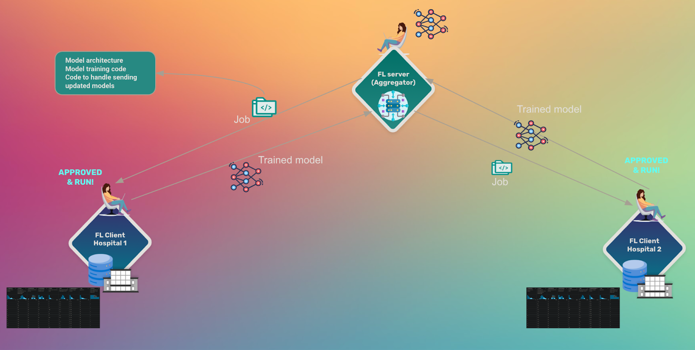
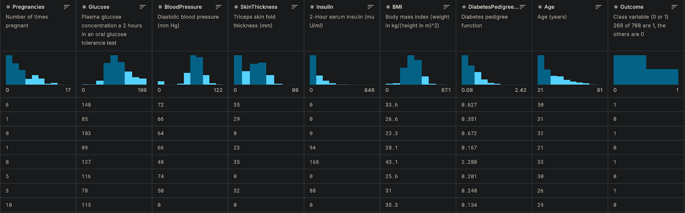

<!-- TODO(a11y): 2 localized body image(s) have empty alt text -->


Imagine you’re a data scientist at a healthcare organization with a valuable diabetes dataset. Across town, another hospital has a similar dataset, and a research institution has yet another. You all want to collaborate on building a better diabetes prediction model, but sharing patient data directly is impossible due to privacy regulations, competitive concerns between organizations, and technical complexities of securely merging large, heterogeneous datasets. This is where **federated learning** comes to the rescue.

> If you are already a Federated Learning practitioner, consider our **Federated Learning Co-Design Program**. You will get direct support from the OpenMined team to build production ready federated learning solutions.
> 
>  <a class="btn" href="https://openmined.org/federated-learning/co-design/" target="_blank" rel="noopener">Learn more and apply now →</a> 

Federated learning (FL) allows multiple parties to collaboratively train machine learning models without ever sharing their raw data. Instead of moving data to a central location, the model travels to each dataset, learns on local data, and only model updates are shared back to the aggregator to create a global model.

In this three-part tutorial series, we will walk through a practical FL implementation using [**Syft Flwr**](https://github.com/OpenMined/syft-flwr)—a framework that combines the flexibility of [Flower](https://flower.ai/) (a popular federated learning framework) with the privacy-preserving networking capabilities of [SyftBox](https://syftbox.openmined.org/). This builds on the OpenMined community’s commitment to making privacy-preserving machine learning accessible to everyone.

By the end of this tutorial series, you would have learned to:

-   Set up a federated learning network with multiple data providers.
-   Train a diabetes prediction model across distributed, private datasets.
-   Simulate your federated workflow locally before deploying to real-world participants.
-   Implement a secure job submission and approval process.

For questions and support, join our [Slack workspace](http://Openmined.org/slack) and head to the **#community-federated-learning** channel.

<figure class="wp-block-image">



</figure>

Let’s dive in!

## Part 1: The Full Workflow on Your Local Machine

In this first part, we’ll set up our environment and run the complete FL workflow locally. This simulation is the best way to understand the big picture and all the moving parts before we move to a real distributed network in the later parts.

Before we start, make sure you have:

-   Python 3.9+ installed and the [uv](https://docs.astral.sh/uv/getting-started/installation/) package manager
-   Basic familiarity with python and machine learning concepts
-   An email address for SyftBox authentication
-   The example repository: https://github.com/OpenMined/syft-flwr/tree/main/notebooks/fl-diabetes-prediction

### Step 1: Understanding the Architecture

**SyftBox** creates a distributed network where each participant runs a “datasite” — a local environment that can sync public metadata with other nodes while keeping private data secure. **Syft Flwr** then enables Flower’s federated learning capabilities to run over this privacy-preserving network.

Think of it as having three layers:

1.  **SyftBox (Foundation)**: Handles networking, authentication, and privacy
2.  **Flower (ML Layer)**: Orchestrates the federated learning process
3.  **Syft Flwr (Integration)**: Bridges the two frameworks seamlessly

### Step 2: Installing and Setting up Python Environment

First, let’s install the required components:

```shell
# Clone the example repository
git clone https://github.com/OpenMined/syft-flwr.git _tmp \
		&& mv _tmp/notebooks/fl-diabetes-prediction . \
		&& rm -rf _tmp && cd fl-diabetes-prediction

# Set up Python environment
uv sync
```

### Step 3: Exploring the Diabetes Prediction Example

The diabetes prediction example uses the open source **Pima Indian Diabetes Database** ([link on kaggle](https://www.kaggle.com/datasets/uciml/pima-indians-diabetes-database/)), which contains features like glucose levels, blood pressure, and BMI to predict diabetes onset. Below is a screenshot showing several examples of the dataset

<figure class="wp-block-image">



</figure>

For the federated set up, we split the Pima Indian Diabetes Database into smaller partitions, where each FL client will hold one partition of the dataset

For our local test, we run the notebooks in the `local` folder that simulate the entire FL process on your machine, which involves three components:

1.  **Data Owner 1 (DO1)**: Manages the first data partition. We’ll run `do1.ipynb`.
2.  **Data Owner 2 (DO2)**: Manages the second data partition. We’ll run `do2.ipynb`.
3.  **Data Scientist (DS)**: Defines the model and coordinates training. We’ll run `ds.ipynb`.

### Step 4: Running the Data Owner Notebooks

We’ll start by setting up our two data owners who will each manage a partition of the diabetes dataset. Each data owner runs their own instance of the federated learning client.

#### Data Owner 1 Setup (`local`/do1.ipynb)

First, let’s set up Data Owner 1. Open the `local/do1.ipynb` notebook and run through the cells:

##### Initialize the Data Owner’s datasite:

The first DO then creates a local simulation of a SyftBox datasite using the following code

```python
from pathlib import Path
from syft_rds.orchestra import remove_rds_stack_dir, setup_rds_server

remove_rds_stack_dir(root_dir=Path("."), key="flwr")
DO_EMAIL = "do1@openmined.org"
do_stack = setup_rds_server(email=DO_EMAIL, root_dir=Path("."), key="flwr")
do_client = do_stack.init_session(host=DO_EMAIL)	
```

where the do\_client object represents this data owner’s connection to their datasite.

##### Download and set up the dataset:

```python
from huggingface_hub import snapshot_download

DATASET_DIR = Path("./dataset/").expanduser().absolute()

if not DATASET_DIR.exists():
    snapshot_download(
        repo_id="khoaguin/pima-indians-diabetes-database-partitions",
        repo_type="dataset",
        local_dir="./dataset/",
        local_dir_use_symlinks=False,  # Set to False to copy files instead of symlinking
    )
```

This downloads the pre-partitioned Pima Indians Diabetes Database from Hugging Face. The dataset has already been split into multiple partitions to simulate different data owners having different portions of the complete dataset.

##### Create the dataset in the datasite:

The following code snippet creates a dataset within the DO’s datasite. Notice the important distinction between private and mock paths – the private data is the real, sensitive information that always stays secure and never shared. The mock data is a non-sensitive sample that mimics the structure of the real data. Data scientists can use the mock data to build and test their programs before requesting to run them on the private data by submitting jobs.

```python
partition_number = 0
DATASET_PATH = Path(f"./dataset/pima-indians-diabetes-database-{partition_number}")

dataset = do_client.dataset.create(
    name="pima-indians-diabetes-database",
    summary="Pima Indians Diabetes Database.",
    description_path=DATASET_PATH / "README.md",
    path=DATASET_PATH / "private",
    mock_path=DATASET_PATH / "mock",
)
dataset.describe()
```

After the DO1 uploads the dataset, they can wait for jobs to be submitted by the DS.

#### Data Owner 2 Setup (local/do2.ipynb)

Now let’s set up Data Owner 2. The process is nearly identical, but with a different email identifier:

##### The key difference is in the datasite initialization:

```python
from syft_rds.orchestra import setup_rds_server
DO_EMAIL = "do2@openmined.org"  # Different email for DO2
do_stack = setup_rds_server(email=DO_EMAIL, root_dir=Path("."), key="flwr")
do_client = do_stack.init_session(host=DO_EMAIL)
```

Data Owner 2 follows the same dataset setup process, creating their own secure datasite with their partition of the diabetes data and then waits for jobs to be submitted by the DS.

### Step 6: Running the Data Scientist Notebook (local/ds.ipynb)

Now comes the exciting part – the Data Scientist coordinates the federated learning process across both data owners.

##### Now, the DS can Connect to both data owner datasites:

```python
from syft_rds.orchestra import setup_rds_server
DS = "ds@openmined.org"
print("DS email: ", DS)
DO1 = "do1@openmined.org"
DO2 = "do2@openmined.org"

ds_stack = setup_rds_server(email=DS, key="flwr", root_dir=Path("."))
do_client_1 = ds_stack.init_session(host=DO1)
do_client_2 = ds_stack.init_session(host=DO2)

do_clients = [do_client_1, do_client_2]
do_emails = [DO1, DO2]
```

The Data Scientist creates connections to both data owners’ datasites. This is where the magic of federated learning becomes apparent – the DS can coordinate training across multiple parties without direct access to their data.

##### Explore the mock datasets of the DOs:

```python
SYFTBOX_DATASET_NAME = "pima-indians-diabetes-database"
mock_paths = []
for client in do_clients:
    dataset = client.dataset.get(name=SYFTBOX_DATASET_NAME)
    mock_paths.append(dataset.get_mock_path())
    print(f"Client {client.host}'s dataset: \n{dataset}\n")
```

This step lets the Data Scientist understand the structure and format of the data across all participants using publicly available mock data, without ever seeing the private data. 

If you are curious, try `dataset.get_private_path()` to see what happens.

##### Prepare the Syft Flwr project:

The DS now prepares the `syft_flwr` project to be submitted to the DOs

```python
from pathlib import Path
SYFT_FLWR_PROJECT_PATH = Path("./fl-diabetes-prediction")
```

Here, SYFT\_FLWR\_PROJECT\_PATH points to the `syft_flwr` project that contains code to train the federated diabetes prediction model. The `syft_flwr` project has the exact same structure with a Flower project:

```
fl-diabetes-prediction/
├── fl_diabetes_prediction/
│   ├── __init__.py
│   ├── client_app.py
│   ├── server_app.py
│   └── task.py
├── pyproject.toml
└── README.md
```

Furthermore, it is only minimally modified compared to a Flower project. Almost everything in the project stays the same compared to Flower, and the DS only has to do 2 modifications:

1.  Instead of loading the dataset from memory for Flower (`load_flwr_data` function in `task.py`), the DS changes it to use the `load_syftbox_dataset` function to load the data from SyftBox’s datasite. 
2.  In `client_fn (client_app.py)`, the DS checks if the clients are running with `syft_flwr`, if so, we use the `load_syftbox_dataset` functionality:

```python
def client_fn(context: Context):
    from fl_diabetes_prediction.task import load_syftbox_dataset
    from syft_flwr.utils import run_syft_flwr

    if not run_syft_flwr():
        logger.info("Running flwr locally")
        train_loader, test_loader = load_flwr_data(
            partition_id=context.node_config["partition-id"],
            num_partitions=context.node_config["num-partitions"],
        )
    else:
        logger.info("Running with syft_flwr")
        train_loader, test_loader = load_syftbox_dataset()

    net = Net()
    return FlowerClient(net, train_loader, test_loader).to_client()
```

> If you’re an engineer or data scientist who wants to apply these skills to real-world problems, consider our **Federated Learning Co-Design Program**. You will get direct support from the OpenMined team to build production ready federated learning solutions.
> 
> [Learn more and apply →](https://openmined.org/federated-learning/co-design/)

Let us continue. Optionally, the DS can also modify the aggregation strategy to save the aggregated model locally:  

```python
# server_app.py

def server_fn(context: Context) -> ServerAppComponents:
    # some code
    strategy = FedAvgWithModelSaving(
        save_path=Path(__file__).parent.parent.parent / "weights",
        fraction_fit=1.0,
        fraction_evaluate=1.0,
        min_available_clients=2,
        initial_parameters=params,
        evaluate_metrics_aggregation_fn=weighted_average,
    )
    
    # some other code 
```

##### Bootstrap the Syft Flwr project:

The DS then bootstraps the syft\_flwr project by simply running the command

```python
syft_flwr.bootstrap(SYFT_FLWR_PROJECT_PATH, aggregator=DS, datasites=do_emails)
```

The bootstrapping step modifies the `pyproject.toml` file of the `syft_flwr` project, specifying the emails of aggregators and participant datasites as FL clients:

```
[tool.syft_flwr]
app_name = "ds@openmined.org_fl-diabetes-prediction_1749616701"
datasites = [
    "do1@openmined.org",
    "do2@openmined.org",
]
aggregator = "ds@openmined.org"
```

It also automatically creates a `main.py file`. So now, our `syft_flwr` project has the following structure:

```
fl-diabetes-prediction/
├── fl_diabetes_prediction/
│   ├── __init__.py
│   ├── client_app.py
│   ├── server_app.py
│   └── task.py
├── main.py  # created by bootstrapping
├── pyproject.toml  # modified by bootstrapping
└── README.md
```

##### Run simulations to test the setup (optional):

First, we run a standard Flower simulation to make sure our syft\_flwr project code is compatible with Flower:

```shell
!flwr run {SYFT_FLWR_PROJECT_PATH}
```

`syft_flwr` also has a functionality to run local simulation similar to Flower, where it creates asynchronous threads that run the `SYFT_FLWR_PROJECT_PATH` on the mock datasets that simulates the whole workflow we are running in three notebooks, but with only one command. This will help save a lot of time for developing `syft_flwr` code

```python
syft_flwr.run(SYFT_FLWR_PROJECT_PATH, mock_paths)
```

When running syft\_flwr.run, please look into the path specified by the log starts with `Log directory`: to view the logs of different parties in the simulation run. By default, it stays in the directory `simulation_logs` inside `SYFT_FLWR_PROJECT_PATH`:

```
fl-diabetes-prediction/
├── fl_diabetes_prediction/
│   ├── __init__.py
│   ├── client_app.py
│   ├── server_app.py
│   └── task.py
├── simulation_logs/  # created by `syft_flwr.run`
│   ├── do1@openmined.org.log
│   ├── do2@openmined.org.log
│   └── ds@openmined.org.log
├── main.py
├── pyproject.toml
└── README.md
```

##### Submit jobs to the data owners:

Finally, it’s time for the DS to submits the jobs to DOs to run on private data:

```python
for client in do_clients:
    print(f"sending job to {client.host}")
    job = client.jobs.submit(
        name="Syft Flower Experiment",
        description="Syft Flower Federated Learning Experiment",
        user_code_path=SYFT_FLWR_PROJECT_PATH,
        dataset_name=SYFTBOX_DATASET_NAME,
        entrypoint="main.py",
    )
    print(job)
```

This is where the FL job gets distributed to each data owner. Each data owner will receive the training code and can review it before deciding whether to approve and run it on their private data.

### Step 7: Job Review and Execution

Back in the Data Owner notebooks, each DO will review and approve the incoming jobs:

##### Check for pending jobs:

```python
jobs = do_client.jobs.get_all(status="pending_code_review")
jobs
```

##### Review the job details:

```python
job = jobs[-1]  # pick the right job
job.show_user_code()  # This shows the code that will run on the private data
```

##### Execute the approved job:

res\_job = do\_client.run\_private(job)

This runs the FL training on the data owner’s private data, with the trained model updates being sent back to the Data Scientist.

### Step 8: Federated Learning Coordination

Finally, the Data Scientist starts the federated learning server to coordinate and aggregate the results:

```shell

!uv run {str(SYFT_FLWR_PROJECT_PATH / "main.py")} --active
```

This starts the Flower server that will aggregate the model updates from both data owners, creating a global model that benefits from both datasets without either party ever sharing their raw data.

The DS can then observe the results in the `weights` folder, where the aggregated models from each federated learning round are stored, which will look something like below:

```
weights/
├── parameters_round_0.safetensors
├── parameters_round_1.safetensors
├── parameters_round_2.safetensors
└── parameters_round_3.safetensors
```

## What We Have Accomplished in Part 1

Congratulations! You’ve successfully run a complete federated learning workflow locally. Here’s what happened:

1.  **Two Data Owners** set up secure datasites with their partitions of diabetes data
2.  **A Data Scientist** connected to both datasites and explored the data structure using mock data
3.  **Federated jobs** were submitted, reviewed, and approved by each data owner
4.  **Model training** occurred on each data owner’s private data
5.  **Results were aggregated** to create a global model that learned from all participants

The beauty of this process is that no raw data ever left each data owner’s secure environment, yet we successfully trained a model that benefits from the combined knowledge of all participants.

In [Part 2](https://openmined.org/blog/federated-learning-in-practice-training-a-diabetes-prediction-model-across-distributed-datasites-part-2/), we’ll move beyond local simulation and learn how to participate in a real federated learning network as a Data Scientist, submitting jobs to actual remote datasites. Stay tuned!

## Skip Ahead and Start Building for Production?

We invite data scientists, researchers, and engineers working on production federated learning use cases to check out and apply to our **Federated Learning Co-Design Program** (No commitments).

 <a class="btn" href="https://openmined.org/federated-learning/co-design/" target="_blank" rel="noopener">Apply to the Co-Design Program Now</a> 

### Have questions?

-   Join the conversation in our [Slack Community](https://openmined.org/slack/)
-   Already in the OpenMined workspace? Join the `[#community-federated-learning](https://openmined.slack.com/archives/C081120HQ21)` channel
